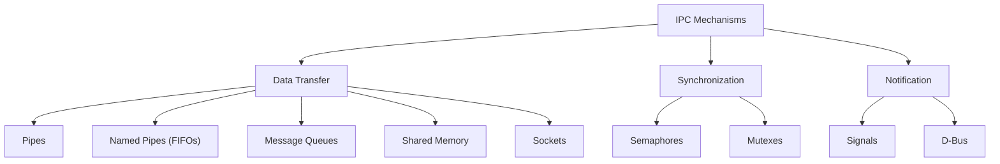
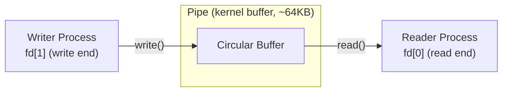
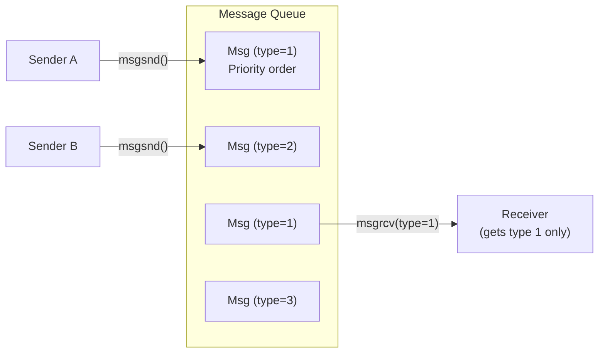
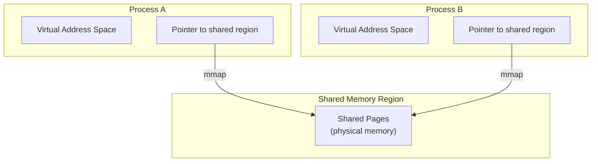
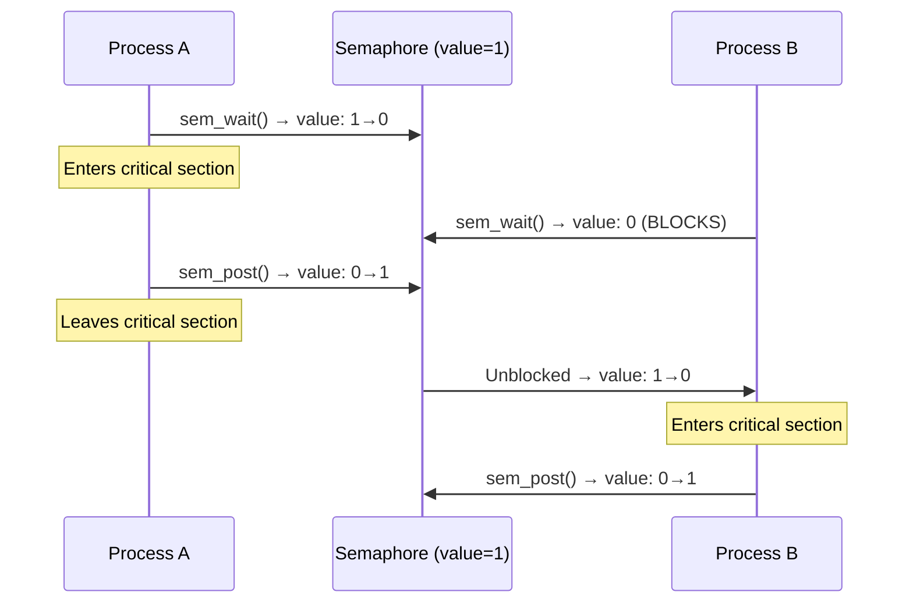
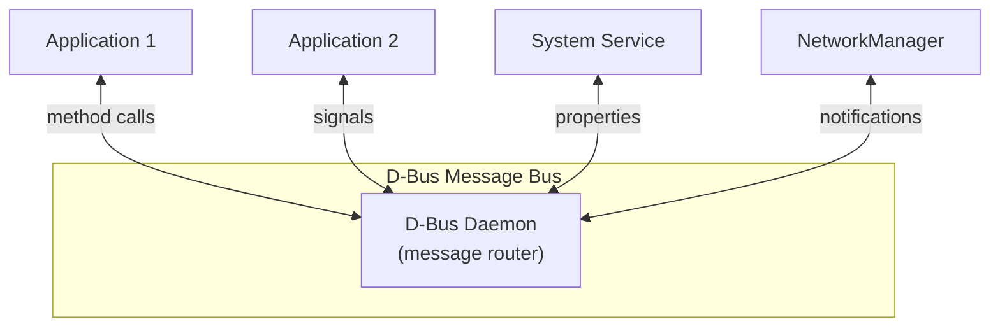
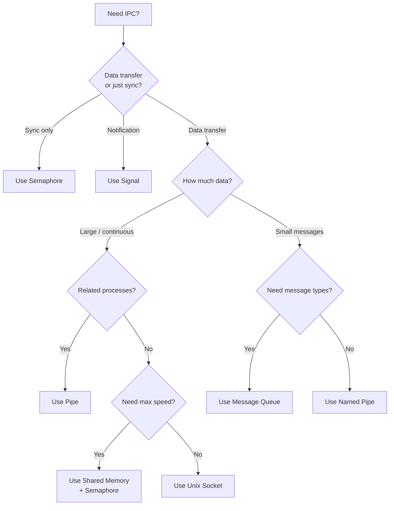

## Learning Objectives

By the end of this lesson, you will be able to:

- Explain why processes need inter-process communication (IPC)
- Use pipes and named pipes (FIFOs) for unidirectional data flow
- Understand message queues for structured communication
- Implement shared memory for high-performance data sharing
- Use semaphores for synchronization between processes
- Send and handle signals for process notification
- Choose the right IPC mechanism for different scenarios

## Prerequisites

- Understanding of processes, process creation, and memory layout
- Basic C programming for code examples
- Familiarity with the Linux command line

---

## Why IPC?

Processes have **isolated address spaces** — they cannot directly read or write each other's memory. This isolation is crucial for stability and security, but processes often need to cooperate.

Common scenarios requiring IPC:

- A web server passing requests to a backend worker
- A shell piping output from one command to another
- A database receiving queries from multiple client processes
- Microservices exchanging data on the same host


### IPC Mechanism Overview



---

## Pipes

A **pipe** is a unidirectional byte stream connecting the stdout of one process to the stdin of another. It's the oldest and simplest IPC mechanism on Unix.

### How Pipes Work



### Shell Pipes

```bash
# The | operator creates a pipe between processes
ls -la /usr/bin | grep python | wc -l

# This creates three processes connected by two pipes:
# ls → pipe1 → grep → pipe2 → wc
```


### Creating Pipes in C

```c
#include <stdio.h>
#include <unistd.h>
#include <string.h>
#include <sys/wait.h>

int main() {
    int pipefd[2];  // pipefd[0] = read end, pipefd[1] = write end
    char buffer[256];

    if (pipe(pipefd) == -1) {
        perror("pipe");
        return 1;
    }

    pid_t pid = fork();

    if (pid == 0) {
        // Child: read from pipe
        close(pipefd[1]);  // Close unused write end
        int n = read(pipefd[0], buffer, sizeof(buffer));
        buffer[n] = '\0';
        printf("Child received: %s\n", buffer);
        close(pipefd[0]);
    } else {
        // Parent: write to pipe
        close(pipefd[0]);  // Close unused read end
        const char *msg = "Hello from parent!";
        write(pipefd[1], msg, strlen(msg));
        close(pipefd[1]);
        wait(NULL);
    }

    return 0;
}
```

### Pipe Characteristics

| Property | Value |
|----------|-------|
| Direction | Unidirectional |
| Buffer size | Typically 64 KB (Linux) |
| Persistence | Exists only while processes are running |
| Relationship | Related processes (parent-child) only |
| Blocking | Blocks on full (write) or empty (read) |

---

## Named Pipes (FIFOs)

**Named pipes** (FIFOs) are like pipes but have a name in the filesystem, allowing unrelated processes to communicate.


```bash
# Create a named pipe
mkfifo /tmp/myfifo

# Terminal 1: write to the FIFO
echo "Hello through FIFO" > /tmp/myfifo

# Terminal 2: read from the FIFO
cat /tmp/myfifo
# Output: Hello through FIFO

# View FIFO properties (note the 'p' type)
ls -la /tmp/myfifo
# prw-r--r-- 1 user user 0 Jan 1 12:00 /tmp/myfifo

# Remove the FIFO
rm /tmp/myfifo
```

### FIFO in C

```c
#include <stdio.h>
#include <fcntl.h>
#include <sys/stat.h>
#include <unistd.h>
#include <string.h>

#define FIFO_PATH "/tmp/myfifo"

// Writer process
void writer() {
    mkfifo(FIFO_PATH, 0666);
    int fd = open(FIFO_PATH, O_WRONLY);
    const char *msg = "Message via FIFO";
    write(fd, msg, strlen(msg) + 1);
    close(fd);
}

// Reader process
void reader() {
    char buffer[256];
    int fd = open(FIFO_PATH, O_RDONLY);
    read(fd, buffer, sizeof(buffer));
    printf("Received: %s\n", buffer);
    close(fd);
    unlink(FIFO_PATH);
}
```

---

## Message Queues

**Message queues** provide structured, typed message passing between processes. Unlike pipes, messages have boundaries and types, allowing selective retrieval.



### POSIX Message Queue Example

```c
#include <stdio.h>
#include <mqueue.h>
#include <string.h>
#include <fcntl.h>

#define QUEUE_NAME "/my_queue"
#define MAX_MSG_SIZE 256

// Sender
void send_message() {
    struct mq_attr attr = {
        .mq_maxmsg = 10,
        .mq_msgsize = MAX_MSG_SIZE
    };

    mqd_t mq = mq_open(QUEUE_NAME, O_CREAT | O_WRONLY, 0644, &attr);
    const char *msg = "Hello via message queue!";
    mq_send(mq, msg, strlen(msg) + 1, 0);
    mq_close(mq);
}

// Receiver
void receive_message() {
    char buffer[MAX_MSG_SIZE];
    mqd_t mq = mq_open(QUEUE_NAME, O_RDONLY);
    mq_receive(mq, buffer, MAX_MSG_SIZE, NULL);
    printf("Received: %s\n", buffer);
    mq_close(mq);
    mq_unlink(QUEUE_NAME);
}
```

```bash
# Compile with real-time library
gcc -o mq_example mq_example.c -lrt

# View POSIX message queues
ls /dev/mqueue/

# View System V message queues
ipcs -q
```

---

## Shared Memory

**Shared memory** is the fastest IPC mechanism because data is placed in a memory region accessible by multiple processes — no kernel involvement after setup.



### POSIX Shared Memory Example

```c
#include <stdio.h>
#include <fcntl.h>
#include <sys/mman.h>
#include <unistd.h>
#include <string.h>

#define SHM_NAME "/my_shm"
#define SHM_SIZE 4096

// Writer process
void writer() {
    int fd = shm_open(SHM_NAME, O_CREAT | O_RDWR, 0666);
    ftruncate(fd, SHM_SIZE);
    char *ptr = mmap(NULL, SHM_SIZE, PROT_WRITE, MAP_SHARED, fd, 0);

    const char *msg = "Hello from shared memory!";
    memcpy(ptr, msg, strlen(msg) + 1);

    munmap(ptr, SHM_SIZE);
    close(fd);
}

// Reader process
void reader() {
    int fd = shm_open(SHM_NAME, O_RDONLY, 0666);
    char *ptr = mmap(NULL, SHM_SIZE, PROT_READ, MAP_SHARED, fd, 0);

    printf("Read: %s\n", ptr);

    munmap(ptr, SHM_SIZE);
    close(fd);
    shm_unlink(SHM_NAME);
}
```

```bash
# Compile with real-time library
gcc -o shm_example shm_example.c -lrt

# View shared memory segments
ls /dev/shm/

# View System V shared memory
ipcs -m
```

Shared memory requires external synchronization (semaphores, mutexes) because multiple processes can read/write simultaneously.

---

## Semaphores

**Semaphores** are synchronization primitives used to coordinate access to shared resources between processes (or threads).

### Types of Semaphores

| Type | Values | Use Case |
|------|--------|----------|
| **Binary semaphore** | 0 or 1 | Mutual exclusion (like a mutex) |
| **Counting semaphore** | 0 to N | Limiting concurrent access to N resources |



### POSIX Named Semaphore Example

```c
#include <stdio.h>
#include <semaphore.h>
#include <fcntl.h>
#include <unistd.h>
#include <sys/wait.h>

#define SEM_NAME "/my_sem"

int main() {
    sem_t *sem = sem_open(SEM_NAME, O_CREAT, 0644, 1);

    pid_t pid = fork();

    if (pid == 0) {
        // Child
        sem_wait(sem);
        printf("Child: in critical section\n");
        sleep(2);
        printf("Child: leaving critical section\n");
        sem_post(sem);
    } else {
        // Parent
        sleep(1);
        sem_wait(sem);
        printf("Parent: in critical section\n");
        sem_post(sem);
        wait(NULL);
        sem_unlink(SEM_NAME);
    }

    sem_close(sem);
    return 0;
}
```

---

## Signals

**Signals** are asynchronous notifications sent to a process to inform it of events. They're the Unix mechanism for software interrupts.

### Common Signals

| Signal | Number | Default Action | Description |
|--------|--------|----------------|-------------|
| `SIGHUP` | 1 | Terminate | Terminal hangup / reload config |
| `SIGINT` | 2 | Terminate | Interrupt (Ctrl+C) |
| `SIGQUIT` | 3 | Core dump | Quit (Ctrl+\\) |
| `SIGKILL` | 9 | Terminate | Force kill (cannot be caught) |
| `SIGSEGV` | 11 | Core dump | Segmentation fault |
| `SIGPIPE` | 13 | Terminate | Broken pipe |
| `SIGALRM` | 14 | Terminate | Alarm timer expired |
| `SIGTERM` | 15 | Terminate | Graceful termination request |
| `SIGCHLD` | 17 | Ignore | Child process status changed |
| `SIGSTOP` | 19 | Stop | Pause process (cannot be caught) |
| `SIGCONT` | 18 | Continue | Resume stopped process |
| `SIGUSR1` | 10 | Terminate | User-defined signal 1 |
| `SIGUSR2` | 12 | Terminate | User-defined signal 2 |

### Signal Handling in C

```c
#include <stdio.h>
#include <signal.h>
#include <unistd.h>

volatile sig_atomic_t got_signal = 0;

void handler(int sig) {
    got_signal = sig;
}

int main() {
    struct sigaction sa;
    sa.sa_handler = handler;
    sigemptyset(&sa.sa_mask);
    sa.sa_flags = 0;

    sigaction(SIGINT, &sa, NULL);   // Handle Ctrl+C
    sigaction(SIGTERM, &sa, NULL);  // Handle kill

    printf("PID: %d — Send me SIGINT or SIGTERM\n", getpid());

    while (!got_signal) {
        pause();  // Wait for a signal
    }

    printf("\nReceived signal %d, shutting down gracefully.\n", got_signal);
    return 0;
}
```

### Signal Commands

```bash
# Send signals
kill -SIGTERM 1234       # Graceful termination
kill -SIGKILL 1234       # Force kill
kill -SIGHUP 1234        # Often: reload config

# Send signal by name
kill -s USR1 1234

# List all signals
kill -l

# Send signal to process group
kill -SIGTERM -1234      # Note the negative PID

# Trap signals in bash
trap 'echo "Caught SIGINT"' INT
trap 'cleanup; exit' TERM
```

---

## Sockets for IPC

**Unix domain sockets** provide bidirectional communication between processes on the same host, similar to network sockets but without the network overhead.


```bash
# List Unix domain sockets in use
ss -xl | head -10

# Common system sockets
ls -la /var/run/*.sock
# /var/run/docker.sock
# /var/run/dbus/system_bus_socket
```

### Socket Types

| Type | Description | Use Case |
|------|-------------|----------|
| `SOCK_STREAM` | Reliable, ordered byte stream (like TCP) | Most IPC |
| `SOCK_DGRAM` | Unreliable datagrams (like UDP) | Low-overhead messages |
| `SOCK_SEQPACKET` | Reliable, ordered message boundaries | Structured messages |

---

## D-Bus

**D-Bus** is a message bus system used extensively in Linux desktop environments for IPC between system services and applications.



```bash
# List D-Bus services (system bus)
dbus-send --system --print-reply \
    --dest=org.freedesktop.DBus \
    /org/freedesktop/DBus \
    org.freedesktop.DBus.ListNames

# Monitor D-Bus messages
dbus-monitor --system

# Query NetworkManager via D-Bus
dbus-send --system --print-reply \
    --dest=org.freedesktop.NetworkManager \
    /org/freedesktop/NetworkManager \
    org.freedesktop.DBus.Properties.Get \
    string:"org.freedesktop.NetworkManager" \
    string:"Version"

# Interactive D-Bus tool
busctl list
busctl tree org.freedesktop.systemd1
```

---

## Comparing IPC Mechanisms

| Mechanism | Direction | Speed | Persistence | Relationships | Data Type | Best For |
|-----------|-----------|-------|-------------|---------------|-----------|----------|
| **Pipe** | Unidirectional | Fast | Process lifetime | Related (parent-child) | Byte stream | Shell pipelines |
| **Named Pipe (FIFO)** | Unidirectional | Fast | Filesystem | Any | Byte stream | Simple unrelated IPC |
| **Message Queue** | Bidirectional | Moderate | Kernel-persistent | Any | Typed messages | Structured messaging |
| **Shared Memory** | Bidirectional | **Fastest** | Kernel-persistent | Any | Raw bytes | High-throughput data sharing |
| **Semaphore** | N/A (sync only) | Fast | Kernel-persistent | Any | Counter | Synchronization |
| **Signal** | Unidirectional | Fast | None | Any | Signal number | Event notification |
| **Unix Socket** | Bidirectional | Fast | Filesystem | Any | Byte/datagram | Client-server on same host |
| **D-Bus** | Bidirectional | Moderate | Daemon lifetime | Any | Structured | Desktop service integration |

### Decision Flowchart



---

## IPC Resources on Linux

```bash
# View all System V IPC resources
ipcs -a

# Output:
# ------ Message Queues --------
# key        msqid      owner      perms      used-bytes   messages
#
# ------ Shared Memory Segments --------
# key        shmid      owner      perms      bytes      nattch
# 0x00000000 0          user       600        524288     2
#
# ------ Semaphore Arrays --------
# key        semid      owner      perms      nsems

# Remove specific IPC resources
ipcrm -m <shmid>    # Remove shared memory
ipcrm -q <msqid>    # Remove message queue
ipcrm -s <semid>    # Remove semaphore

# View POSIX IPC resources
ls /dev/shm/        # Shared memory
ls /dev/mqueue/     # Message queues

# View pipe buffer sizes
cat /proc/sys/fs/pipe-max-size
# 1048576 (1 MB)
```

---

## Key Takeaways

1. **Pipes** provide simple, unidirectional byte streams between related processes — the foundation of shell pipelines (`cmd1 | cmd2`).

2. **Named pipes (FIFOs)** extend pipes to unrelated processes by creating a named filesystem entry, while **message queues** add structure with typed, prioritized messages.

3. **Shared memory** is the fastest IPC mechanism since data doesn't cross the kernel after setup, but it requires explicit synchronization (semaphores or mutexes) to prevent race conditions.

4. **Signals** provide asynchronous notification between processes — used for termination requests (SIGTERM), interrupts (SIGINT), and custom events (SIGUSR1/USR2).

5. **Unix domain sockets** offer bidirectional, reliable communication between unrelated processes on the same host, combining the flexibility of network sockets with local performance.

6. Choose your IPC mechanism based on the use case: **pipes** for simple pipelines, **shared memory** for high throughput, **message queues** for structured messages, **sockets** for client-server patterns, and **signals** for event notification.
