## Learning Objectives

By the end of this lesson, you will be able to:

- Define what a process is and how it differs from a program
- Identify the five process states and transitions between them
- Describe the contents of a Process Control Block (PCB)
- Explain process creation with `fork()` and `exec()`
- Understand process termination and exit codes
- Identify orphan and zombie processes and how to handle them
- Navigate the process tree on a Linux system

## Prerequisites

- Understanding of kernel space vs user space
- Basic familiarity with the Linux command line
- Knowledge of virtual memory concepts is helpful

---

## What Is a Process?

A **program** is a passive entity — a file on disk containing instructions (e.g., `/usr/bin/python3`). A **process** is an active entity — a program in execution with its own memory space, registers, open files, and execution state.

Think of it this way: a recipe (program) sitting in a cookbook does nothing. When a chef (CPU) follows the recipe, using ingredients (data) and kitchen tools (resources), that's a process.

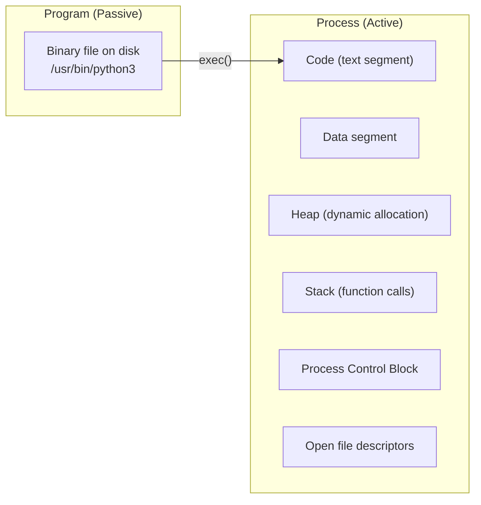

### Process Memory Layout

Every process has its own virtual address space divided into segments:

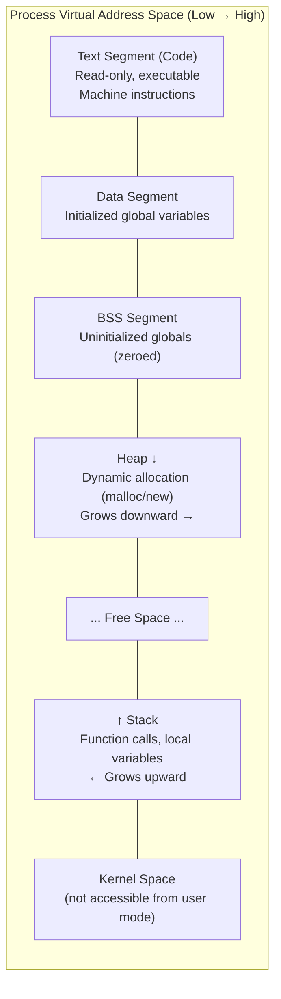

```c
#include <stdio.h>
#include <stdlib.h>

int global_init = 42;          // Data segment
int global_uninit;             // BSS segment

int main() {                   // Text segment (code)
    int local_var = 10;        // Stack
    int *heap_var = malloc(sizeof(int)); // Heap
    *heap_var = 20;

    printf("Code:   %p\n", (void *)main);
    printf("Data:   %p\n", (void *)&global_init);
    printf("BSS:    %p\n", (void *)&global_uninit);
    printf("Heap:   %p\n", (void *)heap_var);
    printf("Stack:  %p\n", (void *)&local_var);

    free(heap_var);
    return 0;
}
```

```bash
# View memory map of a running process
cat /proc/self/maps | head -20

# View memory regions of a specific process
pmap -x $(pidof bash) | head -20

# View process memory usage
ps aux --sort=-%mem | head -10
```

---

## Process States

A process moves through several states during its lifetime. The OS scheduler manages these transitions.

### The Five-State Model

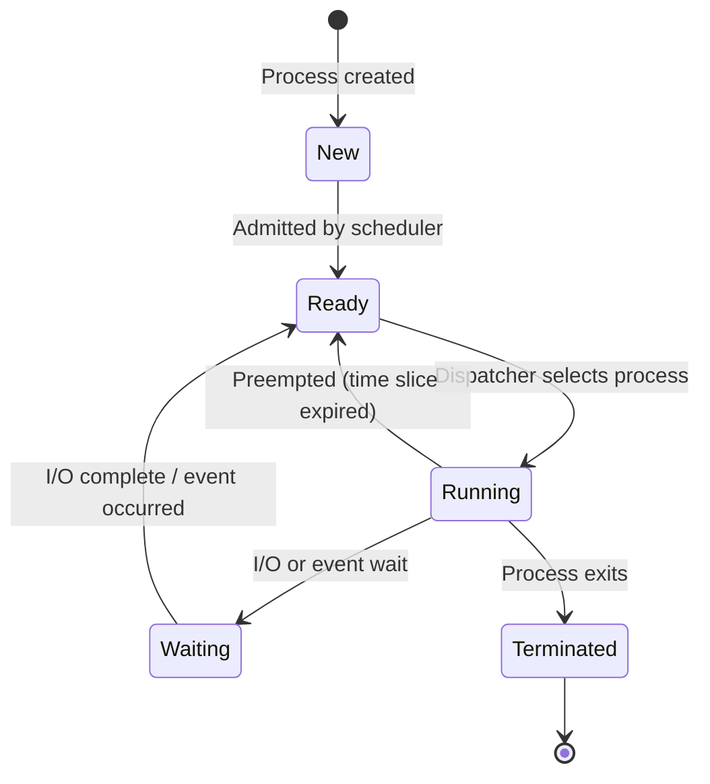

| State | Description | Example |
|-------|-------------|---------|
| **New** | Process is being created | After `fork()`, before scheduling |
| **Ready** | Waiting for CPU assignment | In the ready queue |
| **Running** | Currently executing on a CPU | Active instructions |
| **Waiting (Blocked)** | Waiting for an event (I/O, signal, lock) | Reading from disk |
| **Terminated** | Execution finished, awaiting cleanup | After `exit()` |

### Linux Process States

Linux uses more granular states visible in `/proc/[pid]/status`:

| Code | State | Description |
|------|-------|-------------|
| `R` | Running | On CPU or in run queue |
| `S` | Sleeping (Interruptible) | Waiting for event, can receive signals |
| `D` | Sleeping (Uninterruptible) | Waiting for I/O, cannot be interrupted |
| `T` | Stopped | Paused by signal (SIGSTOP, SIGTSTP) |
| `t` | Tracing stop | Stopped by debugger (ptrace) |
| `Z` | Zombie | Terminated but parent hasn't called wait() |
| `X` | Dead | Being removed (not visible) |

```bash
# View process states
ps aux | awk '{print $8}' | sort | uniq -c | sort -rn
# Output:
#  145 S    (sleeping)
#   23 Ss   (sleeping, session leader)
#    3 R    (running)
#    1 Z    (zombie)

# View state of a specific process
cat /proc/$$/status | grep State
# State:  S (sleeping)
```

---

## Process Control Block (PCB)

The **Process Control Block** (called `task_struct` in Linux) is a data structure the kernel maintains for every process. It contains everything the OS needs to manage the process.

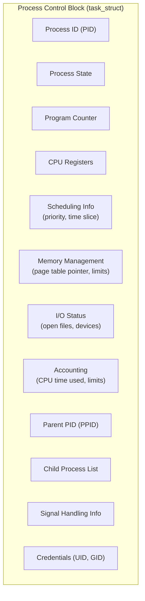

### Key PCB Fields

| Field | Purpose |
|-------|---------|
| `pid` | Unique process identifier |
| `ppid` | Parent process ID |
| `state` | Current process state (R, S, D, T, Z) |
| `mm` | Pointer to memory descriptor (page tables) |
| `files` | Open file descriptor table |
| `signal` | Pending and blocked signals |
| `policy` | Scheduling policy (SCHED_NORMAL, SCHED_FIFO, etc.) |
| `prio` | Process priority / nice value |
| `cred` | Credentials (real/effective UID, GID, capabilities) |
| `comm` | Executable name (up to 16 chars) |

### Context Switch

When the scheduler switches from one process to another, it performs a **context switch**: saving the current process's state and loading the next process's state.

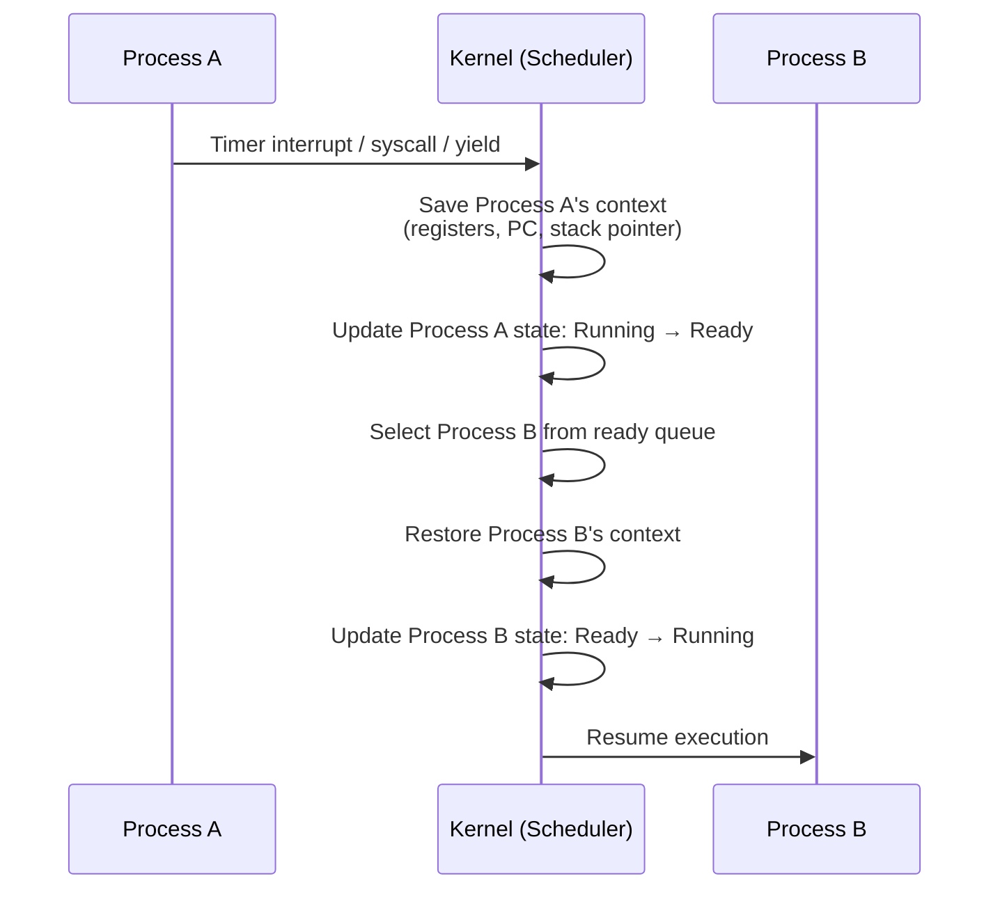

```bash
# View context switch statistics
vmstat 1 5
#  procs -----------memory---------- ---swap-- -----io---- -system-- ------cpu-----
#  r  b   swpd   free   buff  cache   si   so    bi    bo   in   cs us sy id wa st
#  1  0      0 123456  12345 234567    0    0     0     0  150  300  2  1 97  0  0
#                                                            ↑    ↑
#                                                     interrupts  context switches

# Per-process context switch count
grep ctxt /proc/$$/status
# voluntary_ctxt_switches:    150
# nonvoluntary_ctxt_switches: 42
```

---

## Process Creation: fork() and exec()

On Unix-like systems, new processes are created using the **fork-exec** model.

### fork()

`fork()` creates a new process by **duplicating** the calling process. The new process (child) is an almost exact copy of the parent.

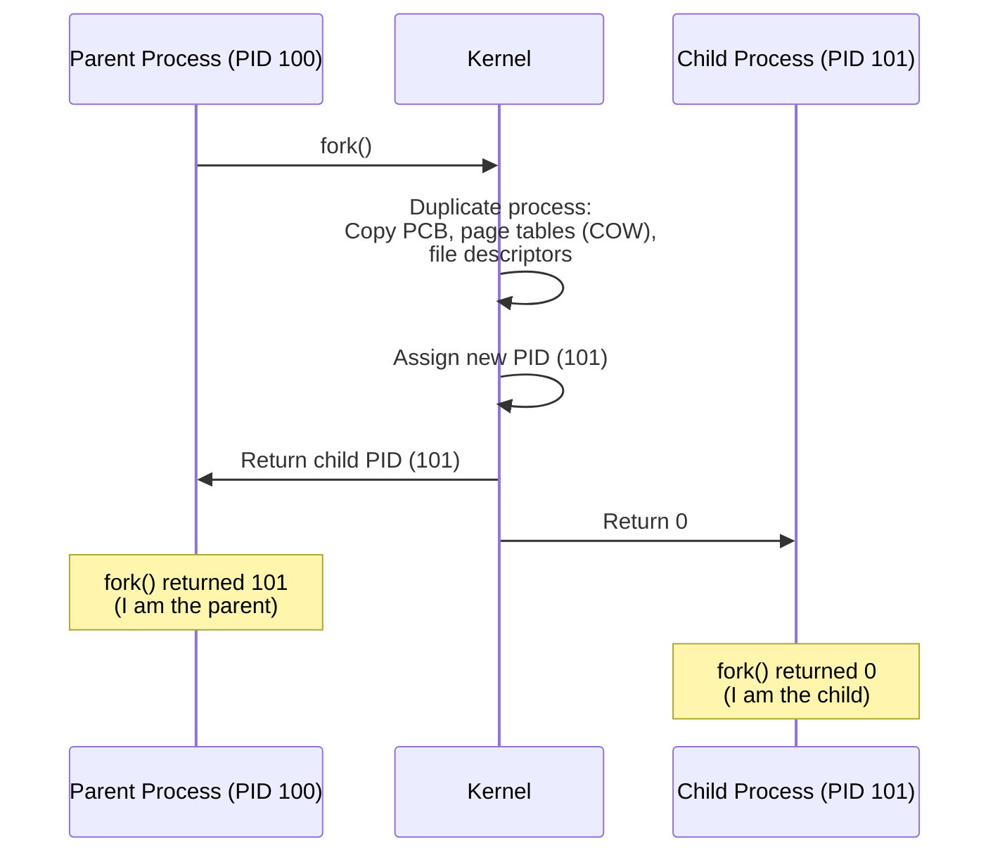

```c
#include <stdio.h>
#include <unistd.h>
#include <sys/wait.h>

int main() {
    printf("Parent PID: %d\n", getpid());

    pid_t pid = fork();

    if (pid < 0) {
        perror("fork failed");
        return 1;
    } else if (pid == 0) {
        printf("Child:  PID=%d, PPID=%d\n", getpid(), getppid());
    } else {
        printf("Parent: PID=%d, Child PID=%d\n", getpid(), pid);
        wait(NULL);  // Wait for child to finish
    }

    return 0;
}
```

Output:
```
Parent PID: 1000
Parent: PID=1000, Child PID=1001
Child:  PID=1001, PPID=1000
```

### exec()

`exec()` **replaces** the current process's memory image with a new program. After `exec()`, the process has a new code, data, heap, and stack — but the same PID.

```c
#include <stdio.h>
#include <unistd.h>
#include <sys/wait.h>

int main() {
    pid_t pid = fork();

    if (pid == 0) {
        // Child: replace with "ls -la" program
        execlp("ls", "ls", "-la", "/tmp", NULL);
        perror("exec failed");  // Only reached if exec fails
    } else {
        wait(NULL);
        printf("Child finished executing ls\n");
    }

    return 0;
}
```

### The fork-exec Pattern

This is how shells launch programs:

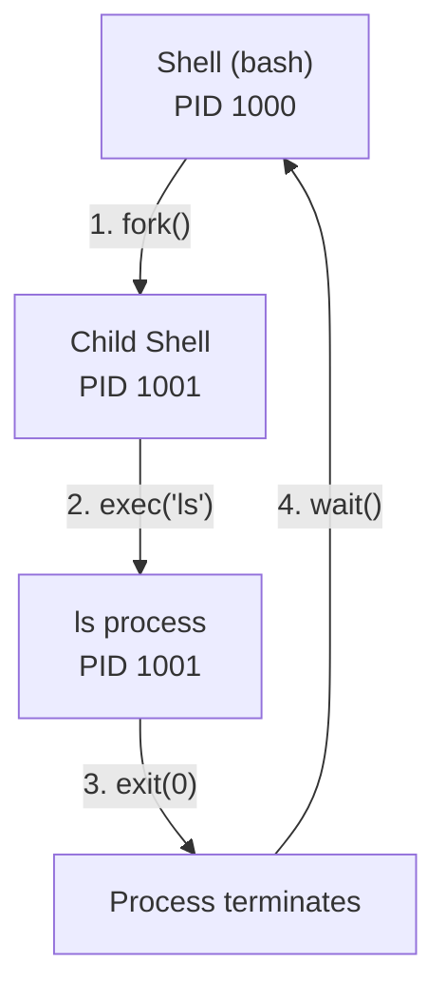

### Copy-On-Write (COW)

`fork()` doesn't immediately copy all memory — that would be wasteful. Instead, parent and child **share** the same physical pages, marked read-only. Only when either process writes to a page does the kernel create a private copy. This optimization is called **Copy-On-Write**.

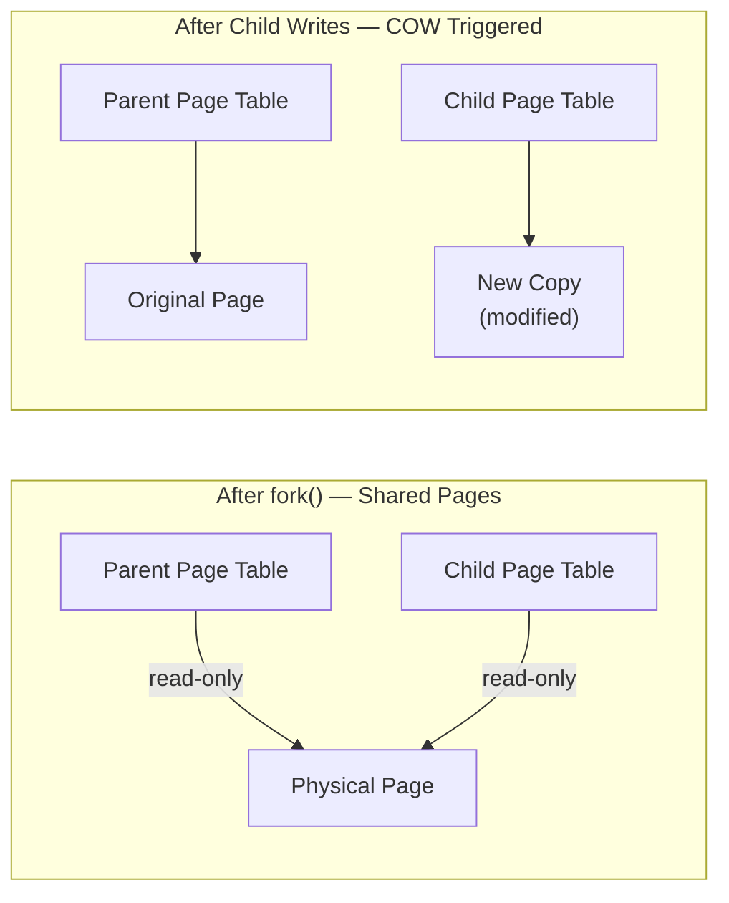

---

## Process Termination

A process terminates when it:

1. Calls `exit()` or returns from `main()`
2. Receives a fatal signal (SIGKILL, SIGSEGV)
3. Is killed by another process or the OS

```c
#include <stdlib.h>
#include <unistd.h>

int main() {
    // Method 1: return from main
    // return 0;

    // Method 2: explicit exit
    // exit(0);

    // Method 3: _exit (skip cleanup handlers)
    // _exit(0);

    return 0;
}
```

### Exit Codes

| Code | Meaning |
|------|---------|
| 0 | Success |
| 1 | General error |
| 2 | Misuse of shell command |
| 126 | Command not executable |
| 127 | Command not found |
| 128+N | Killed by signal N (e.g., 137 = SIGKILL) |
| 130 | Terminated by Ctrl+C (SIGINT) |

```bash
# Check exit code of last command
ls /nonexistent
echo $?
# Output: 2

# A process killed by SIGKILL (signal 9)
# Exit code: 128 + 9 = 137
kill -9 $PID
echo $?
# Output: 137
```

---

## Orphan and Zombie Processes

### Zombie Processes

A **zombie** process has terminated but its parent hasn't yet called `wait()` to read its exit status. The process entry remains in the process table.

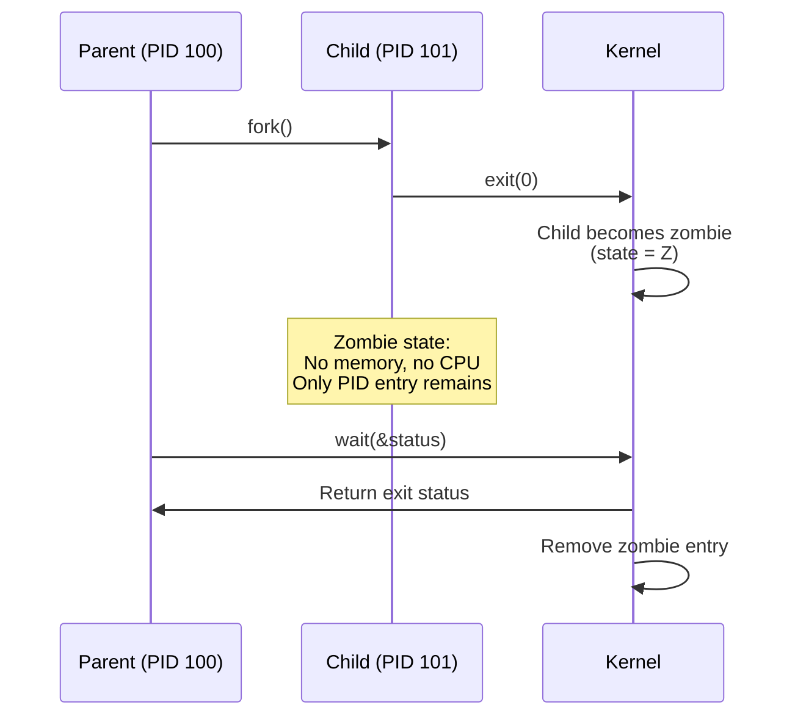

```c
#include <stdio.h>
#include <unistd.h>

int main() {
    pid_t pid = fork();

    if (pid == 0) {
        printf("Child exiting (will become zombie)\n");
        _exit(0);
    } else {
        printf("Parent sleeping — not calling wait()\n");
        sleep(60);  // Child is a zombie for 60 seconds
        // Should call wait() here!
    }

    return 0;
}
```

```bash
# Find zombie processes
ps aux | awk '$8 ~ /Z/ {print}'

# Count zombies
ps aux | awk '$8 ~ /Z/' | wc -l

# The parent of a zombie is the one that needs to call wait()
ps -eo pid,ppid,stat,comm | grep ' Z'
```

### Orphan Processes

An **orphan** process is a child whose parent has terminated. The kernel **re-parents** orphans to PID 1 (init/systemd), which automatically calls `wait()` to clean them up.

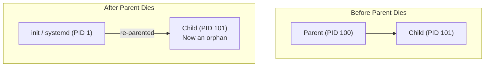

```c
#include <stdio.h>
#include <unistd.h>

int main() {
    pid_t pid = fork();

    if (pid == 0) {
        sleep(2);  // Wait for parent to exit
        printf("Child: My new parent is PID %d\n", getppid());
        // Will print PID 1 (init/systemd)
    } else {
        printf("Parent: Exiting immediately\n");
        _exit(0);  // Parent exits, child becomes orphan
    }

    return 0;
}
```

---

## The Process Tree

All processes form a tree rooted at PID 1. Every process (except PID 1) has exactly one parent.

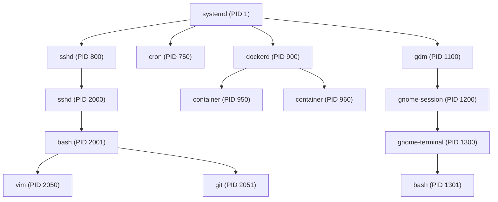

### Viewing the Process Tree

```bash
# Display process tree
pstree
# systemd─┬─ModemManager───2*[{ModemManager}]
#          ├─NetworkManager───2*[{NetworkManager}]
#          ├─sshd───sshd───sshd───bash───pstree
#          ├─cron
#          └─docker───containerd

# Process tree with PIDs
pstree -p

# Process tree for a specific user
pstree -u username

# All processes with full details
ps auxf

# Process hierarchy with specific columns
ps -eo pid,ppid,user,stat,%cpu,%mem,comm --forest | head -30
```

### Process Inspection Commands

```bash
# View all attributes of a process
cat /proc/$$/status

# List open files of a process
ls -la /proc/$$/fd/

# View process limits
cat /proc/$$/limits

# View process environment variables
cat /proc/$$/environ | tr '\0' '\n'

# View process command line
cat /proc/$$/cmdline | tr '\0' ' '

# Real-time process monitoring
top -p $PID

# Interactive process manager
htop
```

---

## Process Management Commands

```bash
# List processes (BSD style)
ps aux

# List processes (POSIX style)
ps -ef

# Find a specific process
pgrep -a nginx

# Send signals to processes
kill -SIGTERM $PID   # Graceful shutdown (default)
kill -SIGKILL $PID   # Force kill (cannot be caught)
kill -SIGHUP $PID    # Reload configuration
kill -SIGSTOP $PID   # Pause process
kill -SIGCONT $PID   # Resume paused process

# Kill by name
pkill -f "python server.py"
killall nginx

# Change process priority
nice -n 10 ./my_program        # Start with lower priority
renice -n -5 -p $PID           # Change running process priority

# Run in background
./long_task &
jobs                            # List background jobs
fg %1                           # Bring job 1 to foreground
bg %1                           # Resume job 1 in background

# Detach from terminal
nohup ./long_task &             # Survives terminal close
disown %1                       # Disown a background job
```

---

## Key Takeaways

1. A **process** is a program in execution with its own virtual address space (text, data, heap, stack), a Process Control Block, and OS-managed resources.

2. Processes cycle through five states: **New → Ready → Running → Waiting → Terminated**. The scheduler manages transitions, and Linux adds granular states like interruptible/uninterruptible sleep.

3. The **Process Control Block** (`task_struct` in Linux) stores everything the kernel needs about a process — PID, state, registers, memory maps, open files, credentials, and scheduling info.

4. **fork()** creates a child process by duplicating the parent (with Copy-On-Write optimization), and **exec()** replaces the process image with a new program. Together they form the Unix process creation model.

5. **Zombie processes** are terminated children whose parents haven't called `wait()`. **Orphan processes** are children whose parents terminated — they get re-parented to PID 1.

6. All processes form a **tree** rooted at PID 1 (init/systemd). Tools like `pstree`, `ps`, `top`, and `/proc` let you inspect and manage the process hierarchy.
