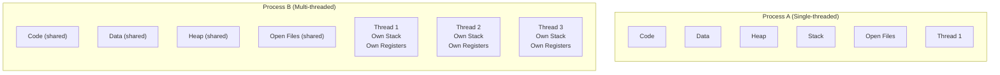
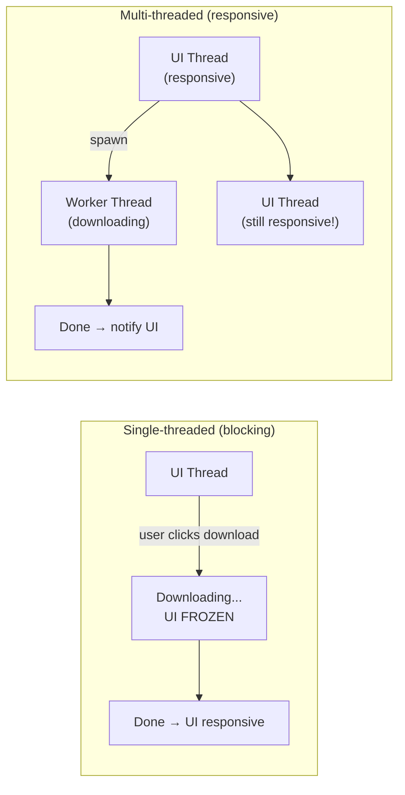
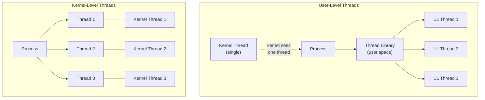
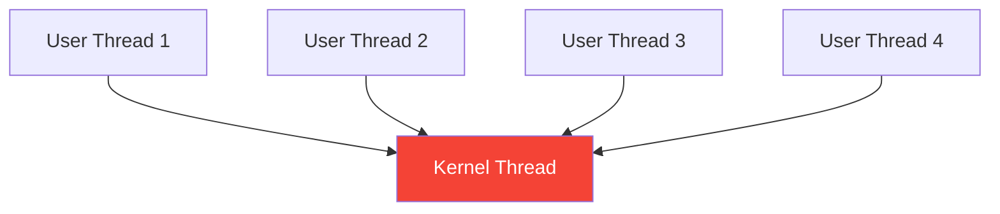
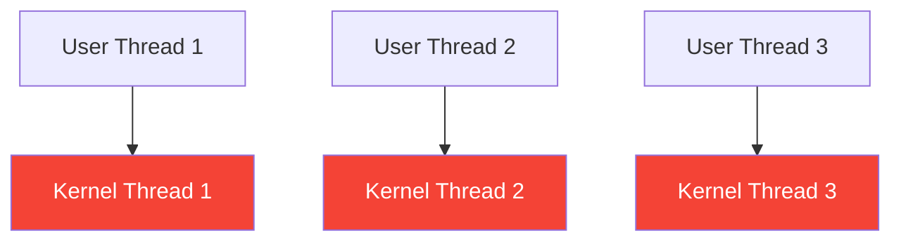
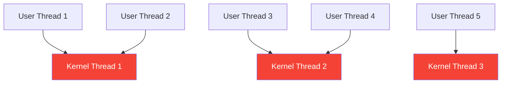
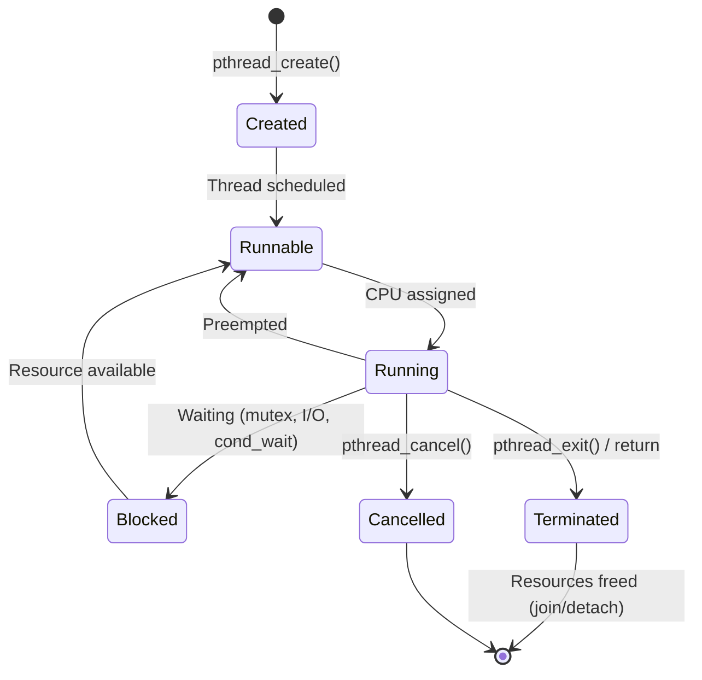
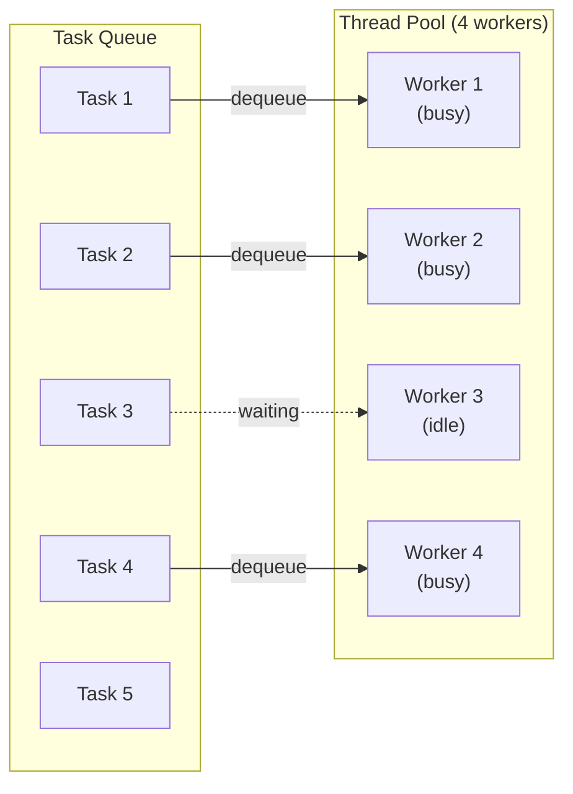
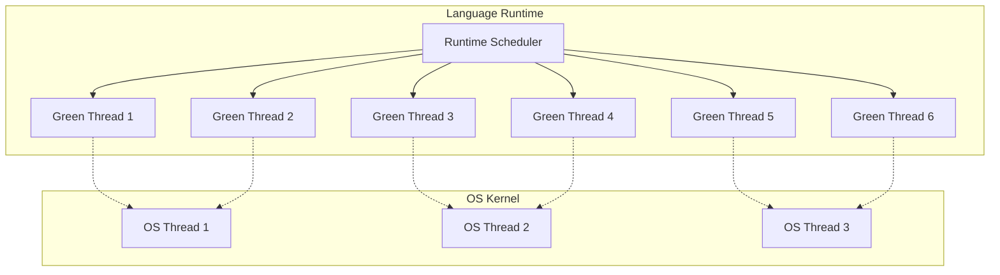

## Learning Objectives

By the end of this lesson, you will be able to:

- Explain what threads are and how they differ from processes
- Compare user-level and kernel-level threads
- Describe the three threading models: many-to-one, one-to-one, many-to-many
- Write basic multithreaded programs using POSIX threads (pthreads)
- Understand the thread lifecycle and state transitions
- Explain thread pools and green threads

## Prerequisites

- Understanding of processes, process states, and process creation
- Basic C programming knowledge for code examples
- Familiarity with the concept of concurrency

---

## What Are Threads?

A **thread** is the smallest unit of CPU execution within a process. While a process is a container for resources (memory, files, etc.), threads are the entities that actually execute code on the CPU.

Every process has at least one thread — the **main thread**. Additional threads can be created to perform work concurrently within the same process.

### Threads vs Processes



| Aspect | Process | Thread |
|--------|---------|--------|
| **Address space** | Own virtual address space | Shared with other threads in process |
| **Creation cost** | Expensive (copy page tables, etc.) | Lightweight (share existing resources) |
| **Context switch** | Slow (TLB flush, page table swap) | Fast (same address space) |
| **Communication** | IPC required (pipes, sockets, shm) | Direct memory access (shared heap) |
| **Isolation** | Full isolation | No memory isolation between threads |
| **Crash impact** | Only the process dies | Entire process (all threads) crash |
| **OS overhead** | Higher | Lower |

### What Threads Share and Don't Share

| Shared (per-process) | Private (per-thread) |
|---------------------|---------------------|
| Code segment | Program counter |
| Data segment (globals) | CPU registers |
| Heap | Stack |
| Open file descriptors | Stack pointer |
| Signal handlers | Thread ID |
| Working directory | Signal mask |
| User/Group ID | errno value |

---

## Why Use Threads?

### 1. Responsiveness

A GUI application can keep the interface responsive while performing background work:



### 2. Performance (Parallelism)

Threads can run on multiple CPU cores simultaneously:

```
4-core CPU processing 4 tasks:

Single-threaded: [Task1][Task2][Task3][Task4]  → 4x time
Multi-threaded:  [Task1]                       → 1x time
                 [Task2]
                 [Task3]
                 [Task4]
```

### 3. Resource Sharing

Threads share the process's address space, making communication trivial compared to IPC between processes.

### 4. Economy

Thread creation and context switching is much faster than process-level equivalents:

| Operation | Process | Thread |
|-----------|---------|--------|
| Creation | ~10,000 μs | ~100 μs |
| Context switch | ~5,000 μs | ~200 μs |
| Communication | IPC overhead | Direct memory |

---

## User-Level vs Kernel-Level Threads

### User-Level Threads (ULT)

**User-level threads** are managed entirely by a threading library in user space. The kernel has no knowledge of them — it sees only a single process.

**Advantages:**
- No kernel involvement → very fast creation and switching
- Can be implemented on any OS (even without kernel thread support)
- Custom scheduling algorithms possible

**Disadvantages:**
- If one thread blocks on I/O, all threads in the process block
- Cannot take advantage of multiple CPUs
- The kernel schedules the process, not individual threads

### Kernel-Level Threads (KLT)

**Kernel-level threads** are managed by the OS kernel. Each thread is a schedulable entity.

**Advantages:**
- True parallelism on multi-core CPUs
- If one thread blocks, others continue
- Kernel can schedule threads on different CPUs

**Disadvantages:**
- Slower creation and switching (requires kernel calls)
- Higher memory overhead (kernel stack per thread)



---

## Threading Models

The relationship between user-level threads and kernel-level threads is described by three models.

### Many-to-One Model

Multiple user threads map to a single kernel thread. The thread library manages scheduling in user space.



- **Examples:** GNU Portable Threads, early Solaris Green Threads
- **Limitation:** No true parallelism; one blocking call blocks all

### One-to-One Model

Each user thread maps to exactly one kernel thread.



- **Examples:** Linux (NPTL), Windows threads
- **Advantage:** True parallelism, no blocking issues
- **Limitation:** Each thread requires kernel resources; may hit kernel thread limits

### Many-to-Many Model

Multiple user threads map to a smaller or equal number of kernel threads. Provides the best of both worlds.



- **Examples:** Solaris LWP, IRIX, historical Windows ThreadFiber
- **Advantage:** Developer creates many threads, kernel maps them efficiently
- **Limitation:** Complex to implement

### Model Comparison

| Feature | Many-to-One | One-to-One | Many-to-Many |
|---------|------------|------------|--------------|
| Parallelism | None | Full | Full |
| Blocking behavior | All threads block | Only blocked thread | Only blocked thread |
| Creation overhead | Very low | Moderate | Low |
| Scalability | Limited | Kernel limit | Best |
| Complexity | Simple | Simple | Complex |
| Modern usage | Rare | **Most common** | Declining |

---

## POSIX Threads (pthreads)

**pthreads** is the standard threading API on Unix-like systems, defined by the POSIX standard (IEEE 1003.1c).

### Creating and Joining Threads

```c
#include <stdio.h>
#include <stdlib.h>
#include <pthread.h>
#include <unistd.h>

void *worker(void *arg) {
    int id = *(int *)arg;
    printf("Thread %d: Starting work (TID: %lu)\n", id, pthread_self());
    sleep(1);  // Simulate work
    printf("Thread %d: Done!\n", id);

    int *result = malloc(sizeof(int));
    *result = id * 100;
    return result;
}

int main() {
    const int NUM_THREADS = 4;
    pthread_t threads[NUM_THREADS];
    int thread_ids[NUM_THREADS];

    for (int i = 0; i < NUM_THREADS; i++) {
        thread_ids[i] = i;
        int rc = pthread_create(&threads[i], NULL, worker, &thread_ids[i]);
        if (rc != 0) {
            fprintf(stderr, "Error creating thread %d\n", i);
            exit(1);
        }
    }

    for (int i = 0; i < NUM_THREADS; i++) {
        void *retval;
        pthread_join(threads[i], &retval);
        printf("Thread %d returned: %d\n", i, *(int *)retval);
        free(retval);
    }

    printf("All threads complete.\n");
    return 0;
}
```

Compile and run:
```bash
gcc -o threads threads.c -pthread
./threads
```

### Thread Synchronization with Mutex

```c
#include <stdio.h>
#include <pthread.h>

int counter = 0;
pthread_mutex_t lock = PTHREAD_MUTEX_INITIALIZER;

void *increment(void *arg) {
    for (int i = 0; i < 1000000; i++) {
        pthread_mutex_lock(&lock);
        counter++;
        pthread_mutex_unlock(&lock);
    }
    return NULL;
}

int main() {
    pthread_t t1, t2;

    pthread_create(&t1, NULL, increment, NULL);
    pthread_create(&t2, NULL, increment, NULL);

    pthread_join(t1, NULL);
    pthread_join(t2, NULL);

    printf("Counter: %d (expected: 2000000)\n", counter);
    pthread_mutex_destroy(&lock);
    return 0;
}
```

### Key pthreads Functions

| Function | Purpose |
|----------|---------|
| `pthread_create()` | Create a new thread |
| `pthread_join()` | Wait for thread to finish |
| `pthread_detach()` | Detach thread (auto-cleanup on exit) |
| `pthread_exit()` | Terminate calling thread |
| `pthread_self()` | Get current thread ID |
| `pthread_cancel()` | Request thread cancellation |
| `pthread_mutex_lock()` | Acquire a mutex lock |
| `pthread_mutex_unlock()` | Release a mutex lock |
| `pthread_cond_wait()` | Wait on a condition variable |
| `pthread_cond_signal()` | Wake one waiting thread |

---

## Thread Lifecycle



### Detached vs Joinable Threads

| Mode | Behavior | Use Case |
|------|----------|----------|
| **Joinable** (default) | Another thread must call `pthread_join()` to reclaim resources | When you need the thread's return value |
| **Detached** | Resources automatically freed on exit | Fire-and-forget tasks |

```c
// Create a detached thread
pthread_t t;
pthread_attr_t attr;
pthread_attr_init(&attr);
pthread_attr_setdetachstate(&attr, PTHREAD_CREATE_DETACHED);
pthread_create(&t, &attr, worker, NULL);
pthread_attr_destroy(&attr);

// Or detach an existing thread
pthread_detach(t);
```

---

## Thread Pools

Creating and destroying threads for every task is expensive. A **thread pool** pre-creates a fixed number of worker threads that pull tasks from a shared queue.



**Benefits of thread pools:**
- Avoid thread creation/destruction overhead for each task
- Limit the number of concurrent threads (prevent resource exhaustion)
- Tasks are queued when all workers are busy
- Reuse threads for multiple tasks

```c
// Simplified thread pool concept (pseudocode)
typedef struct {
    pthread_t *threads;
    int num_threads;
    task_queue_t *queue;
    pthread_mutex_t lock;
    pthread_cond_t notify;
    int shutdown;
} thread_pool_t;

void *pool_worker(void *arg) {
    thread_pool_t *pool = (thread_pool_t *)arg;
    while (1) {
        pthread_mutex_lock(&pool->lock);
        while (queue_empty(pool->queue) && !pool->shutdown) {
            pthread_cond_wait(&pool->notify, &pool->lock);
        }
        if (pool->shutdown) {
            pthread_mutex_unlock(&pool->lock);
            break;
        }
        task_t task = queue_dequeue(pool->queue);
        pthread_mutex_unlock(&pool->lock);
        task.function(task.argument);
    }
    return NULL;
}
```

---

## Green Threads

**Green threads** (also called virtual threads, fibers, or coroutines) are threads managed entirely by a language runtime, not the OS kernel. They are extremely lightweight — you can create millions of them.

### How Green Threads Work



### Green Threads in Popular Languages

| Language | Implementation | Example |
|----------|---------------|---------|
| **Go** | Goroutines | `go myFunction()` |
| **Java 21+** | Virtual Threads (Project Loom) | `Thread.ofVirtual().start(task)` |
| **Erlang/Elixir** | BEAM processes | `spawn(fn -> ... end)` |
| **Rust** | tokio/async-std tasks | `tokio::spawn(async { ... })` |
| **Python** | asyncio coroutines | `asyncio.create_task(coro())` |

### Go Goroutines Example

```go
package main

import (
    "fmt"
    "sync"
    "time"
)

func worker(id int, wg *sync.WaitGroup) {
    defer wg.Done()
    fmt.Printf("Worker %d starting\n", id)
    time.Sleep(time.Second)
    fmt.Printf("Worker %d done\n", id)
}

func main() {
    var wg sync.WaitGroup

    for i := 0; i < 10; i++ {
        wg.Add(1)
        go worker(i, &wg) // Spawn a goroutine (green thread)
    }

    wg.Wait()
    fmt.Println("All workers complete")
}
```

### Comparison: OS Threads vs Green Threads

| Feature | OS Threads | Green Threads |
|---------|-----------|---------------|
| Managed by | OS kernel | Language runtime |
| Stack size | 1–8 MB (fixed or configurable) | 2–8 KB (growable) |
| Creation cost | ~100 μs | ~1 μs |
| Max practical count | ~10,000 | Millions |
| Parallelism | Yes (multi-core) | Via M:N mapping to OS threads |
| Scheduling | OS preemptive | Runtime cooperative/preemptive |
| Blocking I/O | Blocks one thread | Runtime multiplexes to async I/O |

---

## Viewing Threads on Linux

```bash
# View threads of a process
ps -T -p $(pidof firefox) | head -20

# Thread count per process
ps -eo pid,nlwp,comm --sort=-nlwp | head -10
# PID   NLWP COMMAND
# 1234   156 firefox
# 5678    42 code
# 9012    18 docker

# View threads in /proc
ls /proc/$$/task/

# Detailed thread info
cat /proc/$$/status | grep Threads
# Threads: 1

# htop shows individual threads (press H to toggle)
htop

# View thread-specific stats
pidstat -t -p $(pidof nginx) 1
```

---

## Key Takeaways

1. **Threads** are the smallest unit of CPU execution within a process. They share the process's code, data, heap, and open files, but each thread has its own stack, registers, and program counter.

2. **User-level threads** are managed by a library without kernel knowledge (fast but no true parallelism), while **kernel-level threads** are scheduled by the OS (true parallelism but higher overhead).

3. The **one-to-one model** (each user thread maps to one kernel thread) is the most common modern approach, used by Linux NPTL and Windows threads.

4. **POSIX threads (pthreads)** provide a standardized API for creating, synchronizing, and managing threads on Unix-like systems using functions like `pthread_create()`, `pthread_join()`, and `pthread_mutex_lock()`.

5. **Thread pools** avoid per-task thread creation overhead by maintaining a fixed set of worker threads that process tasks from a shared queue.

6. **Green threads** (goroutines, virtual threads, coroutines) are extremely lightweight user-space threads managed by a language runtime, allowing millions of concurrent tasks mapped to a smaller number of OS threads.
