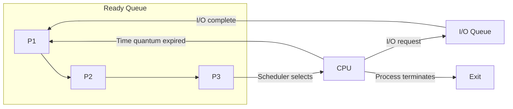
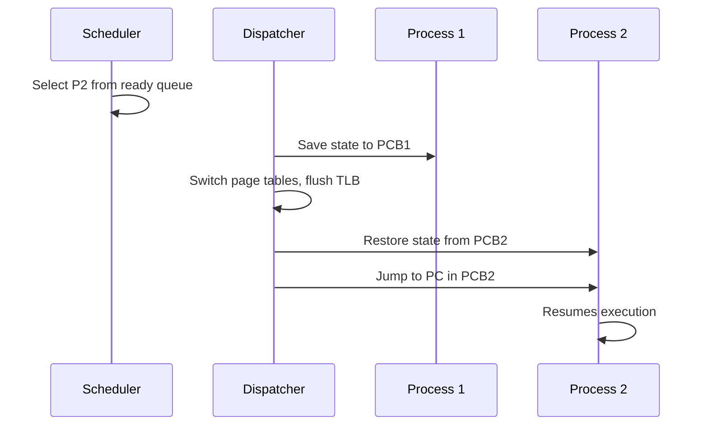
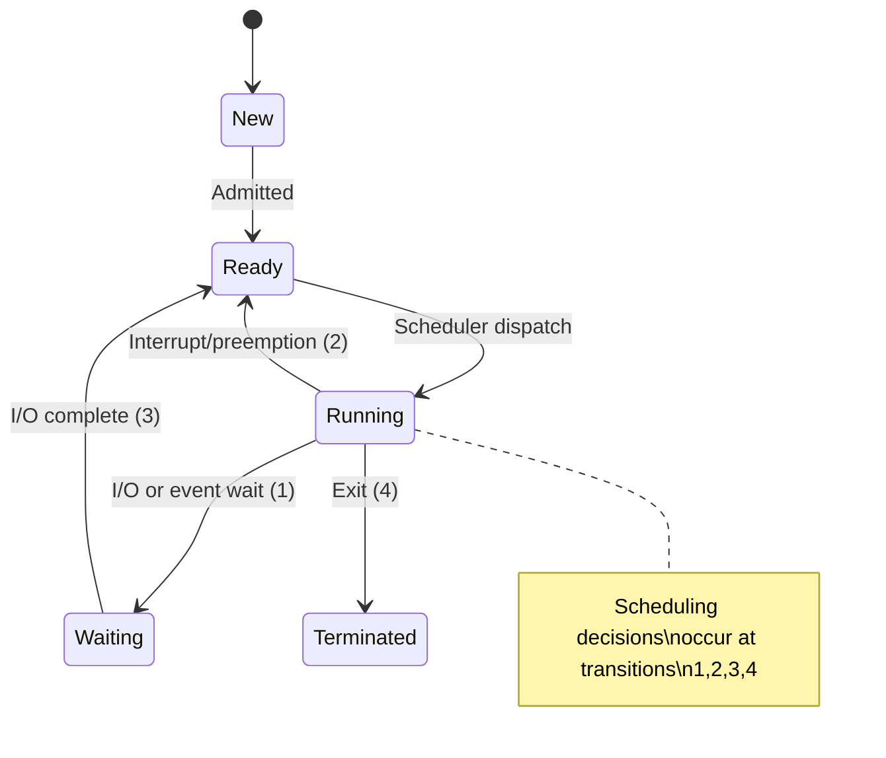
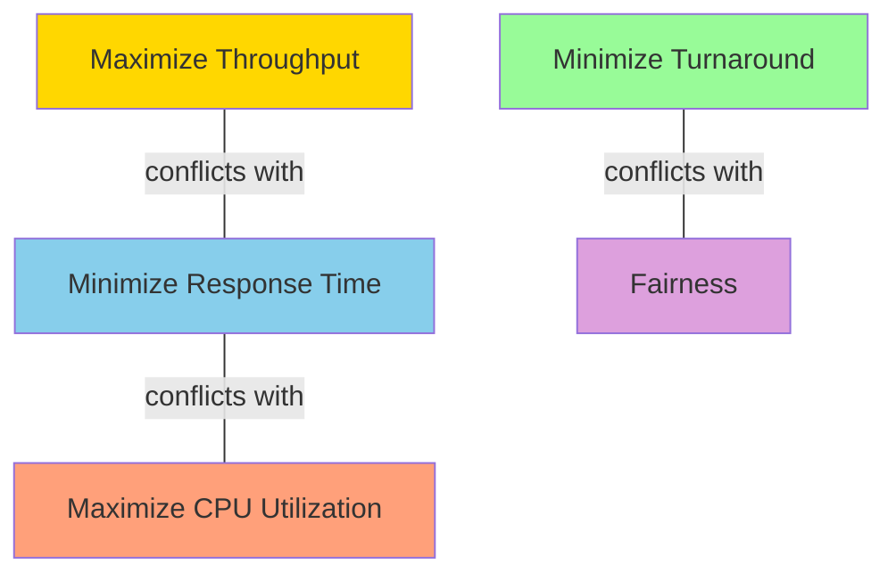
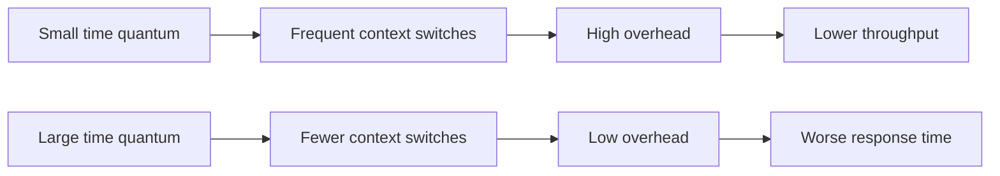
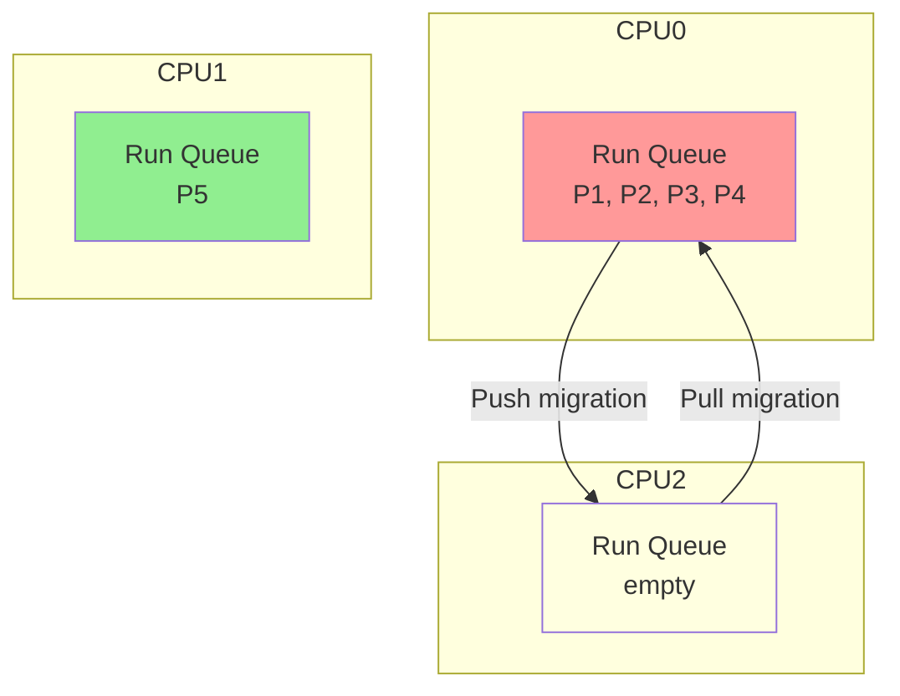

## Learning Objectives

By the end of this lesson, you will be able to:

- Explain the role of the CPU scheduler and dispatcher in process management
- Distinguish between CPU-bound and I/O-bound processes
- Define and calculate key scheduling metrics (throughput, turnaround time, waiting time, response time)
- Compare preemptive and non-preemptive scheduling strategies
- Analyze the overhead and impact of context switching
- Understand when the scheduler makes decisions and why it matters

## Prerequisites

- Process states and lifecycle (new, ready, running, waiting, terminated)
- Basic understanding of interrupts and system calls
- PCB (Process Control Block) concepts

---

## Why CPU Scheduling Matters

In a multiprogramming system, multiple processes compete for CPU time. The **CPU scheduler** decides which process runs next when the CPU becomes available. Good scheduling decisions directly impact:

- **User experience**: Interactive applications must respond quickly
- **System throughput**: Maximize useful work completed per unit time
- **Fairness**: Every process should get reasonable CPU access
- **Resource utilization**: Keep the CPU busy, not idle



---

## CPU and I/O Bursts

Process execution alternates between **CPU bursts** (computation) and **I/O bursts** (waiting for I/O):

```mermaid
gantt
    title Process Execution: Alternating Bursts
    dateFormat X
    axisFormat %s

    section Process
    CPU Burst    :active, cpu1, 0, 5
    I/O Burst    :io1, 5, 12
    CPU Burst    :active, cpu2, 12, 15
    I/O Burst    :io2, 15, 20
    CPU Burst    :active, cpu3, 20, 22
```



### CPU-Bound vs I/O-Bound Processes

| Characteristic | CPU-Bound | I/O-Bound |
|---------------|-----------|-----------|
| CPU burst length | Long | Short |
| I/O burst frequency | Rare | Frequent |
| Examples | Compilation, video encoding, ML training | Text editor, web browser, database server |
| Scheduling need | Throughput | Low response time |
| Typical ratio in a system | Fewer | More |


A good scheduler favors I/O-bound processes — letting them issue I/O requests quickly keeps the I/O devices busy while CPU-bound processes use the CPU.

---

## Scheduler Components

### The CPU Scheduler (Short-Term Scheduler)

Selects from the ready queue which process will execute next. Invoked very frequently — every few milliseconds. Must be extremely fast.

### The Dispatcher

Actually performs the context switch:

1. Switches context (save/restore PCB)
2. Switches to user mode
3. Jumps to the proper location in the program

The time the dispatcher takes is called **dispatch latency** — pure overhead.



### Three Levels of Scheduling

| Level | Name | Function | Frequency |
|-------|------|----------|-----------|
| Long-term | Job scheduler | Admits processes to system | Seconds/minutes |
| Medium-term | Swapper | Swaps processes in/out of memory | Seconds |
| Short-term | CPU scheduler | Selects next process to run | Milliseconds |

---

## When Does the Scheduler Decide?

The scheduler is invoked when a process:

1. **Switches from running to waiting** (e.g., I/O request, wait for child) — non-preemptive
2. **Switches from running to ready** (e.g., interrupt, timer expires) — preemptive
3. **Switches from waiting to ready** (e.g., I/O completion) — preemptive
4. **Terminates** — non-preemptive



---

## Preemptive vs Non-Preemptive Scheduling

### Non-Preemptive (Cooperative)

Once a process starts running, it keeps the CPU until it:
- Voluntarily yields
- Makes an I/O request
- Terminates

```c
// Non-preemptive: process runs until it gives up CPU
while (has_work()) {
    do_computation();  // Runs uninterrupted
}
yield();  // Voluntarily give up CPU
```

### Preemptive

The OS can forcibly take the CPU from a running process, typically via a **timer interrupt**:

```c
// Kernel timer interrupt handler (simplified)
void timer_interrupt_handler() {
    current_process->time_used++;
    if (current_process->time_used >= TIME_QUANTUM) {
        current_process->state = READY;
        schedule();  // Pick another process
    }
}
```

### Comparison

| Aspect | Non-Preemptive | Preemptive |
|--------|---------------|------------|
| CPU monopoly risk | High | Low |
| Response time | Unpredictable | Bounded |
| Context switch overhead | Minimal | Regular |
| Implementation complexity | Simple | Complex |
| Shared data consistency | Simpler | Needs synchronization |
| Used by | Old Windows (3.1), simple RTOS | Linux, macOS, modern Windows |

### Race Conditions with Preemption

Preemptive scheduling introduces concurrency issues in the kernel:

```c
// Kernel code: what if preempted between read and write?
int count = shared_resource->count;  // Read
// <-- Timer interrupt here, another process modifies count
shared_resource->count = count + 1;  // Write — lost update!
```

Solution: Disable interrupts during critical kernel sections or use kernel locks.

---

## Scheduling Criteria

### Key Metrics

| Metric | Definition | Goal |
|--------|-----------|------|
| **CPU Utilization** | % of time CPU is busy | Maximize (40-90% typical) |
| **Throughput** | Number of processes completed per time unit | Maximize |
| **Turnaround Time** | Total time from submission to completion | Minimize |
| **Waiting Time** | Total time spent in the ready queue | Minimize |
| **Response Time** | Time from submission to first response | Minimize |

### Formal Definitions

For a process P:

- **Turnaround Time** = Completion Time - Arrival Time
- **Waiting Time** = Turnaround Time - Burst Time
- **Response Time** = First Run Time - Arrival Time

### Example Calculation

| Process | Arrival | Burst | Completion | Turnaround | Waiting | Response |
|---------|---------|-------|------------|------------|---------|----------|
| P1 | 0 | 6 | 6 | 6 | 0 | 0 |
| P2 | 1 | 4 | 10 | 9 | 5 | 5 |
| P3 | 2 | 2 | 12 | 10 | 8 | 8 |

**Average Turnaround** = (6 + 9 + 10) / 3 = 8.33
**Average Waiting** = (0 + 5 + 8) / 3 = 4.33

### Metric Trade-offs

Optimizing one metric often hurts another:



- Maximizing throughput → batch long jobs together → hurts response time
- Minimizing response time → frequent context switches → hurts throughput
- Fairness → time-sharing → each process is slower individually

---

## Context Switching Overhead

A **context switch** saves the state of the current process and restores the state of the next process. It's pure overhead — no useful work is done.

### What Gets Saved/Restored

```c
struct pcb {
    int pid;
    int state;
    unsigned long program_counter;
    unsigned long stack_pointer;
    unsigned long registers[16];    // General-purpose registers
    unsigned long float_regs[32];   // Floating-point registers
    struct mm_struct *memory_map;   // Page tables
    struct files_struct *open_files;
    int priority;
    unsigned long kernel_stack;
};
```

### Context Switch Cost Breakdown

| Component | Typical Cost | Notes |
|-----------|-------------|-------|
| Register save/restore | ~100 ns | Direct hardware operations |
| TLB flush | ~1-10 μs | Virtual memory invalidation |
| Cache pollution | Variable | Cold cache on resume |
| Pipeline flush | ~10 ns | CPU pipeline restart |
| **Total direct cost** | **~1-10 μs** | Hardware dependent |
| **Indirect cost (cache)** | **~10-100 μs** | Often dominates |

### Measuring Context Switch Time

```bash
# Linux: view context switch statistics
vmstat 1
# cs column shows context switches per second

# Per-process context switches
grep ctxt /proc/$PID/status
# voluntary_ctxt_switches: 150
# nonvoluntary_ctxt_switches: 42

# System-wide
cat /proc/stat | grep ctxt
# ctxt 123456789  (total since boot)
```

### Impact of Excessive Context Switching



The time quantum should be **significantly larger** than the context switch time (typically 10-100ms vs 1-10μs).

---

## The Ready Queue Data Structure

The scheduler's performance depends heavily on how the ready queue is implemented:

| Structure | Insert | Remove Best | Use Case |
|-----------|--------|-------------|----------|
| FIFO Queue | O(1) | O(1) | FCFS scheduling |
| Sorted List | O(n) | O(1) | Priority/SJF |
| Heap | O(log n) | O(log n) | Priority/SJF |
| Multi-level Array | O(1) | O(1)* | Linux O(1) scheduler |
| Red-Black Tree | O(log n) | O(log n) | Linux CFS |

*O(1) scheduler uses a bitmap to find the highest priority non-empty queue.

### Linux's Run Queue

```bash
# View scheduler statistics
cat /proc/schedstat

# Per-CPU run queue length
cat /proc/loadavg
# 0.52 0.48 0.45 2/1234 5678
# ^                ^ currently running/total threads
# 1-min load average
```

---

## Scheduling in Multi-Processor Systems

Multi-core systems add complexity:

### Processor Affinity

Processes tend to accumulate cache state on a particular CPU. Migrating them causes cache misses:

- **Soft affinity**: Scheduler tries to keep a process on the same CPU but may migrate it
- **Hard affinity**: Process is pinned to specific CPUs

```bash
# Pin process to CPU 0 and 1
taskset -c 0,1 ./my_program

# View current affinity
taskset -p $PID
```

### Load Balancing



- **Push migration**: Overloaded CPU pushes tasks to idle CPUs
- **Pull migration**: Idle CPU steals tasks from busy CPUs (work stealing)

---

## Observing Scheduling on Linux

```bash
# See which CPU a process runs on
ps -eo pid,comm,psr

# Real-time scheduling information
chrt -p $PID
# pid 1234's current scheduling policy: SCHED_OTHER
# pid 1234's current scheduling priority: 0

# Trace scheduling events (requires root)
perf sched record -- sleep 5
perf sched latency --sort max
# Task              | Runtime ms | Switches | Avg delay ms | Max delay ms
# ------------------+------------+----------+--------------+-------------
# firefox           | 2450.123   | 4521     | 0.234        | 15.678

# View nice values
ps -eo pid,ni,comm | head -20
```

---

## Key Takeaways

1. **CPU scheduling** is fundamental to multiprogramming — the scheduler decides which process runs next to maximize system performance and user experience.

2. Processes alternate between **CPU bursts** and **I/O bursts**. I/O-bound processes should be favored by the scheduler to keep I/O devices busy alongside the CPU.

3. **Preemptive scheduling** allows the OS to interrupt running processes (via timer interrupts), ensuring fair CPU sharing and bounded response times — virtually all modern OS kernels use it.

4. The five key **scheduling metrics** are CPU utilization, throughput, turnaround time, waiting time, and response time. Optimizing one often comes at the cost of another.

5. **Context switches** have both direct costs (register save/restore, TLB flush) and indirect costs (cache pollution). The time quantum must be much larger than the switch cost.

6. **Multi-processor scheduling** introduces additional concerns: processor affinity to exploit cache locality and load balancing to prevent CPU hotspots.

7. Linux provides rich tools (`/proc`, `perf sched`, `vmstat`, `taskset`) for observing and controlling scheduling behavior.
