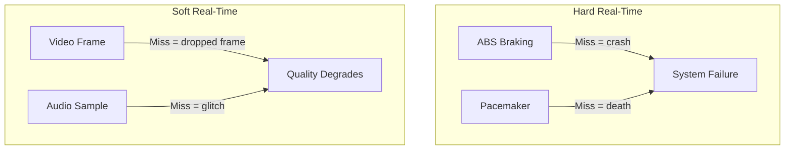
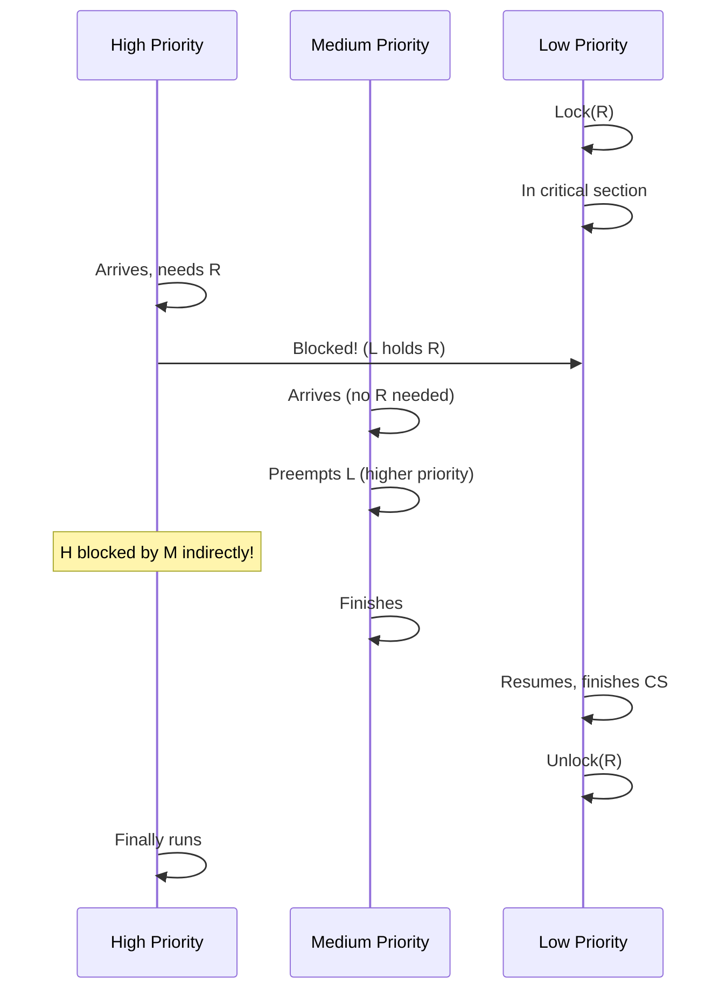
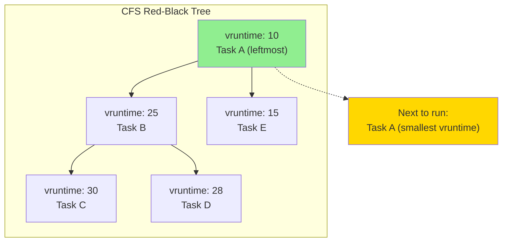
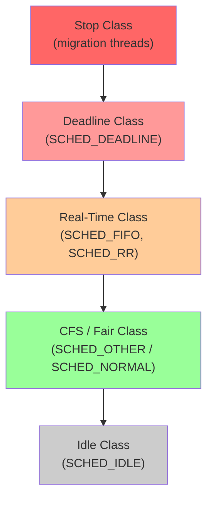

## Learning Objectives

By the end of this lesson, you will be able to:

- Distinguish between hard and soft real-time systems and their scheduling requirements
- Apply Rate-Monotonic Scheduling and its schedulability test
- Apply Earliest-Deadline-First scheduling and prove its optimality
- Understand proportional share scheduling and its fairness guarantees
- Explain how Linux CFS works using virtual runtime and red-black trees
- Configure CPU resource limits using cgroups

## Prerequisites

- CPU scheduling concepts and metrics
- Knowledge of scheduling algorithms (FCFS, SJF, RR, Priority)
- Basic understanding of Linux process management

---

## Real-Time Systems

A **real-time system** must produce correct results within strict timing constraints. Missing a deadline can range from degraded quality to catastrophic failure.

### Hard vs Soft Real-Time

| Characteristic | Hard Real-Time | Soft Real-Time |
|---------------|----------------|----------------|
| Deadline miss consequence | System failure | Degraded quality |
| Guarantee | Must **always** meet deadlines | Should **usually** meet deadlines |
| Examples | Anti-lock brakes, pacemaker, flight control | Video streaming, audio playback, gaming |
| Scheduling approach | Offline analysis + admission control | Best-effort with priority |
| OS examples | VxWorks, QNX, RTEMS | Linux with PREEMPT_RT, macOS |



### Real-Time Task Model

A periodic real-time task is characterized by:

| Parameter | Symbol | Description |
|-----------|--------|-------------|
| Period | T | Time between successive invocations |
| Deadline | D | Maximum time to complete after release |
| Execution time | C | Worst-case CPU time needed |
| Utilization | U = C/T | Fraction of CPU time consumed |

```mermaid
gantt
    title Periodic Task (T=10, C=3, D=10)
    dateFormat X
    axisFormat %s

    section Task τ₁
    Release 1    :milestone, r1, 0, 0
    Execute      :active, e1, 0, 3
    Idle         :i1, 3, 10
    Release 2    :milestone, r2, 10, 10
    Execute      :active, e2, 10, 13
    Idle         :i2, 13, 20
    Release 3    :milestone, r3, 20, 20
    Execute      :active, e3, 20, 23
```



---

## Rate-Monotonic Scheduling (RMS)

**Rate-Monotonic** is a static-priority algorithm for periodic tasks: the task with the **shortest period** gets the **highest priority**.

### Algorithm

1. Assign priorities inversely proportional to period (shorter period = higher priority)
2. Preemptive: a higher-priority task always preempts a lower-priority one
3. Priority is fixed and never changes

### Schedulability Test

A set of n periodic tasks is guaranteed schedulable under RMS if:

\[ U = \sum_{i=1}^{n} \frac{C_i}{T_i} \leq n \cdot (2^{1/n} - 1) \]

| n (tasks) | Utilization Bound |
|-----------|-------------------|
| 1 | 1.000 (100%) |
| 2 | 0.828 (82.8%) |
| 3 | 0.780 (78.0%) |
| 4 | 0.757 (75.7%) |
| ∞ | 0.693 (69.3%) |

This is a **sufficient** condition — some task sets above the bound are still schedulable.

### Example

| Task | Period (T) | Execution (C) | Priority | Utilization |
|------|-----------|--------------|----------|-------------|
| τ₁ | 4 | 1 | Highest | 0.25 |
| τ₂ | 6 | 2 | Medium | 0.33 |
| τ₃ | 12 | 3 | Lowest | 0.25 |

Total U = 0.25 + 0.33 + 0.25 = 0.83

Bound for n=3: 0.780. Since 0.83 > 0.78, the sufficient test **fails** — but the task set may still be schedulable (need to verify with timeline analysis).

```mermaid
gantt
    title Rate-Monotonic Schedule (LCM = 12)
    dateFormat X
    axisFormat %s

    section τ₁ (T=4, C=1)
    Execute :active, a1, 0, 1
    Execute :active, a2, 4, 5
    Execute :active, a3, 8, 9

    section τ₂ (T=6, C=2)
    Execute :active, b1, 1, 3
    Execute :active, b2, 5, 7

    section τ₃ (T=12, C=3)
    Execute :active, c1, 3, 4
    Execute :active, c1b, 7, 8
    Execute :active, c1c, 9, 10
```



All deadlines met within the hyperperiod (LCM = 12).

### Priority Inversion Problem

A high-priority task can be blocked by a low-priority task holding a shared resource, while a medium-priority task preempts the low-priority one:



**Solutions**:
- **Priority Inheritance**: L temporarily inherits H's priority while holding R
- **Priority Ceiling**: Each resource has a ceiling priority; a task holding it runs at ceiling

The Mars Pathfinder (1997) experienced this exact bug — priority inversion caused system resets until NASA engineers patched it remotely with priority inheritance.

---

## Earliest Deadline First (EDF)

**EDF** is a dynamic-priority algorithm: the task with the **nearest deadline** gets the highest priority. Priorities change at each scheduling decision.

### Optimality

EDF is **optimal** among all scheduling algorithms for preemptive uniprocessor scheduling:

> If a set of tasks is schedulable by **any** algorithm, it is schedulable by EDF.

### Schedulability Test

For periodic tasks with deadline equal to period:

\[ U = \sum_{i=1}^{n} \frac{C_i}{T_i} \leq 1.0 \]

EDF can utilize up to **100%** of the CPU — strictly better than RMS's ~69.3% asymptotic bound.

### Example

Same tasks as RMS example (U = 0.83):

| Task | Period | WCET | Deadline |
|------|--------|------|----------|
| τ₁ | 4 | 1 | 4 |
| τ₂ | 6 | 2 | 6 |
| τ₃ | 12 | 3 | 12 |

```mermaid
gantt
    title EDF Schedule (LCM = 12)
    dateFormat X
    axisFormat %s

    section τ₁
    Execute :active, a1, 0, 1
    Execute :active, a2, 4, 5
    Execute :active, a3, 8, 9

    section τ₂
    Execute :active, b1, 1, 3
    Execute :active, b2, 5, 7

    section τ₃
    Execute :active, c1, 3, 4
    Execute :active, c1b, 9, 11
```



### RMS vs EDF

| Feature | RMS | EDF |
|---------|-----|-----|
| Priority | Static | Dynamic |
| Max utilization | ~69.3% (n→∞) | 100% |
| Overload behavior | Predictable (lowest priority misses) | Unpredictable (domino effect) |
| Implementation | Simple (fixed priorities) | Complex (recompute priorities) |
| Analysis | Easier | Harder |
| Used in | Most hard real-time systems | Research, some soft real-time |

---

## Proportional Share Scheduling

**Proportional share** (or **fair share**) scheduling allocates CPU time in proportion to assigned weights or shares.

### Lottery Scheduling

Each process holds "lottery tickets." The scheduler draws a random ticket and runs the winner:

```c
int total_tickets = 0;
for (int i = 0; i < n; i++)
    total_tickets += process[i].tickets;

int winner = random() % total_tickets;
int count = 0;
for (int i = 0; i < n; i++) {
    count += process[i].tickets;
    if (count > winner) {
        run(process[i]);
        break;
    }
}
```

| Process | Tickets | Expected CPU Share |
|---------|---------|-------------------|
| A | 60 | 60% |
| B | 30 | 30% |
| C | 10 | 10% |

**Ticket transfer**: A client process can temporarily give tickets to a server process to increase its priority while handling the client's request.

### Stride Scheduling

Deterministic version of lottery scheduling. Each process has a **stride** (inversely proportional to tickets) and a **pass counter**:

```c
#define LARGE_NUMBER 10000

void stride_schedule(Process procs[], int n) {
    for (int i = 0; i < n; i++) {
        procs[i].stride = LARGE_NUMBER / procs[i].tickets;
        procs[i].pass = 0;
    }

    while (1) {
        int min_idx = 0;
        for (int i = 1; i < n; i++) {
            if (procs[i].pass < procs[min_idx].pass)
                min_idx = i;
        }
        run(procs[min_idx]);
        procs[min_idx].pass += procs[min_idx].stride;
    }
}
```

---

## Linux Completely Fair Scheduler (CFS)

CFS is the default scheduler for normal (SCHED_OTHER) tasks in Linux since kernel 2.6.23.

### Core Idea: Virtual Runtime

Instead of time slices, CFS tracks **virtual runtime** (`vruntime`) — the amount of CPU time a task has received, weighted by its priority:

\[ \text{vruntime} += \text{actual\_runtime} \times \frac{\text{default\_weight}}{\text{task\_weight}} \]

The scheduler always picks the task with the **smallest vruntime** — the one that has received the least (weighted) CPU time.



### Nice Values and Weights

| Nice Value | Weight | Relative CPU Time |
|-----------|--------|-------------------|
| -20 | 88761 | ~300x more than nice 19 |
| -10 | 9548 | |
| 0 | 1024 | Default |
| 10 | 110 | |
| 19 | 15 | Minimum |

Each nice level difference corresponds to roughly a **10% CPU time difference** (by design):

```bash
# Run at lower priority
nice -n 10 ./background_task

# View nice values of all processes
ps -eo pid,ni,comm --sort=-ni
```

### CFS Time Slice Calculation

CFS doesn't use fixed time slices. Instead, each task's slice is proportional to its weight:

\[ \text{time\_slice}_i = \text{scheduling\_period} \times \frac{\text{weight}_i}{\sum \text{weights}} \]

The **scheduling period** (target latency) is typically 6ms for ≤8 tasks, scaling up for more tasks:

```bash
# View CFS parameters
cat /proc/sys/kernel/sched_latency_ns          # Target latency (6000000 = 6ms)
cat /proc/sys/kernel/sched_min_granularity_ns   # Minimum slice (750000 = 0.75ms)
cat /proc/sys/kernel/sched_wakeup_granularity_ns # Preemption threshold
```

### CFS Implementation Details

```c
// Simplified CFS pick_next_task
struct task_struct *pick_next_task_fair(struct rq *rq) {
    struct cfs_rq *cfs_rq = &rq->cfs;
    struct sched_entity *se;
    struct rb_node *left = rb_first_cached(&cfs_rq->tasks_timeline);

    if (!left)
        return NULL;

    se = rb_entry(left, struct sched_entity, run_node);
    return task_of(se);
}
```

Key operations:
- **Pick next**: O(1) — leftmost node in cached red-black tree
- **Enqueue/Dequeue**: O(log n) — red-black tree insertion/deletion
- **Update vruntime**: O(1) — simple arithmetic on context switch

### Scheduling Classes in Linux

Linux uses a hierarchy of scheduling classes:



```bash
# View and set scheduling policies
chrt -p $$                           # Current shell's policy
chrt -f -p 50 $PID                   # Set SCHED_FIFO, priority 50
chrt -r -p 25 $PID                   # Set SCHED_RR, priority 25
chrt -d --sched-runtime 10000000 \
        --sched-deadline 30000000 \
        --sched-period 30000000 \
        -p 0 $PID                    # Set SCHED_DEADLINE
```

---

## CPU Control with cgroups

**Control groups (cgroups)** allow you to allocate, limit, and monitor CPU resources for groups of processes.

### cgroups v2 CPU Controller

```bash
# Create a cgroup
mkdir /sys/fs/cgroup/myapp

# Set CPU weight (proportional share, default 100)
echo 200 > /sys/fs/cgroup/myapp/cpu.weight  # 2x default share

# Set CPU bandwidth limit (max 50% of one CPU)
echo "50000 100000" > /sys/fs/cgroup/myapp/cpu.max
# Format: $MAX $PERIOD (in microseconds)
# 50000/100000 = 50%

# Add a process to the cgroup
echo $PID > /sys/fs/cgroup/myapp/cgroup.procs

# Monitor CPU usage
cat /sys/fs/cgroup/myapp/cpu.stat
# usage_usec 1234567
# user_usec 1000000
# system_usec 234567
```

### CPU Pinning with cgroups

```bash
# Restrict to CPUs 0 and 1 only
echo "0-1" > /sys/fs/cgroup/myapp/cpuset.cpus
echo "0" > /sys/fs/cgroup/myapp/cpuset.mems
```

### Docker and CPU Limits

Docker uses cgroups under the hood:

```bash
# Limit container to 1.5 CPUs
docker run --cpus="1.5" nginx

# Relative weight (1024 = default)
docker run --cpu-shares=2048 nginx  # Double weight

# Pin to specific CPUs
docker run --cpuset-cpus="0,2" nginx
```

---

## Observing Scheduling in Practice

```bash
# Trace scheduler decisions
sudo perf sched record -- sleep 10
sudo perf sched latency --sort max

# Scheduler statistics per task
cat /proc/$PID/sched
# se.vruntime         : 12345.678
# se.sum_exec_runtime : 456789.012
# nr_switches         : 1234
# nr_voluntary_switches : 800
# nr_involuntary_switches : 434

# Real-time scheduling info
cat /proc/$PID/sched | grep policy
# policy        : 0  (SCHED_NORMAL)

# System-wide scheduler stats
cat /proc/schedstat
```

---

## Key Takeaways

1. **Hard real-time** systems demand guaranteed deadline compliance, while **soft real-time** tolerates occasional misses — the scheduling approach differs significantly.

2. **Rate-Monotonic Scheduling** is the optimal static-priority algorithm, with a utilization bound of ~69.3%. It's simple and widely deployed in real-time systems.

3. **Earliest Deadline First** is the optimal dynamic-priority algorithm, achieving up to 100% CPU utilization, but its overload behavior is less predictable than RMS.

4. **Priority inversion** is a real danger in priority-based scheduling — use priority inheritance or priority ceiling protocols to prevent it.

5. **Linux CFS** uses virtual runtime in a red-black tree to achieve proportional fair scheduling with O(1) task selection and O(log n) updates.

6. **cgroups** provide powerful CPU resource control — use `cpu.weight` for proportional sharing, `cpu.max` for hard limits, and `cpuset.cpus` for CPU pinning.

7. The `nice` value maps to CFS weights, where each nice level corresponds to roughly a 10% difference in CPU time allocation.
