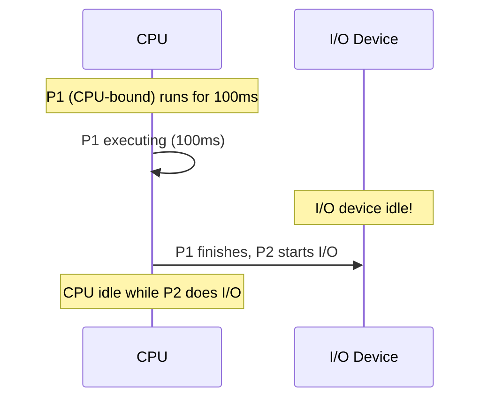
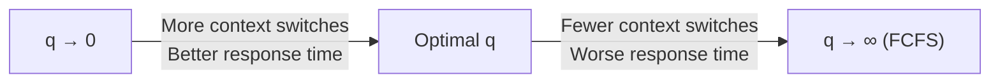
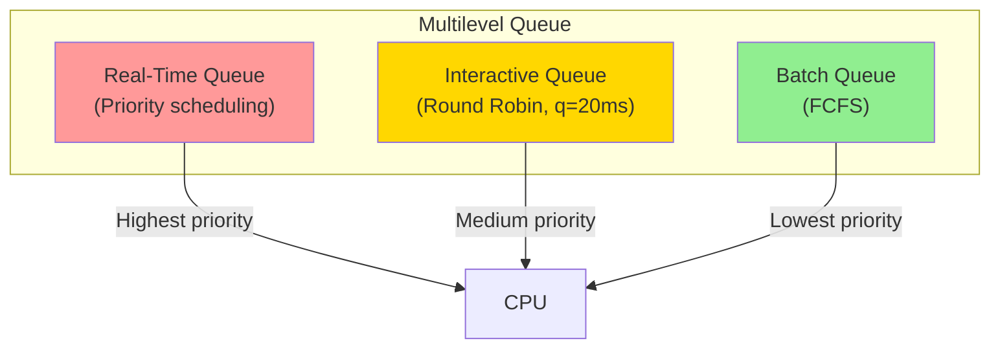
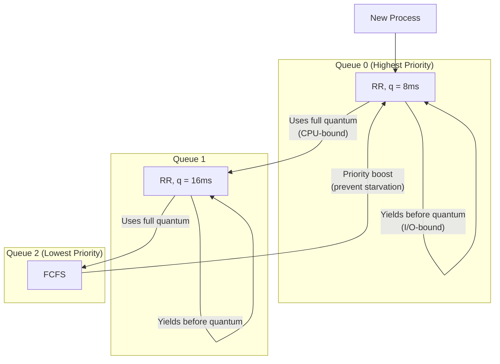

## Learning Objectives

By the end of this lesson, you will be able to:

- Implement and analyze FCFS, SJF, SRTF, Round Robin, and Priority scheduling
- Construct Gantt charts for each scheduling algorithm
- Calculate average waiting time, turnaround time, and response time for each algorithm
- Explain Multilevel Queue and Multilevel Feedback Queue scheduling
- Compare algorithms using quantitative metrics and understand their trade-offs
- Choose the appropriate scheduling algorithm for different workload types

## Prerequisites

- CPU scheduling concepts, metrics, and terminology
- Preemptive vs non-preemptive scheduling
- Understanding of process arrival times and burst times

---

## First-Come, First-Served (FCFS)

The simplest scheduling algorithm: processes are executed in the order they arrive.

### Example

| Process | Arrival | Burst |
|---------|---------|-------|
| P1 | 0 | 7 |
| P2 | 1 | 4 |
| P3 | 2 | 1 |
| P4 | 3 | 4 |

```mermaid
gantt
    title FCFS Gantt Chart
    dateFormat X
    axisFormat %s

    P1 :p1, 0, 7
    P2 :p2, 7, 11
    P3 :p3, 11, 12
    P4 :p4, 12, 16
```



| Process | Completion | Turnaround | Waiting | Response |
|---------|-----------|------------|---------|----------|
| P1 | 7 | 7 | 0 | 0 |
| P2 | 11 | 10 | 6 | 6 |
| P3 | 12 | 10 | 9 | 9 |
| P4 | 16 | 13 | 9 | 9 |
| **Avg** | | **10.0** | **6.0** | **6.0** |

### The Convoy Effect

FCFS suffers from the **convoy effect**: a long CPU-bound process monopolizes the CPU while short I/O-bound processes wait behind it, leading to low CPU and I/O utilization.



### Properties

- **Type**: Non-preemptive
- **Pros**: Simple, no starvation
- **Cons**: Convoy effect, high average waiting time
- **Best for**: Batch systems where simplicity matters

---

## Shortest Job First (SJF)

Select the process with the **shortest CPU burst** next. Provably optimal for minimizing average waiting time (among non-preemptive algorithms).

### Example

| Process | Arrival | Burst |
|---------|---------|-------|
| P1 | 0 | 7 |
| P2 | 2 | 4 |
| P3 | 4 | 1 |
| P4 | 5 | 4 |



```mermaid
gantt
    title SJF (Non-Preemptive) Gantt Chart
    dateFormat X
    axisFormat %s

    P1 :p1, 0, 7
    P3 :p3, 7, 8
    P2 :p2, 8, 12
    P4 :p4, 12, 16
```

At time 7, P2 (burst=4), P3 (burst=1), P4 (burst=4) are all waiting. SJF picks P3 (shortest).

| Process | Completion | Turnaround | Waiting | Response |
|---------|-----------|------------|---------|----------|
| P1 | 7 | 7 | 0 | 0 |
| P2 | 12 | 10 | 6 | 6 |
| P3 | 8 | 4 | 3 | 3 |
| P4 | 16 | 11 | 7 | 7 |
| **Avg** | | **8.0** | **4.0** | **4.0** |

### The Prediction Problem

SJF requires knowing future burst lengths. In practice, we **estimate** using exponential averaging:

\[ \tau_{n+1} = \alpha \cdot t_n + (1 - \alpha) \cdot \tau_n \]

Where:
- \(\tau_{n+1}\) = predicted next burst
- \(t_n\) = actual length of the nth burst
- \(\alpha\) = weight (typically 0.5)

```c
double predict_burst(double actual, double previous_prediction, double alpha) {
    return alpha * actual + (1.0 - alpha) * previous_prediction;
}

// Example: alpha = 0.5, initial prediction = 10
// Actual bursts: 6, 4, 6, 4, 13, 13, 13
// Predictions:   10, 8, 6, 6, 5, 9, 11, 12
```

### Properties

- **Type**: Non-preemptive
- **Pros**: Optimal average waiting time for non-preemptive
- **Cons**: Requires burst prediction, starvation of long processes
- **Best for**: Batch systems with predictable job sizes

---

## Shortest Remaining Time First (SRTF)

The preemptive version of SJF. When a new process arrives with a shorter remaining burst than the current process, the current process is preempted.

### Example

| Process | Arrival | Burst |
|---------|---------|-------|
| P1 | 0 | 7 |
| P2 | 2 | 4 |
| P3 | 4 | 1 |
| P4 | 5 | 4 |



```mermaid
gantt
    title SRTF Gantt Chart
    dateFormat X
    axisFormat %s

    P1 :p1a, 0, 2
    P2 :p2a, 2, 4
    P3 :p3, 4, 5
    P2 :p2b, 5, 7
    P4 :p4, 7, 11
    P1 :p1b, 11, 16
```

Step-by-step:
- t=0: Only P1 (remaining=7). Run P1.
- t=2: P2 arrives (burst=4). P1 remaining=5. 4 < 5 → preempt P1, run P2.
- t=4: P3 arrives (burst=1). P2 remaining=2. 1 < 2 → preempt P2, run P3.
- t=5: P3 finishes. P4 arrives (burst=4). P2 remaining=2, P1 remaining=5. Run P2.
- t=7: P2 finishes. P4 remaining=4, P1 remaining=5. Run P4.
- t=11: P4 finishes. Run P1.

| Process | Completion | Turnaround | Waiting | Response |
|---------|-----------|------------|---------|----------|
| P1 | 16 | 16 | 9 | 0 |
| P2 | 7 | 5 | 1 | 0 |
| P3 | 5 | 1 | 0 | 0 |
| P4 | 11 | 6 | 2 | 2 |
| **Avg** | | **7.0** | **3.0** | **0.5** |

### Properties

- **Type**: Preemptive
- **Pros**: Optimal average waiting time overall
- **Cons**: More context switches, starvation risk, needs burst prediction
- **Best for**: Time-sharing systems where minimizing wait is critical

---

## Round Robin (RR)

Each process gets a fixed **time quantum** (q). After q time units, the process is preempted and placed at the end of the ready queue.

### Example (q = 3)

| Process | Arrival | Burst |
|---------|---------|-------|
| P1 | 0 | 5 |
| P2 | 1 | 3 |
| P3 | 2 | 6 |
| P4 | 3 | 1 |

```mermaid
gantt
    title Round Robin (q=3) Gantt Chart
    dateFormat X
    axisFormat %s

    P1 :p1a, 0, 3
    P2 :p2, 3, 6
    P3 :p3a, 6, 9
    P4 :p4, 9, 10
    P1 :p1b, 10, 12
    P3 :p3b, 12, 15
```



| Process | Completion | Turnaround | Waiting | Response |
|---------|-----------|------------|---------|----------|
| P1 | 12 | 12 | 7 | 0 |
| P2 | 6 | 5 | 2 | 2 |
| P3 | 15 | 13 | 7 | 4 |
| P4 | 10 | 7 | 6 | 6 |
| **Avg** | | **9.25** | **5.5** | **3.0** |

### Time Quantum Selection

| Quantum Size | Effect |
|-------------|--------|
| Very small (1ms) | Near-SRTF behavior but excessive context switches |
| Very large (∞) | Degenerates to FCFS |
| Rule of thumb | 80% of CPU bursts should be shorter than q |
| Typical values | 10-100ms |



### Properties

- **Type**: Preemptive
- **Pros**: Fair, bounded response time, no starvation
- **Cons**: Higher average turnaround than SJF, context switch overhead
- **Best for**: Interactive/time-sharing systems

---

## Priority Scheduling

Each process is assigned a **priority**. The highest-priority process runs first. Equal priorities use FCFS.

### Example

| Process | Arrival | Burst | Priority (lower = higher) |
|---------|---------|-------|---------------------------|
| P1 | 0 | 4 | 3 |
| P2 | 1 | 3 | 1 |
| P3 | 2 | 5 | 4 |
| P4 | 3 | 2 | 2 |

```mermaid
gantt
    title Preemptive Priority Gantt Chart
    dateFormat X
    axisFormat %s

    P1 :p1a, 0, 1
    P2 :p2, 1, 4
    P4 :p4, 4, 6
    P1 :p1b, 6, 9
    P3 :p3, 9, 14
```



### The Starvation Problem

Low-priority processes may **never execute** if higher-priority processes keep arriving.

**Solution — Aging**: Gradually increase the priority of waiting processes:

```c
// Every scheduling tick:
for (int i = 0; i < num_processes; i++) {
    if (process[i].state == READY) {
        process[i].wait_time++;
        if (process[i].wait_time % AGING_THRESHOLD == 0) {
            process[i].priority--;  // Boost priority (lower = higher)
        }
    }
}
```

### Priority Assignment

| Type | Source | Example |
|------|--------|---------|
| Static | Set at creation | Real-time priorities |
| Dynamic | Adjusted at runtime | Nice values, aging |
| Internal | OS-computed | 1/burst_time (SJF is priority scheduling!) |
| External | User/admin set | `nice -n -10 ./important_task` |

```bash
# View and modify process priorities on Linux
nice -n 10 ./low_priority_task     # Lower priority
renice -n -5 -p $PID              # Boost priority (needs root for negative)

# Real-time priorities
chrt -f 50 ./realtime_task         # SCHED_FIFO, priority 50
```

---

## Multilevel Queue Scheduling

Processes are permanently assigned to different queues based on their type, each with its own scheduling algorithm:



### Time Allocation Between Queues

| Queue | Algorithm | CPU Share |
|-------|-----------|-----------|
| Real-time | Priority | Absolute priority |
| Interactive | RR (q=20ms) | 70% of remaining |
| Batch | FCFS | 30% of remaining |

### Limitation

Processes **cannot move** between queues. An I/O-bound process that becomes CPU-bound is stuck in the wrong queue.

---

## Multilevel Feedback Queue (MLFQ)

The most sophisticated general-purpose scheduling algorithm. Processes can **move between queues** based on their behavior:



### MLFQ Rules

1. New processes enter the highest-priority queue
2. If a process uses its entire time quantum, it moves **down** one queue
3. If a process voluntarily gives up the CPU (I/O), it stays at the **same** level (or moves up)
4. Periodically, **boost** all processes to the top queue (prevents starvation)

### Example Walkthrough

```mermaid
gantt
    title MLFQ Execution (3 queues, q=8,16,FCFS)
    dateFormat X
    axisFormat %s

    section Queue 0 (q=8)
    P1 (new)      :a1, 0, 8
    P2 (I/O return):a2, 8, 10

    section Queue 1 (q=16)
    P1 (demoted)  :b1, 10, 26

    section Queue 2 (FCFS)
    P1 (demoted)  :c1, 26, 50
```



P1 is CPU-bound → keeps using full quantum → gets demoted. P2 does I/O quickly → stays in top queue → gets good response time.

### MLFQ Parameters

| Parameter | Typical Value | Effect |
|-----------|--------------|--------|
| Number of queues | 3-10 | More queues = finer granularity |
| Quantum per queue | Doubles each level | 8ms, 16ms, 32ms, ... |
| Boost interval | 1-10 seconds | Prevents starvation |
| Aging threshold | Varies | How quickly to promote |

---

## Algorithm Comparison

### Head-to-Head: Same Workload

Using processes: P1(burst=10), P2(burst=4), P3(burst=2), P4(burst=7), all arriving at time 0.

| Algorithm | Avg Turnaround | Avg Waiting | Avg Response |
|-----------|---------------|-------------|-------------|
| FCFS | 16.75 | 10.75 | 10.75 |
| SJF | 13.0 | 7.0 | 7.0 |
| RR (q=4) | 18.25 | 12.25 | 2.5 |
| Priority | Depends on assignment | Varies | Varies |

### Algorithm Selection Guide

| Criterion | Best Algorithm |
|-----------|----------------|
| Minimize average wait | SJF / SRTF |
| Minimize response time | Round Robin (small q) |
| Simplicity | FCFS |
| No starvation | Round Robin, MLFQ with boost |
| Adaptive to workload | MLFQ |
| Real-time guarantees | Priority + rate-monotonic |
| General-purpose OS | MLFQ (what Linux approximates) |

### Comprehensive Comparison Table

| Algorithm | Preemptive | Starvation | Convoy Effect | Needs Burst Length | Context Switches |
|-----------|:---------:|:----------:|:-------------:|:-----------------:|:---------------:|
| FCFS | ❌ | ❌ | ✅ | ❌ | Minimal |
| SJF | ❌ | ✅ | ❌ | ✅ | Minimal |
| SRTF | ✅ | ✅ | ❌ | ✅ | High |
| RR | ✅ | ❌ | ❌ | ❌ | Medium-High |
| Priority | Either | ✅* | ❌ | ❌ | Varies |
| MLQ | Either | ✅ | Possible | ❌ | Varies |
| MLFQ | ✅ | ❌** | ❌ | ❌ | Medium |

*Without aging. **With periodic priority boost.

---

## Implementing a Simple Scheduler

```c
#include <stdio.h>
#include <limits.h>

typedef struct {
    int pid;
    int arrival;
    int burst;
    int remaining;
    int completion;
    int start;
    int started;
} Process;

void round_robin(Process procs[], int n, int quantum) {
    int time = 0, done = 0;
    int queue[100], front = 0, rear = 0;
    int in_queue[100] = {0};

    // Add first process
    queue[rear++] = 0;
    in_queue[0] = 1;

    while (done < n) {
        if (front == rear) {
            time++;
            for (int i = 0; i < n; i++) {
                if (!in_queue[i] && procs[i].arrival <= time && procs[i].remaining > 0) {
                    queue[rear++] = i;
                    in_queue[i] = 1;
                }
            }
            continue;
        }

        int idx = queue[front++];

        if (!procs[idx].started) {
            procs[idx].start = time;
            procs[idx].started = 1;
        }

        int run_time = (procs[idx].remaining < quantum) ?
                        procs[idx].remaining : quantum;
        time += run_time;
        procs[idx].remaining -= run_time;

        // Add newly arrived processes
        for (int i = 0; i < n; i++) {
            if (!in_queue[i] && procs[i].arrival <= time && procs[i].remaining > 0) {
                queue[rear++] = i;
                in_queue[i] = 1;
            }
        }

        if (procs[idx].remaining > 0) {
            queue[rear++] = idx;  // Re-enqueue
        } else {
            procs[idx].completion = time;
            done++;
        }
    }

    printf("PID\tArrival\tBurst\tComplete\tTurnaround\tWaiting\tResponse\n");
    float avg_tat = 0, avg_wt = 0, avg_rt = 0;
    for (int i = 0; i < n; i++) {
        int tat = procs[i].completion - procs[i].arrival;
        int wt = tat - procs[i].burst;
        int rt = procs[i].start - procs[i].arrival;
        printf("P%d\t%d\t%d\t%d\t\t%d\t\t%d\t%d\n",
               procs[i].pid, procs[i].arrival, procs[i].burst,
               procs[i].completion, tat, wt, rt);
        avg_tat += tat;
        avg_wt += wt;
        avg_rt += rt;
    }
    printf("Avg\t\t\t\t\t%.2f\t\t%.2f\t%.2f\n",
           avg_tat/n, avg_wt/n, avg_rt/n);
}

int main() {
    Process procs[] = {
        {1, 0, 5, 5, 0, 0, 0},
        {2, 1, 3, 3, 0, 0, 0},
        {3, 2, 6, 6, 0, 0, 0},
        {4, 3, 1, 1, 0, 0, 0}
    };
    printf("=== Round Robin (q=3) ===\n");
    round_robin(procs, 4, 3);
    return 0;
}
```

---

## Key Takeaways

1. **FCFS** is the simplest but suffers from the convoy effect — long processes delay short ones, leading to high average waiting time.

2. **SJF/SRTF** minimize average waiting time but require burst-time prediction and risk starvation of long processes.

3. **Round Robin** provides fair, bounded response time through time-slicing — the time quantum is the critical tuning parameter (rule of thumb: 80% of bursts should complete within one quantum).

4. **Priority scheduling** offers flexible control but introduces starvation — **aging** is the standard solution.

5. **Multilevel Feedback Queue (MLFQ)** is the most adaptive algorithm: it automatically classifies processes as CPU-bound or I/O-bound based on behavior and adjusts priority accordingly.

6. No single algorithm is optimal for all criteria simultaneously — the choice depends on whether you prioritize throughput (SJF), response time (RR), fairness (MLFQ), or simplicity (FCFS).

7. Real operating systems use **hybrid approaches** — Linux CFS uses a weighted fair-queuing model with red-black trees, inspired by MLFQ principles but with different mechanics.
