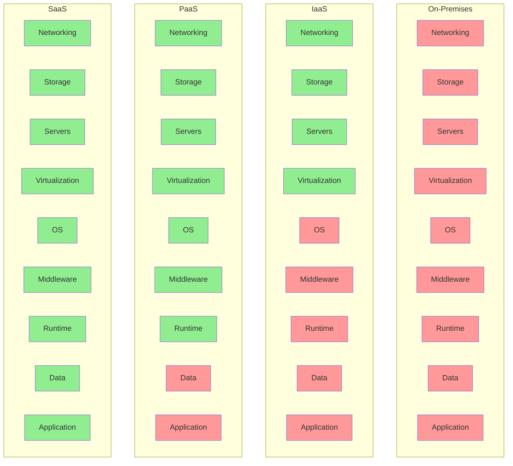
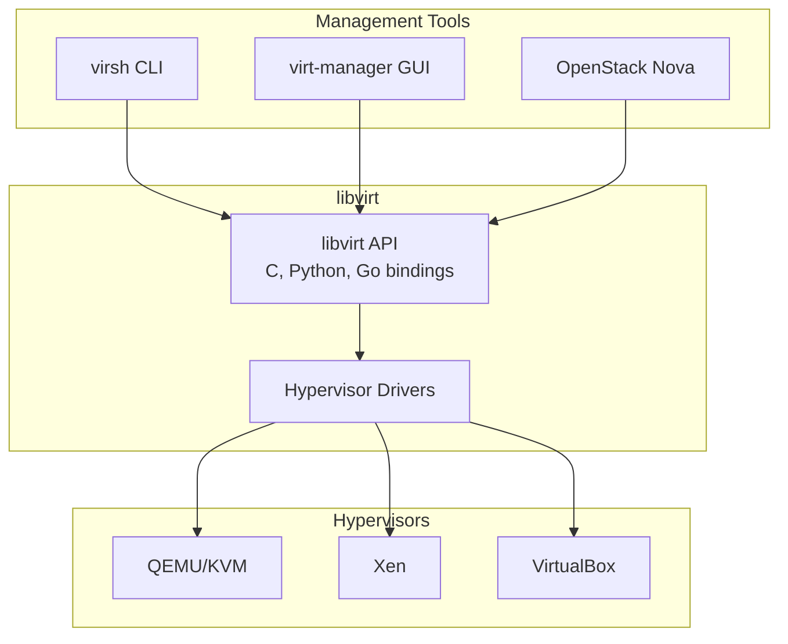
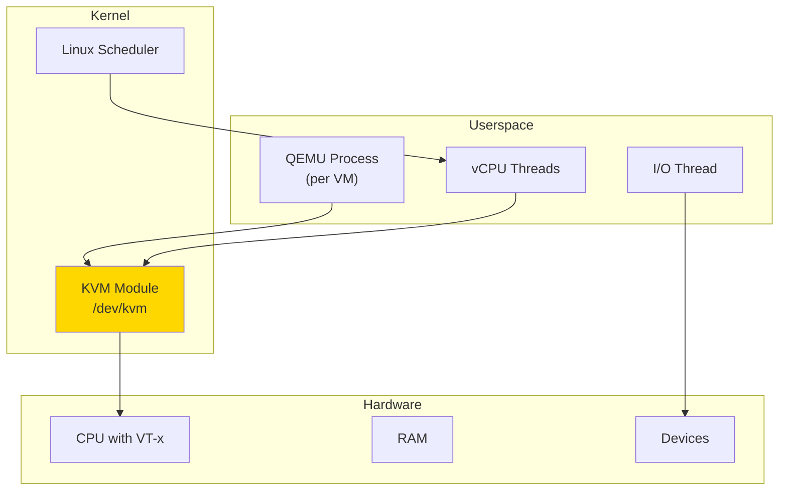
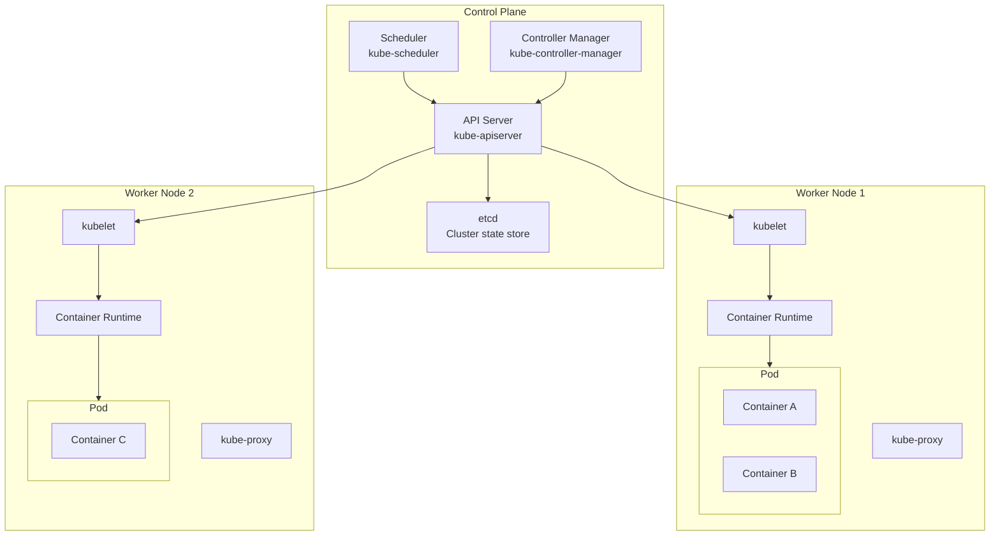
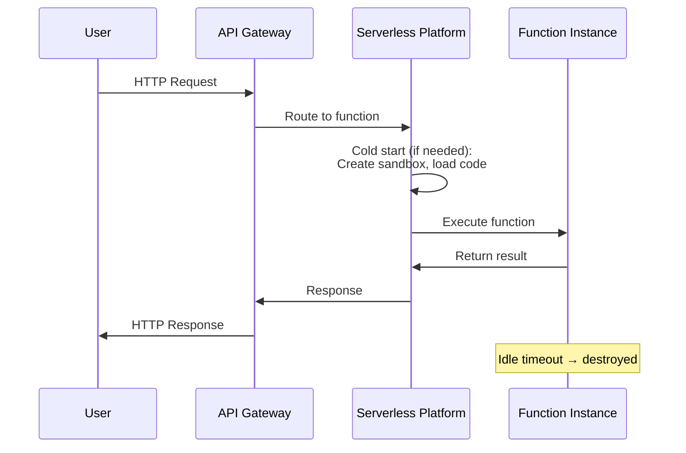
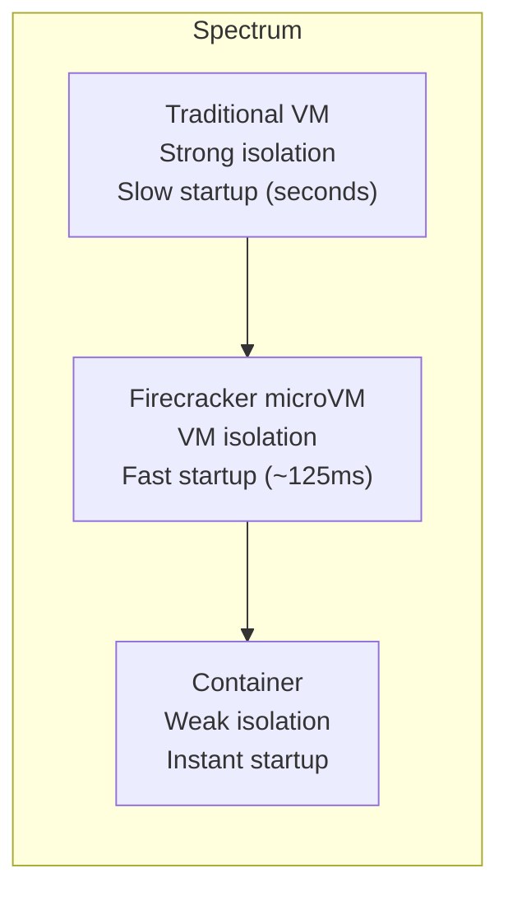
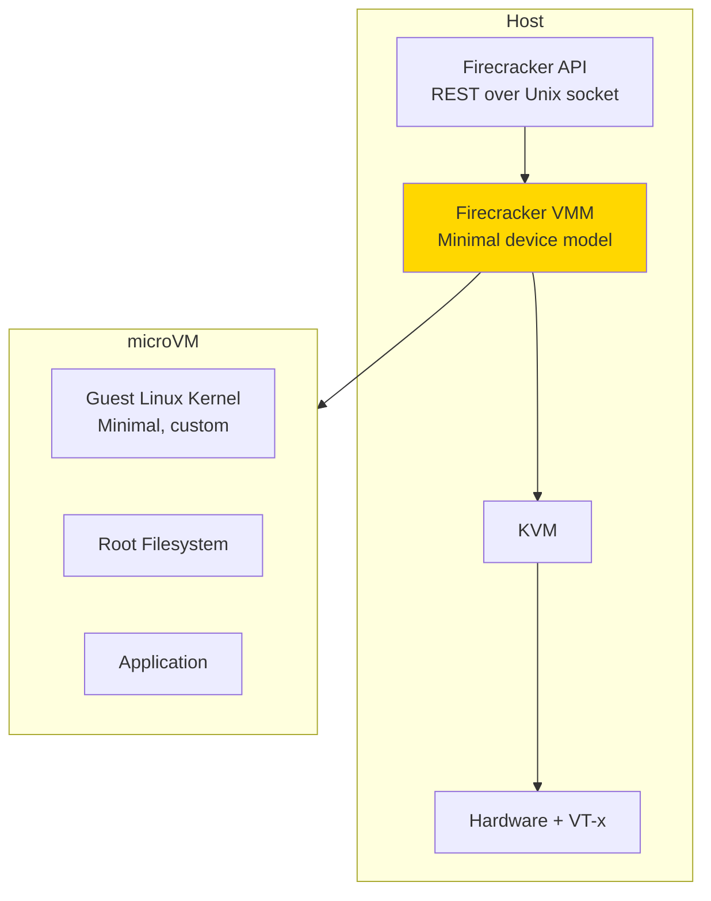
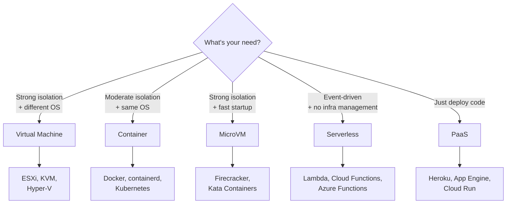

## Learning Objectives

By the end of this lesson, you will be able to:

- Classify cloud computing models (IaaS, PaaS, SaaS) and their trade-offs
- Explain how libvirt and QEMU/KVM manage virtual machines programmatically
- Understand Kubernetes architecture and core concepts (Pods, Services, Deployments)
- Describe serverless computing and its execution model
- Explain how microVMs (Firecracker) combine container speed with VM security
- Evaluate which abstraction layer fits different application requirements

## Prerequisites

- Virtualization concepts (hypervisors, VMs)
- Container fundamentals (namespaces, cgroups, Docker)
- Basic networking concepts

---

## Cloud Computing Models

Cloud computing provides on-demand access to computing resources over a network. The three service models define what the provider manages vs. what the customer manages:



*Green = provider manages, Red = customer manages*

### Service Model Comparison

| Model | Customer Controls | Provider Controls | Examples |
|-------|------------------|-------------------|----------|
| **IaaS** | OS, middleware, runtime, apps | Hardware, networking, virtualization | AWS EC2, Azure VMs, GCP Compute Engine |
| **PaaS** | Application code, data | Everything below runtime | Heroku, Google App Engine, Azure App Service |
| **SaaS** | Configuration only | Everything | Gmail, Salesforce, Slack |

### Additional Cloud Models

| Model | Description | Examples |
|-------|-------------|----------|
| **FaaS** (Function as a Service) | Run individual functions, pay per execution | AWS Lambda, Azure Functions, GCP Cloud Functions |
| **CaaS** (Container as a Service) | Managed container orchestration | AWS ECS, Google GKE, Azure AKS |
| **DBaaS** (Database as a Service) | Managed databases | AWS RDS, MongoDB Atlas, Google Cloud SQL |

---

## Virtual Machine Management

### libvirt: The Virtualization API

**libvirt** provides a unified API for managing VMs across different hypervisors (KVM, Xen, VirtualBox, etc.):



### Managing VMs with virsh

```bash
# List running VMs
virsh list
#  Id   Name     State
# -------------------------
#  1    web-01   running
#  2    db-01    running

# Create VM from XML definition
virsh define vm-config.xml

# Start/stop/restart
virsh start web-01
virsh shutdown web-01      # Graceful shutdown
virsh destroy web-01       # Force stop (like power off)
virsh reboot web-01

# Snapshot management
virsh snapshot-create-as web-01 --name "before-upgrade"
virsh snapshot-list web-01
virsh snapshot-revert web-01 --snapshotname "before-upgrade"

# Live migration
virsh migrate --live web-01 qemu+ssh://host2/system

# Resource modification
virsh setvcpus web-01 4 --live          # Change CPU count
virsh setmem web-01 4194304 --live      # Change memory (KiB)
```

### VM Definition (XML)

```xml
<domain type='kvm'>
  <name>web-server</name>
  <memory unit='GiB'>4</memory>
  <vcpu>2</vcpu>
  <os>
    <type arch='x86_64'>hvm</type>
    <boot dev='hd'/>
  </os>
  <devices>
    <disk type='file' device='disk'>
      <driver name='qemu' type='qcow2'/>
      <source file='/var/lib/libvirt/images/web.qcow2'/>
      <target dev='vda' bus='virtio'/>
    </disk>
    <interface type='bridge'>
      <source bridge='br0'/>
      <model type='virtio'/>
    </interface>
    <graphics type='vnc' port='-1'/>
  </devices>
</domain>
```

### QEMU/KVM Architecture



```bash
# Create a disk image
qemu-img create -f qcow2 disk.qcow2 20G

# Boot a VM with KVM acceleration
qemu-system-x86_64 \
    -enable-kvm \
    -m 2048 \
    -smp cores=2 \
    -drive file=disk.qcow2,format=qcow2,if=virtio \
    -netdev user,id=net0,hostfwd=tcp::2222-:22 \
    -device virtio-net-pci,netdev=net0 \
    -nographic

# Manage disk images
qemu-img info disk.qcow2
qemu-img snapshot -c backup1 disk.qcow2
qemu-img convert -O raw disk.qcow2 disk.raw
```

---

## Container Orchestration: Kubernetes

**Kubernetes** (K8s) automates deployment, scaling, and management of containerized applications across clusters of machines.

### Architecture



### Core Concepts

| Concept | Description |
|---------|-------------|
| **Pod** | Smallest deployable unit — one or more containers sharing network/storage |
| **Service** | Stable network endpoint for a set of Pods |
| **Deployment** | Declarative updates for Pods (rolling updates, rollbacks) |
| **ReplicaSet** | Ensures a specified number of Pod replicas are running |
| **Namespace** | Virtual cluster within a physical cluster |
| **ConfigMap/Secret** | Configuration and sensitive data management |
| **PersistentVolume** | Storage abstraction for stateful workloads |

### Kubernetes Manifests

```yaml
# deployment.yaml — Desired state declaration
apiVersion: apps/v1
kind: Deployment
metadata:
  name: web-app
  labels:
    app: web
spec:
  replicas: 3
  selector:
    matchLabels:
      app: web
  template:
    metadata:
      labels:
        app: web
    spec:
      containers:
      - name: nginx
        image: nginx:1.25
        ports:
        - containerPort: 80
        resources:
          requests:
            cpu: "100m"      # 0.1 CPU cores
            memory: "128Mi"
          limits:
            cpu: "500m"      # 0.5 CPU cores
            memory: "256Mi"
---
# service.yaml — Network access
apiVersion: v1
kind: Service
metadata:
  name: web-service
spec:
  selector:
    app: web
  ports:
  - port: 80
    targetPort: 80
  type: LoadBalancer
```

```bash
# Apply configuration
kubectl apply -f deployment.yaml

# View resources
kubectl get pods
# NAME                       READY   STATUS    RESTARTS   AGE
# web-app-7d4b8c6f9-abc12    1/1     Running   0          30s
# web-app-7d4b8c6f9-def34    1/1     Running   0          30s
# web-app-7d4b8c6f9-ghi56    1/1     Running   0          30s

# Scale up
kubectl scale deployment web-app --replicas=5

# Rolling update
kubectl set image deployment/web-app nginx=nginx:1.26

# Rollback
kubectl rollout undo deployment/web-app

# View cluster resources
kubectl top nodes
kubectl top pods
```

### How Kubernetes Uses OS Primitives

| K8s Feature | Linux Mechanism |
|-------------|-----------------|
| Pod isolation | Namespaces (PID, network, mount) |
| Resource limits | cgroups (cpu, memory, io) |
| Networking | veth pairs, iptables/nftables, IPVS |
| Storage | Volumes, bind mounts, CSI drivers |
| Security | seccomp, AppArmor, SELinux |

---

## Serverless Computing

**Serverless** (FaaS) abstracts away all infrastructure. You deploy functions; the platform handles everything else:



### Execution Model

```python
# AWS Lambda function example
import json

def handler(event, context):
    name = event.get('name', 'World')
    return {
        'statusCode': 200,
        'body': json.dumps({'message': f'Hello, {name}!'})
    }
```

### Cold Start Problem

| Phase | Duration | Cause |
|-------|----------|-------|
| **Cold start** | 100ms - 10s | New sandbox creation, code loading, runtime init |
| **Warm start** | 1-10ms | Reuse existing sandbox |

Factors affecting cold start:
- **Language**: Go/Rust (~50ms) < Python/Node (~200ms) < Java/C# (~1-5s)
- **Package size**: Larger dependencies = slower load
- **Memory allocation**: More memory = faster CPU = shorter startup
- **VPC networking**: Attaching to VPC adds seconds (mitigated by newer platforms)

### Serverless vs Traditional

| Aspect | Serverless | Containers | VMs |
|--------|-----------|-----------|-----|
| Scaling | Automatic, per-request | Manual or auto-scaling rules | Manual or auto-scaling |
| Pricing | Pay per invocation | Pay per container-hour | Pay per VM-hour |
| Cold start | Yes (100ms-10s) | No (always running) | No |
| Max execution | 15 min (AWS Lambda) | Unlimited | Unlimited |
| State | Stateless | Stateful possible | Stateful |
| Concurrency | 1000+ parallel | Limited by cluster | Limited by host |

---

## MicroVMs: Firecracker

**Firecracker** is an open-source Virtual Machine Monitor (VMM) designed for serverless and container workloads. Created by AWS, it powers Lambda and Fargate.

### The Problem Firecracker Solves



### Firecracker Architecture



### Key Features

| Feature | Value |
|---------|-------|
| Boot time | ~125ms |
| Memory overhead | ~5MB per microVM |
| Device model | Minimal: virtio-net, virtio-blk, serial, minimal i8042 |
| Supported guests | Linux only |
| Security | jailer for additional sandboxing |
| Density | Thousands per host |

### Using Firecracker

```bash
# Start Firecracker (it exposes a REST API)
firecracker --api-sock /tmp/firecracker.socket

# Configure the VM via API
# Set kernel
curl -X PUT --unix-socket /tmp/firecracker.socket \
    -d '{
        "kernel_image_path": "./vmlinux",
        "boot_args": "console=ttyS0 reboot=k panic=1 pci=off"
    }' \
    http://localhost/boot-source

# Set root filesystem
curl -X PUT --unix-socket /tmp/firecracker.socket \
    -d '{
        "drive_id": "rootfs",
        "path_on_host": "./rootfs.ext4",
        "is_root_device": true,
        "is_read_only": false
    }' \
    http://localhost/drives/rootfs

# Set resources
curl -X PUT --unix-socket /tmp/firecracker.socket \
    -d '{
        "vcpu_count": 2,
        "mem_size_mib": 256
    }' \
    http://localhost/machine-config

# Start the microVM
curl -X PUT --unix-socket /tmp/firecracker.socket \
    -d '{"action_type": "InstanceStart"}' \
    http://localhost/actions
```

### MicroVM Landscape

| Technology | Provider | Use Case |
|-----------|----------|----------|
| **Firecracker** | AWS | Lambda, Fargate |
| **Cloud Hypervisor** | Intel/Linux Foundation | General cloud workloads |
| **QEMU microvm** | QEMU | Lightweight QEMU VMs |
| **Kata Containers** | OpenStack Foundation | Secure container runtime |
| **gVisor** | Google | Application kernel (not a VM) |

---

## Choosing the Right Abstraction



### Decision Matrix

| Factor | VM | Container | MicroVM | Serverless |
|--------|:--:|:---------:|:-------:|:----------:|
| Boot time | Slow | Fast | Fast | Variable |
| Isolation | Strong | Moderate | Strong | Strong |
| Density | Low | High | High | Very High |
| Operational overhead | High | Medium | Low | None |
| Custom kernel | ✅ | ❌ | ✅ | ❌ |
| Persistent state | ✅ | Possible | Possible | ❌ |
| Cost efficiency | Low | Medium | High | Highest* |

*For sporadic, event-driven workloads.

---

## Key Takeaways

1. **Cloud computing models** (IaaS, PaaS, SaaS) represent a spectrum of abstraction — IaaS gives maximum control while SaaS minimizes operational burden. Choose based on how much infrastructure you want to manage.

2. **libvirt** provides a unified API for managing VMs across different hypervisors, while **QEMU/KVM** is the dominant open-source virtualization stack powering most cloud providers.

3. **Kubernetes** orchestrates containers at scale using declarative configuration, automating deployment, scaling, and self-healing — built entirely on Linux primitives (namespaces, cgroups, iptables).

4. **Serverless computing** eliminates infrastructure management entirely but introduces cold-start latency and execution time limits — ideal for event-driven, sporadic workloads.

5. **Firecracker microVMs** bridge the gap between containers and VMs: they provide VM-level isolation with container-like speed (~125ms boot, ~5MB overhead), enabling secure multi-tenant serverless platforms.

6. The industry trend is toward **lighter abstractions**: VMs → containers → microVMs → serverless, each trading flexibility for operational simplicity.

7. Real-world architectures often combine multiple approaches: VMs for the infrastructure layer, containers for application packaging, microVMs for isolation, and serverless for event-driven glue logic.
