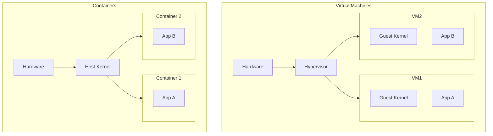
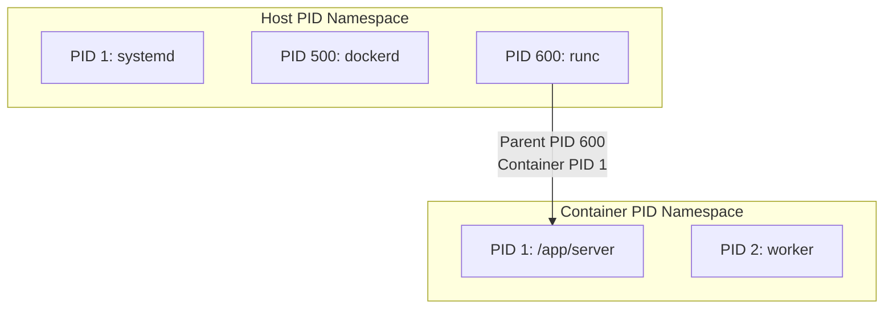
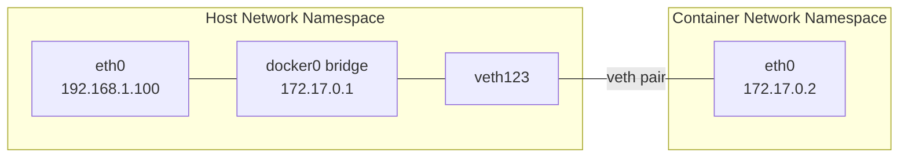
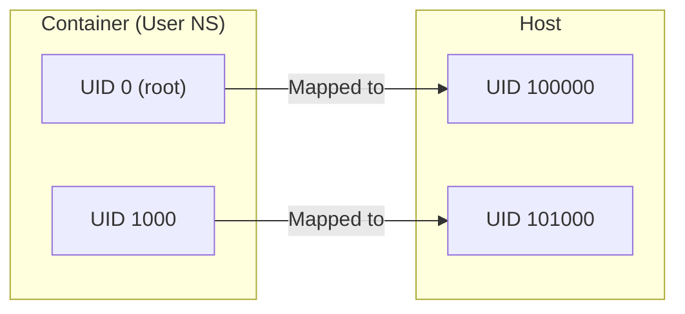
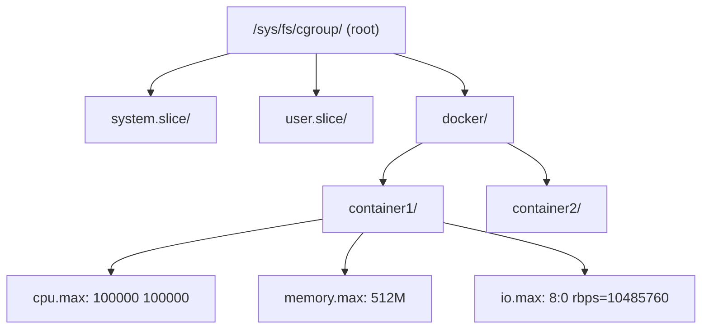
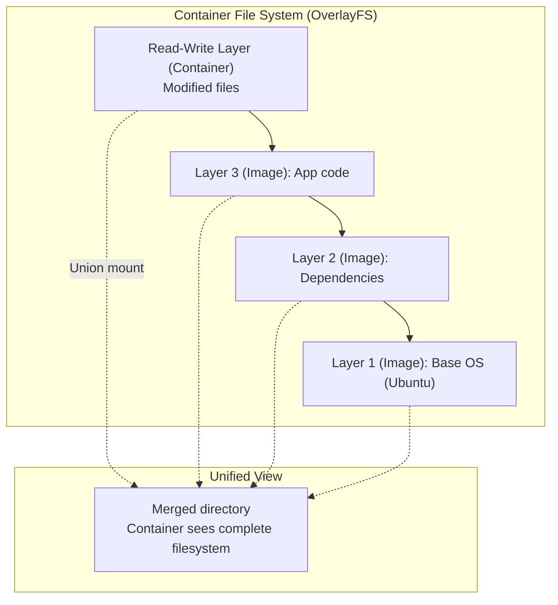
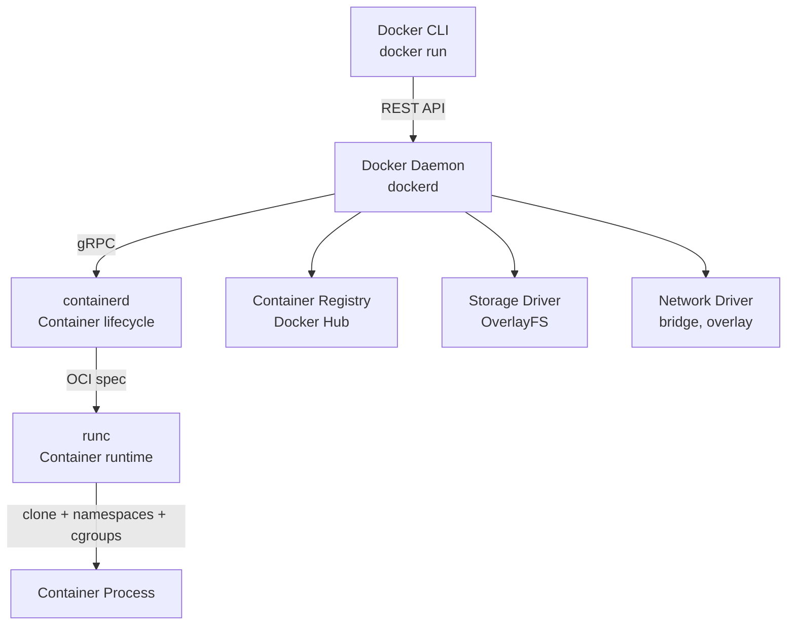
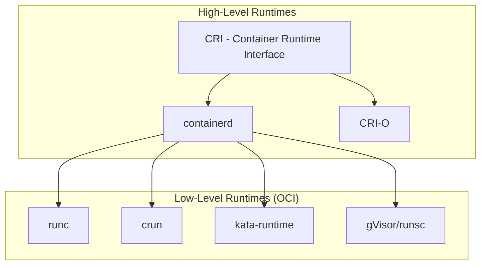

## Learning Objectives

By the end of this lesson, you will be able to:

- Explain OS-level virtualization and how it differs from hardware virtualization
- Describe each Linux namespace type and its isolation purpose
- Configure cgroups to limit CPU, memory, and I/O resources
- Understand union file systems and how container images work
- Trace Docker's architecture from CLI to containerd to runc
- Compare containers with VMs across performance, security, and use cases

## Prerequisites

- Linux process model and kernel concepts
- Understanding of virtual machines and hypervisors
- Basic command-line Linux skills

---

## OS-Level Virtualization

Unlike VMs that virtualize the entire hardware stack, **containers** virtualize at the OS level. All containers share the host kernel but have isolated views of the system:



### Key Difference

| Aspect | Virtual Machine | Container |
|--------|----------------|-----------|
| Kernel | Each has its own | Shared host kernel |
| Boot time | Seconds to minutes | Milliseconds |
| Image size | GBs | MBs |
| Isolation | Hardware-level | Kernel-level (namespaces) |
| Performance | Near-native (with VT-x) | Native |
| Overhead | Hypervisor + guest kernel | Minimal |
| Density | 10-100 VMs per host | 100-1000+ containers |

---

## Linux Namespaces

**Namespaces** are the isolation mechanism behind containers. Each namespace type isolates a specific system resource, giving each container its own independent view.

### The Seven Namespace Types

| Namespace | Flag | Isolates | Kernel Version |
|-----------|------|----------|----------------|
| **PID** | `CLONE_NEWPID` | Process IDs | 2.6.24 |
| **Network** | `CLONE_NEWNET` | Network stack | 2.6.29 |
| **Mount** | `CLONE_NEWNS` | File system mounts | 2.4.19 |
| **UTS** | `CLONE_NEWUTS` | Hostname, domain name | 2.6.19 |
| **IPC** | `CLONE_NEWIPC` | Inter-process communication | 2.6.19 |
| **User** | `CLONE_NEWUSER` | User/group IDs | 3.8 |
| **Cgroup** | `CLONE_NEWCGROUP` | Cgroup root directory | 4.6 |

### PID Namespace

Each PID namespace has its own PID 1 (init process). Processes in different namespaces can have the same PID:

```bash
# Create a new PID namespace
sudo unshare --pid --fork --mount-proc bash
ps aux
# PID 1 is now this bash process!
# Only processes in this namespace are visible

# From outside, it has a different PID
# Host sees it as PID 12345, container sees it as PID 1
```



### Network Namespace

Each network namespace has its own interfaces, routing tables, iptables rules, and sockets:

```bash
# Create a network namespace
sudo ip netns add mycontainer

# Create a virtual ethernet pair
sudo ip link add veth0 type veth peer name veth1

# Move one end into the namespace
sudo ip link set veth1 netns mycontainer

# Configure the namespace's interface
sudo ip netns exec mycontainer ip addr add 10.0.0.2/24 dev veth1
sudo ip netns exec mycontainer ip link set veth1 up
sudo ip netns exec mycontainer ip link set lo up

# Configure the host's end
sudo ip addr add 10.0.0.1/24 dev veth0
sudo ip link set veth0 up

# Now they can communicate
sudo ip netns exec mycontainer ping 10.0.0.1
```



### Mount Namespace

Isolates mount points — each container sees its own filesystem tree:

```bash
# Create isolated mount namespace
sudo unshare --mount bash

# Mounts here are invisible to the host
mount -t tmpfs tmpfs /tmp
# Host's /tmp is unaffected
```

### User Namespace

Maps container UIDs to different host UIDs — allows running as "root" inside the container without being root on the host:

```bash
# Create user namespace (no root required!)
unshare --user --map-root-user bash
id
# uid=0(root) gid=0(root) — root inside namespace only!
whoami
# root

# But on the host, this process runs as the original unprivileged user
```



### Creating a Namespace Programmatically

```c
#define _GNU_SOURCE
#include <sched.h>
#include <stdio.h>
#include <stdlib.h>
#include <sys/wait.h>
#include <unistd.h>

#define STACK_SIZE (1024 * 1024)

static int child_func(void *arg) {
    printf("Child PID (inside namespace): %d\n", getpid());  // PID 1
    sethostname("container", 9);

    char hostname[64];
    gethostname(hostname, sizeof(hostname));
    printf("Hostname: %s\n", hostname);  // "container"

    execl("/bin/bash", "bash", NULL);
    return 0;
}

int main() {
    char *stack = malloc(STACK_SIZE);
    int flags = CLONE_NEWPID | CLONE_NEWUTS | CLONE_NEWNS | SIGCHLD;

    pid_t pid = clone(child_func, stack + STACK_SIZE, flags, NULL);
    if (pid == -1) {
        perror("clone");
        return 1;
    }

    printf("Child PID (from host): %d\n", pid);
    waitpid(pid, NULL, 0);
    free(stack);
    return 0;
}
```

---

## Control Groups (cgroups)

**Cgroups** limit, account, and isolate resource usage (CPU, memory, I/O, network) for groups of processes.

### cgroups v2 Hierarchy



### CPU Limits

```bash
# Create a cgroup
mkdir /sys/fs/cgroup/demo

# Limit to 50% of one CPU
echo "50000 100000" > /sys/fs/cgroup/demo/cpu.max

# Add a process
echo $$ > /sys/fs/cgroup/demo/cgroup.procs

# Verify with a CPU-intensive task
stress --cpu 1 &
top  # Should show ~50% CPU
```

### Memory Limits

```bash
# Set memory limit to 256MB
echo $((256 * 1024 * 1024)) > /sys/fs/cgroup/demo/memory.max

# Set swap limit
echo $((512 * 1024 * 1024)) > /sys/fs/cgroup/demo/memory.swap.max

# Monitor usage
cat /sys/fs/cgroup/demo/memory.current
cat /sys/fs/cgroup/demo/memory.stat
# anon 123456789
# file 98765432
# slab 1234567

# OOM behavior
cat /sys/fs/cgroup/demo/memory.events
# low 0
# high 0
# max 3    ← hit the limit 3 times
# oom 1    ← OOM killer invoked once
```

### I/O Limits

```bash
# Find your device's major:minor number
lsblk -o NAME,MAJ:MIN
# sda  8:0

# Limit read bandwidth to 10MB/s
echo "8:0 rbps=10485760" > /sys/fs/cgroup/demo/io.max

# Limit write IOPS to 100
echo "8:0 wiops=100" > /sys/fs/cgroup/demo/io.max

# Monitor I/O stats
cat /sys/fs/cgroup/demo/io.stat
```

### cgroups Subsystem Summary

| Controller | File | Purpose |
|-----------|------|---------|
| CPU | `cpu.max` | Bandwidth limit |
| CPU | `cpu.weight` | Proportional sharing |
| Memory | `memory.max` | Hard memory limit |
| Memory | `memory.high` | Throttling threshold |
| I/O | `io.max` | Bandwidth/IOPS limits |
| I/O | `io.weight` | Proportional I/O |
| PIDs | `pids.max` | Maximum process count |

---

## Union File Systems

Containers use **union file systems** to layer images efficiently. Multiple read-only layers are stacked, with a thin read-write layer on top:



### OverlayFS (Default in Docker)

```bash
# Create an overlay mount manually
mkdir lower upper work merged

echo "from lower" > lower/file1.txt
echo "from lower" > lower/file2.txt

mount -t overlay overlay \
    -o lowerdir=lower,upperdir=upper,workdir=work \
    merged/

# Reading uses lower layer
cat merged/file1.txt    # "from lower"

# Writing creates copy-on-write in upper
echo "modified" > merged/file1.txt
cat upper/file1.txt     # "modified" — written to upper layer
cat lower/file1.txt     # "from lower" — unchanged!

# Deleting creates a whiteout file
rm merged/file2.txt
ls upper/                # file2.txt is a character device (whiteout)
```

### Docker Image Layers

```bash
# Inspect image layers
docker image inspect ubuntu | jq '.[0].RootFS.Layers'
# [
#   "sha256:abc123...",  ← Base layer
#   "sha256:def456...",  ← Updates
#   "sha256:789ghi..."   ← Package installs
# ]

# See layer sizes
docker history nginx
# IMAGE         CREATED    SIZE     COMMAND
# abc123...     2 days     25.4MB   COPY nginx.conf
# def456...     2 days     0B       EXPOSE 80
# 789ghi...     2 days     72.5MB   apt-get install nginx
# aaa111...     3 days     77.8MB   ubuntu:22.04
```

**Key benefit**: Shared layers. If 10 containers use the same Ubuntu base, only one copy exists on disk.

---

## Docker Architecture



### Component Roles

| Component | Role | Specification |
|-----------|------|--------------|
| **Docker CLI** | User interface | Docker API |
| **dockerd** | Daemon, image management, networking | Docker API |
| **containerd** | Container lifecycle (create, start, stop) | CRI (Container Runtime Interface) |
| **runc** | Actually creates the container (namespaces, cgroups) | OCI Runtime Spec |

### What `docker run` Actually Does

```bash
docker run -d --name web -p 8080:80 --memory=512m nginx
```

Under the hood:

1. **Pull image** (if not cached): Download layers from registry
2. **Create container**: Assemble overlay filesystem from layers
3. **Configure namespaces**: PID, network, mount, UTS, IPC, user
4. **Set up cgroups**: Memory limit (512m), CPU defaults
5. **Create network**: veth pair, connect to bridge, set up port forwarding
6. **Start process**: `clone()` with namespace flags, `exec` the entrypoint

```bash
# Trace what happens with strace
strace -f -e trace=clone,unshare,mount,setns docker run --rm alpine echo hello

# See the cgroup created for a container
docker inspect web --format '{{.HostConfig.CgroupParent}}'
ls /sys/fs/cgroup/system.slice/docker-<container-id>.scope/
```

### Container Runtimes Ecosystem



| Runtime | Language | Features |
|---------|----------|----------|
| runc | Go | OCI reference implementation, Docker/K8s default |
| crun | C | Faster startup, lower memory, rootless |
| kata-runtime | Go | Hardware-isolated containers (lightweight VMs) |
| gVisor (runsc) | Go | Application kernel, intercepts syscalls for security |

---

## Containers vs VMs: Detailed Comparison

| Metric | Containers | Virtual Machines |
|--------|-----------|------------------|
| Startup time | ~50ms | ~30-60 seconds |
| Memory overhead | ~5-10MB | ~200MB-1GB (guest kernel) |
| Disk footprint | ~10-200MB | ~1-20GB |
| Isolation strength | Process-level (kernel shared) | Hardware-level (separate kernel) |
| Kernel exploit | Affects all containers on host | Contained to one VM |
| Performance | Native | 1-5% overhead |
| Density | 1000+ per host | 10-100 per host |
| Live migration | Checkpoint/restore (CRIU) | Built-in (vMotion, live migrate) |
| Networking | veth pairs, bridge | Virtual NIC, virtual switch |
| Storage | Union FS layers | Virtual disk (qcow2, vmdk) |

### When to Use Each

| Use Case | Containers | VMs |
|----------|:---------:|:---:|
| Microservices | ✅ | |
| CI/CD pipelines | ✅ | |
| Multi-tenant isolation | | ✅ |
| Running different OS kernels | | ✅ |
| Desktop applications | | ✅ |
| Edge/IoT | ✅ | |
| Batch processing | ✅ | |
| Legacy applications | | ✅ |

---

## Building a Container from Scratch

Putting it all together — a minimal container in ~60 lines of C:

```c
#define _GNU_SOURCE
#include <sched.h>
#include <stdio.h>
#include <stdlib.h>
#include <string.h>
#include <sys/mount.h>
#include <sys/stat.h>
#include <sys/syscall.h>
#include <sys/wait.h>
#include <unistd.h>

#define STACK_SIZE (1024 * 1024)

static int child(void *arg) {
    char **argv = (char **)arg;

    sethostname("container", 9);

    mount("proc", "/proc", "proc", 0, NULL);
    mount("none", "/tmp", "tmpfs", 0, "size=64m");

    // pivot_root could be used here for full filesystem isolation

    printf("[Container] PID: %d\n", getpid());
    printf("[Container] Hostname: container\n");

    execvp(argv[0], argv);
    perror("execvp");
    return 1;
}

int main(int argc, char **argv) {
    if (argc < 2) {
        fprintf(stderr, "Usage: %s <command> [args...]\n", argv[0]);
        return 1;
    }

    char *stack = malloc(STACK_SIZE);
    if (!stack) { perror("malloc"); return 1; }

    int flags = CLONE_NEWPID | CLONE_NEWUTS | CLONE_NEWNS |
                CLONE_NEWNET | CLONE_NEWIPC | SIGCHLD;

    pid_t pid = clone(child, stack + STACK_SIZE, flags, &argv[1]);
    if (pid == -1) { perror("clone"); return 1; }

    printf("[Host] Container PID: %d\n", pid);
    waitpid(pid, NULL, 0);
    free(stack);
    return 0;
}
```

```bash
gcc -o minicontainer minicontainer.c
sudo ./minicontainer /bin/bash
# [Host] Container PID: 12345
# [Container] PID: 1
# [Container] Hostname: container
```

---

## Key Takeaways

1. **Containers** provide OS-level virtualization by isolating processes using **namespaces** (for visibility) and **cgroups** (for resource limits), while sharing the host kernel.

2. Linux has **seven namespace types** (PID, Network, Mount, UTS, IPC, User, Cgroup), each isolating a specific system resource to give containers an independent view.

3. **Cgroups** enforce resource limits — `cpu.max` for CPU bandwidth, `memory.max` for memory, `io.max` for disk I/O — preventing any container from monopolizing host resources.

4. **Union file systems** (OverlayFS) enable efficient image layering with copy-on-write semantics, allowing shared base layers across hundreds of containers.

5. Docker's architecture is layered: **CLI → dockerd → containerd → runc**, with each layer handling different responsibilities from user interaction to actual container creation.

6. Containers offer **native performance** and millisecond startup but weaker isolation than VMs. VMs provide hardware-level isolation but with higher overhead. Choose based on your security and performance requirements.

7. Container runtimes like **gVisor** and **Kata Containers** combine container UX with VM-like isolation, bridging the security gap for multi-tenant environments.
