## Learning Objectives

By the end of this lesson, you will be able to:

- Define virtualization and explain its fundamental purpose in computing
- Differentiate between Type 1 (bare-metal) and Type 2 (hosted) hypervisors
- Compare full virtualization, paravirtualization, and hardware-assisted virtualization
- Explain how VT-x and AMD-V enable efficient hardware-assisted virtualization
- Understand virtual machine architecture including virtual CPU, memory, and I/O
- Evaluate trade-offs between different virtualization approaches

## Prerequisites

- Understanding of operating system architecture (kernel, user mode, system calls)
- Memory management concepts (paging, virtual memory)
- Basic knowledge of CPU privilege rings

---

## What Is Virtualization?

**Virtualization** is the creation of a virtual (rather than physical) version of a computing resource — CPUs, memory, storage, or networks. The key abstraction is the **virtual machine (VM)**: a software-based emulation of a complete computer system.

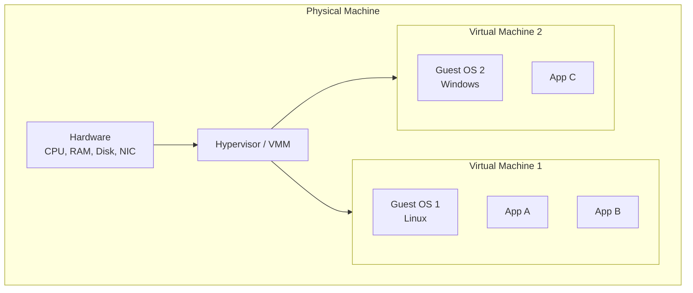

### Why Virtualize?

| Benefit | Description |
|---------|-------------|
| **Server consolidation** | Run multiple workloads on fewer physical machines |
| **Isolation** | Faults in one VM don't affect others |
| **Resource efficiency** | Share hardware dynamically based on demand |
| **Portability** | VMs are independent of underlying hardware |
| **Testing/Development** | Run multiple OS environments on one machine |
| **Disaster recovery** | Snapshot, migrate, and restore entire machines |
| **Legacy support** | Run old OS versions alongside modern ones |

### The Popek-Goldberg Theorem (1974)

A **virtual machine monitor (VMM)** must satisfy three properties:

1. **Equivalence/Fidelity**: Software runs identically in the VM as on real hardware (minus timing)
2. **Resource control**: The VMM completely controls all hardware resources
3. **Efficiency**: A statistically dominant fraction of machine instructions execute directly on hardware without VMM intervention

An architecture is **virtualizable** if all sensitive instructions (those that affect machine state or depend on it) are a subset of privileged instructions (those that trap in user mode).

---

## Hypervisor Types

The **hypervisor** (or VMM) is the software that creates and manages virtual machines.

### Type 1: Bare-Metal Hypervisor

Runs directly on hardware — the hypervisor IS the operating system:

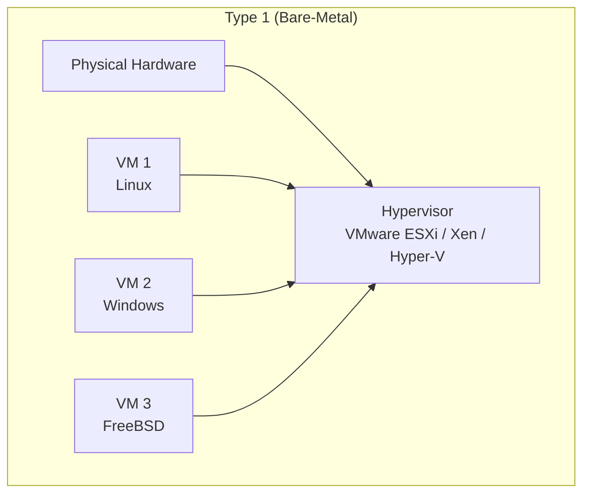

| Product | Vendor | Notable Features |
|---------|--------|-----------------|
| VMware ESXi | VMware/Broadcom | Enterprise standard, vMotion live migration |
| Xen | Linux Foundation | Used by AWS EC2 (originally), paravirt support |
| KVM | Linux kernel | Part of Linux, QEMU for device emulation |
| Hyper-V | Microsoft | Integrated with Windows Server, Azure |

### Type 2: Hosted Hypervisor

Runs as an application on top of a host operating system:

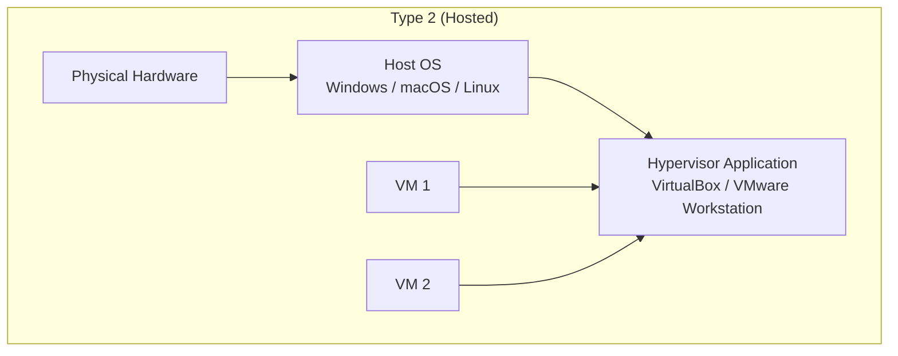

| Product | Use Case |
|---------|----------|
| VirtualBox | Free, cross-platform development |
| VMware Workstation/Fusion | Professional desktop virtualization |
| Parallels Desktop | macOS, running Windows on Mac |
| QEMU (user-mode) | Emulation, cross-architecture |

### Type 1 vs Type 2 Comparison

| Aspect | Type 1 | Type 2 |
|--------|--------|--------|
| Performance | Near-native | Additional host OS overhead |
| Security | Smaller attack surface | Host OS vulnerabilities |
| Hardware access | Direct | Through host OS drivers |
| Setup complexity | Higher (dedicated machine) | Lower (install like any app) |
| Use case | Data centers, cloud | Desktop development, testing |
| Resource overhead | Minimal | Host OS consumes resources |

### KVM: Blurring the Line

KVM (Kernel-based Virtual Machine) turns the Linux kernel itself into a Type 1 hypervisor:

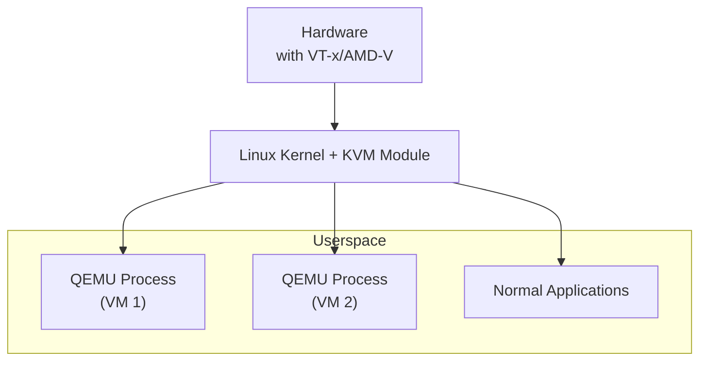

KVM is technically a Type 1 hypervisor (it runs directly on hardware via the kernel module), but the management and device emulation happens in userspace QEMU processes — combining benefits of both types.

```bash
# Check if KVM is available
lsmod | grep kvm
# kvm_intel    123456  0
# kvm          456789  1 kvm_intel

# Check hardware virtualization support
grep -E 'vmx|svm' /proc/cpuinfo
# flags: ... vmx ...  (Intel VT-x)
# flags: ... svm ...  (AMD-V)

# Create a VM with QEMU/KVM
qemu-system-x86_64 \
    -enable-kvm \
    -m 2048 \
    -smp 2 \
    -hda disk.qcow2 \
    -cdrom ubuntu.iso \
    -boot d
```

---

## Virtualization Approaches

### Full Virtualization (Binary Translation)

The guest OS runs completely unmodified. The hypervisor intercepts and translates privileged instructions:

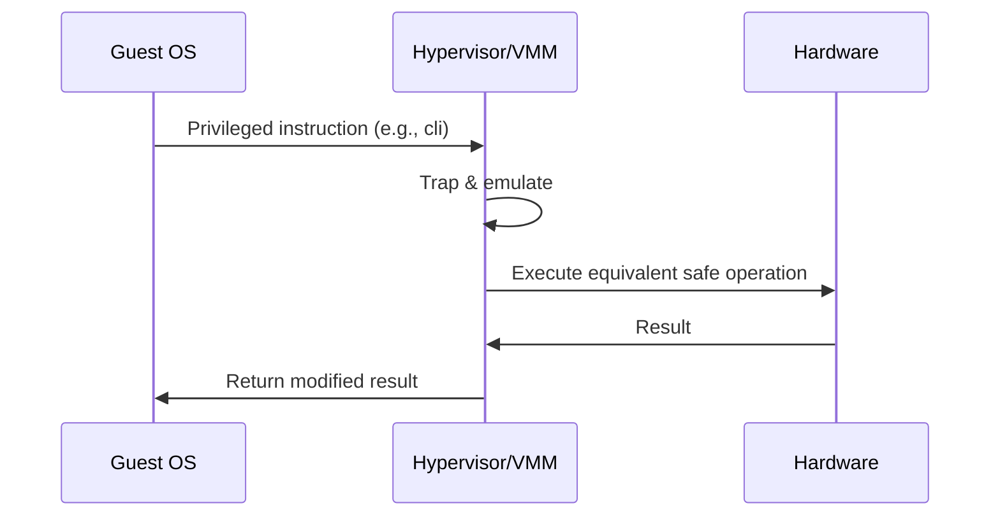

**How binary translation works**:

1. VMM scans guest code blocks before execution
2. Sensitive instructions are replaced with calls into the VMM
3. Translated blocks are cached for reuse

| Pros | Cons |
|------|------|
| Unmodified guest OS | Performance overhead (translation) |
| Complete compatibility | Complex VMM implementation |
| Supports any OS | Some instructions are hard to translate |

### Paravirtualization

The guest OS is **modified** to call the hypervisor directly through **hypercalls** instead of executing sensitive instructions:

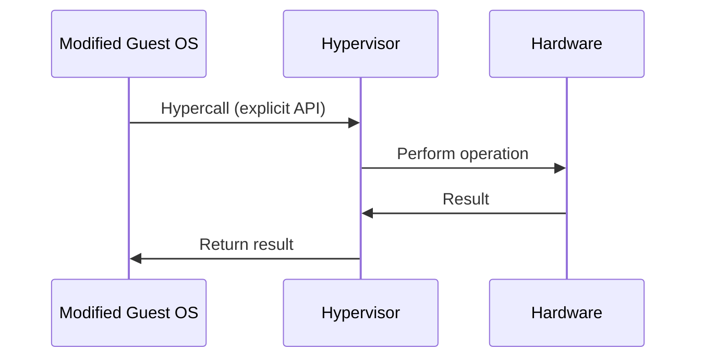

```c
// Xen paravirtualization example (guest kernel code)
// Instead of:
//   asm volatile("mov %0, %%cr3" : : "r"(pgd));
// Guest uses:
HYPERVISOR_mmu_update(updates, count, NULL, DOMID_SELF);
```

| Pros | Cons |
|------|------|
| Near-native performance | Must modify guest OS kernel |
| Lower overhead than full virt | Can't run unmodified proprietary OS |
| Clean hypercall interface | Maintenance burden on guest |

### Hardware-Assisted Virtualization

Modern CPUs provide hardware support that eliminates the need for binary translation or guest modification:

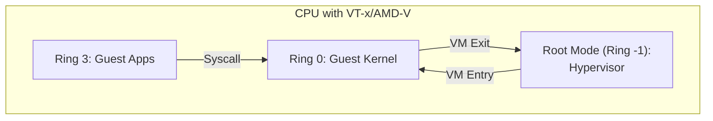

**Intel VT-x** introduces a new CPU mode:

| Mode | Purpose | Privilege |
|------|---------|-----------|
| VMX Root | Hypervisor execution | Highest (Ring -1 effectively) |
| VMX Non-Root | Guest execution | Normal rings (0-3) |

The **VMCS** (Virtual Machine Control Structure) defines what causes VM exits:

```c
// Simplified VMCS setup (Linux KVM)
struct vmcs {
    // Guest state area
    uint64_t guest_rip;
    uint64_t guest_rsp;
    uint64_t guest_rflags;
    uint64_t guest_cr0, guest_cr3, guest_cr4;

    // Host state area (restored on VM exit)
    uint64_t host_rip;
    uint64_t host_rsp;

    // VM execution control
    uint32_t pin_based_controls;      // Interrupt handling
    uint32_t proc_based_controls;     // I/O, MSR access
    uint32_t exit_controls;           // What triggers VM exit
    uint32_t entry_controls;
};
```

### VM Entry and VM Exit

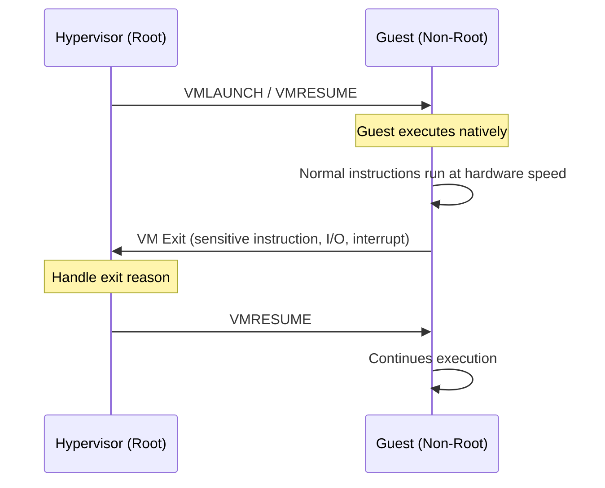

### Extended Page Tables (EPT / NPT)

Without hardware support, the VMM must maintain **shadow page tables** — intercepting every guest page table modification:

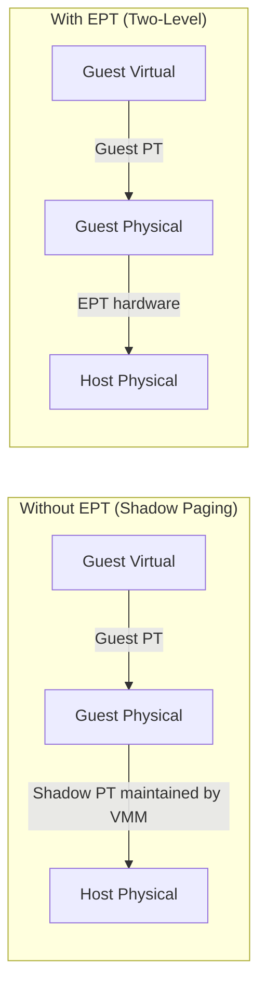

**EPT** (Intel) / **NPT** (AMD) performs the guest-physical to host-physical translation in hardware:

| Approach | TLB Miss Cost | VMM Complexity | Performance |
|----------|--------------|----------------|-------------|
| Shadow paging | Low (flat PT) | High (intercept all PT writes) | Good after warmup |
| EPT/NPT | Higher (2D page walk) | Low (hardware handles it) | Better overall |

---

## Virtual Machine Architecture

### Virtual CPU (vCPU)

Each VM is assigned one or more vCPUs, which are scheduled onto physical CPUs by the hypervisor:

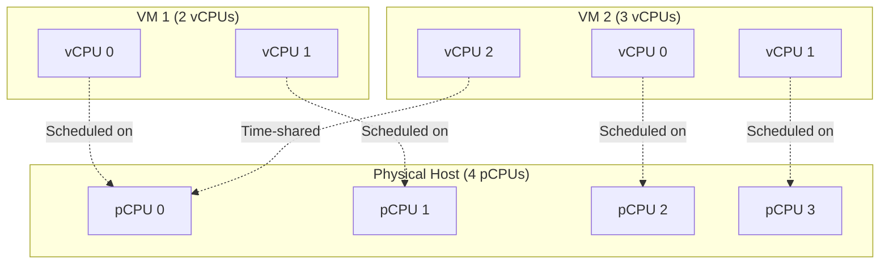

**Overcommitment**: Total vCPUs can exceed physical CPUs. The hypervisor time-shares, similar to OS thread scheduling.

### Virtual Memory

The hypervisor manages a second level of memory translation:

```
Guest Application → Guest Virtual Address
                 → Guest Page Tables → Guest Physical Address
                 → EPT/NPT → Host Physical Address
                 → Actual RAM
```

**Memory overcommitment techniques**:

| Technique | Description |
|-----------|-------------|
| Ballooning | Guest balloon driver reclaims unused pages |
| Transparent page sharing | Deduplicate identical pages across VMs |
| Swapping | Hypervisor swaps VM pages to disk |
| Compression | Compress pages before swapping |

### Virtual I/O

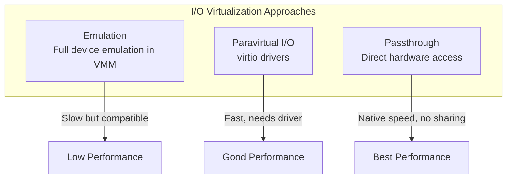

**virtio** is the standard paravirtualized I/O framework:

```bash
# Check for virtio devices in a VM
lspci | grep -i virtio
# 00:03.0 Network controller: Red Hat, Inc. Virtio network device
# 00:04.0 SCSI storage controller: Red Hat, Inc. Virtio block device

# virtio drivers in Linux
lsmod | grep virtio
# virtio_net
# virtio_blk
# virtio_pci
# virtio_ring
```

### SR-IOV (Single Root I/O Virtualization)

SR-IOV allows a single physical NIC to present multiple **virtual functions** directly to VMs:

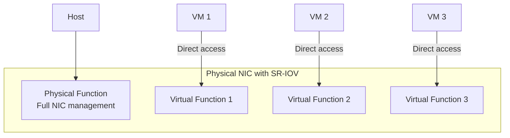

---

## Performance Comparison

| Approach | CPU Overhead | Memory Overhead | I/O Overhead | Guest Modification |
|----------|:-----------:|:---------------:|:------------:|:-----------------:|
| Full virtualization (binary translation) | 5-20% | Moderate | High | None |
| Paravirtualization | 2-5% | Low | Low | Required |
| Hardware-assisted (VT-x/AMD-V) | 1-3% | Low (with EPT) | Low (with virtio) | None |
| Containers (for reference) | <1% | Minimal | Minimal | N/A |

---

## Live Migration

One of virtualization's most powerful features — move a running VM between physical hosts with minimal downtime:

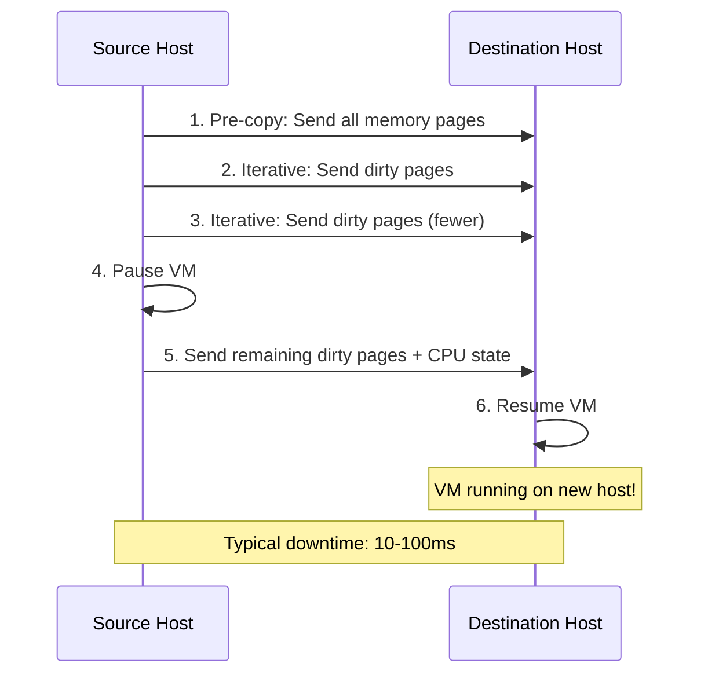

```bash
# Live migrate VM using virsh (libvirt)
virsh migrate --live myvm qemu+ssh://dest-host/system

# QEMU monitor command
(qemu) migrate -d tcp:dest-host:1234
```

---

## Key Takeaways

1. **Virtualization** creates isolated virtual machines that share physical hardware, enabling consolidation, isolation, portability, and efficient resource use.

2. **Type 1 (bare-metal) hypervisors** run directly on hardware for maximum performance and security; **Type 2 (hosted)** hypervisors run atop an OS for convenience. KVM blurs this distinction.

3. **Full virtualization** runs unmodified guests via binary translation; **paravirtualization** modifies guests for better performance; **hardware-assisted virtualization** (VT-x/AMD-V) provides the best of both worlds.

4. **Extended Page Tables** (EPT/NPT) eliminate the need for shadow page tables, reducing VMM complexity and improving memory virtualization performance.

5. **Virtual I/O** ranges from full emulation (slow but compatible) to paravirtual **virtio** (fast, needs drivers) to **SR-IOV passthrough** (native speed, limited sharing).

6. **Live migration** enables moving running VMs between physical hosts with millisecond-level downtime — a cornerstone of modern cloud infrastructure.

7. Modern hardware-assisted virtualization achieves **1-3% CPU overhead**, making it practical for even performance-sensitive production workloads.
