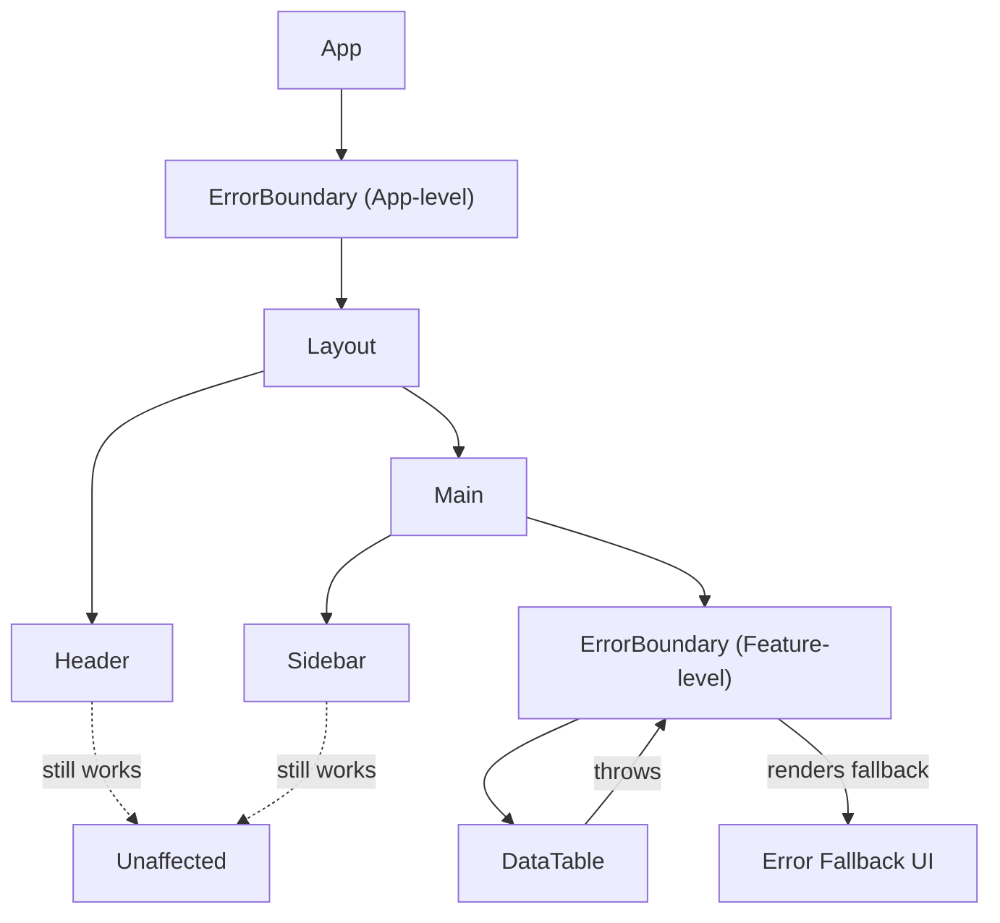
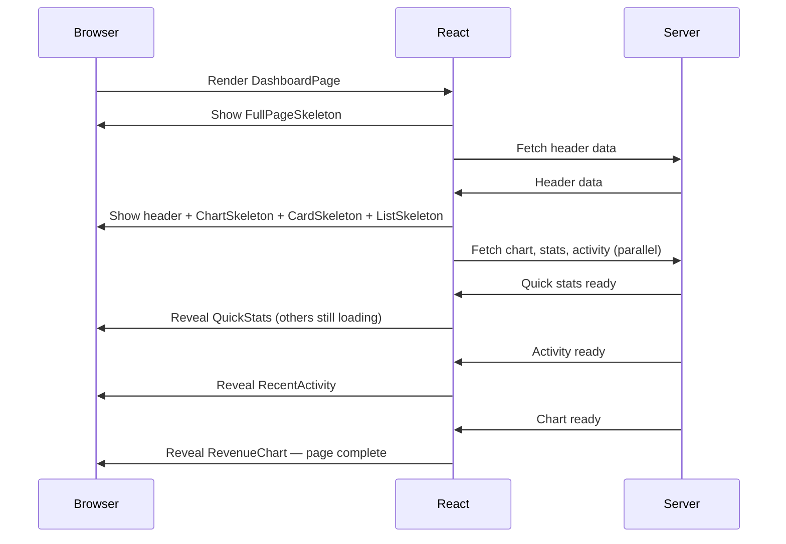

## Learning Objectives

- Build reusable error boundary components with recovery mechanisms
- Use Suspense for data fetching with streaming and fallback hierarchies
- Implement concurrent features with useTransition and useDeferredValue
- Design resilient UIs that degrade gracefully instead of crashing
- Combine error boundaries and Suspense for production-ready loading patterns

## Prerequisites

- React.lazy and Suspense basics for code splitting
- Understanding of React's rendering model
- TypeScript class components (for error boundaries)

## Core Concepts

### Error Boundaries

Error boundaries catch JavaScript errors during rendering, in lifecycle methods, and in constructors of the whole tree below them. They do NOT catch errors in event handlers, async code, or server-side rendering.



#### Reusable Error Boundary

```typescript
import { Component, type ErrorInfo, type ReactNode } from "react";

interface ErrorBoundaryProps {
  children: ReactNode;
  fallback?: ReactNode | ((error: Error, reset: () => void) => ReactNode);
  onError?: (error: Error, errorInfo: ErrorInfo) => void;
  resetKeys?: unknown[];
}

interface ErrorBoundaryState {
  hasError: boolean;
  error: Error | null;
}

class ErrorBoundary extends Component<ErrorBoundaryProps, ErrorBoundaryState> {
  state: ErrorBoundaryState = { hasError: false, error: null };

  static getDerivedStateFromError(error: Error): ErrorBoundaryState {
    return { hasError: true, error };
  }

  componentDidCatch(error: Error, errorInfo: ErrorInfo) {
    this.props.onError?.(error, errorInfo);
  }

  componentDidUpdate(prevProps: ErrorBoundaryProps) {
    if (this.state.hasError && prevProps.resetKeys !== this.props.resetKeys) {
      const prevKeys = prevProps.resetKeys ?? [];
      const nextKeys = this.props.resetKeys ?? [];
      const hasChanged = nextKeys.some((key, i) => key !== prevKeys[i]);
      if (hasChanged) {
        this.reset();
      }
    }
  }

  reset = () => {
    this.setState({ hasError: false, error: null });
  };

  render() {
    if (this.state.hasError && this.state.error) {
      if (typeof this.props.fallback === "function") {
        return this.props.fallback(this.state.error, this.reset);
      }
      return this.props.fallback ?? <DefaultErrorFallback error={this.state.error} onRetry={this.reset} />;
    }

    return this.props.children;
  }
}

function DefaultErrorFallback({ error, onRetry }: { error: Error; onRetry: () => void }) {
  return (
    <div className="flex flex-col items-center justify-center rounded-lg border border-red-200 bg-red-50 p-8">
      <h2 className="text-lg font-semibold text-red-800">Something went wrong</h2>
      <p className="mt-2 text-sm text-red-600">{error.message}</p>
      <button
        onClick={onRetry}
        className="mt-4 rounded bg-red-600 px-4 py-2 text-white hover:bg-red-700"
      >
        Try Again
      </button>
    </div>
  );
}
```

#### Usage Patterns

```typescript
function App() {
  return (
    <ErrorBoundary
      onError={(error, info) => {
        // Send to error tracking service
        reportError({ error, componentStack: info.componentStack });
      }}
    >
      <Layout>
        <ErrorBoundary
          fallback={(error, reset) => (
            <div className="p-4">
              <p>The dashboard failed to load: {error.message}</p>
              <button onClick={reset}>Retry</button>
            </div>
          )}
          resetKeys={[selectedProject]}
        >
          <Dashboard projectId={selectedProject} />
        </ErrorBoundary>
      </Layout>
    </ErrorBoundary>
  );
}
```

### Suspense for Data Fetching

React 19 fully supports Suspense for async data. Components can "suspend" while waiting for data, and Suspense renders a fallback until they're ready.

```typescript
import { Suspense, use } from "react";

async function fetchUser(id: string): Promise<User> {
  const response = await fetch(`/api/users/${id}`);
  if (!response.ok) throw new Error("User not found");
  return response.json();
}

function UserProfile({ userPromise }: { userPromise: Promise<User> }) {
  const user = use(userPromise);

  return (
    <div className="flex items-center gap-4">
      
      <div>
        <h2 className="font-semibold">{user.name}</h2>
        <p className="text-sm text-gray-600">{user.email}</p>
      </div>
    </div>
  );
}

function ProfilePage({ userId }: { userId: string }) {
  const userPromise = fetchUser(userId);

  return (
    <ErrorBoundary fallback={<p>Failed to load profile</p>}>
      <Suspense fallback={<ProfileSkeleton />}>
        <UserProfile userPromise={userPromise} />
      </Suspense>
    </ErrorBoundary>
  );
}
```

#### Suspense Hierarchy

Nested Suspense boundaries let you progressively reveal content:

```typescript
function DashboardPage() {
  return (
    <Suspense fallback={<FullPageSkeleton />}>
      <DashboardHeader />
      <div className="grid grid-cols-12 gap-6 p-6">
        <div className="col-span-8">
          <Suspense fallback={<ChartSkeleton />}>
            <RevenueChart />
          </Suspense>
        </div>
        <div className="col-span-4 space-y-4">
          <Suspense fallback={<CardSkeleton />}>
            <QuickStats />
          </Suspense>
          <Suspense fallback={<ListSkeleton count={5} />}>
            <RecentActivity />
          </Suspense>
        </div>
      </div>
    </Suspense>
  );
}
```



### useTransition: Non-Blocking Updates

`useTransition` marks state updates as non-urgent, keeping the UI responsive:

```typescript
import { useState, useTransition } from "react";

function SearchableList({ items }: { items: Item[] }) {
  const [query, setQuery] = useState("");
  const [filteredItems, setFilteredItems] = useState(items);
  const [isPending, startTransition] = useTransition();

  function handleSearch(value: string) {
    setQuery(value); // Urgent: update the input immediately

    startTransition(() => {
      // Non-urgent: filter the list without blocking typing
      const filtered = items.filter((item) =>
        item.name.toLowerCase().includes(value.toLowerCase())
      );
      setFilteredItems(filtered);
    });
  }

  return (
    <div>
      <input
        value={query}
        onChange={(e) => handleSearch(e.target.value)}
        placeholder="Search..."
        className="w-full rounded border px-3 py-2"
      />
      <div className={isPending ? "opacity-60" : ""}>
        {filteredItems.map((item) => (
          <ListItem key={item.id} item={item} />
        ))}
      </div>
    </div>
  );
}
```

#### useTransition for Navigation

```typescript
function TabPanel() {
  const [activeTab, setActiveTab] = useState("overview");
  const [isPending, startTransition] = useTransition();

  function handleTabChange(tab: string) {
    startTransition(() => {
      setActiveTab(tab);
    });
  }

  return (
    <div>
      <div className="flex border-b">
        {["overview", "analytics", "settings"].map((tab) => (
          <button
            key={tab}
            onClick={() => handleTabChange(tab)}
            className={`px-4 py-2 ${activeTab === tab ? "border-b-2 border-blue-600" : ""}`}
          >
            {tab}
            {isPending && activeTab !== tab && <Spinner size="sm" className="ml-1" />}
          </button>
        ))}
      </div>
      <Suspense fallback={<TabSkeleton />}>
        <TabContent tab={activeTab} />
      </Suspense>
    </div>
  );
}
```

### useDeferredValue: Deferred Rendering

```typescript
import { useDeferredValue, memo } from "react";

function SearchResults({ query }: { query: string }) {
  const deferredQuery = useDeferredValue(query);
  const isStale = query !== deferredQuery;

  return (
    <div className={isStale ? "opacity-50 transition-opacity" : ""}>
      <ResultsList query={deferredQuery} />
    </div>
  );
}

const ResultsList = memo(function ResultsList({ query }: { query: string }) {
  const results = computeExpensiveSearch(query);

  return (
    <ul>
      {results.map((result) => (
        <li key={result.id} className="border-b px-4 py-3">
          <Highlight text={result.title} query={query} />
        </li>
      ))}
    </ul>
  );
});
```

### Combining Error Boundaries + Suspense

The production pattern for any async UI:

```typescript
function AsyncBoundary({
  children,
  loadingFallback,
  errorFallback,
  onError,
}: {
  children: ReactNode;
  loadingFallback?: ReactNode;
  errorFallback?: ReactNode | ((error: Error, reset: () => void) => ReactNode);
  onError?: (error: Error, info: ErrorInfo) => void;
}) {
  return (
    <ErrorBoundary fallback={errorFallback} onError={onError}>
      <Suspense fallback={loadingFallback ?? <DefaultSkeleton />}>
        {children}
      </Suspense>
    </ErrorBoundary>
  );
}

// Usage — clean and consistent
function ProjectDashboard({ projectId }: { projectId: string }) {
  return (
    <div className="grid gap-6 md:grid-cols-2">
      <AsyncBoundary
        loadingFallback={<ChartSkeleton />}
        errorFallback={(error, reset) => (
          <RetryCard message="Failed to load analytics" onRetry={reset} />
        )}
      >
        <AnalyticsChart projectId={projectId} />
      </AsyncBoundary>

      <AsyncBoundary loadingFallback={<ListSkeleton count={5} />}>
        <TeamMembers projectId={projectId} />
      </AsyncBoundary>

      <AsyncBoundary loadingFallback={<TableSkeleton />}>
        <RecentCommits projectId={projectId} />
      </AsyncBoundary>
    </div>
  );
}
```

## Best Practices

1. **Error boundaries at feature boundaries** — don't let one widget crash the whole page
2. **Always pair Suspense with ErrorBoundary** — async operations can fail
3. **Use `resetKeys`** — automatically retry when relevant props change
4. **Report errors** — send caught errors to your monitoring service (Sentry, DataDog)
5. **`useTransition` for tab/filter switches** — keep the current view visible while new content loads
6. **`useDeferredValue` for expensive renders** — defer re-renders of heavy components

## Anti-Patterns to Avoid

- **Catching errors in event handlers** — error boundaries don't catch those; use try/catch
- **One giant Suspense boundary** — granular boundaries provide better UX
- **Ignoring `isPending`** — always show visual feedback during transitions
- **Using `useTransition` for urgent updates** — text input should update immediately
- **Suspense without timeout strategy** — consider `SuspenseList` or staggered loading for many boundaries

## Hands-On Exercise

### Build a Resilient Dashboard

1. Create an `AsyncBoundary` component that wraps both ErrorBoundary and Suspense
2. Build a dashboard with 4 independent widgets, each with its own `AsyncBoundary`
3. Simulate random failures in widget data fetching — verify only the failed widget shows an error
4. Add retry buttons that reset the error boundary and refetch data
5. Implement tab navigation with `useTransition` — keep old tab visible while new one loads
6. Add a search filter with `useDeferredValue` that doesn't block keyboard input

## Key Takeaways

- Error boundaries prevent one component failure from crashing the entire application
- Suspense enables declarative loading states — components suspend, boundaries show fallbacks
- `useTransition` keeps the UI responsive by marking state updates as non-urgent
- `useDeferredValue` defers expensive re-renders while showing stale content
- The `AsyncBoundary` pattern (ErrorBoundary + Suspense) is the production standard for async UI

## External Resources

- [React docs: Error Boundaries](https://react.dev/reference/react/Component#catching-rendering-errors-with-an-error-boundary)
- [React docs: Suspense](https://react.dev/reference/react/Suspense)
- [React docs: useTransition](https://react.dev/reference/react/useTransition)
- [React docs: useDeferredValue](https://react.dev/reference/react/useDeferredValue)
- [Dan Abramov: Algebraic Effects for the Rest of Us](https://overreacted.io/algebraic-effects-for-the-rest-of-us/)
