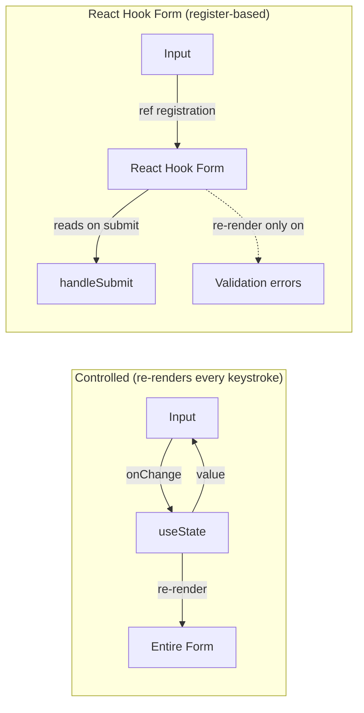

## Learning Objectives

- Build performant forms with React Hook Form that minimize re-renders
- Define type-safe validation schemas with Zod and integrate them with forms
- Implement dynamic forms with field arrays and conditional logic
- Build multi-step wizard forms with progress tracking and state persistence
- Handle file uploads with preview, progress, and drag-and-drop
- Implement optimistic form submission with rollback

## Prerequisites

- Comfortable with controlled vs. uncontrolled components
- TypeScript generics and inference
- Understanding of HTML form elements and validation attributes

## Core Concepts

### Why React Hook Form?

React Hook Form uses uncontrolled components internally, which means **no re-renders on every keystroke**. This makes a massive difference in forms with 20+ fields.

```bash
npm install react-hook-form @hookform/resolvers zod
```



### Basic Form with Zod Validation

```typescript
import { useForm } from "react-hook-form";
import { zodResolver } from "@hookform/resolvers/zod";
import { z } from "zod";

const signUpSchema = z
  .object({
    name: z.string().min(2, "Name must be at least 2 characters"),
    email: z.string().email("Invalid email address"),
    password: z
      .string()
      .min(8, "Password must be at least 8 characters")
      .regex(/[A-Z]/, "Must contain an uppercase letter")
      .regex(/[0-9]/, "Must contain a number"),
    confirmPassword: z.string(),
    role: z.enum(["developer", "designer", "manager"]),
    acceptTerms: z.literal(true, {
      errorMap: () => ({ message: "You must accept the terms" }),
    }),
  })
  .refine((data) => data.password === data.confirmPassword, {
    message: "Passwords don't match",
    path: ["confirmPassword"],
  });

type SignUpForm = z.infer<typeof signUpSchema>;

function SignUpPage() {
  const {
    register,
    handleSubmit,
    formState: { errors, isSubmitting },
    setError,
    reset,
  } = useForm<SignUpForm>({
    resolver: zodResolver(signUpSchema),
    defaultValues: {
      role: "developer",
    },
  });

  const onSubmit = async (data: SignUpForm) => {
    try {
      const response = await fetch("/api/auth/register", {
        method: "POST",
        headers: { "Content-Type": "application/json" },
        body: JSON.stringify(data),
      });

      if (!response.ok) {
        const error = await response.json();
        if (error.field) {
          setError(error.field as keyof SignUpForm, { message: error.message });
          return;
        }
        throw new Error(error.message);
      }

      reset();
    } catch (err) {
      setError("root", {
        message: err instanceof Error ? err.message : "Registration failed",
      });
    }
  };

  return (
    <form onSubmit={handleSubmit(onSubmit)} className="mx-auto max-w-md space-y-4">
      {errors.root && (
        <div className="rounded bg-red-50 p-3 text-sm text-red-700">
          {errors.root.message}
        </div>
      )}

      <FormField label="Name" error={errors.name?.message}>
        <input {...register("name")} className="w-full rounded border px-3 py-2" />
      </FormField>

      <FormField label="Email" error={errors.email?.message}>
        <input {...register("email")} type="email" className="w-full rounded border px-3 py-2" />
      </FormField>

      <FormField label="Password" error={errors.password?.message}>
        <input {...register("password")} type="password" className="w-full rounded border px-3 py-2" />
      </FormField>

      <FormField label="Confirm Password" error={errors.confirmPassword?.message}>
        <input {...register("confirmPassword")} type="password" className="w-full rounded border px-3 py-2" />
      </FormField>

      <FormField label="Role" error={errors.role?.message}>
        <select {...register("role")} className="w-full rounded border px-3 py-2">
          <option value="developer">Developer</option>
          <option value="designer">Designer</option>
          <option value="manager">Manager</option>
        </select>
      </FormField>

      <label className="flex items-center gap-2">
        <input {...register("acceptTerms")} type="checkbox" />
        <span className="text-sm">I accept the terms and conditions</span>
      </label>
      {errors.acceptTerms && (
        <p className="text-sm text-red-600">{errors.acceptTerms.message}</p>
      )}

      <button
        type="submit"
        disabled={isSubmitting}
        className="w-full rounded bg-blue-600 py-2 text-white disabled:opacity-50"
      >
        {isSubmitting ? "Creating account..." : "Sign Up"}
      </button>
    </form>
  );
}

function FormField({
  label,
  error,
  children,
}: {
  label: string;
  error?: string;
  children: ReactNode;
}) {
  return (
    <div>
      <label className="mb-1 block text-sm font-medium">{label}</label>
      {children}
      {error && <p className="mt-1 text-sm text-red-600">{error}</p>}
    </div>
  );
}
```

### Dynamic Forms with useFieldArray

```typescript
const invoiceSchema = z.object({
  clientName: z.string().min(1, "Client name required"),
  items: z
    .array(
      z.object({
        description: z.string().min(1, "Description required"),
        quantity: z.number().min(1, "Minimum 1"),
        unitPrice: z.number().min(0, "Price cannot be negative"),
      })
    )
    .min(1, "At least one item required"),
  notes: z.string().optional(),
});

type InvoiceForm = z.infer<typeof invoiceSchema>;

function InvoiceEditor() {
  const { register, control, handleSubmit, watch, formState: { errors } } =
    useForm<InvoiceForm>({
      resolver: zodResolver(invoiceSchema),
      defaultValues: {
        items: [{ description: "", quantity: 1, unitPrice: 0 }],
      },
    });

  const { fields, append, remove, move } = useFieldArray({
    control,
    name: "items",
  });

  const watchedItems = watch("items");
  const total = watchedItems?.reduce(
    (sum, item) => sum + (item.quantity ?? 0) * (item.unitPrice ?? 0),
    0
  ) ?? 0;

  return (
    <form onSubmit={handleSubmit(onSubmit)} className="space-y-6">
      <FormField label="Client Name" error={errors.clientName?.message}>
        <input {...register("clientName")} className="w-full rounded border px-3 py-2" />
      </FormField>

      <div>
        <h3 className="mb-2 font-medium">Line Items</h3>
        {fields.map((field, index) => (
          <div key={field.id} className="mb-2 flex gap-2">
            <input
              {...register(`items.${index}.description`)}
              placeholder="Description"
              className="flex-1 rounded border px-3 py-2"
            />
            <input
              {...register(`items.${index}.quantity`, { valueAsNumber: true })}
              type="number"
              placeholder="Qty"
              className="w-20 rounded border px-3 py-2"
            />
            <input
              {...register(`items.${index}.unitPrice`, { valueAsNumber: true })}
              type="number"
              step="0.01"
              placeholder="Price"
              className="w-28 rounded border px-3 py-2"
            />
            <button
              type="button"
              onClick={() => remove(index)}
              disabled={fields.length === 1}
              className="rounded border px-3 py-2 text-red-600 disabled:opacity-30"
            >
              ×
            </button>
          </div>
        ))}
        {errors.items?.message && (
          <p className="text-sm text-red-600">{errors.items.message}</p>
        )}
        <button
          type="button"
          onClick={() => append({ description: "", quantity: 1, unitPrice: 0 })}
          className="mt-2 rounded border px-3 py-1 text-sm"
        >
          + Add Item
        </button>
      </div>

      <div className="text-right text-lg font-bold">
        Total: ${total.toFixed(2)}
      </div>

      <button type="submit" className="rounded bg-blue-600 px-4 py-2 text-white">
        Create Invoice
      </button>
    </form>
  );
}
```

### Multi-Step Wizard Form

```typescript
const personalInfoSchema = z.object({
  firstName: z.string().min(1, "Required"),
  lastName: z.string().min(1, "Required"),
  email: z.string().email(),
});

const addressSchema = z.object({
  street: z.string().min(1, "Required"),
  city: z.string().min(1, "Required"),
  state: z.string().min(2, "Required"),
  zip: z.string().regex(/^\d{5}(-\d{4})?$/, "Invalid ZIP code"),
});

const preferencesSchema = z.object({
  newsletter: z.boolean(),
  notifications: z.enum(["all", "important", "none"]),
  theme: z.enum(["light", "dark", "system"]),
});

const fullSchema = personalInfoSchema.merge(addressSchema).merge(preferencesSchema);
type FullFormData = z.infer<typeof fullSchema>;

const steps = [
  { id: "personal", title: "Personal Info", schema: personalInfoSchema },
  { id: "address", title: "Address", schema: addressSchema },
  { id: "preferences", title: "Preferences", schema: preferencesSchema },
  { id: "review", title: "Review", schema: z.object({}) },
] as const;

function WizardForm() {
  const [currentStep, setCurrentStep] = useState(0);
  const [formData, setFormData] = useState<Partial<FullFormData>>({});

  const isLastStep = currentStep === steps.length - 1;
  const step = steps[currentStep];

  function handleStepSubmit(stepData: Record<string, unknown>) {
    const merged = { ...formData, ...stepData };
    setFormData(merged);

    if (isLastStep) {
      handleFinalSubmit(merged as FullFormData);
    } else {
      setCurrentStep((prev) => prev + 1);
    }
  }

  async function handleFinalSubmit(data: FullFormData) {
    await fetch("/api/onboarding", {
      method: "POST",
      headers: { "Content-Type": "application/json" },
      body: JSON.stringify(data),
    });
  }

  return (
    <div className="mx-auto max-w-lg">
      <StepIndicator steps={steps} currentStep={currentStep} />

      {step.id === "review" ? (
        <ReviewStep data={formData} onSubmit={() => handleStepSubmit({})} />
      ) : (
        <StepForm
          schema={step.schema}
          defaultValues={formData}
          onSubmit={handleStepSubmit}
          onBack={currentStep > 0 ? () => setCurrentStep((prev) => prev - 1) : undefined}
        />
      )}
    </div>
  );
}

function StepIndicator({
  steps,
  currentStep,
}: {
  steps: readonly { id: string; title: string }[];
  currentStep: number;
}) {
  return (
    <div className="mb-8 flex items-center">
      {steps.map((step, index) => (
        <div key={step.id} className="flex flex-1 items-center">
          <div
            className={`flex h-8 w-8 items-center justify-center rounded-full text-sm font-medium ${
              index <= currentStep
                ? "bg-blue-600 text-white"
                : "bg-gray-200 text-gray-600"
            }`}
          >
            {index < currentStep ? "✓" : index + 1}
          </div>
          <span className="ml-2 text-sm">{step.title}</span>
          {index < steps.length - 1 && (
            <div
              className={`mx-2 h-0.5 flex-1 ${
                index < currentStep ? "bg-blue-600" : "bg-gray-200"
              }`}
            />
          )}
        </div>
      ))}
    </div>
  );
}

function StepForm<T extends z.ZodType>({
  schema,
  defaultValues,
  onSubmit,
  onBack,
}: {
  schema: T;
  defaultValues: Partial<z.infer<T>>;
  onSubmit: (data: z.infer<T>) => void;
  onBack?: () => void;
}) {
  const { register, handleSubmit, formState: { errors } } = useForm({
    resolver: zodResolver(schema),
    defaultValues: defaultValues as Record<string, unknown>,
  });

  return (
    <form onSubmit={handleSubmit(onSubmit)} className="space-y-4">
      {/* Dynamic fields based on schema — simplified for illustration */}
      <div className="flex justify-between">
        {onBack && (
          <button type="button" onClick={onBack} className="rounded border px-4 py-2">
            Back
          </button>
        )}
        <button type="submit" className="rounded bg-blue-600 px-4 py-2 text-white">
          Continue
        </button>
      </div>
    </form>
  );
}
```

### File Upload with Preview

```typescript
const MAX_FILE_SIZE = 5 * 1024 * 1024; // 5MB
const ACCEPTED_TYPES = ["image/jpeg", "image/png", "image/webp"];

const fileSchema = z.object({
  files: z
    .array(
      z.object({
        file: z.instanceof(File),
        preview: z.string(),
      })
    )
    .min(1, "At least one file required")
    .max(5, "Maximum 5 files"),
});

function FileUpload({ onUpload }: { onUpload: (files: File[]) => void }) {
  const [files, setFiles] = useState<Array<{ file: File; preview: string }>>([]);
  const [isDragging, setIsDragging] = useState(false);

  const handleFiles = useCallback((newFiles: FileList | null) => {
    if (!newFiles) return;

    const validFiles = Array.from(newFiles)
      .filter((file) => {
        if (!ACCEPTED_TYPES.includes(file.type)) return false;
        if (file.size > MAX_FILE_SIZE) return false;
        return true;
      })
      .map((file) => ({
        file,
        preview: URL.createObjectURL(file),
      }));

    setFiles((prev) => [...prev, ...validFiles].slice(0, 5));
  }, []);

  const removeFile = useCallback((index: number) => {
    setFiles((prev) => {
      URL.revokeObjectURL(prev[index].preview);
      return prev.filter((_, i) => i !== index);
    });
  }, []);

  useEffect(() => {
    return () => files.forEach((f) => URL.revokeObjectURL(f.preview));
  }, []);

  return (
    <div>
      <div
        onDragOver={(e) => { e.preventDefault(); setIsDragging(true); }}
        onDragLeave={() => setIsDragging(false)}
        onDrop={(e) => {
          e.preventDefault();
          setIsDragging(false);
          handleFiles(e.dataTransfer.files);
        }}
        className={`rounded-lg border-2 border-dashed p-8 text-center ${
          isDragging ? "border-blue-500 bg-blue-50" : "border-gray-300"
        }`}
      >
        <p className="text-gray-600">Drag & drop images here, or</p>
        <label className="mt-2 inline-block cursor-pointer rounded bg-blue-600 px-4 py-2 text-white">
          Browse Files
          <input
            type="file"
            multiple
            accept={ACCEPTED_TYPES.join(",")}
            onChange={(e) => handleFiles(e.target.files)}
            className="hidden"
          />
        </label>
      </div>

      {files.length > 0 && (
        <div className="mt-4 grid grid-cols-5 gap-2">
          {files.map((f, i) => (
            <div key={f.preview} className="group relative">
              
              <button
                onClick={() => removeFile(i)}
                className="absolute -right-1 -top-1 hidden h-5 w-5 rounded-full bg-red-500 text-xs text-white group-hover:block"
              >
                ×
              </button>
            </div>
          ))}
        </div>
      )}
    </div>
  );
}
```

## Best Practices

1. **Zod schemas as source of truth** — derive TypeScript types from schemas, not vice versa
2. **Server-side validation always** — client validation is UX; server validation is security
3. **Use `setError` for server errors** — map API errors back to specific fields
4. **Debounce async validation** — don't hit the server on every keystroke for email uniqueness checks
5. **Persist wizard state** — save multi-step form data to sessionStorage for recovery

## Anti-Patterns to Avoid

- **Controlled inputs for large forms** — use React Hook Form's register-based approach
- **Validation on blur only** — validate on submit first, then switch to on-change for corrected fields
- **Ignoring `formState.isDirty`** — warn users about unsaved changes when navigating away
- **File uploads without size limits** — always validate on client AND server

## Hands-On Exercise

### Build a Job Application Form

1. Create a multi-step wizard: Personal Info → Experience → Education → Resume Upload → Review
2. Use Zod schemas for each step with cross-field validation
3. Implement a dynamic "Work Experience" section with `useFieldArray` (add/remove positions)
4. Add file upload for resume (PDF only, max 10MB) with drag-and-drop
5. Show a review step that summarizes all data before submission
6. Persist form progress to sessionStorage so users don't lose work on refresh

## Key Takeaways

- React Hook Form minimizes re-renders by using uncontrolled components internally
- Zod provides runtime validation with full TypeScript type inference
- `useFieldArray` handles dynamic form sections without manual array state management
- Multi-step wizards split validation per step while accumulating data across steps
- Always validate on both client (UX) and server (security)

## External Resources

- [React Hook Form Documentation](https://react-hook-form.com/)
- [Zod Documentation](https://zod.dev/)
- [React Hook Form + Zod Integration](https://react-hook-form.com/get-started#SchemaValidation)
- [shadcn/ui Form Components](https://ui.shadcn.com/docs/components/form)
