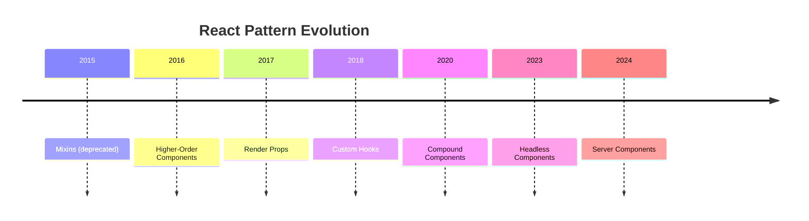

## Learning Objectives

- Compare render props, HOCs, and custom hooks — know when each pattern shines
- Build compound components with implicit shared state for declarative APIs
- Implement headless components that separate logic from presentation
- Use the slot pattern for flexible layout composition
- Design reusable component APIs that scale with complexity

## Prerequisites

- Proficiency with custom hooks and Context API
- Understanding of TypeScript generics and intersection types
- Experience building component libraries or shared components

## Core Concepts

### Evolution of React Patterns



Each pattern solves the same problem — **sharing logic between components** — with different tradeoffs.

### Render Props

A component that takes a function as a child (or prop) and delegates rendering:

```typescript
interface MousePosition {
  x: number;
  y: number;
}

interface MouseTrackerProps {
  children: (position: MousePosition) => ReactNode;
}

function MouseTracker({ children }: MouseTrackerProps) {
  const [position, setPosition] = useState<MousePosition>({ x: 0, y: 0 });

  useEffect(() => {
    const handleMove = (e: MouseEvent) => {
      setPosition({ x: e.clientX, y: e.clientY });
    };
    window.addEventListener("mousemove", handleMove);
    return () => window.removeEventListener("mousemove", handleMove);
  }, []);

  return <>{children(position)}</>;
}

// Usage
function HeatMap() {
  return (
    <MouseTracker>
      {({ x, y }) => (
        <div
          className="pointer-events-none fixed h-20 w-20 rounded-full bg-red-400 opacity-30"
          style={{ left: x - 40, top: y - 40 }}
        />
      )}
    </MouseTracker>
  );
}
```

**When to use:** Rarely in modern React. Custom hooks replaced most render prop use cases. Still useful when you need conditional rendering logic controlled by the parent.

### Higher-Order Components (HOCs)

A function that takes a component and returns an enhanced component:

```typescript
interface WithLoadingProps {
  isLoading: boolean;
}

function withLoading<P extends object>(
  WrappedComponent: React.ComponentType<P>,
  LoadingComponent: React.ComponentType = DefaultSpinner
) {
  function WithLoadingComponent(props: P & WithLoadingProps) {
    const { isLoading, ...rest } = props;

    if (isLoading) return <LoadingComponent />;
    return <WrappedComponent {...(rest as P)} />;
  }

  WithLoadingComponent.displayName = `withLoading(${
    WrappedComponent.displayName ?? WrappedComponent.name ?? "Component"
  })`;

  return WithLoadingComponent;
}

const EnhancedUserList = withLoading(UserList);

// Usage
<EnhancedUserList isLoading={isPending} users={data} />;
```

**When to use:** Cross-cutting concerns that many components need (analytics tracking, error boundaries, feature flags). Custom hooks are usually better.

### Custom Hooks (The Modern Default)

Extract stateful logic into reusable functions:

```typescript
function useMediaQuery(query: string): boolean {
  const [matches, setMatches] = useState(() => {
    if (typeof window === "undefined") return false;
    return window.matchMedia(query).matches;
  });

  useEffect(() => {
    const mql = window.matchMedia(query);
    const handler = (e: MediaQueryListEvent) => setMatches(e.matches);

    mql.addEventListener("change", handler);
    return () => mql.removeEventListener("change", handler);
  }, [query]);

  return matches;
}

function useLocalStorage<T>(key: string, initialValue: T) {
  const [value, setValue] = useState<T>(() => {
    try {
      const stored = localStorage.getItem(key);
      return stored ? (JSON.parse(stored) as T) : initialValue;
    } catch {
      return initialValue;
    }
  });

  useEffect(() => {
    localStorage.setItem(key, JSON.stringify(value));
  }, [key, value]);

  return [value, setValue] as const;
}

function useDebounce<T>(value: T, delay: number): T {
  const [debouncedValue, setDebouncedValue] = useState(value);

  useEffect(() => {
    const timer = setTimeout(() => setDebouncedValue(value), delay);
    return () => clearTimeout(timer);
  }, [value, delay]);

  return debouncedValue;
}

function SearchPage() {
  const [query, setQuery] = useState("");
  const debouncedQuery = useDebounce(query, 300);
  const isMobile = useMediaQuery("(max-width: 768px)");
  const [recentSearches, setRecentSearches] = useLocalStorage<string[]>("searches", []);

  return (
    <div className={isMobile ? "p-2" : "p-6"}>
      <input
        value={query}
        onChange={(e) => setQuery(e.target.value)}
        placeholder="Search..."
        className="w-full rounded border px-3 py-2"
      />
      <SearchResults query={debouncedQuery} />
    </div>
  );
}
```

### Compound Components

Components that work together with shared implicit state:

```typescript
interface SelectContextValue<T> {
  value: T | null;
  onChange: (value: T) => void;
  isOpen: boolean;
  toggle: () => void;
  close: () => void;
  highlightedIndex: number;
  setHighlightedIndex: (index: number) => void;
}

const SelectContext = createContext<SelectContextValue<unknown> | null>(null);

function useSelectContext<T>() {
  const ctx = useContext(SelectContext) as SelectContextValue<T> | null;
  if (!ctx) throw new Error("Select compound components must be used within <Select>");
  return ctx;
}

interface SelectProps<T> {
  value: T | null;
  onChange: (value: T) => void;
  children: ReactNode;
}

function Select<T>({ value, onChange, children }: SelectProps<T>) {
  const [isOpen, setIsOpen] = useState(false);
  const [highlightedIndex, setHighlightedIndex] = useState(-1);

  const toggle = useCallback(() => setIsOpen((prev) => !prev), []);
  const close = useCallback(() => {
    setIsOpen(false);
    setHighlightedIndex(-1);
  }, []);

  return (
    <SelectContext.Provider
      value={{ value, onChange, isOpen, toggle, close, highlightedIndex, setHighlightedIndex }}
    >
      <div className="relative">{children}</div>
    </SelectContext.Provider>
  );
}

function SelectTrigger({ children }: { children: ReactNode }) {
  const { toggle, isOpen } = useSelectContext();

  return (
    <button
      onClick={toggle}
      aria-expanded={isOpen}
      className="flex w-full items-center justify-between rounded border px-3 py-2"
    >
      {children}
      <ChevronIcon className={`transition-transform ${isOpen ? "rotate-180" : ""}`} />
    </button>
  );
}

function SelectContent({ children }: { children: ReactNode }) {
  const { isOpen, close } = useSelectContext();

  if (!isOpen) return null;

  return (
    <>
      <div className="fixed inset-0" onClick={close} />
      <ul
        role="listbox"
        className="absolute z-10 mt-1 w-full rounded border bg-white shadow-lg"
      >
        {children}
      </ul>
    </>
  );
}

function SelectOption<T>({ value, children }: { value: T; children: ReactNode }) {
  const { value: selected, onChange, close } = useSelectContext<T>();
  const isSelected = selected === value;

  return (
    <li
      role="option"
      aria-selected={isSelected}
      onClick={() => {
        onChange(value);
        close();
      }}
      className={`cursor-pointer px-3 py-2 hover:bg-blue-50 ${
        isSelected ? "bg-blue-100 font-medium" : ""
      }`}
    >
      {children}
    </li>
  );
}

Select.Trigger = SelectTrigger;
Select.Content = SelectContent;
Select.Option = SelectOption;

// Usage — clean declarative API
function CountryPicker() {
  const [country, setCountry] = useState<string | null>(null);

  return (
    <Select value={country} onChange={setCountry}>
      <Select.Trigger>{country ?? "Select country..."}</Select.Trigger>
      <Select.Content>
        <Select.Option value="us">United States</Select.Option>
        <Select.Option value="uk">United Kingdom</Select.Option>
        <Select.Option value="de">Germany</Select.Option>
      </Select.Content>
    </Select>
  );
}
```

### Headless Components

Provide all behavior and accessibility without any styles:

```typescript
interface UseToggleReturn {
  isOn: boolean;
  toggle: () => void;
  setOn: () => void;
  setOff: () => void;
  getToggleProps: (props?: React.ButtonHTMLAttributes<HTMLButtonElement>) => {
    role: "switch";
    "aria-checked": boolean;
    onClick: () => void;
  } & React.ButtonHTMLAttributes<HTMLButtonElement>;
}

function useToggle(initialState = false): UseToggleReturn {
  const [isOn, setIsOn] = useState(initialState);

  const toggle = useCallback(() => setIsOn((prev) => !prev), []);
  const setOn = useCallback(() => setIsOn(true), []);
  const setOff = useCallback(() => setIsOn(false), []);

  const getToggleProps = useCallback(
    (props: React.ButtonHTMLAttributes<HTMLButtonElement> = {}) => ({
      role: "switch" as const,
      "aria-checked": isOn,
      onClick: () => {
        props.onClick?.({} as React.MouseEvent<HTMLButtonElement>);
        toggle();
      },
      ...props,
    }),
    [isOn, toggle]
  );

  return { isOn, toggle, setOn, setOff, getToggleProps };
}

// Usage — user provides all styling
function DarkModeToggle() {
  const { isOn, getToggleProps } = useToggle(false);

  return (
    <button
      {...getToggleProps()}
      className={`relative h-6 w-11 rounded-full transition-colors ${
        isOn ? "bg-blue-600" : "bg-gray-300"
      }`}
    >
      <span
        className={`absolute left-0.5 top-0.5 h-5 w-5 rounded-full bg-white transition-transform ${
          isOn ? "translate-x-5" : ""
        }`}
      />
    </button>
  );
}
```

### Slot Pattern

Allow parent components to inject content into specific regions of a child:

```typescript
interface CardSlots {
  header?: ReactNode;
  media?: ReactNode;
  body: ReactNode;
  actions?: ReactNode;
  footer?: ReactNode;
}

function Card({ header, media, body, actions, footer }: CardSlots) {
  return (
    <div className="overflow-hidden rounded-lg border bg-white shadow-sm">
      {header && <div className="border-b px-4 py-3 font-medium">{header}</div>}
      {media && <div className="aspect-video w-full overflow-hidden">{media}</div>}
      <div className="p-4">{body}</div>
      {actions && <div className="flex gap-2 border-t px-4 py-3">{actions}</div>}
      {footer && <div className="bg-gray-50 px-4 py-3 text-sm text-gray-600">{footer}</div>}
    </div>
  );
}

// Usage
<Card
  header="Project Update"
  media={}
  body={<p>{project.description}</p>}
  actions={
    <>
      <button className="rounded bg-blue-600 px-3 py-1 text-white">View</button>
      <button className="rounded border px-3 py-1">Share</button>
    </>
  }
  footer={`Last updated ${formatDate(project.updatedAt)}`}
/>
```

## Pattern Comparison

| Pattern | Logic Reuse | Render Control | TypeScript | Composability |
|---------|------------|---------------|-----------|--------------|
| Custom Hooks | Excellent | None (logic only) | Excellent | Excellent |
| Compound Components | Good | Internal composition | Good | Excellent |
| Headless Components | Excellent | Full control | Excellent | Excellent |
| Render Props | Good | Full control | Complex | Moderate |
| HOCs | Good | Limited | Difficult | Poor (wrapper hell) |
| Slots | None | Layout regions | Excellent | Good |

## Best Practices

1. **Default to custom hooks** — they're the simplest pattern for sharing logic
2. **Compound components for declarative APIs** — when sub-components share implicit state
3. **Headless for design system primitives** — logic and a11y without style opinions
4. **Slots for layout flexibility** — when consumers need to inject into specific regions
5. **Avoid HOC chains** — they obscure props, break types, and make debugging hard

## Anti-Patterns to Avoid

- **Prop explosion** — a component with 20+ props needs compound components or slots
- **Render prop hell** — nesting 3+ render props; use hooks or composition instead
- **HOC type erasure** — wrapping components loses TypeScript inference
- **Premature abstraction** — don't extract patterns until you see repetition 3+ times

## Hands-On Exercise

### Build a Headless Data Table

1. Create a `useDataTable` hook that manages sorting, filtering, pagination, and row selection
2. Build compound components: `DataTable`, `DataTable.Head`, `DataTable.Row`, `DataTable.Cell`, `DataTable.Pagination`
3. Use the headless hook in two completely different visual implementations — one card-based, one traditional table
4. Add keyboard navigation and ARIA roles for accessibility
5. Support generic types: `useDataTable<User>`, `useDataTable<Product>`

## Key Takeaways

- Custom hooks are the default pattern for sharing stateful logic in modern React
- Compound components create clean, declarative APIs for complex UI patterns
- Headless components separate behavior from presentation for maximum flexibility
- The slot pattern enables flexible layout composition without children manipulation
- Choose the pattern based on the problem — logic reuse, render control, or both

## External Resources

- [Patterns.dev: React Design Patterns](https://www.patterns.dev/react)
- [Radix UI: Headless Components](https://www.radix-ui.com/)
- [Kent C. Dodds: Advanced React Patterns](https://kentcdodds.com/blog/advanced-react-patterns)
- [Headless UI by Tailwind Labs](https://headlessui.com/)
