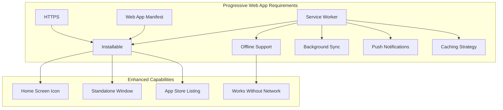
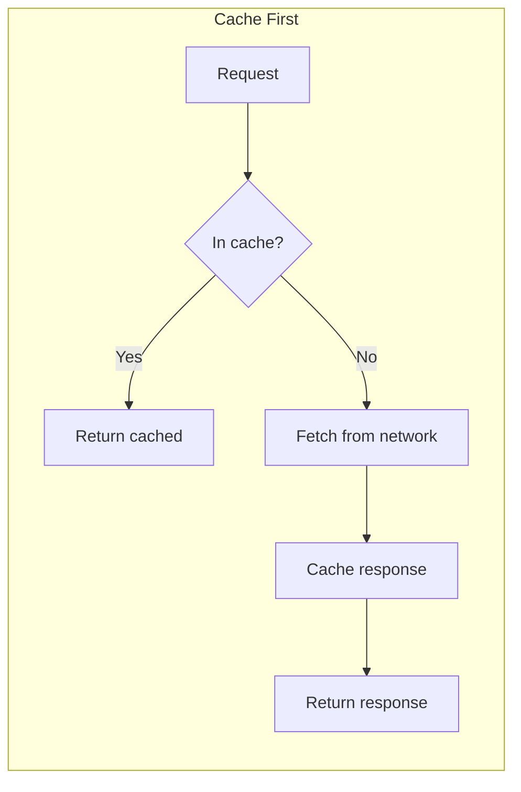
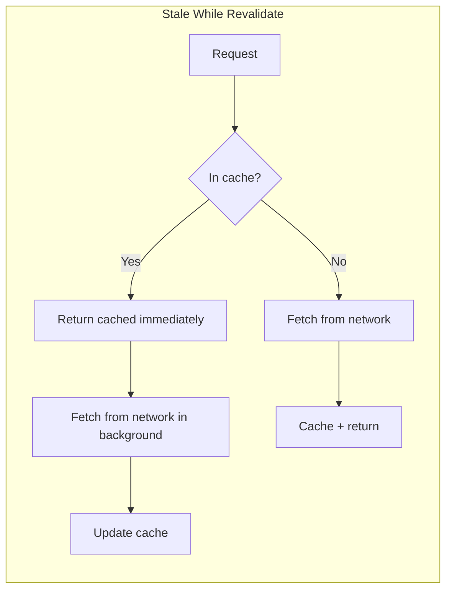

## Learning Objectives

- Understand Progressive Web App architecture and the app manifest
- Implement Service Workers with Workbox for intelligent caching
- Use IndexedDB for structured offline data storage
- Design offline-first data sync patterns with conflict resolution
- Add push notifications and install prompts for native-like experience

## Prerequisites

- React application deployment and build process
- Network requests and caching concepts
- Basic understanding of Web Workers

## Core Concepts

### What Makes a PWA?



### Web App Manifest

```json
// public/manifest.json
{
  "name": "TaskFlow - Project Management",
  "short_name": "TaskFlow",
  "description": "Manage projects and tasks with your team",
  "start_url": "/",
  "display": "standalone",
  "background_color": "#ffffff",
  "theme_color": "#3b82f6",
  "orientation": "portrait-primary",
  "icons": [
    {
      "src": "/icons/icon-192.png",
      "sizes": "192x192",
      "type": "image/png",
      "purpose": "any maskable"
    },
    {
      "src": "/icons/icon-512.png",
      "sizes": "512x512",
      "type": "image/png",
      "purpose": "any maskable"
    }
  ],
  "screenshots": [
    {
      "src": "/screenshots/desktop.png",
      "sizes": "1280x720",
      "type": "image/png",
      "form_factor": "wide"
    },
    {
      "src": "/screenshots/mobile.png",
      "sizes": "750x1334",
      "type": "image/png",
      "form_factor": "narrow"
    }
  ]
}
```

```html
<!-- index.html -->
<head>
  <link rel="manifest" href="/manifest.json" />
  <meta name="theme-color" content="#3b82f6" />
  <link rel="apple-touch-icon" href="/icons/icon-192.png" />
</head>
```

### Service Workers with Workbox

```bash
npm install -D vite-plugin-pwa workbox-precaching workbox-routing workbox-strategies
```

```typescript
// vite.config.ts
import { VitePWA } from "vite-plugin-pwa";

export default defineConfig({
  plugins: [
    react(),
    VitePWA({
      registerType: "autoUpdate",
      includeAssets: ["favicon.ico", "icons/*.png"],
      manifest: {
        name: "TaskFlow",
        short_name: "TaskFlow",
        theme_color: "#3b82f6",
        icons: [
          { src: "/icons/icon-192.png", sizes: "192x192", type: "image/png" },
          { src: "/icons/icon-512.png", sizes: "512x512", type: "image/png" },
        ],
      },
      workbox: {
        globPatterns: ["**/*.{js,css,html,ico,png,svg,woff2}"],
        runtimeCaching: [
          {
            urlPattern: /^https:\/\/api\.example\.com\/.*$/,
            handler: "StaleWhileRevalidate",
            options: {
              cacheName: "api-cache",
              expiration: { maxEntries: 100, maxAgeSeconds: 60 * 60 * 24 },
            },
          },
          {
            urlPattern: /^https:\/\/images\.example\.com\/.*$/,
            handler: "CacheFirst",
            options: {
              cacheName: "image-cache",
              expiration: { maxEntries: 200, maxAgeSeconds: 60 * 60 * 24 * 30 },
            },
          },
        ],
      },
    }),
  ],
});
```

### Caching Strategies





| Strategy | Best For | Freshness | Speed |
|----------|----------|-----------|-------|
| Cache First | Fonts, images, static assets | Low | Fastest |
| Network First | API data, user content | High | Depends on network |
| Stale While Revalidate | Semi-fresh data, feeds | Medium | Fast (cache + background) |
| Network Only | Real-time data, auth | Highest | Network speed |
| Cache Only | App shell, offline page | Build-time | Instant |

### IndexedDB for Offline Data

```bash
npm install idb
```

```typescript
import { openDB, type DBSchema, type IDBPDatabase } from "idb";

interface TaskDB extends DBSchema {
  tasks: {
    key: string;
    value: {
      id: string;
      title: string;
      status: "todo" | "in-progress" | "done";
      priority: "low" | "medium" | "high";
      createdAt: string;
      updatedAt: string;
      synced: boolean;
    };
    indexes: {
      "by-status": string;
      "by-synced": boolean;
    };
  };
  syncQueue: {
    key: number;
    value: {
      id?: number;
      type: "create" | "update" | "delete";
      entityType: "task";
      entityId: string;
      payload: unknown;
      createdAt: string;
      attempts: number;
    };
  };
}

async function getDB(): Promise<IDBPDatabase<TaskDB>> {
  return openDB<TaskDB>("taskflow", 1, {
    upgrade(db) {
      const taskStore = db.createObjectStore("tasks", { keyPath: "id" });
      taskStore.createIndex("by-status", "status");
      taskStore.createIndex("by-synced", "synced");

      db.createObjectStore("syncQueue", { keyPath: "id", autoIncrement: true });
    },
  });
}
```

### Offline-First Hook

```typescript
function useOfflineTasks() {
  const [tasks, setTasks] = useState<Task[]>([]);
  const [isOnline, setIsOnline] = useState(navigator.onLine);

  useEffect(() => {
    const handleOnline = () => {
      setIsOnline(true);
      syncPendingChanges();
    };
    const handleOffline = () => setIsOnline(false);

    window.addEventListener("online", handleOnline);
    window.addEventListener("offline", handleOffline);

    return () => {
      window.removeEventListener("online", handleOnline);
      window.removeEventListener("offline", handleOffline);
    };
  }, []);

  useEffect(() => {
    loadTasks();
  }, []);

  async function loadTasks() {
    const db = await getDB();

    if (isOnline) {
      try {
        const response = await fetch("/api/tasks");
        const serverTasks = await response.json();

        const tx = db.transaction("tasks", "readwrite");
        for (const task of serverTasks) {
          await tx.store.put({ ...task, synced: true });
        }
        await tx.done;

        setTasks(serverTasks);
      } catch {
        const localTasks = await db.getAll("tasks");
        setTasks(localTasks);
      }
    } else {
      const localTasks = await db.getAll("tasks");
      setTasks(localTasks);
    }
  }

  async function addTask(task: Omit<Task, "id" | "synced">) {
    const db = await getDB();
    const newTask: Task = {
      ...task,
      id: crypto.randomUUID(),
      synced: false,
      createdAt: new Date().toISOString(),
      updatedAt: new Date().toISOString(),
    };

    await db.put("tasks", newTask);
    setTasks((prev) => [...prev, newTask]);

    if (isOnline) {
      try {
        const response = await fetch("/api/tasks", {
          method: "POST",
          headers: { "Content-Type": "application/json" },
          body: JSON.stringify(newTask),
        });
        const serverTask = await response.json();
        await db.put("tasks", { ...serverTask, synced: true });
        setTasks((prev) =>
          prev.map((t) => (t.id === newTask.id ? { ...serverTask, synced: true } : t))
        );
      } catch {
        await db.add("syncQueue", {
          type: "create",
          entityType: "task",
          entityId: newTask.id,
          payload: newTask,
          createdAt: new Date().toISOString(),
          attempts: 0,
        });
      }
    } else {
      await db.add("syncQueue", {
        type: "create",
        entityType: "task",
        entityId: newTask.id,
        payload: newTask,
        createdAt: new Date().toISOString(),
        attempts: 0,
      });
    }
  }

  async function syncPendingChanges() {
    const db = await getDB();
    const pending = await db.getAll("syncQueue");

    for (const item of pending) {
      try {
        switch (item.type) {
          case "create":
            await fetch("/api/tasks", {
              method: "POST",
              headers: { "Content-Type": "application/json" },
              body: JSON.stringify(item.payload),
            });
            break;
          case "update":
            await fetch(`/api/tasks/${item.entityId}`, {
              method: "PUT",
              headers: { "Content-Type": "application/json" },
              body: JSON.stringify(item.payload),
            });
            break;
          case "delete":
            await fetch(`/api/tasks/${item.entityId}`, { method: "DELETE" });
            break;
        }

        await db.delete("syncQueue", item.id!);

        if (item.type !== "delete") {
          const task = await db.get("tasks", item.entityId);
          if (task) {
            await db.put("tasks", { ...task, synced: true });
          }
        }
      } catch {
        await db.put("syncQueue", { ...item, attempts: item.attempts + 1 });
      }
    }

    await loadTasks();
  }

  return { tasks, addTask, isOnline, syncPendingChanges };
}
```

### Online Status Indicator

```typescript
function useOnlineStatus() {
  const [isOnline, setIsOnline] = useState(navigator.onLine);

  useEffect(() => {
    const handleOnline = () => setIsOnline(true);
    const handleOffline = () => setIsOnline(false);

    window.addEventListener("online", handleOnline);
    window.addEventListener("offline", handleOffline);

    return () => {
      window.removeEventListener("online", handleOnline);
      window.removeEventListener("offline", handleOffline);
    };
  }, []);

  return isOnline;
}

function OfflineBanner() {
  const isOnline = useOnlineStatus();

  if (isOnline) return null;

  return (
    <div className="bg-yellow-500 px-4 py-2 text-center text-sm font-medium text-yellow-900">
      You're offline. Changes will sync when you reconnect.
    </div>
  );
}
```

### Push Notifications

```typescript
async function subscribeToPushNotifications() {
  const permission = await Notification.requestPermission();
  if (permission !== "granted") return null;

  const registration = await navigator.serviceWorker.ready;

  const subscription = await registration.pushManager.subscribe({
    userVisibleOnly: true,
    applicationServerKey: urlBase64ToUint8Array(import.meta.env.VITE_VAPID_PUBLIC_KEY),
  });

  await fetch("/api/push/subscribe", {
    method: "POST",
    headers: { "Content-Type": "application/json" },
    body: JSON.stringify(subscription),
  });

  return subscription;
}

function urlBase64ToUint8Array(base64String: string) {
  const padding = "=".repeat((4 - (base64String.length % 4)) % 4);
  const base64 = (base64String + padding).replace(/-/g, "+").replace(/_/g, "/");
  const rawData = window.atob(base64);
  return Uint8Array.from(rawData, (char) => char.charCodeAt(0));
}

function NotificationSettings() {
  const [isSubscribed, setIsSubscribed] = useState(false);
  const [isLoading, setIsLoading] = useState(false);

  useEffect(() => {
    navigator.serviceWorker?.ready.then((reg) => {
      reg.pushManager.getSubscription().then((sub) => {
        setIsSubscribed(!!sub);
      });
    });
  }, []);

  async function handleToggle() {
    setIsLoading(true);
    try {
      if (isSubscribed) {
        const reg = await navigator.serviceWorker.ready;
        const sub = await reg.pushManager.getSubscription();
        await sub?.unsubscribe();
        await fetch("/api/push/unsubscribe", { method: "POST" });
        setIsSubscribed(false);
      } else {
        const sub = await subscribeToPushNotifications();
        setIsSubscribed(!!sub);
      }
    } finally {
      setIsLoading(false);
    }
  }

  return (
    <div className="flex items-center justify-between rounded border p-4">
      <div>
        <p className="font-medium">Push Notifications</p>
        <p className="text-sm text-gray-500">Get notified about task assignments and updates</p>
      </div>
      <button
        onClick={handleToggle}
        disabled={isLoading}
        className={`rounded-full px-4 py-2 text-sm font-medium ${
          isSubscribed
            ? "bg-green-100 text-green-800"
            : "bg-gray-100 text-gray-800"
        }`}
      >
        {isLoading ? "..." : isSubscribed ? "Enabled" : "Enable"}
      </button>
    </div>
  );
}
```

### Install Prompt

```typescript
function useInstallPrompt() {
  const [deferredPrompt, setDeferredPrompt] = useState<BeforeInstallPromptEvent | null>(null);
  const [isInstalled, setIsInstalled] = useState(false);

  useEffect(() => {
    const handler = (e: Event) => {
      e.preventDefault();
      setDeferredPrompt(e as BeforeInstallPromptEvent);
    };

    const installedHandler = () => setIsInstalled(true);

    window.addEventListener("beforeinstallprompt", handler);
    window.addEventListener("appinstalled", installedHandler);

    if (window.matchMedia("(display-mode: standalone)").matches) {
      setIsInstalled(true);
    }

    return () => {
      window.removeEventListener("beforeinstallprompt", handler);
      window.removeEventListener("appinstalled", installedHandler);
    };
  }, []);

  const install = async () => {
    if (!deferredPrompt) return false;
    deferredPrompt.prompt();
    const { outcome } = await deferredPrompt.userChoice;
    setDeferredPrompt(null);
    return outcome === "accepted";
  };

  return { canInstall: !!deferredPrompt && !isInstalled, isInstalled, install };
}

interface BeforeInstallPromptEvent extends Event {
  prompt(): Promise<void>;
  userChoice: Promise<{ outcome: "accepted" | "dismissed" }>;
}

function InstallBanner() {
  const { canInstall, install } = useInstallPrompt();
  const [dismissed, setDismissed] = useState(false);

  if (!canInstall || dismissed) return null;

  return (
    <div className="fixed bottom-4 left-4 right-4 flex items-center justify-between rounded-lg bg-blue-600 p-4 text-white shadow-lg sm:left-auto sm:w-96">
      <div>
        <p className="font-medium">Install TaskFlow</p>
        <p className="text-sm text-blue-100">Get the full app experience</p>
      </div>
      <div className="flex gap-2">
        <button onClick={() => setDismissed(true)} className="rounded px-3 py-1 text-sm hover:bg-blue-700">
          Later
        </button>
        <button onClick={install} className="rounded bg-white px-3 py-1 text-sm font-medium text-blue-600">
          Install
        </button>
      </div>
    </div>
  );
}
```

## Best Practices

1. **Offline-first mindset** — design as if the network doesn't exist, then add syncing
2. **Stale-while-revalidate for API data** — show cached data immediately, refresh in background
3. **Sync queue for mutations** — queue changes offline, process when back online
4. **Precache the app shell** — HTML, CSS, JS, and critical assets available instantly
5. **Progressive enhancement** — PWA features layer on top of a working web app
6. **Respectful push notifications** — ask after the user takes a meaningful action, not on page load

## Anti-Patterns to Avoid

- **Requesting notification permission on first visit** — users deny it; ask after engagement
- **Caching everything** — cache what's needed; respect storage quotas
- **No offline indication** — always tell users when they're offline
- **Ignoring sync conflicts** — last-write-wins loses data; offer merge or user choice
- **Giant precache manifests** — only precache critical assets; lazy-cache the rest

## Hands-On Exercise

### Build an Offline-First Task Manager

1. Configure Vite PWA plugin with app manifest and service worker
2. Implement IndexedDB storage for tasks with `idb` library
3. Create a sync queue that stores offline mutations and processes them on reconnect
4. Add an offline banner that shows when the user loses network
5. Implement push notification subscription for task assignment alerts
6. Add an install prompt banner that appears after 3 visits
7. Test by disabling the network in DevTools — verify the app works fully offline

## Key Takeaways

- PWAs combine web reach with native app capabilities — offline, install, push
- Service Workers intercept network requests and serve cached content when offline
- IndexedDB provides structured storage for offline data with full query support
- The sync queue pattern ensures no user data is lost during network outages
- Push notifications re-engage users — but only when used respectfully after opt-in

## External Resources

- [web.dev: Progressive Web Apps](https://web.dev/progressive-web-apps/)
- [Vite PWA Plugin](https://vite-pwa-org.netlify.app/)
- [Workbox Documentation](https://developer.chrome.com/docs/workbox/)
- [idb: IndexedDB with Promises](https://github.com/jakearchibald/idb)
- [web.dev: Service Workers](https://web.dev/articles/service-workers-lifecycle)
- [Push API Documentation](https://developer.mozilla.org/en-US/docs/Web/API/Push_API)
