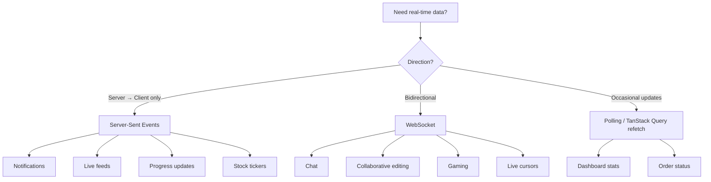
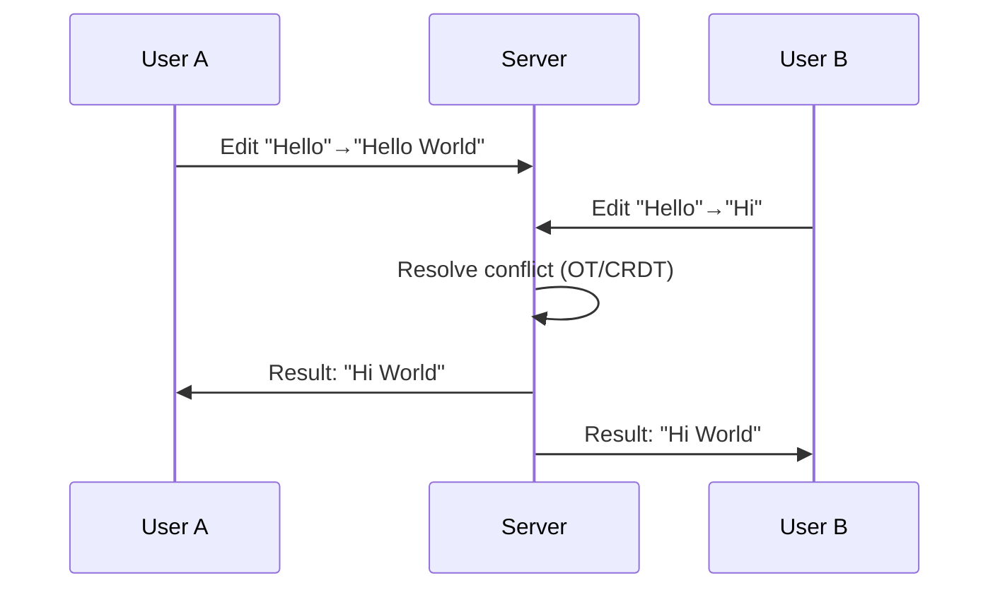

## Learning Objectives

- Implement WebSocket connections in React with automatic reconnection
- Use Server-Sent Events (SSE) for one-way real-time data streams
- Build optimistic UI patterns for instant-feeling interactions
- Design collaborative editing features with conflict resolution
- Implement presence indicators showing who's online and what they're viewing

## Prerequisites

- TanStack Query for server state management
- Custom hooks development
- Understanding of HTTP vs. WebSocket protocols

## Core Concepts

### Choosing the Right Real-Time Protocol



| Feature | WebSocket | SSE | Polling |
|---------|-----------|-----|---------|
| Direction | Bidirectional | Server → Client | Client → Server (request) |
| Protocol | WS/WSS | HTTP | HTTP |
| Reconnection | Manual | Automatic | Built-in |
| Binary data | Yes | No (text only) | Yes |
| Browser support | Universal | Universal (except IE) | Universal |
| Complexity | Higher | Lower | Lowest |

### WebSocket Hook

```typescript
type WebSocketStatus = "connecting" | "connected" | "disconnected" | "reconnecting";

interface UseWebSocketOptions {
  url: string;
  onMessage?: (data: unknown) => void;
  onConnect?: () => void;
  onDisconnect?: () => void;
  reconnect?: boolean;
  reconnectInterval?: number;
  maxReconnectAttempts?: number;
}

function useWebSocket({
  url,
  onMessage,
  onConnect,
  onDisconnect,
  reconnect = true,
  reconnectInterval = 3000,
  maxReconnectAttempts = 10,
}: UseWebSocketOptions) {
  const wsRef = useRef<WebSocket | null>(null);
  const reconnectCountRef = useRef(0);
  const reconnectTimerRef = useRef<ReturnType<typeof setTimeout>>();
  const [status, setStatus] = useState<WebSocketStatus>("disconnected");

  const connect = useCallback(() => {
    if (wsRef.current?.readyState === WebSocket.OPEN) return;

    setStatus("connecting");
    const ws = new WebSocket(url);

    ws.onopen = () => {
      setStatus("connected");
      reconnectCountRef.current = 0;
      onConnect?.();
    };

    ws.onmessage = (event) => {
      try {
        const data = JSON.parse(event.data);
        onMessage?.(data);
      } catch {
        onMessage?.(event.data);
      }
    };

    ws.onclose = () => {
      setStatus("disconnected");
      onDisconnect?.();

      if (reconnect && reconnectCountRef.current < maxReconnectAttempts) {
        setStatus("reconnecting");
        reconnectCountRef.current++;
        const delay = reconnectInterval * Math.pow(2, reconnectCountRef.current - 1);
        reconnectTimerRef.current = setTimeout(connect, Math.min(delay, 30000));
      }
    };

    ws.onerror = () => {
      ws.close();
    };

    wsRef.current = ws;
  }, [url, onMessage, onConnect, onDisconnect, reconnect, reconnectInterval, maxReconnectAttempts]);

  const disconnect = useCallback(() => {
    clearTimeout(reconnectTimerRef.current);
    reconnectCountRef.current = maxReconnectAttempts;
    wsRef.current?.close();
  }, [maxReconnectAttempts]);

  const send = useCallback((data: unknown) => {
    if (wsRef.current?.readyState === WebSocket.OPEN) {
      wsRef.current.send(JSON.stringify(data));
    }
  }, []);

  useEffect(() => {
    connect();
    return () => {
      clearTimeout(reconnectTimerRef.current);
      wsRef.current?.close();
    };
  }, [connect]);

  return { status, send, disconnect, reconnect: connect };
}
```

### Chat Application

```typescript
interface ChatMessage {
  id: string;
  userId: string;
  userName: string;
  content: string;
  timestamp: string;
  type: "text" | "system";
}

function useChat(roomId: string) {
  const [messages, setMessages] = useState<ChatMessage[]>([]);
  const queryClient = useQueryClient();

  const { status, send } = useWebSocket({
    url: `wss://api.example.com/chat/${roomId}`,
    onMessage: (data) => {
      const event = data as { type: string; payload: unknown };

      switch (event.type) {
        case "message":
          setMessages((prev) => [...prev, event.payload as ChatMessage]);
          break;
        case "history":
          setMessages(event.payload as ChatMessage[]);
          break;
        case "user_joined":
        case "user_left":
          queryClient.invalidateQueries({ queryKey: ["room", roomId, "members"] });
          break;
      }
    },
  });

  const sendMessage = useCallback(
    (content: string) => {
      const optimisticMessage: ChatMessage = {
        id: `temp-${Date.now()}`,
        userId: getCurrentUserId(),
        userName: getCurrentUserName(),
        content,
        timestamp: new Date().toISOString(),
        type: "text",
      };

      setMessages((prev) => [...prev, optimisticMessage]);
      send({ type: "message", content });
    },
    [send]
  );

  return { messages, sendMessage, status };
}

function ChatRoom({ roomId }: { roomId: string }) {
  const { messages, sendMessage, status } = useChat(roomId);
  const [input, setInput] = useState("");
  const messagesEndRef = useRef<HTMLDivElement>(null);

  useEffect(() => {
    messagesEndRef.current?.scrollIntoView({ behavior: "smooth" });
  }, [messages]);

  const handleSubmit = (e: React.FormEvent) => {
    e.preventDefault();
    if (!input.trim()) return;
    sendMessage(input.trim());
    setInput("");
  };

  return (
    <div className="flex h-screen flex-col">
      <div className="flex items-center gap-2 border-b px-4 py-3">
        <h1 className="font-semibold">Chat Room</h1>
        <ConnectionIndicator status={status} />
      </div>

      <div className="flex-1 overflow-y-auto p-4">
        {messages.map((msg) => (
          <MessageBubble key={msg.id} message={msg} />
        ))}
        <div ref={messagesEndRef} />
      </div>

      <form onSubmit={handleSubmit} className="border-t p-4">
        <div className="flex gap-2">
          <input
            value={input}
            onChange={(e) => setInput(e.target.value)}
            placeholder="Type a message..."
            disabled={status !== "connected"}
            className="flex-1 rounded border px-3 py-2"
          />
          <button
            type="submit"
            disabled={status !== "connected" || !input.trim()}
            className="rounded bg-blue-600 px-4 py-2 text-white disabled:opacity-50"
          >
            Send
          </button>
        </div>
      </form>
    </div>
  );
}

function ConnectionIndicator({ status }: { status: WebSocketStatus }) {
  const colors: Record<WebSocketStatus, string> = {
    connected: "bg-green-500",
    connecting: "bg-yellow-500",
    reconnecting: "bg-yellow-500 animate-pulse",
    disconnected: "bg-red-500",
  };

  return (
    <div className="flex items-center gap-1.5">
      <div className={`h-2 w-2 rounded-full ${colors[status]}`} />
      <span className="text-xs text-gray-500 capitalize">{status}</span>
    </div>
  );
}
```

### Server-Sent Events

```typescript
function useServerEvents<T>(url: string, onEvent: (data: T) => void) {
  const [isConnected, setIsConnected] = useState(false);

  useEffect(() => {
    const eventSource = new EventSource(url);

    eventSource.onopen = () => setIsConnected(true);

    eventSource.onmessage = (event) => {
      const data = JSON.parse(event.data) as T;
      onEvent(data);
    };

    eventSource.onerror = () => {
      setIsConnected(false);
      // EventSource auto-reconnects
    };

    return () => eventSource.close();
  }, [url, onEvent]);

  return { isConnected };
}

// Typed event streams
function useNotificationStream() {
  const queryClient = useQueryClient();
  const [notifications, setNotifications] = useState<Notification[]>([]);

  const handleEvent = useCallback((event: NotificationEvent) => {
    switch (event.type) {
      case "new_notification":
        setNotifications((prev) => [event.notification, ...prev]);
        break;
      case "notification_read":
        setNotifications((prev) =>
          prev.map((n) => (n.id === event.notificationId ? { ...n, read: true } : n))
        );
        break;
      case "data_updated":
        queryClient.invalidateQueries({ queryKey: event.queryKey });
        break;
    }
  }, [queryClient]);

  const { isConnected } = useServerEvents("/api/events", handleEvent);

  return { notifications, isConnected };
}
```

### Optimistic UI Patterns

```typescript
function useOptimisticList<T extends { id: string }>(
  queryKey: unknown[],
  fetcher: () => Promise<T[]>
) {
  const queryClient = useQueryClient();
  const { data: items = [], ...query } = useQuery({ queryKey, queryFn: fetcher });

  const optimisticAdd = useMutation({
    mutationFn: (newItem: Omit<T, "id">) =>
      fetch("/api/items", {
        method: "POST",
        body: JSON.stringify(newItem),
      }).then((r) => r.json() as Promise<T>),

    onMutate: async (newItem) => {
      await queryClient.cancelQueries({ queryKey });
      const previous = queryClient.getQueryData<T[]>(queryKey);

      const optimistic = { ...newItem, id: `optimistic-${Date.now()}` } as T;
      queryClient.setQueryData<T[]>(queryKey, (old) => [...(old ?? []), optimistic]);

      return { previous };
    },
    onError: (_, __, context) => {
      if (context?.previous) {
        queryClient.setQueryData(queryKey, context.previous);
      }
    },
    onSettled: () => {
      queryClient.invalidateQueries({ queryKey });
    },
  });

  const optimisticRemove = useMutation({
    mutationFn: (id: string) =>
      fetch(`/api/items/${id}`, { method: "DELETE" }),

    onMutate: async (id) => {
      await queryClient.cancelQueries({ queryKey });
      const previous = queryClient.getQueryData<T[]>(queryKey);

      queryClient.setQueryData<T[]>(queryKey, (old) =>
        old?.filter((item) => item.id !== id) ?? []
      );

      return { previous };
    },
    onError: (_, __, context) => {
      if (context?.previous) {
        queryClient.setQueryData(queryKey, context.previous);
      }
    },
    onSettled: () => {
      queryClient.invalidateQueries({ queryKey });
    },
  });

  return { items, ...query, optimisticAdd, optimisticRemove };
}
```

### Presence: Who's Online

```typescript
interface PresenceState {
  userId: string;
  userName: string;
  avatar: string;
  status: "online" | "away" | "busy";
  currentPage?: string;
  lastSeen: string;
}

function usePresence(roomId: string) {
  const [peers, setPeers] = useState<Map<string, PresenceState>>(new Map());

  const { send } = useWebSocket({
    url: `wss://api.example.com/presence/${roomId}`,
    onMessage: (data) => {
      const event = data as { type: string; payload: unknown };

      switch (event.type) {
        case "presence_sync":
          setPeers(new Map(Object.entries(event.payload as Record<string, PresenceState>)));
          break;
        case "presence_join": {
          const user = event.payload as PresenceState;
          setPeers((prev) => new Map(prev).set(user.userId, user));
          break;
        }
        case "presence_leave": {
          const { userId } = event.payload as { userId: string };
          setPeers((prev) => {
            const next = new Map(prev);
            next.delete(userId);
            return next;
          });
          break;
        }
        case "presence_update": {
          const update = event.payload as PresenceState;
          setPeers((prev) => new Map(prev).set(update.userId, update));
          break;
        }
      }
    },
  });

  const updatePresence = useCallback(
    (update: Partial<PresenceState>) => {
      send({ type: "presence_update", payload: update });
    },
    [send]
  );

  return { peers: Array.from(peers.values()), updatePresence };
}

function PresenceAvatars({ roomId }: { roomId: string }) {
  const { peers } = usePresence(roomId);
  const maxVisible = 5;
  const visiblePeers = peers.slice(0, maxVisible);
  const overflow = peers.length - maxVisible;

  return (
    <div className="flex -space-x-2">
      {visiblePeers.map((peer) => (
        <div key={peer.userId} className="relative" title={peer.userName}>
          
          <div
            className={`absolute bottom-0 right-0 h-2.5 w-2.5 rounded-full border-2 border-white ${
              peer.status === "online"
                ? "bg-green-500"
                : peer.status === "away"
                  ? "bg-yellow-500"
                  : "bg-red-500"
            }`}
          />
        </div>
      ))}
      {overflow > 0 && (
        <div className="flex h-8 w-8 items-center justify-center rounded-full border-2 border-white bg-gray-200 text-xs font-medium">
          +{overflow}
        </div>
      )}
    </div>
  );
}
```

### Collaborative Editing Concepts



For production collaborative editing, use established libraries like **Yjs** or **Liveblocks** rather than building from scratch:

```typescript
// Using Yjs for collaborative editing
import * as Y from "yjs";
import { WebsocketProvider } from "y-websocket";

function useCollaborativeDoc(roomId: string) {
  const [doc] = useState(() => new Y.Doc());
  const [provider, setProvider] = useState<WebsocketProvider | null>(null);

  useEffect(() => {
    const wsProvider = new WebsocketProvider(
      "wss://api.example.com/yjs",
      roomId,
      doc
    );
    setProvider(wsProvider);

    return () => wsProvider.destroy();
  }, [doc, roomId]);

  const text = doc.getText("content");
  const awareness = provider?.awareness;

  return { doc, text, awareness, provider };
}
```

## Best Practices

1. **Auto-reconnect with exponential backoff** — network drops happen; recover gracefully
2. **Optimistic updates for all mutations** — update UI immediately, reconcile after
3. **Presence heartbeats** — detect stale connections and clean up phantom users
4. **SSE for server-to-client only** — simpler than WebSocket when you don't need bidirectional
5. **Use established CRDT libraries** — don't build collaborative editing from scratch
6. **Connection status indicators** — always show users when they're offline or reconnecting

## Anti-Patterns to Avoid

- **Polling when WebSocket is needed** — polling every second wastes bandwidth and is still laggy
- **No reconnection logic** — mobile networks drop constantly; always auto-reconnect
- **Giant payloads** — send diffs, not full state, over WebSocket
- **Missing offline handling** — queue operations when disconnected, sync when reconnected
- **Ignoring backpressure** — if the server sends faster than the client can render, throttle

## Hands-On Exercise

### Build a Collaborative Task Board

1. Create a WebSocket hook with automatic reconnection and exponential backoff
2. Build a real-time chat sidebar with optimistic message sending
3. Implement presence indicators showing who's viewing the board
4. Add SSE-powered notifications for task assignments
5. Build optimistic drag-and-drop for moving tasks between columns
6. Show a connection status indicator that displays reconnecting state

## Key Takeaways

- WebSocket for bidirectional real-time communication; SSE for server-to-client streams
- Automatic reconnection with exponential backoff is essential for production reliability
- Optimistic updates make real-time UIs feel instant — always plan for rollback
- Presence features (who's online, cursors, typing indicators) require WebSocket
- Use established CRDT/OT libraries for collaborative editing — don't reinvent conflict resolution

## External Resources

- [MDN: WebSocket API](https://developer.mozilla.org/en-US/docs/Web/API/WebSocket)
- [MDN: Server-Sent Events](https://developer.mozilla.org/en-US/docs/Web/API/Server-sent_events)
- [Yjs Documentation](https://docs.yjs.dev/)
- [Liveblocks: Real-Time Collaboration](https://liveblocks.io/)
- [Socket.IO Documentation](https://socket.io/docs/v4/)
