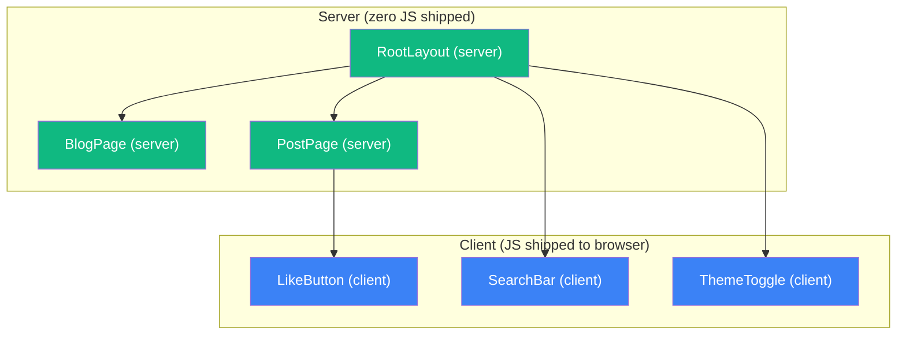
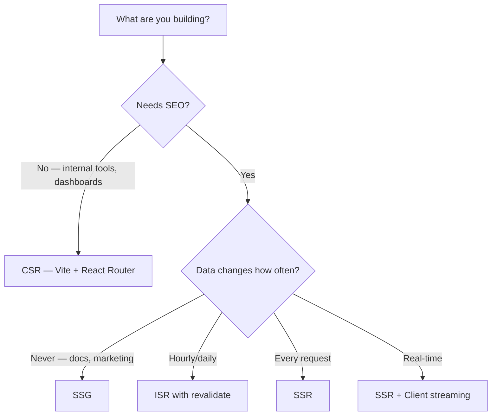

## Learning Objectives

- Compare rendering strategies: CSR, SSR, SSG, and ISR — when to use each
- Build pages with Next.js App Router and React Server Components
- Implement streaming SSR for progressive page loading
- Understand the server/client boundary and `"use client"` directive
- Choose the right rendering strategy based on data freshness, SEO, and performance needs

## Prerequisites

- React Router and data fetching patterns
- TanStack Query for client-side caching
- TypeScript and async/await

## Core Concepts

### Rendering Strategies Compared

```mermaid
flowchart TD
    subgraph CSR["Client-Side Rendering"]
        CSR1[Empty HTML + JS bundle] --> CSR2[Browser downloads JS]
        CSR2 --> CSR3[React renders in browser]
        CSR3 --> CSR4[Fetch data from API]
        CSR4 --> CSR5[User sees content]
    end

    subgraph SSR["Server-Side Rendering"]
        SSR1[Request hits server] --> SSR2[Server fetches data]
        SSR2 --> SSR3[Server renders HTML]
        SSR3 --> SSR4[HTML sent to browser]
        SSR4 --> SSR5[Hydration — JS takes over]
    end

    subgraph SSG["Static Site Generation"]
        SSG1[Build time] --> SSG2[Fetch data + render HTML]
        SSG2 --> SSG3[HTML files on CDN]
        SSG3 --> SSG4[Instant delivery]
    end

    subgraph ISR["Incremental Static Regeneration"]
        ISR1[First request: serve cached HTML]
        ISR1 --> ISR2{Stale?}
        ISR2 -->|Yes| ISR3[Regenerate in background]
        ISR3 --> ISR4[Next request gets fresh HTML]
        ISR2 -->|No| ISR5[Serve cached HTML]
    end
```



| Strategy | TTFB | SEO | Data Freshness | Hosting |
|----------|------|-----|---------------|---------|
| CSR | Fast (empty shell) | Poor | Real-time | Static CDN |
| SSR | Slower (server work) | Excellent | Real-time | Node.js server |
| SSG | Fastest (pre-built) | Excellent | Build-time only | Static CDN |
| ISR | Fast (cached) | Excellent | Periodic (revalidate) | Vercel/Node.js |

### Next.js App Router Fundamentals

```bash
npx create-next-app@latest my-app --typescript --tailwind --app
```

#### File-Based Routing

```
app/
├── layout.tsx              # Root layout (wraps all pages)
├── page.tsx                # / route
├── loading.tsx             # Loading UI for this segment
├── error.tsx               # Error boundary for this segment
├── not-found.tsx           # 404 page
├── blog/
│   ├── layout.tsx          # Blog layout (nested)
│   ├── page.tsx            # /blog route
│   └── [slug]/
│       ├── page.tsx        # /blog/:slug route
│       └── loading.tsx     # Loading UI for blog post
├── dashboard/
│   ├── layout.tsx          # Dashboard layout with sidebar
│   ├── page.tsx            # /dashboard
│   └── settings/
│       └── page.tsx        # /dashboard/settings
└── api/
    └── posts/
        └── route.ts        # API route: /api/posts
```

#### Root Layout

```typescript
// app/layout.tsx
import type { Metadata } from "next";

export const metadata: Metadata = {
  title: { default: "My App", template: "%s | My App" },
  description: "A modern React application",
};

export default function RootLayout({ children }: { children: React.ReactNode }) {
  return (
    <html lang="en">
      <body className="min-h-screen bg-background font-sans antialiased">
        <Header />
        <main>{children}</main>
        <Footer />
      </body>
    </html>
  );
}
```

### React Server Components (RSC)

In the App Router, components are **server components by default**. They run on the server and send HTML to the client — no JavaScript shipped for these components.

```typescript
// app/blog/page.tsx — Server Component (default)
interface Post {
  id: string;
  title: string;
  excerpt: string;
  publishedAt: string;
}

async function getPosts(): Promise<Post[]> {
  const res = await fetch("https://api.example.com/posts", {
    next: { revalidate: 3600 }, // ISR: revalidate every hour
  });
  if (!res.ok) throw new Error("Failed to fetch posts");
  return res.json();
}

export default async function BlogPage() {
  const posts = await getPosts();

  return (
    <div className="mx-auto max-w-3xl py-10">
      <h1 className="text-3xl font-bold">Blog</h1>
      <div className="mt-8 space-y-6">
        {posts.map((post) => (
          <article key={post.id} className="rounded-lg border p-6">
            <h2 className="text-xl font-semibold">
              <a href={`/blog/${post.id}`} className="hover:text-blue-600">
                {post.title}
              </a>
            </h2>
            <p className="mt-2 text-gray-600">{post.excerpt}</p>
            <time className="mt-3 block text-sm text-gray-400">
              {new Date(post.publishedAt).toLocaleDateString()}
            </time>
          </article>
        ))}
      </div>
    </div>
  );
}
```

This component:
- Fetches data on the server (no loading state needed on the client)
- Ships zero JavaScript to the browser (no useState, no useEffect)
- Gets full SEO benefits (search engines see the rendered HTML)
- Revalidates the cache every hour (ISR)

### Client Components

Components that need interactivity, browser APIs, or hooks must opt in with `"use client"`:

```typescript
// app/blog/[slug]/LikeButton.tsx
"use client";

import { useState, useTransition } from "react";

export function LikeButton({ postId, initialLikes }: { postId: string; initialLikes: number }) {
  const [likes, setLikes] = useState(initialLikes);
  const [isPending, startTransition] = useTransition();

  function handleLike() {
    startTransition(async () => {
      setLikes((prev) => prev + 1);
      await fetch(`/api/posts/${postId}/like`, { method: "POST" });
    });
  }

  return (
    <button
      onClick={handleLike}
      disabled={isPending}
      className="flex items-center gap-2 rounded-full border px-4 py-2 hover:bg-gray-50"
    >
      <span>❤️</span>
      <span>{likes}</span>
    </button>
  );
}
```

```typescript
// app/blog/[slug]/page.tsx — Server Component using a Client Component
import { LikeButton } from "./LikeButton";

async function getPost(slug: string) {
  const res = await fetch(`https://api.example.com/posts/${slug}`);
  if (!res.ok) throw new Error("Post not found");
  return res.json();
}

export default async function BlogPostPage({ params }: { params: Promise<{ slug: string }> }) {
  const { slug } = await params;
  const post = await getPost(slug);

  return (
    <article className="mx-auto max-w-3xl py-10">
      <h1 className="text-3xl font-bold">{post.title}</h1>
      <div className="mt-6 prose" dangerouslySetInnerHTML={{ __html: post.contentHtml }} />
      <LikeButton postId={post.id} initialLikes={post.likes} />
    </article>
  );
}
```

### The Server/Client Boundary



**Rules:**
- Server components CAN import client components
- Client components CANNOT import server components (but can accept them as children)
- Props passed from server to client must be serializable (no functions, no classes)
- `"use client"` creates a boundary — everything imported by that file is also client

### Streaming SSR

```typescript
// app/dashboard/page.tsx
import { Suspense } from "react";

export default function DashboardPage() {
  return (
    <div className="grid gap-6 md:grid-cols-2">
      <Suspense fallback={<StatsSkeleton />}>
        <DashboardStats />
      </Suspense>
      <Suspense fallback={<ChartSkeleton />}>
        <RevenueChart />
      </Suspense>
      <Suspense fallback={<TableSkeleton />}>
        <RecentOrders />
      </Suspense>
      <Suspense fallback={<ListSkeleton />}>
        <TopProducts />
      </Suspense>
    </div>
  );
}

async function DashboardStats() {
  const stats = await fetch("https://api.example.com/stats").then((r) => r.json());

  return (
    <div className="grid grid-cols-4 gap-4">
      {stats.map((stat: Stat) => (
        <div key={stat.label} className="rounded-lg border p-4">
          <p className="text-sm text-gray-500">{stat.label}</p>
          <p className="text-2xl font-bold">{stat.value}</p>
        </div>
      ))}
    </div>
  );
}
```

With streaming, the server sends HTML progressively:
1. Shell with layout and `<Suspense>` fallbacks renders immediately
2. As each async component resolves, its HTML streams to the browser
3. The browser replaces fallbacks with real content without a full page reload

### Server Actions

```typescript
// app/blog/new/page.tsx
import { redirect } from "next/navigation";
import { revalidatePath } from "next/cache";

async function createPost(formData: FormData) {
  "use server";

  const title = formData.get("title") as string;
  const content = formData.get("content") as string;

  const response = await fetch("https://api.example.com/posts", {
    method: "POST",
    headers: { "Content-Type": "application/json" },
    body: JSON.stringify({ title, content }),
  });

  if (!response.ok) {
    throw new Error("Failed to create post");
  }

  revalidatePath("/blog");
  redirect("/blog");
}

export default function NewPostPage() {
  return (
    <form action={createPost} className="mx-auto max-w-2xl space-y-4 py-10">
      <div>
        <label htmlFor="title" className="block text-sm font-medium">Title</label>
        <input id="title" name="title" required className="mt-1 w-full rounded border px-3 py-2" />
      </div>
      <div>
        <label htmlFor="content" className="block text-sm font-medium">Content</label>
        <textarea id="content" name="content" rows={10} required className="mt-1 w-full rounded border px-3 py-2" />
      </div>
      <button type="submit" className="rounded bg-blue-600 px-4 py-2 text-white">
        Publish
      </button>
    </form>
  );
}
```

### When to Use What



## Best Practices

1. **Server components by default** — add `"use client"` only when you need interactivity
2. **Push client boundaries down** — keep the interactive leaf small; large server tree
3. **Use `revalidatePath`/`revalidateTag`** — for on-demand ISR after mutations
4. **Streaming with Suspense** — don't make users wait for the slowest data fetch
5. **Colocate data fetching** — fetch in the component that needs the data, not at the page level
6. **Serializable props only** — server-to-client boundaries can't pass functions or class instances

## Anti-Patterns to Avoid

- **`"use client"` on layout components** — ship massive amounts of JS; keep layouts on the server
- **Fetching in client components when SSR would suffice** — unnecessary loading spinners
- **Over-using ISR** — if data must be real-time, use SSR or client-side fetching
- **Ignoring the server/client boundary** — importing server-only code in client components leaks secrets
- **N+1 queries in server components** — fetch all related data in one call, or use `Promise.all`

## Hands-On Exercise

### Build a Blog with Next.js App Router

1. Create a Next.js app with the App Router
2. Build a blog index page as a server component with ISR (revalidate every hour)
3. Create dynamic `[slug]` pages that fetch individual posts on the server
4. Add a `LikeButton` client component with optimistic updates
5. Implement a "New Post" form using server actions
6. Add `loading.tsx` and `error.tsx` for each route segment
7. Compare Lighthouse scores between CSR and SSR versions

## Key Takeaways

- Server Components are the default in Next.js App Router — they ship zero JavaScript
- `"use client"` creates a boundary; use it only for interactive components
- SSR provides SEO and fast first paint; CSR suits internal tools and dashboards
- ISR gives you the speed of static with configurable data freshness
- Streaming SSR with Suspense progressively reveals content as data resolves

## External Resources

- [Next.js App Router Documentation](https://nextjs.org/docs/app)
- [React Server Components RFC](https://react.dev/blog/2023/03/22/react-labs-what-we-have-been-working-on-march-2023)
- [Vercel: Understanding ISR](https://vercel.com/docs/incremental-static-regeneration)
- [Dan Abramov: The Two Reacts](https://overreacted.io/the-two-reacts/)
- [Next.js Streaming SSR](https://nextjs.org/docs/app/building-your-application/routing/loading-ui-and-streaming)
