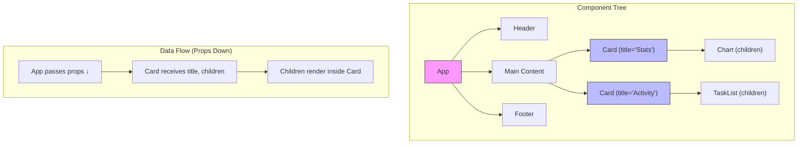

## Learning Objectives

- Build functional components with typed props in TypeScript
- Use the children prop and composition patterns for flexible UIs
- Understand JSX compilation and what happens under the hood
- Apply conditional rendering and list rendering patterns
- Design reusable components with proper prop interfaces

## Prerequisites

- React project set up with Vite and TypeScript (previous lesson)
- Basic TypeScript types (string, number, boolean, interfaces)

## Core Concepts

### What Is JSX?

JSX looks like HTML inside JavaScript, but it's actually syntactic sugar for function calls. When you write:

```tsx
const element = <h1 className="title">Hello, World!</h1>
```

The compiler transforms it into:

```tsx
const element = React.createElement('h1', { className: 'title' }, 'Hello, World!')
```

This means JSX is just JavaScript expressions — you can assign it to variables, return it from functions, put it in arrays, and pass it as props.

**Key differences from HTML:**
- `class` → `className` (class is a reserved JavaScript keyword)
- `for` → `htmlFor` (for is reserved too)
- Self-closing tags are required: ``, `<br />`, `<input />`
- All attributes are camelCase: `onClick`, `tabIndex`, `onChange`
- Style is an object, not a string: `style={{ color: 'red', fontSize: '16px' }}`

### Functional Components

Every React component is a function that returns JSX:

```tsx
function Greeting() {
  return <h1>Hello, World!</h1>
}

// Arrow function style (either is fine)
const Greeting = () => {
  return <h1>Hello, World!</h1>
}
```

### Props: Passing Data to Components

Props are the mechanism for passing data from parent to child components. In TypeScript, we define a props interface for type safety:

```tsx
interface UserProfileProps {
  name: string
  email: string
  avatarUrl: string
  isOnline: boolean
  role?: 'admin' | 'user' | 'viewer'  // Optional prop with union type
}

function UserProfile({ name, email, avatarUrl, isOnline, role = 'user' }: UserProfileProps) {
  return (
    <div className="user-profile">
      
      <div>
        <h2>
          {name}
          {isOnline && <span className="online-dot" />}
        </h2>
        <p>{email}</p>
        <span className="badge">{role}</span>
      </div>
    </div>
  )
}

// Usage
<UserProfile
  name="Alice"
  email="alice@example.com"
  avatarUrl="/avatars/alice.jpg"
  isOnline={true}
/>
```

### The Children Prop

`children` is a special prop that receives whatever JSX is placed between a component's opening and closing tags:

```tsx
interface CardProps {
  title: string
  children: React.ReactNode  // Accepts any valid JSX
  variant?: 'default' | 'outlined' | 'elevated'
}

function Card({ title, children, variant = 'default' }: CardProps) {
  const styles: Record<string, React.CSSProperties> = {
    default: { padding: '1.5rem', borderRadius: '8px', background: '#fff' },
    outlined: { padding: '1.5rem', borderRadius: '8px', border: '1px solid #ddd' },
    elevated: { padding: '1.5rem', borderRadius: '8px', boxShadow: '0 4px 12px rgba(0,0,0,0.1)' },
  }

  return (
    <div style={styles[variant]}>
      <h3 style={{ marginTop: 0 }}>{title}</h3>
      <div>{children}</div>
    </div>
  )
}

// Usage — children can be anything
<Card title="User Stats" variant="elevated">
  <p>Total lessons completed: 42</p>
  <p>Current streak: 7 days</p>
  <button>View Details</button>
</Card>
```

### Composition Over Configuration

Instead of building components with dozens of props for every variation, compose smaller components together:

```tsx
// ❌ Configuration approach — inflexible
<Dialog
  title="Confirm Delete"
  body="Are you sure?"
  showCancel={true}
  cancelText="No"
  confirmText="Yes, Delete"
  onCancel={handleCancel}
  onConfirm={handleConfirm}
  icon="warning"
  iconColor="red"
/>

// ✅ Composition approach — flexible
<Dialog>
  <Dialog.Header>
    <WarningIcon color="red" />
    <Dialog.Title>Confirm Delete</Dialog.Title>
  </Dialog.Header>
  <Dialog.Body>
    <p>Are you sure? This action cannot be undone.</p>
  </Dialog.Body>
  <Dialog.Footer>
    <Button variant="ghost" onClick={handleCancel}>No</Button>
    <Button variant="destructive" onClick={handleConfirm}>Yes, Delete</Button>
  </Dialog.Footer>
</Dialog>
```

### Conditional Rendering

React supports several patterns for rendering content conditionally:

```tsx
interface NotificationProps {
  type: 'info' | 'warning' | 'error' | 'success'
  message: string
  dismissible?: boolean
  details?: string
}

function Notification({ type, message, dismissible = false, details }: NotificationProps) {
  const colors = {
    info: '#3b82f6',
    warning: '#f59e0b',
    error: '#ef4444',
    success: '#10b981',
  }

  return (
    <div style={{ borderLeft: `4px solid ${colors[type]}`, padding: '1rem' }}>
      {/* Logical AND — renders right side only if left is truthy */}
      {dismissible && <button style={{ float: 'right' }}>×</button>}

      <strong>{message}</strong>

      {/* Ternary — choose between two elements */}
      {details ? (
        <p style={{ marginTop: '0.5rem', color: '#666' }}>{details}</p>
      ) : null}
    </div>
  )
}
```

**Gotcha with `&&`:** Avoid `{count && <span>...</span>}` when count might be 0, because React renders `0` to the DOM. Use `{count > 0 && <span>...</span>}` instead.

### List Rendering with Keys

```tsx
interface Task {
  id: string
  title: string
  completed: boolean
}

interface TaskListProps {
  tasks: Task[]
  onToggle: (id: string) => void
}

function TaskList({ tasks, onToggle }: TaskListProps) {
  if (tasks.length === 0) {
    return <p style={{ color: '#999' }}>No tasks yet. Add one above!</p>
  }

  return (
    <ul style={{ listStyle: 'none', padding: 0 }}>
      {tasks.map((task) => (
        <li
          key={task.id}  // Stable, unique key — NEVER use array index
          style={{
            display: 'flex',
            alignItems: 'center',
            gap: '0.5rem',
            padding: '0.75rem',
            borderBottom: '1px solid #eee',
            textDecoration: task.completed ? 'line-through' : 'none',
            opacity: task.completed ? 0.6 : 1,
          }}
        >
          <input
            type="checkbox"
            checked={task.completed}
            onChange={() => onToggle(task.id)}
          />
          <span>{task.title}</span>
        </li>
      ))}
    </ul>
  )
}
```

**Why keys matter:** React uses keys to track which items changed, were added, or removed. Using the array index as a key causes bugs when items are reordered, deleted, or inserted in the middle — React can't distinguish between "item moved" and "item content changed."

### Event Handling

```tsx
function SearchBar() {
  const [query, setQuery] = React.useState('')

  const handleSubmit = (e: React.FormEvent<HTMLFormElement>) => {
    e.preventDefault()
    console.log('Searching for:', query)
  }

  const handleChange = (e: React.ChangeEvent<HTMLInputElement>) => {
    setQuery(e.target.value)
  }

  return (
    <form onSubmit={handleSubmit}>
      <input
        type="text"
        value={query}
        onChange={handleChange}
        placeholder="Search..."
      />
      <button type="submit">Search</button>
    </form>
  )
}
```

### Typing Common Patterns

```tsx
// Component that accepts standard HTML div props
interface PanelProps extends React.HTMLAttributes<HTMLDivElement> {
  bordered?: boolean
}

function Panel({ bordered, children, className, ...rest }: PanelProps) {
  return (
    <div
      className={`panel ${bordered ? 'bordered' : ''} ${className ?? ''}`}
      {...rest}
    >
      {children}
    </div>
  )
}

// Generic list component
interface ListProps<T> {
  items: T[]
  renderItem: (item: T, index: number) => React.ReactNode
  keyExtractor: (item: T) => string
}

function List<T>({ items, renderItem, keyExtractor }: ListProps<T>) {
  return (
    <ul>
      {items.map((item, index) => (
        <li key={keyExtractor(item)}>{renderItem(item, index)}</li>
      ))}
    </ul>
  )
}
```

## Diagram



## Hands-On Exercise

### Exercise: Build a Reusable Card Component

**Step 1: Create the Card component**

Create `src/components/ui/Card.tsx`:

```tsx
interface CardProps {
  children: React.ReactNode
}

interface CardHeaderProps {
  children: React.ReactNode
}

interface CardTitleProps {
  children: React.ReactNode
}

interface CardContentProps {
  children: React.ReactNode
}

interface CardFooterProps {
  children: React.ReactNode
}

export function Card({ children }: CardProps) {
  return (
    <div style={{
      borderRadius: '12px',
      border: '1px solid #e2e8f0',
      overflow: 'hidden',
      background: 'white',
    }}>
      {children}
    </div>
  )
}

Card.Header = function CardHeader({ children }: CardHeaderProps) {
  return <div style={{ padding: '1.5rem 1.5rem 0' }}>{children}</div>
}

Card.Title = function CardTitle({ children }: CardTitleProps) {
  return <h3 style={{ margin: 0, fontSize: '1.25rem' }}>{children}</h3>
}

Card.Content = function CardContent({ children }: CardContentProps) {
  return <div style={{ padding: '1rem 1.5rem' }}>{children}</div>
}

Card.Footer = function CardFooter({ children }: CardFooterProps) {
  return (
    <div style={{
      padding: '1rem 1.5rem',
      borderTop: '1px solid #e2e8f0',
      display: 'flex',
      gap: '0.5rem',
      justifyContent: 'flex-end',
    }}>
      {children}
    </div>
  )
}
```

**Step 2: Use the Card in App.tsx**

```tsx
import { Card } from './components/ui/Card'

function App() {
  const courses = [
    { id: '1', title: 'LLM & AI Engineering', progress: 42, lessons: 55 },
    { id: '2', title: 'Golang for Backends', progress: 78, lessons: 25 },
    { id: '3', title: 'React + TypeScript', progress: 15, lessons: 24 },
  ]

  return (
    <div style={{ maxWidth: '800px', margin: '2rem auto', padding: '0 1rem' }}>
      <h1>My Courses</h1>
      <div style={{ display: 'grid', gap: '1rem', gridTemplateColumns: 'repeat(auto-fill, minmax(250px, 1fr))' }}>
        {courses.map((course) => (
          <Card key={course.id}>
            <Card.Header>
              <Card.Title>{course.title}</Card.Title>
            </Card.Header>
            <Card.Content>
              <p>{course.lessons} lessons</p>
              <div style={{ background: '#e2e8f0', borderRadius: '4px', height: '6px' }}>
                <div style={{
                  background: '#3b82f6',
                  borderRadius: '4px',
                  height: '100%',
                  width: `${course.progress}%`,
                }} />
              </div>
              <p style={{ fontSize: '0.875rem', color: '#666' }}>{course.progress}% complete</p>
            </Card.Content>
            <Card.Footer>
              <button>Continue</button>
            </Card.Footer>
          </Card>
        ))}
      </div>
    </div>
  )
}

export default App
```

**Challenge:** Add a `Badge` component and integrate it into the Card to show difficulty level (Beginner/Intermediate/Advanced) with color coding.

## Key Takeaways

- JSX is syntactic sugar for `React.createElement` — it's just JavaScript expressions, not a template language
- Props flow one way (parent → child); type them with interfaces for compile-time safety
- `children` is a prop like any other — use `React.ReactNode` as its type
- Composition is more flexible than configuration: build small focused components and compose them
- Always use stable, unique keys from your data (like IDs) — never array indices
- TypeScript catches prop mismatches at compile time, eliminating an entire class of runtime errors

## External Resources

- [React: Describing the UI](https://react.dev/learn/describing-the-ui) — Official guide to components and JSX
- [React TypeScript Cheatsheet](https://react-typescript-cheatsheet.netlify.app/) — Comprehensive typing patterns
- [Patterns.dev: Compound Pattern](https://www.patterns.dev/react/compound-pattern) — Deep dive into compound component design
- [Kent C. Dodds: Composition vs Inheritance](https://kentcdodds.com/blog/application-state-management-with-react) — Why composition wins

## Quiz

See the quiz.json file for this module's quiz questions.
