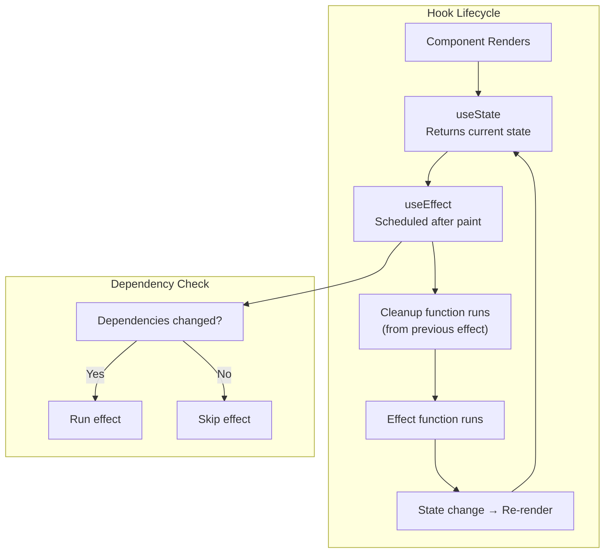

## Learning Objectives

- Master useState, useEffect, useRef, useMemo, and useCallback with correct dependency arrays
- Identify and fix common hook pitfalls (stale closures, infinite loops, missing dependencies)
- Extract reusable logic into custom hooks
- Understand the Rules of Hooks and why they exist
- Build a production-quality custom hook from scratch

## Prerequisites

- Functional components and props (previous lesson)
- JavaScript closures and reference equality concepts

## Core Concepts

### Rules of Hooks

Before diving in, there are two inviolable rules:

1. **Only call hooks at the top level** — Never inside loops, conditions, or nested functions. React relies on call order to track which hook is which.
2. **Only call hooks from React functions** — From functional components or custom hooks, never from regular JavaScript functions.

```tsx
// ❌ BROKEN — conditional hook call
function Profile({ userId }: { userId: string | null }) {
  if (userId) {
    const [user, setUser] = useState(null)  // Hook call order changes!
  }
}

// ✅ CORRECT — hook always called, condition inside
function Profile({ userId }: { userId: string | null }) {
  const [user, setUser] = useState(null)
  useEffect(() => {
    if (userId) fetchUser(userId).then(setUser)
  }, [userId])
}
```

### useState: Managing State

`useState` declares a state variable. When state changes, the component re-renders.

```tsx
function Counter() {
  const [count, setCount] = useState(0)

  return (
    <div>
      <p>Count: {count}</p>
      <button onClick={() => setCount(count + 1)}>Increment</button>
      <button onClick={() => setCount(prev => prev - 1)}>Decrement</button>
      <button onClick={() => setCount(0)}>Reset</button>
    </div>
  )
}
```

**Functional updates** — Use the callback form when the new state depends on the previous state:

```tsx
// ❌ Bug: clicking fast may miss updates
setCount(count + 1)

// ✅ Correct: always based on latest state
setCount(prev => prev + 1)
```

**Lazy initialization** — Pass a function when the initial value is expensive to compute:

```tsx
// ❌ Runs JSON.parse on EVERY render, even though only the first matters
const [settings, setSettings] = useState(
  JSON.parse(localStorage.getItem('settings') ?? '{}')
)

// ✅ Only runs once, on first render
const [settings, setSettings] = useState(() =>
  JSON.parse(localStorage.getItem('settings') ?? '{}')
)
```

### useEffect: Side Effects

`useEffect` synchronizes your component with external systems (APIs, subscriptions, DOM manipulation).

```tsx
function UserProfile({ userId }: { userId: string }) {
  const [user, setUser] = useState<User | null>(null)
  const [loading, setLoading] = useState(true)
  const [error, setError] = useState<string | null>(null)

  useEffect(() => {
    let cancelled = false

    async function fetchUser() {
      setLoading(true)
      setError(null)
      try {
        const response = await fetch(`/api/users/${userId}`)
        if (!response.ok) throw new Error('Failed to fetch')
        const data = await response.json()
        if (!cancelled) {
          setUser(data)
        }
      } catch (err) {
        if (!cancelled) {
          setError(err instanceof Error ? err.message : 'Unknown error')
        }
      } finally {
        if (!cancelled) {
          setLoading(false)
        }
      }
    }

    fetchUser()

    return () => {
      cancelled = true  // Cleanup: prevent state updates on unmounted component
    }
  }, [userId])  // Re-run when userId changes

  if (loading) return <p>Loading...</p>
  if (error) return <p>Error: {error}</p>
  if (!user) return null

  return <div>{user.name}</div>
}
```

**The dependency array controls when the effect runs:**

| Dependency Array | When It Runs |
|-----------------|-------------|
| Not provided    | After every render (usually a bug) |
| `[]`            | Once, after initial render |
| `[a, b]`       | When `a` or `b` changes (referential equality) |

**Common pitfall — infinite loop:**

```tsx
// ❌ INFINITE LOOP: object created every render → effect re-runs → state changes → re-render
useEffect(() => {
  fetch('/api/data', { headers: { auth: token } })
    .then(r => r.json())
    .then(setData)
}, [{ auth: token }])  // New object reference every render!

// ✅ Depend on the primitive value
useEffect(() => {
  fetch('/api/data', { headers: { auth: token } })
    .then(r => r.json())
    .then(setData)
}, [token])
```

### useRef: Mutable References

`useRef` holds a mutable value that persists across renders without triggering re-renders.

Two primary use cases:

**1. Accessing DOM elements:**

```tsx
function AutoFocusInput() {
  const inputRef = useRef<HTMLInputElement>(null)

  useEffect(() => {
    inputRef.current?.focus()
  }, [])

  return <input ref={inputRef} placeholder="I'm auto-focused!" />
}
```

**2. Storing mutable values (like instance variables):**

```tsx
function Timer() {
  const [seconds, setSeconds] = useState(0)
  const intervalRef = useRef<ReturnType<typeof setInterval> | null>(null)

  const start = () => {
    if (intervalRef.current) return
    intervalRef.current = setInterval(() => {
      setSeconds(prev => prev + 1)
    }, 1000)
  }

  const stop = () => {
    if (intervalRef.current) {
      clearInterval(intervalRef.current)
      intervalRef.current = null
    }
  }

  useEffect(() => {
    return () => stop()
  }, [])

  return (
    <div>
      <p>{seconds}s elapsed</p>
      <button onClick={start}>Start</button>
      <button onClick={stop}>Stop</button>
    </div>
  )
}
```

### useMemo: Expensive Computations

`useMemo` caches the result of an expensive computation, re-computing only when dependencies change.

```tsx
interface Product {
  id: string
  name: string
  price: number
  category: string
}

function ProductList({ products, filter }: { products: Product[]; filter: string }) {
  const filteredProducts = useMemo(() => {
    console.log('Filtering products...')  // Only logs when products or filter changes
    return products.filter(p =>
      p.name.toLowerCase().includes(filter.toLowerCase()) ||
      p.category.toLowerCase().includes(filter.toLowerCase())
    )
  }, [products, filter])

  const totalValue = useMemo(() => {
    return filteredProducts.reduce((sum, p) => sum + p.price, 0)
  }, [filteredProducts])

  return (
    <div>
      <p>Showing {filteredProducts.length} products (total: ${totalValue.toFixed(2)})</p>
      {filteredProducts.map(p => (
        <div key={p.id}>{p.name} — ${p.price}</div>
      ))}
    </div>
  )
}
```

**Don't overuse useMemo.** It has its own overhead (storing the cached value, comparing dependencies). Only use it when:
- The computation is genuinely expensive (sorting/filtering large arrays)
- The result is passed as a prop to a memoized child component
- You've measured a performance problem

### useCallback: Stable Function References

`useCallback` returns a memoized function that only changes when its dependencies change. It's primarily useful for preventing unnecessary re-renders of child components.

```tsx
interface SearchInputProps {
  onSearch: (query: string) => void
}

const SearchInput = React.memo(function SearchInput({ onSearch }: SearchInputProps) {
  console.log('SearchInput rendered')
  return <input onChange={e => onSearch(e.target.value)} placeholder="Search..." />
})

function App() {
  const [query, setQuery] = useState('')
  const [count, setCount] = useState(0)

  // Without useCallback, this function is recreated on every render,
  // causing SearchInput to re-render even when only `count` changes
  const handleSearch = useCallback((q: string) => {
    setQuery(q)
  }, [])

  return (
    <div>
      <SearchInput onSearch={handleSearch} />
      <p>Query: {query}</p>
      <button onClick={() => setCount(c => c + 1)}>Count: {count}</button>
    </div>
  )
}
```

### Custom Hooks

Custom hooks extract reusable stateful logic. They're just functions that use other hooks.

```tsx
function useLocalStorage<T>(key: string, initialValue: T) {
  const [storedValue, setStoredValue] = useState<T>(() => {
    try {
      const item = window.localStorage.getItem(key)
      return item ? (JSON.parse(item) as T) : initialValue
    } catch {
      return initialValue
    }
  })

  const setValue = useCallback(
    (value: T | ((prev: T) => T)) => {
      setStoredValue(prev => {
        const valueToStore = value instanceof Function ? value(prev) : value
        window.localStorage.setItem(key, JSON.stringify(valueToStore))
        return valueToStore
      })
    },
    [key],
  )

  const removeValue = useCallback(() => {
    window.localStorage.removeItem(key)
    setStoredValue(initialValue)
  }, [key, initialValue])

  return [storedValue, setValue, removeValue] as const
}

// Usage
function Settings() {
  const [theme, setTheme] = useLocalStorage<'light' | 'dark'>('theme', 'light')
  const [fontSize, setFontSize] = useLocalStorage('fontSize', 16)

  return (
    <div>
      <button onClick={() => setTheme(t => t === 'light' ? 'dark' : 'light')}>
        Theme: {theme}
      </button>
      <input
        type="range"
        min={12}
        max={24}
        value={fontSize}
        onChange={e => setFontSize(Number(e.target.value))}
      />
      <span>Font size: {fontSize}px</span>
    </div>
  )
}
```

### Another Custom Hook: useDebounce

```tsx
function useDebounce<T>(value: T, delay: number): T {
  const [debouncedValue, setDebouncedValue] = useState(value)

  useEffect(() => {
    const timer = setTimeout(() => setDebouncedValue(value), delay)
    return () => clearTimeout(timer)
  }, [value, delay])

  return debouncedValue
}

function SearchPage() {
  const [query, setQuery] = useState('')
  const debouncedQuery = useDebounce(query, 300)

  useEffect(() => {
    if (debouncedQuery) {
      console.log('Fetching results for:', debouncedQuery)
    }
  }, [debouncedQuery])

  return (
    <input
      value={query}
      onChange={e => setQuery(e.target.value)}
      placeholder="Type to search (debounced)..."
    />
  )
}
```

## Diagram



## Hands-On Exercise

### Exercise: Build a useLocalStorage Custom Hook

**Step 1: Create `src/hooks/useLocalStorage.ts`**

Implement the `useLocalStorage` hook shown above.

**Step 2: Create a settings panel that uses it**

```tsx
function SettingsPanel() {
  const [theme, setTheme] = useLocalStorage<'light' | 'dark'>('theme', 'light')
  const [name, setName] = useLocalStorage('username', '')
  const [notifications, setNotifications] = useLocalStorage('notifications', true)

  return (
    <div style={{
      padding: '2rem',
      background: theme === 'dark' ? '#1a1a2e' : '#ffffff',
      color: theme === 'dark' ? '#e0e0e0' : '#1a1a2e',
      borderRadius: '12px',
      maxWidth: '400px',
    }}>
      <h2>Settings</h2>

      <label style={{ display: 'block', marginBottom: '1rem' }}>
        Name:
        <input value={name} onChange={e => setName(e.target.value)} />
      </label>

      <label style={{ display: 'block', marginBottom: '1rem' }}>
        Theme:
        <select value={theme} onChange={e => setTheme(e.target.value as 'light' | 'dark')}>
          <option value="light">Light</option>
          <option value="dark">Dark</option>
        </select>
      </label>

      <label style={{ display: 'block', marginBottom: '1rem' }}>
        <input
          type="checkbox"
          checked={notifications}
          onChange={e => setNotifications(e.target.checked)}
        />
        Enable notifications
      </label>

      <p style={{ fontSize: '0.8rem', opacity: 0.7 }}>
        Settings are persisted in localStorage. Refresh the page to verify!
      </p>
    </div>
  )
}
```

**Step 3: Test persistence** — Change settings, refresh the page, and verify they persist.

**Challenge:** Add a `useMediaQuery` hook that returns true/false based on a CSS media query string, and use it to auto-detect the user's preferred color scheme (`prefers-color-scheme: dark`).

## Key Takeaways

- Hooks must be called at the top level in the same order every render — React uses call order to identify each hook
- Use the functional updater form of `useState` when the new state depends on the previous state
- `useEffect` cleanup functions prevent memory leaks and stale state updates on unmounted components
- `useMemo` and `useCallback` are performance optimizations, not correctness tools — don't use them everywhere
- Custom hooks are the primary abstraction mechanism in React — extract reusable stateful logic into `use*` functions
- Stale closures are the most common hook bug: when an effect or callback captures an old value instead of the current one

## External Resources

- [React: Built-in Hooks Reference](https://react.dev/reference/react/hooks) — Official API reference for every hook
- [React: You Might Not Need an Effect](https://react.dev/learn/you-might-not-need-an-effect) — Essential reading for avoiding overuse
- [Dan Abramov: A Complete Guide to useEffect](https://overreacted.io/a-complete-guide-to-useeffect/) — Deep dive into the mental model
- [usehooks-ts](https://usehooks-ts.com/) — Collection of production-quality custom hooks
- [React: Rules of Hooks](https://react.dev/reference/rules/rules-of-hooks) — Why the rules exist and how the linter enforces them

## Quiz

See the quiz.json file for this module's quiz questions.
