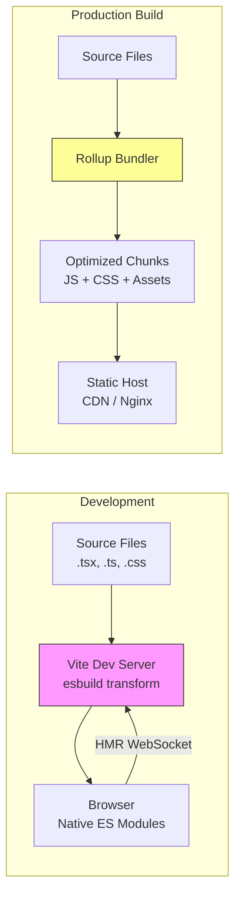

## Learning Objectives

- Scaffold a new React 19 project using Vite with the TypeScript template
- Configure TypeScript in strict mode for maximum type safety
- Set up ESLint and Prettier for consistent code quality
- Understand the Vite dev server, HMR, and build pipeline
- Organize files following a scalable project structure

## Prerequisites

- Node.js 18+ and npm/pnpm installed
- Basic familiarity with HTML, CSS, and JavaScript
- A code editor (VS Code recommended)

## Core Concepts

### Why Vite?

Vite (French for "fast") replaces Create React App as the standard way to scaffold React projects. Here's why:

| Feature | Create React App (legacy) | Vite |
|---------|--------------------------|------|
| Dev server start | 10-30 seconds | < 500ms |
| Hot Module Replacement | Slow, full reload | Instant, preserves state |
| Build tool | Webpack | Rollup (production) / esbuild (dev) |
| Config | Ejectable, complex | Simple vite.config.ts |
| Maintenance | Deprecated | Actively maintained |

Vite achieves this speed by serving source files as native ES modules during development. The browser does the bundling work, and only changed modules are re-compiled.

### Scaffolding the Project

```bash
npm create vite@latest my-app -- --template react-ts
cd my-app
npm install
npm run dev
```

This creates a project with React 19 and TypeScript pre-configured. Open `http://localhost:5173` in your browser.

**What's in the box:**

```
my-app/
├── index.html            # Entry point — Vite serves this directly
├── package.json
├── tsconfig.json          # TypeScript configuration
├── tsconfig.app.json      # App-specific TS config
├── tsconfig.node.json     # Node/Vite config TS settings
├── vite.config.ts         # Vite configuration
├── public/                # Static assets (copied as-is to dist/)
│   └── vite.svg
├── src/
│   ├── main.tsx           # React DOM root mount
│   ├── App.tsx            # Root component
│   ├── App.css
│   ├── index.css          # Global styles
│   └── vite-env.d.ts      # Vite type declarations
└── eslint.config.js       # ESLint flat config
```

### Configuring TypeScript Strict Mode

Open `tsconfig.app.json` and ensure strict mode is enabled:

```json
{
  "compilerOptions": {
    "target": "ES2020",
    "useDefineForClassFields": true,
    "lib": ["ES2020", "DOM", "DOM.Iterable"],
    "module": "ESNext",
    "skipLibCheck": true,

    "moduleResolution": "bundler",
    "allowImportingTsExtensions": true,
    "isolatedModules": true,
    "moduleDetection": "force",
    "noEmit": true,
    "jsx": "react-jsx",

    "strict": true,
    "noUnusedLocals": true,
    "noUnusedParameters": true,
    "noFallthroughCasesInSwitch": true,
    "noUncheckedIndexedAccess": true,

    "baseUrl": ".",
    "paths": {
      "@/*": ["./src/*"]
    }
  },
  "include": ["src"]
}
```

The `strict: true` flag enables all strict type-checking options. The `noUncheckedIndexedAccess` flag makes array/object access return `T | undefined`, catching a common bug category.

To make the `@/` path alias work with Vite, update `vite.config.ts`:

```typescript
import { defineConfig } from 'vite'
import react from '@vitejs/plugin-react'
import path from 'path'

export default defineConfig({
  plugins: [react()],
  resolve: {
    alias: {
      '@': path.resolve(__dirname, './src'),
    },
  },
})
```

### Setting Up ESLint and Prettier

```bash
npm install -D prettier eslint-config-prettier eslint-plugin-prettier
```

Create `.prettierrc`:

```json
{
  "semi": false,
  "singleQuote": true,
  "tabWidth": 2,
  "trailingComma": "all",
  "printWidth": 80
}
```

Update `eslint.config.js`:

```javascript
import js from '@eslint/js'
import globals from 'globals'
import reactHooks from 'eslint-plugin-react-hooks'
import reactRefresh from 'eslint-plugin-react-refresh'
import tseslint from 'typescript-eslint'
import prettier from 'eslint-config-prettier'

export default tseslint.config(
  { ignores: ['dist'] },
  {
    extends: [
      js.configs.recommended,
      ...tseslint.configs.strictTypeChecked,
      prettier,
    ],
    files: ['**/*.{ts,tsx}'],
    languageOptions: {
      ecmaVersion: 2020,
      globals: globals.browser,
      parserOptions: {
        project: ['./tsconfig.app.json'],
      },
    },
    plugins: {
      'react-hooks': reactHooks,
      'react-refresh': reactRefresh,
    },
    rules: {
      ...reactHooks.configs.recommended.rules,
      'react-refresh/only-export-components': [
        'warn',
        { allowConstantExport: true },
      ],
    },
  },
)
```

### Understanding the Dev Pipeline

**Development mode** (`npm run dev`):

1. Vite starts an HTTP server
2. `index.html` is served with a `<script type="module">` tag pointing to `src/main.tsx`
3. The browser requests modules as native ES imports
4. Vite transforms files on-demand (TypeScript → JavaScript, JSX → createElement)
5. HMR updates only the changed module, preserving React component state

**Production build** (`npm run build`):

1. Vite uses Rollup to bundle all modules into optimized chunks
2. Code splitting happens automatically at dynamic `import()` boundaries
3. CSS is extracted and minified
4. Assets get content hashes for cache busting
5. Output goes to `dist/` — ready to serve from any static host

```bash
npm run build
npm run preview  # Preview the production build locally
```

### Understanding main.tsx

The entry point mounts the React application:

```tsx
import { StrictMode } from 'react'
import { createRoot } from 'react-dom/client'
import App from './App'
import './index.css'

const rootElement = document.getElementById('root')
if (!rootElement) throw new Error('Root element not found')

createRoot(rootElement).render(
  <StrictMode>
    <App />
  </StrictMode>,
)
```

`StrictMode` helps catch common mistakes during development:
- Detects unexpected side effects by double-invoking certain functions
- Warns about deprecated lifecycle methods
- Highlights potential problems with the legacy string ref API

### Recommended Project Structure

For a scalable application, organize your `src/` directory:

```
src/
├── main.tsx
├── App.tsx
├── components/           # Shared/reusable components
│   ├── ui/               # Base UI components (Button, Card, Input)
│   │   ├── Button.tsx
│   │   └── Card.tsx
│   └── layout/           # Layout components (Header, Sidebar)
│       ├── Header.tsx
│       └── Sidebar.tsx
├── pages/                # Route-level components
│   ├── Home.tsx
│   └── Dashboard.tsx
├── hooks/                # Custom React hooks
│   └── useLocalStorage.ts
├── lib/                  # Utility functions, API clients
│   ├── api.ts
│   └── utils.ts
├── types/                # Shared TypeScript types
│   └── index.ts
├── stores/               # State management (Zustand stores)
│   └── useAuthStore.ts
└── styles/               # Global styles, theme
    └── globals.css
```

## Diagram



## Hands-On Exercise

### Exercise: Create a New React Project

**Step 1: Scaffold and configure**

```bash
npm create vite@latest learning-hub -- --template react-ts
cd learning-hub
npm install
```

**Step 2: Enable strict TypeScript** — Edit `tsconfig.app.json` to add `noUncheckedIndexedAccess: true` and path aliases.

**Step 3: Install and configure Prettier**

```bash
npm install -D prettier eslint-config-prettier
```

**Step 4: Create your first component**

Create `src/components/WelcomeBanner.tsx`:

```tsx
interface WelcomeBannerProps {
  username: string
  courseName: string
  progress: number
}

export function WelcomeBanner({ username, courseName, progress }: WelcomeBannerProps) {
  return (
    <div style={{
      padding: '2rem',
      borderRadius: '12px',
      background: 'linear-gradient(135deg, #667eea 0%, #764ba2 100%)',
      color: 'white',
    }}>
      <h1>Welcome back, {username}!</h1>
      <p>Continue learning: {courseName}</p>
      <div style={{
        background: 'rgba(255,255,255,0.3)',
        borderRadius: '8px',
        height: '8px',
        marginTop: '1rem',
      }}>
        <div style={{
          background: 'white',
          borderRadius: '8px',
          height: '100%',
          width: `${progress}%`,
          transition: 'width 0.3s ease',
        }} />
      </div>
      <p style={{ marginTop: '0.5rem', fontSize: '0.9rem' }}>
        {progress}% complete
      </p>
    </div>
  )
}
```

**Step 5: Use it in App.tsx**

```tsx
import { WelcomeBanner } from './components/WelcomeBanner'

function App() {
  return (
    <div style={{ maxWidth: '600px', margin: '2rem auto', padding: '0 1rem' }}>
      <WelcomeBanner
        username="Alice"
        courseName="LLM & AI Engineering"
        progress={42}
      />
    </div>
  )
}

export default App
```

**Step 6: Run and verify**

```bash
npm run dev
```

**Challenge:** Add an `estimatedMinutes` prop and display "~X hours remaining" computed from the progress percentage and total estimated time.

## Key Takeaways

- Vite replaces Create React App with dramatically faster dev server startup and HMR
- TypeScript strict mode catches entire categories of bugs at compile time — always enable it
- Path aliases (`@/`) eliminate fragile relative imports like `../../../components`
- ESLint + Prettier together enforce both logic correctness and formatting consistency
- The production build uses Rollup for tree-shaking, code splitting, and optimization
- A well-organized project structure scales from small apps to large codebases

## External Resources

- [Vite Documentation](https://vitejs.dev/) — Official guides, configuration reference, and plugin ecosystem
- [React Documentation](https://react.dev/) — The official React docs with interactive examples
- [TypeScript Handbook](https://www.typescriptlang.org/docs/handbook/) — Complete TypeScript reference
- [ESLint Getting Started](https://eslint.org/docs/latest/use/getting-started) — Configuration guide for the new flat config
- [Vite + React Template](https://github.com/vitejs/vite/tree/main/packages/create-vite/template-react-ts) — Source template used by create-vite

## Quiz

See the quiz.json file for this module's quiz questions.
