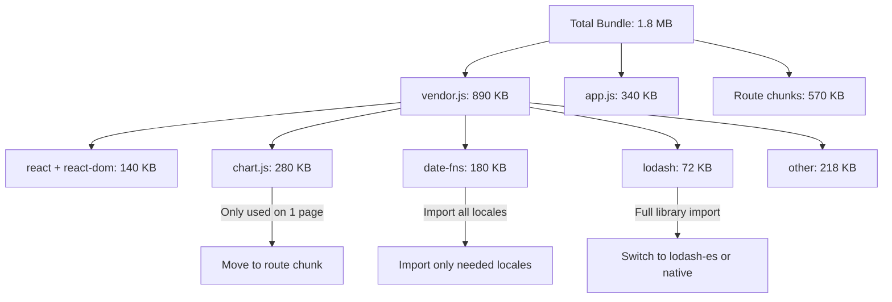
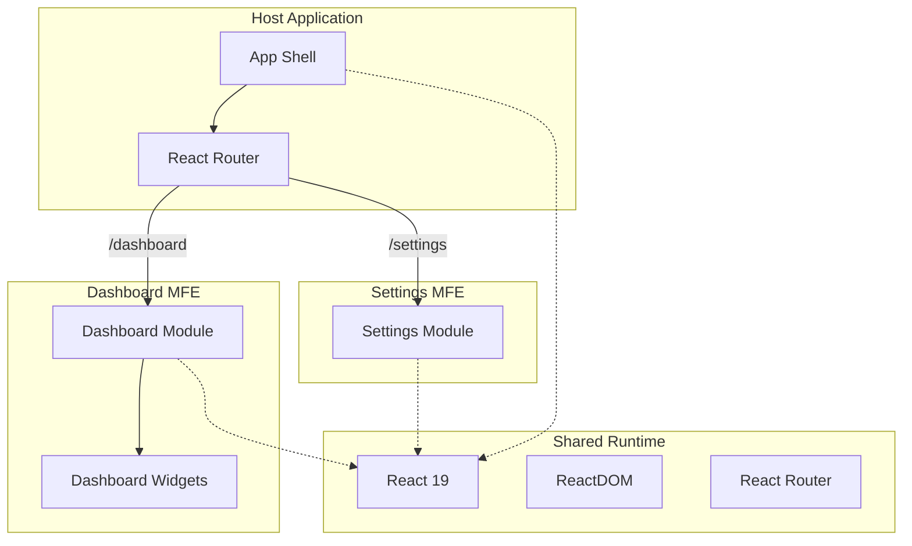

## Learning Objectives

- Analyze bundle composition to identify bloated dependencies
- Configure tree shaking for dead code elimination
- Implement dynamic imports beyond route-level splitting
- Set up Module Federation for micro-frontend architectures
- Offload heavy computation to Web Workers without blocking the UI

## Prerequisites

- Code splitting with React.lazy and Suspense
- Vite build configuration basics
- Understanding of JavaScript modules (ESM vs CJS)

## Core Concepts

### Understanding Your Bundle

Before optimizing, understand what's in your bundle:

```bash
npm install -D rollup-plugin-visualizer source-map-explorer
```

```typescript
// vite.config.ts
import { defineConfig } from "vite";
import react from "@vitejs/plugin-react";
import { visualizer } from "rollup-plugin-visualizer";

export default defineConfig({
  plugins: [
    react(),
    visualizer({
      open: true,
      filename: "dist/bundle-stats.html",
      gzipSize: true,
      brotliSize: true,
    }),
  ],
});
```



### Tree Shaking

Tree shaking eliminates unused exports from the final bundle. It requires ES modules (ESM):

```typescript
// Bad — imports entire library (no tree shaking for CJS)
import _ from "lodash";
const sorted = _.sortBy(users, "name");

// Good — imports only what's used (tree-shakeable)
import { sortBy } from "lodash-es";
const sorted = sortBy(users, "name");

// Best — native JavaScript (zero bundle cost)
const sorted = [...users].sort((a, b) => a.name.localeCompare(b.name));
```

#### Configuring Side Effects

Tell bundlers which files are safe to tree-shake:

```json
// package.json
{
  "sideEffects": [
    "*.css",
    "*.scss",
    "./src/polyfills.ts"
  ]
}
```

Files not listed in `sideEffects` are eligible for removal if their exports are unused.

#### Icon Libraries

A common bundle bloat source:

```typescript
// Bad — imports ALL icons (300+ KB)
import { FaHome, FaUser } from "react-icons/fa";

// Good — import from specific module
import { FaHome } from "react-icons/fa/FaHome";
import { FaUser } from "react-icons/fa/FaUser";

// Best — use lucide-react (ESM, tree-shakeable by default)
import { Home, User } from "lucide-react";
```

### Dynamic Imports Beyond Routes

Split expensive features that aren't always needed:

```typescript
// Heavy chart library — only load when the user opens the analytics tab
const ChartModule = lazy(() => import("./components/AnalyticsChart"));

// PDF generation — only load when the user clicks "Export"
async function handleExportPDF() {
  const { generatePDF } = await import("./utils/pdf-generator");
  const blob = await generatePDF(reportData);
  downloadBlob(blob, "report.pdf");
}

// Markdown editor — only load when the user enters edit mode
const MarkdownEditor = lazy(() => import("./components/MarkdownEditor"));

function ArticlePage({ article }: { article: Article }) {
  const [isEditing, setIsEditing] = useState(false);

  return (
    <article>
      {isEditing ? (
        <Suspense fallback={<EditorSkeleton />}>
          <MarkdownEditor
            content={article.content}
            onSave={(content) => { /* save */ }}
          />
        </Suspense>
      ) : (
        <div>
          <RenderedMarkdown content={article.content} />
          <button onClick={() => setIsEditing(true)}>Edit</button>
        </div>
      )}
    </article>
  );
}
```

### Manual Chunk Splitting

Control how Vite splits vendor code:

```typescript
// vite.config.ts
export default defineConfig({
  build: {
    rollupOptions: {
      output: {
        manualChunks(id) {
          if (id.includes("node_modules")) {
            if (id.includes("react") || id.includes("react-dom")) {
              return "react-vendor";
            }
            if (id.includes("@tanstack")) {
              return "tanstack";
            }
            if (id.includes("chart.js") || id.includes("d3")) {
              return "charts";
            }
            return "vendor";
          }
        },
      },
    },
    chunkSizeWarningLimit: 200,
  },
});
```

### Module Federation for Micro-Frontends

Share React and other dependencies across independently deployed applications:

```typescript
// vite.config.ts for the host app
import federation from "@originjs/vite-plugin-federation";

export default defineConfig({
  plugins: [
    react(),
    federation({
      name: "host-app",
      remotes: {
        dashboardApp: "http://localhost:3001/assets/remoteEntry.js",
        settingsApp: "http://localhost:3002/assets/remoteEntry.js",
      },
      shared: ["react", "react-dom", "react-router"],
    }),
  ],
});

// vite.config.ts for the dashboard micro-frontend
export default defineConfig({
  plugins: [
    react(),
    federation({
      name: "dashboard-app",
      filename: "remoteEntry.js",
      exposes: {
        "./Dashboard": "./src/Dashboard",
        "./AnalyticsWidget": "./src/components/AnalyticsWidget",
      },
      shared: ["react", "react-dom", "react-router"],
    }),
  ],
});
```

```typescript
// In the host app — consuming the remote module
const RemoteDashboard = lazy(() => import("dashboardApp/Dashboard"));

function App() {
  return (
    <ErrorBoundary fallback={<p>Dashboard unavailable</p>}>
      <Suspense fallback={<DashboardSkeleton />}>
        <RemoteDashboard />
      </Suspense>
    </ErrorBoundary>
  );
}
```



### Web Workers for Heavy Computation

Move CPU-intensive work off the main thread:

```typescript
// workers/data-processor.worker.ts
self.onmessage = (event: MessageEvent<{ type: string; data: unknown }>) => {
  const { type, data } = event.data;

  switch (type) {
    case "SORT_AND_FILTER": {
      const { items, sortField, sortDirection, filters } = data as SortFilterPayload;
      let result = [...items];

      for (const [key, value] of Object.entries(filters)) {
        result = result.filter((item) =>
          String(item[key]).toLowerCase().includes(String(value).toLowerCase())
        );
      }

      result.sort((a, b) => {
        const cmp = String(a[sortField]).localeCompare(String(b[sortField]));
        return sortDirection === "asc" ? cmp : -cmp;
      });

      self.postMessage({ type: "RESULT", data: result });
      break;
    }

    case "AGGREGATE": {
      const { records, groupBy, metrics } = data as AggregatePayload;
      const grouped = new Map<string, Record[]>();

      for (const record of records) {
        const key = String(record[groupBy]);
        if (!grouped.has(key)) grouped.set(key, []);
        grouped.get(key)!.push(record);
      }

      const aggregated = Array.from(grouped.entries()).map(([key, group]) => ({
        key,
        count: group.length,
        ...Object.fromEntries(
          metrics.map((metric) => [
            metric,
            group.reduce((sum, r) => sum + Number(r[metric]), 0) / group.length,
          ])
        ),
      }));

      self.postMessage({ type: "RESULT", data: aggregated });
      break;
    }
  }
};
```

```typescript
// hooks/useWorker.ts
function useWorker<TInput, TOutput>(
  workerFactory: () => Worker
): {
  execute: (input: TInput) => Promise<TOutput>;
  isProcessing: boolean;
} {
  const workerRef = useRef<Worker | null>(null);
  const [isProcessing, setIsProcessing] = useState(false);

  useEffect(() => {
    workerRef.current = workerFactory();
    return () => workerRef.current?.terminate();
  }, [workerFactory]);

  const execute = useCallback(
    (input: TInput): Promise<TOutput> => {
      return new Promise((resolve, reject) => {
        if (!workerRef.current) {
          reject(new Error("Worker not initialized"));
          return;
        }

        setIsProcessing(true);

        workerRef.current.onmessage = (event: MessageEvent<TOutput>) => {
          setIsProcessing(false);
          resolve(event.data);
        };

        workerRef.current.onerror = (error) => {
          setIsProcessing(false);
          reject(error);
        };

        workerRef.current.postMessage(input);
      });
    },
    []
  );

  return { execute, isProcessing };
}

// Usage
function DataExplorer({ records }: { records: Record[] }) {
  const { execute, isProcessing } = useWorker<SortFilterPayload, Record[]>(
    () => new Worker(new URL("../workers/data-processor.worker.ts", import.meta.url), { type: "module" })
  );

  const handleSort = async (field: string) => {
    const sorted = await execute({
      type: "SORT_AND_FILTER",
      data: { items: records, sortField: field, sortDirection: "asc", filters: {} },
    });
    setDisplayedRecords(sorted);
  };

  return (
    <div className={isProcessing ? "opacity-50" : ""}>
      {/* table UI */}
    </div>
  );
}
```

## Performance Budget

Set limits and enforce them in CI:

```typescript
// vite.config.ts
export default defineConfig({
  build: {
    chunkSizeWarningLimit: 200, // KB
    rollupOptions: {
      output: {
        manualChunks: { /* ... */ },
      },
    },
  },
});
```

```yaml
# .github/workflows/bundle-check.yml
- name: Check bundle size
  run: |
    npm run build
    MAX_SIZE=250000 # 250KB gzipped
    ACTUAL=$(gzip -c dist/assets/index-*.js | wc -c)
    if [ "$ACTUAL" -gt "$MAX_SIZE" ]; then
      echo "Bundle too large: ${ACTUAL} bytes (max: ${MAX_SIZE})"
      exit 1
    fi
```

## Best Practices

1. **Analyze before optimizing** — `rollup-plugin-visualizer` reveals the biggest opportunities
2. **Use ESM libraries** — tree shaking only works with ES module imports
3. **Dynamic import heavy features** — chart libraries, PDF generators, rich text editors
4. **Set performance budgets** — fail CI if bundles exceed limits
5. **Separate vendor chunks** — `react` changes rarely; cache it separately
6. **Profile with throttled CPU** — test on low-end devices, not your dev machine

## Anti-Patterns to Avoid

- **Importing entire utility libraries** — `import _ from "lodash"` pulls in 70KB
- **CSS-in-JS in the critical path** — runtime CSS generation adds to initial JS payload
- **Bundling polyfills for modern browsers** — use `browserslist` to target only what you support
- **Module Federation without error boundaries** — remote modules can fail to load

## Hands-On Exercise

### Optimize a Real Application Bundle

1. Run `npm run build` and analyze the output with `rollup-plugin-visualizer`
2. Identify the top 3 largest dependencies and find smaller alternatives or lazy-load them
3. Replace `lodash` imports with `lodash-es` or native JavaScript
4. Configure `manualChunks` to separate vendor, UI library, and chart library
5. Move a CPU-heavy computation (sorting 50K records) to a Web Worker
6. Set a 200KB budget for the initial JS bundle and add a CI check

## Key Takeaways

- Bundle analysis is the first step — you can't optimize what you don't measure
- Tree shaking eliminates unused code but requires ESM imports to work
- Dynamic imports push heavy features out of the critical path
- Module Federation enables independent deployment of application features
- Web Workers keep heavy computation off the main thread for smooth interactions

## External Resources

- [Vite: Build Optimizations](https://vite.dev/guide/build.html)
- [Rollup Plugin Visualizer](https://github.com/btd/rollup-plugin-visualizer)
- [web.dev: Reduce JavaScript Payloads](https://web.dev/articles/reduce-javascript-payloads-with-code-splitting)
- [Module Federation Documentation](https://module-federation.io/)
- [Using Web Workers with Vite](https://vite.dev/guide/features.html#web-workers)
