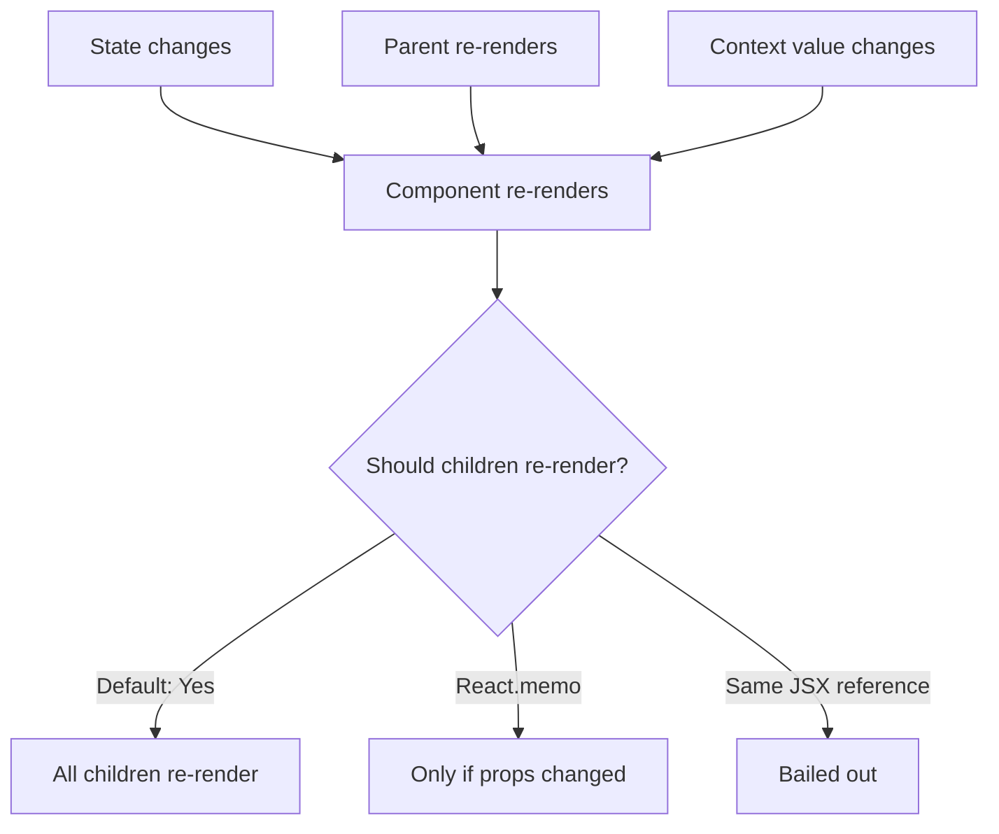
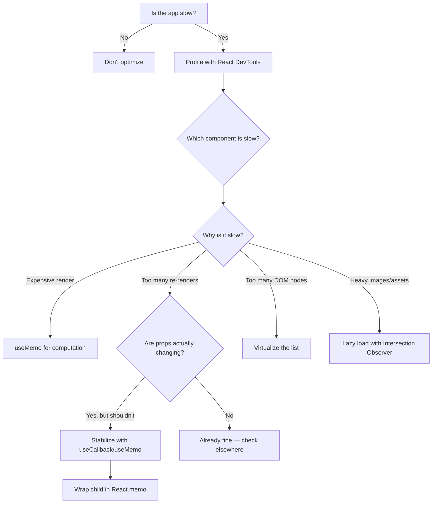

## Learning Objectives

- Understand React's rendering model — when and why components re-render
- Apply React.memo, useMemo, and useCallback with precision (not everywhere)
- Use the React Profiler to identify real performance bottlenecks
- Integrate why-did-you-render to catch unnecessary re-renders in development
- Know when optimization is premature and when it's essential

## Prerequisites

- Deep understanding of React hooks and component lifecycle
- Familiarity with JavaScript closures and reference equality
- Basic awareness of browser performance tools

## Core Concepts

### When Does React Re-Render?



A component re-renders when:
1. Its own state changes (`useState`, `useReducer`)
2. Its parent re-renders (regardless of whether props changed)
3. A context value it consumes changes

**Critical insight:** React re-renders are usually fast. The problem isn't re-rendering — it's re-rendering **expensive** components unnecessarily.

### Measuring Before Optimizing

Never optimize without measuring. Use the React Profiler:

```typescript
import { Profiler, type ProfilerOnRenderCallback } from "react";

const onRender: ProfilerOnRenderCallback = (
  id,
  phase,
  actualDuration,
  baseDuration,
  startTime,
  commitTime
) => {
  if (actualDuration > 16) {
    console.warn(`Slow render: ${id} took ${actualDuration.toFixed(1)}ms (${phase})`);
  }
};

function App() {
  return (
    <Profiler id="Dashboard" onRender={onRender}>
      <Dashboard />
    </Profiler>
  );
}
```

### React.memo: Skip Re-Renders When Props Haven't Changed

```typescript
interface UserCardProps {
  user: User;
  onSelect: (id: string) => void;
}

const UserCard = memo(function UserCard({ user, onSelect }: UserCardProps) {
  return (
    <div
      onClick={() => onSelect(user.id)}
      className="rounded border p-4 hover:bg-gray-50"
    >
      
      <h3 className="font-medium">{user.name}</h3>
      <p className="text-sm text-gray-600">{user.email}</p>
    </div>
  );
});
```

**When `React.memo` helps:**
- Component renders frequently but props rarely change
- Component is expensive to render (large DOM trees, complex calculations)
- Component is a list item rendered many times

**When `React.memo` hurts:**
- Props change on every render anyway (new objects, inline functions)
- Component is cheap to render — memo's comparison overhead isn't worth it

### useMemo: Cache Expensive Computations

```typescript
function AnalyticsDashboard({ transactions }: { transactions: Transaction[] }) {
  // Without useMemo: recalculates on every render (even unrelated state changes)
  // With useMemo: recalculates only when transactions change
  const analytics = useMemo(() => {
    const byMonth = groupBy(transactions, (t) => t.date.slice(0, 7));
    const revenue = Object.entries(byMonth).map(([month, txns]) => ({
      month,
      total: txns.reduce((sum, t) => sum + t.amount, 0),
      count: txns.length,
      average: txns.reduce((sum, t) => sum + t.amount, 0) / txns.length,
    }));
    const topProducts = getTopProducts(transactions, 10);
    const churnRate = calculateChurnRate(transactions);

    return { revenue, topProducts, churnRate };
  }, [transactions]);

  return (
    <div>
      <RevenueChart data={analytics.revenue} />
      <TopProductsTable products={analytics.topProducts} />
      <ChurnMetric rate={analytics.churnRate} />
    </div>
  );
}
```

**When to use useMemo:**
- Filtering/sorting large arrays (1000+ items)
- Complex mathematical computations
- Creating derived data structures
- Stabilizing object references for React.memo children

**When NOT to use useMemo:**
- Simple expressions (`a + b`, string concatenation)
- Creating small arrays or objects that are cheap to allocate
- Values used only in event handlers (not during render)

### useCallback: Stabilize Function References

```typescript
function UserList({ users }: { users: User[] }) {
  const [selectedId, setSelectedId] = useState<string | null>(null);

  // Without useCallback: new function on every render → UserCard re-renders
  // With useCallback: same function reference → UserCard skips re-render
  const handleSelect = useCallback((id: string) => {
    setSelectedId(id);
  }, []);

  const handleDelete = useCallback(async (id: string) => {
    await fetch(`/api/users/${id}`, { method: "DELETE" });
    // Trigger refetch
  }, []);

  return (
    <div className="grid grid-cols-3 gap-4">
      {users.map((user) => (
        <UserCard
          key={user.id}
          user={user}
          onSelect={handleSelect}
          onDelete={handleDelete}
        />
      ))}
    </div>
  );
}
```

**The key rule:** `useCallback` only helps when the receiving component is wrapped in `React.memo`. Without memo, the child re-renders regardless.

### The Optimization Decision Tree



### why-did-you-render

Automatically detect unnecessary re-renders in development:

```bash
npm install -D @welldone-software/why-did-you-render
```

```typescript
// src/wdyr.ts — import BEFORE React
import React from "react";

if (import.meta.env.DEV) {
  const { default: whyDidYouRender } = await import(
    "@welldone-software/why-did-you-render"
  );
  whyDidYouRender(React, {
    trackAllPureComponents: true,
    trackHooks: true,
  });
}
```

```typescript
// In main.tsx, import wdyr first
import "./wdyr";
import React from "react";
import ReactDOM from "react-dom/client";
```

Tag specific components to track:

```typescript
function ExpensiveList({ items }: { items: Item[] }) {
  // component body
}

ExpensiveList.whyDidYouRender = true;
```

### Advanced: Composition to Avoid Re-Renders

Sometimes restructuring eliminates the need for memoization entirely:

```typescript
// Problem: SearchPage re-renders on every keystroke, causing ExpensiveChart to re-render
function SearchPage() {
  const [query, setQuery] = useState("");
  return (
    <div>
      <input value={query} onChange={(e) => setQuery(e.target.value)} />
      <ExpensiveChart /> {/* Re-renders on every keystroke! */}
      <SearchResults query={query} />
    </div>
  );
}

// Solution: Extract the stateful part
function SearchInput({ onSearch }: { onSearch: (q: string) => void }) {
  const [query, setQuery] = useState("");
  return (
    <>
      <input value={query} onChange={(e) => { setQuery(e.target.value); onSearch(e.target.value); }} />
      <SearchResults query={query} />
    </>
  );
}

function SearchPage() {
  return (
    <div>
      <SearchInput onSearch={handleSearch} />
      <ExpensiveChart /> {/* No longer re-renders on keystrokes */}
    </div>
  );
}
```

### Children as Stable References

```typescript
// The children prop doesn't change, so SlowComponent won't re-render
function ScrollTracker({ children }: { children: ReactNode }) {
  const [scrollY, setScrollY] = useState(0);

  useEffect(() => {
    const handler = () => setScrollY(window.scrollY);
    window.addEventListener("scroll", handler, { passive: true });
    return () => window.removeEventListener("scroll", handler);
  }, []);

  return (
    <div>
      <ScrollIndicator position={scrollY} />
      {children} {/* Stable reference — children don't re-render */}
    </div>
  );
}
```

## Best Practices

1. **Measure first** — profile before optimizing; intuition about performance is usually wrong
2. **Composition over memoization** — restructure component trees to isolate state
3. **`React.memo` + `useCallback` together** — one without the other is pointless
4. **Memoize derived data, not primitives** — `useMemo` for arrays and objects, not for `a + b`
5. **Use React Compiler** — React 19's compiler auto-memoizes; manual memo will become less necessary
6. **Avoid premature optimization** — most components render in < 1ms; focus on the slow ones

## Anti-Patterns to Avoid

- **Memoizing everything** — adds complexity and memory overhead for zero benefit
- **useMemo for state initialization** — use `useState(() => expensive())` instead
- **useCallback without React.memo** — stabilizing a function nobody is comparing
- **Inline objects in JSX** — `style={{ color: 'red' }}` creates a new object every render
- **Measuring in development** — always profile production builds; dev mode is 10x slower

## Hands-On Exercise

### Performance Audit

1. Create a list of 10,000 items with search, sort, and filter
2. Profile the unoptimized version — identify the bottlenecks
3. Apply `React.memo` to list items and measure the improvement
4. Use `useMemo` for filtered/sorted results and measure
5. Refactor with composition to isolate the search input state
6. Set up `why-did-you-render` and fix all flagged issues
7. Compare initial vs. final: re-render count and frame time

## Key Takeaways

- React re-renders are fast by default — optimize only what the profiler shows is slow
- Composition (moving state down, lifting content up) is more effective than memoization
- `React.memo` + `useCallback` work together — one alone is insufficient
- `useMemo` prevents redundant expensive calculations, not trivial ones
- Always measure with production builds — development mode performance is misleading

## External Resources

- [React docs: Optimizing Performance](https://react.dev/learn/render-and-commit)
- [Dan Abramov: Before You memo()](https://overreacted.io/before-you-memo/)
- [React Profiler DevTools](https://react.dev/learn/react-developer-tools)
- [why-did-you-render](https://github.com/welldone-software/why-did-you-render)
- [React Compiler (React Forget)](https://react.dev/learn/react-compiler)
