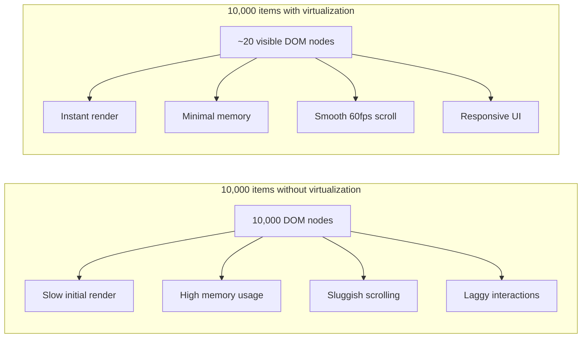

## Learning Objectives

- Understand why rendering thousands of DOM nodes degrades performance
- Implement list virtualization with react-window and TanStack Virtual
- Build infinite scrolling with Intersection Observer and TanStack Query
- Lazy load images with native loading attribute and Intersection Observer
- Combine virtualization with infinite fetching for large datasets

## Prerequisites

- React performance fundamentals (memo, useMemo, useCallback)
- TanStack Query for data fetching
- Basic understanding of the DOM and browser rendering pipeline

## Core Concepts

### The Problem with Long Lists



Virtualization renders only the items visible in the viewport, plus a small overscan buffer. As the user scrolls, items entering the viewport are mounted and items leaving are unmounted.

### react-window: Simple Virtualization

```bash
npm install react-window
npm install -D @types/react-window
```

#### Fixed-Size List

```typescript
import { FixedSizeList } from "react-window";

interface User {
  id: string;
  name: string;
  email: string;
  avatar: string;
}

interface RowProps {
  index: number;
  style: React.CSSProperties;
  data: User[];
}

const UserRow = memo(function UserRow({ index, style, data }: RowProps) {
  const user = data[index];
  return (
    <div style={style} className="flex items-center gap-3 border-b px-4">
      
      <div>
        <p className="font-medium">{user.name}</p>
        <p className="text-sm text-gray-500">{user.email}</p>
      </div>
    </div>
  );
});

function UserList({ users }: { users: User[] }) {
  return (
    <FixedSizeList
      height={600}
      width="100%"
      itemCount={users.length}
      itemSize={64}
      itemData={users}
      overscanCount={5}
    >
      {UserRow}
    </FixedSizeList>
  );
}
```

#### Variable-Size List

```typescript
import { VariableSizeList } from "react-window";

function MessageList({ messages }: { messages: Message[] }) {
  const listRef = useRef<VariableSizeList>(null);

  const getItemSize = useCallback(
    (index: number) => {
      const message = messages[index];
      const lineCount = Math.ceil(message.text.length / 60);
      return 40 + lineCount * 20;
    },
    [messages]
  );

  useEffect(() => {
    listRef.current?.resetAfterIndex(0);
  }, [messages]);

  return (
    <VariableSizeList
      ref={listRef}
      height={500}
      width="100%"
      itemCount={messages.length}
      itemSize={getItemSize}
      overscanCount={3}
    >
      {({ index, style }) => (
        <div style={style} className="border-b px-4 py-2">
          <p className="text-xs text-gray-400">{messages[index].sender}</p>
          <p>{messages[index].text}</p>
        </div>
      )}
    </VariableSizeList>
  );
}
```

### TanStack Virtual: Framework-Agnostic Virtualization

```bash
npm install @tanstack/react-virtual
```

TanStack Virtual provides the virtualization logic without rendering — you control the DOM:

```typescript
import { useVirtualizer } from "@tanstack/react-virtual";

function VirtualTable({ rows }: { rows: DataRow[] }) {
  const parentRef = useRef<HTMLDivElement>(null);

  const virtualizer = useVirtualizer({
    count: rows.length,
    getScrollElement: () => parentRef.current,
    estimateSize: () => 48,
    overscan: 5,
  });

  return (
    <div ref={parentRef} className="h-[600px] overflow-auto">
      <div
        style={{ height: `${virtualizer.getTotalSize()}px`, position: "relative" }}
      >
        {virtualizer.getVirtualItems().map((virtualRow) => {
          const row = rows[virtualRow.index];
          return (
            <div
              key={virtualRow.key}
              style={{
                position: "absolute",
                top: 0,
                left: 0,
                width: "100%",
                height: `${virtualRow.size}px`,
                transform: `translateY(${virtualRow.start}px)`,
              }}
              className="flex items-center border-b px-4"
            >
              <span className="w-24 font-mono text-sm text-gray-400">
                {virtualRow.index}
              </span>
              <span className="flex-1">{row.name}</span>
              <span className="w-32 text-right">{row.value}</span>
            </div>
          );
        })}
      </div>
    </div>
  );
}
```

#### Virtual Grid

```typescript
function ImageGrid({ images }: { images: ImageItem[] }) {
  const parentRef = useRef<HTMLDivElement>(null);
  const columns = 4;

  const rowVirtualizer = useVirtualizer({
    count: Math.ceil(images.length / columns),
    getScrollElement: () => parentRef.current,
    estimateSize: () => 240,
    overscan: 2,
  });

  const columnVirtualizer = useVirtualizer({
    horizontal: true,
    count: columns,
    getScrollElement: () => parentRef.current,
    estimateSize: () => 240,
    overscan: 1,
  });

  return (
    <div ref={parentRef} className="h-[600px] overflow-auto">
      <div style={{ height: `${rowVirtualizer.getTotalSize()}px`, position: "relative" }}>
        {rowVirtualizer.getVirtualItems().map((virtualRow) => (
          <div key={virtualRow.key}>
            {columnVirtualizer.getVirtualItems().map((virtualCol) => {
              const index = virtualRow.index * columns + virtualCol.index;
              if (index >= images.length) return null;
              const image = images[index];

              return (
                <div
                  key={virtualCol.key}
                  style={{
                    position: "absolute",
                    top: 0,
                    left: 0,
                    width: `${virtualCol.size}px`,
                    height: `${virtualRow.size}px`,
                    transform: `translateX(${virtualCol.start}px) translateY(${virtualRow.start}px)`,
                  }}
                  className="p-2"
                >
                  
                </div>
              );
            })}
          </div>
        ))}
      </div>
    </div>
  );
}
```

### Infinite Scrolling with Intersection Observer

```typescript
function useIntersection(
  ref: React.RefObject<HTMLElement | null>,
  options?: IntersectionObserverInit
) {
  const [isIntersecting, setIsIntersecting] = useState(false);

  useEffect(() => {
    const element = ref.current;
    if (!element) return;

    const observer = new IntersectionObserver(([entry]) => {
      setIsIntersecting(entry.isIntersecting);
    }, options);

    observer.observe(element);
    return () => observer.disconnect();
  }, [ref, options?.threshold, options?.rootMargin]);

  return isIntersecting;
}

function InfiniteUserList() {
  const { data, fetchNextPage, hasNextPage, isFetchingNextPage } = useInfiniteQuery({
    queryKey: ["users"],
    queryFn: ({ pageParam }) =>
      fetch(`/api/users?cursor=${pageParam ?? ""}&limit=50`).then((r) => r.json()),
    initialPageParam: null as string | null,
    getNextPageParam: (lastPage) => lastPage.nextCursor,
  });

  const loadMoreRef = useRef<HTMLDivElement>(null);
  const isNearEnd = useIntersection(loadMoreRef, { rootMargin: "400px" });

  useEffect(() => {
    if (isNearEnd && hasNextPage && !isFetchingNextPage) {
      fetchNextPage();
    }
  }, [isNearEnd, hasNextPage, isFetchingNextPage, fetchNextPage]);

  const allUsers = data?.pages.flatMap((p) => p.users) ?? [];

  return (
    <div>
      {allUsers.map((user) => (
        <UserCard key={user.id} user={user} />
      ))}
      <div ref={loadMoreRef} className="py-4 text-center">
        {isFetchingNextPage && <Spinner />}
        {!hasNextPage && <p className="text-gray-500">No more users</p>}
      </div>
    </div>
  );
}
```

### Combining Virtualization + Infinite Query

```typescript
function VirtualInfiniteList() {
  const { data, fetchNextPage, hasNextPage, isFetchingNextPage } = useInfiniteQuery({
    queryKey: ["items"],
    queryFn: ({ pageParam }) =>
      fetch(`/api/items?cursor=${pageParam ?? ""}&limit=100`).then((r) => r.json()),
    initialPageParam: null as string | null,
    getNextPageParam: (lastPage) => lastPage.nextCursor,
  });

  const allItems = data?.pages.flatMap((p) => p.items) ?? [];
  const parentRef = useRef<HTMLDivElement>(null);

  const virtualizer = useVirtualizer({
    count: hasNextPage ? allItems.length + 1 : allItems.length,
    getScrollElement: () => parentRef.current,
    estimateSize: () => 64,
    overscan: 10,
  });

  useEffect(() => {
    const lastItem = virtualizer.getVirtualItems().at(-1);
    if (!lastItem) return;

    if (lastItem.index >= allItems.length - 1 && hasNextPage && !isFetchingNextPage) {
      fetchNextPage();
    }
  }, [virtualizer.getVirtualItems(), hasNextPage, isFetchingNextPage, allItems.length, fetchNextPage]);

  return (
    <div ref={parentRef} className="h-[600px] overflow-auto">
      <div style={{ height: `${virtualizer.getTotalSize()}px`, position: "relative" }}>
        {virtualizer.getVirtualItems().map((virtualRow) => {
          const isLoaderRow = virtualRow.index >= allItems.length;
          const item = allItems[virtualRow.index];

          return (
            <div
              key={virtualRow.key}
              style={{
                position: "absolute",
                top: 0,
                left: 0,
                width: "100%",
                height: `${virtualRow.size}px`,
                transform: `translateY(${virtualRow.start}px)`,
              }}
              className="flex items-center border-b px-4"
            >
              {isLoaderRow ? (
                <Spinner size="sm" />
              ) : (
                <span>{item.name}</span>
              )}
            </div>
          );
        })}
      </div>
    </div>
  );
}
```

### Lazy Loading Images

```typescript
function LazyImage({
  src,
  alt,
  className,
  placeholderSrc,
}: {
  src: string;
  alt: string;
  className?: string;
  placeholderSrc?: string;
}) {
  const [isLoaded, setIsLoaded] = useState(false);
  const [error, setError] = useState(false);

  return (
    <div className={`relative overflow-hidden ${className}`}>
      {!isLoaded && !error && (
        <div className="absolute inset-0 animate-pulse bg-gray-200" />
      )}
      {error ? (
        <div className="flex h-full items-center justify-center bg-gray-100 text-gray-400">
          Failed to load
        </div>
      ) : (
         setIsLoaded(true)}
          onError={() => setError(true)}
          className={`h-full w-full object-cover transition-opacity ${
            isLoaded ? "opacity-100" : "opacity-0"
          }`}
        />
      )}
    </div>
  );
}
```

## Best Practices

1. **Virtualize at 100+ items** — below that, the DOM handles it fine
2. **Overscan 3–5 items** — prevents flashing during fast scrolling
3. **Memoize row components** — `React.memo` prevents re-rendering visible rows
4. **Use `loading="lazy"` on images** — native browser lazy loading is zero-JS
5. **Combine virtualization with pagination** — don't load 100K items into memory
6. **Measure scroll performance** — use Chrome DevTools Performance tab at 4x CPU throttling

## Anti-Patterns to Avoid

- **Virtualizing small lists** — the overhead isn't worth it for 50 items
- **Dynamic heights without measurement** — use `VariableSizeList` or TanStack Virtual's `measureElement`
- **Infinite scroll without a stop** — always communicate when there's no more data
- **Skipping the loading indicator** — users need feedback during data fetching
- **Forgetting keyboard navigation** — virtualized lists must remain accessible

## Hands-On Exercise

### Build a Virtual Data Explorer

1. Generate a mock dataset of 100,000 records with names, dates, and values
2. Implement a virtualized table with TanStack Virtual that renders only visible rows
3. Add sorting by clicking column headers (sort the full dataset, re-virtualize)
4. Add search filtering with `useDeferredValue` so typing stays smooth
5. Implement infinite loading: start with 1,000 items, fetch 500 more as the user scrolls
6. Add a virtual image grid with lazy loading and placeholder shimmer

## Key Takeaways

- Virtualization renders only visible items, reducing DOM nodes from thousands to dozens
- react-window is simple and battle-tested; TanStack Virtual offers more control
- Infinite scrolling with Intersection Observer loads data just before the user needs it
- Native `loading="lazy"` on images is the simplest optimization with big impact
- Always combine virtualization with data pagination for truly large datasets

## External Resources

- [TanStack Virtual Documentation](https://tanstack.com/virtual/latest)
- [react-window Documentation](https://react-window.vercel.app/)
- [web.dev: Virtualize Long Lists](https://web.dev/articles/virtualize-long-lists-react-window)
- [MDN: Intersection Observer API](https://developer.mozilla.org/en-US/docs/Web/API/Intersection_Observer_API)
- [Chrome DevTools: Performance](https://developer.chrome.com/docs/devtools/performance/)
