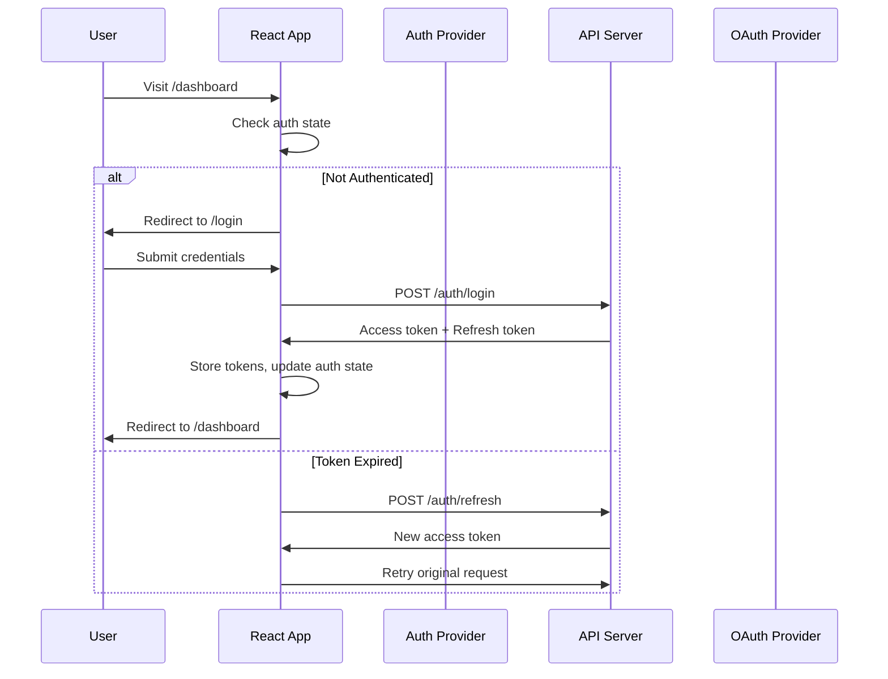
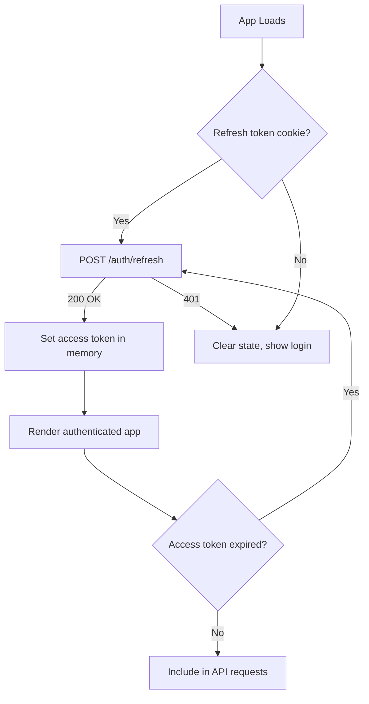

## Learning Objectives

- Implement protected routes that redirect unauthenticated users to login
- Build role-based access control (RBAC) with typed permission checks
- Handle JWT token refresh transparently without interrupting the user
- Persist sessions across page reloads using secure storage strategies
- Integrate OAuth 2.0 / OIDC flows with React Router navigation

## Prerequisites

- React Router v7 with loaders and actions
- Context API for shared auth state
- Basic understanding of JWTs and HTTP cookies

## Core Concepts

### Authentication Architecture



### Auth Context and Provider

```typescript
import { createContext, useContext, useState, useCallback, useEffect, type ReactNode } from "react";

interface User {
  id: string;
  email: string;
  name: string;
  roles: Role[];
  permissions: Permission[];
}

type Role = "admin" | "editor" | "viewer";
type Permission = "posts:read" | "posts:write" | "posts:delete" | "users:manage" | "settings:edit";

interface AuthState {
  user: User | null;
  isAuthenticated: boolean;
  isLoading: boolean;
}

interface AuthContextValue extends AuthState {
  login: (email: string, password: string) => Promise<void>;
  logout: () => Promise<void>;
  hasRole: (role: Role) => boolean;
  hasPermission: (permission: Permission) => boolean;
  hasAnyPermission: (permissions: Permission[]) => boolean;
}

const AuthContext = createContext<AuthContextValue | null>(null);

export function useAuth(): AuthContextValue {
  const context = useContext(AuthContext);
  if (!context) throw new Error("useAuth must be used within AuthProvider");
  return context;
}

let accessToken: string | null = null;

export function getAccessToken() {
  return accessToken;
}

export function AuthProvider({ children }: { children: ReactNode }) {
  const [state, setState] = useState<AuthState>({
    user: null,
    isAuthenticated: false,
    isLoading: true,
  });

  useEffect(() => {
    checkSession();
  }, []);

  async function checkSession() {
    try {
      const response = await fetch("/api/auth/me", { credentials: "include" });
      if (response.ok) {
        const { user, token } = await response.json();
        accessToken = token;
        setState({ user, isAuthenticated: true, isLoading: false });
      } else {
        setState({ user: null, isAuthenticated: false, isLoading: false });
      }
    } catch {
      setState({ user: null, isAuthenticated: false, isLoading: false });
    }
  }

  const login = useCallback(async (email: string, password: string) => {
    const response = await fetch("/api/auth/login", {
      method: "POST",
      headers: { "Content-Type": "application/json" },
      body: JSON.stringify({ email, password }),
      credentials: "include",
    });

    if (!response.ok) {
      const error = await response.json();
      throw new Error(error.message ?? "Login failed");
    }

    const { user, token } = await response.json();
    accessToken = token;
    setState({ user, isAuthenticated: true, isLoading: false });
  }, []);

  const logout = useCallback(async () => {
    await fetch("/api/auth/logout", { method: "POST", credentials: "include" });
    accessToken = null;
    setState({ user: null, isAuthenticated: false, isLoading: false });
  }, []);

  const hasRole = useCallback(
    (role: Role) => state.user?.roles.includes(role) ?? false,
    [state.user]
  );

  const hasPermission = useCallback(
    (permission: Permission) => state.user?.permissions.includes(permission) ?? false,
    [state.user]
  );

  const hasAnyPermission = useCallback(
    (permissions: Permission[]) => permissions.some((p) => state.user?.permissions.includes(p)),
    [state.user]
  );

  return (
    <AuthContext.Provider
      value={{ ...state, login, logout, hasRole, hasPermission, hasAnyPermission }}
    >
      {children}
    </AuthContext.Provider>
  );
}
```

### Protected Routes

```typescript
import { Navigate, Outlet, useLocation } from "react-router";

function ProtectedRoute() {
  const { isAuthenticated, isLoading } = useAuth();
  const location = useLocation();

  if (isLoading) {
    return (
      <div className="flex h-screen items-center justify-center">
        <Spinner size="lg" />
      </div>
    );
  }

  if (!isAuthenticated) {
    return <Navigate to="/login" state={{ from: location }} replace />;
  }

  return <Outlet />;
}

function RoleGuard({ requiredRole, children }: { requiredRole: Role; children: ReactNode }) {
  const { hasRole } = useAuth();

  if (!hasRole(requiredRole)) {
    return <ForbiddenPage />;
  }

  return <>{children}</>;
}

function PermissionGuard({
  required,
  fallback = <ForbiddenPage />,
  children,
}: {
  required: Permission | Permission[];
  fallback?: ReactNode;
  children: ReactNode;
}) {
  const { hasPermission, hasAnyPermission } = useAuth();
  const permissions = Array.isArray(required) ? required : [required];

  if (!hasAnyPermission(permissions)) {
    return <>{fallback}</>;
  }

  return <>{children}</>;
}
```

#### Route Configuration with Guards

```typescript
const router = createBrowserRouter([
  {
    path: "/",
    element: <RootLayout />,
    children: [
      { path: "login", element: <LoginPage /> },
      { path: "oauth/callback", element: <OAuthCallback /> },
      {
        element: <ProtectedRoute />,
        children: [
          { path: "dashboard", element: <Dashboard /> },
          { path: "profile", element: <ProfilePage /> },
          {
            path: "admin",
            element: (
              <RoleGuard requiredRole="admin">
                <AdminLayout />
              </RoleGuard>
            ),
            children: [
              { index: true, element: <AdminDashboard /> },
              { path: "users", element: <UserManagement /> },
              { path: "settings", element: <SystemSettings /> },
            ],
          },
        ],
      },
    ],
  },
]);
```

### Token Refresh Interceptor

```typescript
class AuthenticatedClient {
  private refreshPromise: Promise<string> | null = null;

  async fetch(url: string, options: RequestInit = {}): Promise<Response> {
    const token = getAccessToken();
    const response = await fetch(url, {
      ...options,
      headers: {
        ...options.headers,
        Authorization: `Bearer ${token}`,
      },
      credentials: "include",
    });

    if (response.status === 401) {
      const newToken = await this.refreshToken();
      return fetch(url, {
        ...options,
        headers: {
          ...options.headers,
          Authorization: `Bearer ${newToken}`,
        },
        credentials: "include",
      });
    }

    return response;
  }

  private async refreshToken(): Promise<string> {
    // Deduplicate concurrent refresh requests
    if (this.refreshPromise) return this.refreshPromise;

    this.refreshPromise = (async () => {
      try {
        const response = await fetch("/api/auth/refresh", {
          method: "POST",
          credentials: "include",
        });

        if (!response.ok) {
          window.location.href = "/login";
          throw new Error("Session expired");
        }

        const { token } = await response.json();
        return token as string;
      } finally {
        this.refreshPromise = null;
      }
    })();

    return this.refreshPromise;
  }
}

export const apiClient = new AuthenticatedClient();
```

### Login Page with Redirect

```typescript
import { useNavigate, useLocation } from "react-router";

function LoginPage() {
  const { login, isAuthenticated } = useAuth();
  const navigate = useNavigate();
  const location = useLocation();
  const [error, setError] = useState<string | null>(null);
  const [isSubmitting, setIsSubmitting] = useState(false);

  const from = (location.state as { from?: Location })?.from?.pathname ?? "/dashboard";

  useEffect(() => {
    if (isAuthenticated) navigate(from, { replace: true });
  }, [isAuthenticated, navigate, from]);

  async function handleSubmit(e: React.FormEvent<HTMLFormElement>) {
    e.preventDefault();
    setError(null);
    setIsSubmitting(true);

    const formData = new FormData(e.currentTarget);
    const email = formData.get("email") as string;
    const password = formData.get("password") as string;

    try {
      await login(email, password);
      navigate(from, { replace: true });
    } catch (err) {
      setError(err instanceof Error ? err.message : "Login failed");
    } finally {
      setIsSubmitting(false);
    }
  }

  return (
    <div className="flex min-h-screen items-center justify-center bg-gray-50">
      <div className="w-full max-w-md rounded-lg bg-white p-8 shadow-lg">
        <h1 className="mb-6 text-2xl font-bold">Sign In</h1>
        {error && (
          <div className="mb-4 rounded bg-red-50 p-3 text-sm text-red-700">{error}</div>
        )}
        <form onSubmit={handleSubmit} className="space-y-4">
          <div>
            <label htmlFor="email" className="block text-sm font-medium">Email</label>
            <input id="email" name="email" type="email" required autoComplete="email"
              className="mt-1 block w-full rounded border px-3 py-2" />
          </div>
          <div>
            <label htmlFor="password" className="block text-sm font-medium">Password</label>
            <input id="password" name="password" type="password" required
              className="mt-1 block w-full rounded border px-3 py-2" />
          </div>
          <button type="submit" disabled={isSubmitting}
            className="w-full rounded bg-blue-600 py-2 text-white disabled:opacity-50">
            {isSubmitting ? "Signing in..." : "Sign In"}
          </button>
        </form>

        <div className="mt-6">
          <div className="relative">
            <div className="absolute inset-0 flex items-center">
              <div className="w-full border-t" />
            </div>
            <div className="relative flex justify-center text-sm">
              <span className="bg-white px-2 text-gray-500">Or continue with</span>
            </div>
          </div>
          <div className="mt-4 grid grid-cols-2 gap-3">
            <OAuthButton provider="google" />
            <OAuthButton provider="github" />
          </div>
        </div>
      </div>
    </div>
  );
}
```

### OAuth Integration

```typescript
function OAuthButton({ provider }: { provider: "google" | "github" }) {
  const handleOAuth = () => {
    const state = crypto.randomUUID();
    sessionStorage.setItem("oauth_state", state);

    const params = new URLSearchParams({
      client_id: import.meta.env[`VITE_${provider.toUpperCase()}_CLIENT_ID`],
      redirect_uri: `${window.location.origin}/oauth/callback`,
      scope: provider === "google" ? "openid email profile" : "read:user user:email",
      state,
      response_type: "code",
    });

    const authUrl =
      provider === "google"
        ? `https://accounts.google.com/o/oauth2/v2/auth?${params}`
        : `https://github.com/login/oauth/authorize?${params}`;

    window.location.href = authUrl;
  };

  return (
    <button onClick={handleOAuth}
      className="flex items-center justify-center gap-2 rounded border px-4 py-2 hover:bg-gray-50">
      {provider === "google" ? <GoogleIcon /> : <GithubIcon />}
      {provider.charAt(0).toUpperCase() + provider.slice(1)}
    </button>
  );
}

function OAuthCallback() {
  const navigate = useNavigate();
  const [searchParams] = useSearchParams();

  useEffect(() => {
    const code = searchParams.get("code");
    const state = searchParams.get("state");
    const savedState = sessionStorage.getItem("oauth_state");

    if (!code || state !== savedState) {
      navigate("/login", { replace: true });
      return;
    }

    sessionStorage.removeItem("oauth_state");

    fetch("/api/auth/oauth/callback", {
      method: "POST",
      headers: { "Content-Type": "application/json" },
      body: JSON.stringify({ code, provider: "github" }),
      credentials: "include",
    })
      .then((res) => {
        if (!res.ok) throw new Error("OAuth failed");
        return res.json();
      })
      .then(() => navigate("/dashboard", { replace: true }))
      .catch(() => navigate("/login?error=oauth_failed", { replace: true }));
  }, [searchParams, navigate]);

  return (
    <div className="flex h-screen items-center justify-center">
      <Spinner size="lg" />
      <p className="ml-3 text-gray-600">Completing sign in...</p>
    </div>
  );
}
```

### Session Persistence Strategy



**Security guidelines:**
- Store access tokens in memory only (JavaScript variable) — never in localStorage
- Store refresh tokens as HttpOnly, Secure, SameSite cookies
- Access tokens should be short-lived (15 minutes)
- Refresh tokens should be long-lived (7–30 days) with rotation

## Best Practices

1. **Redirect after login** — preserve the original URL the user tried to visit
2. **Deduplicate refresh requests** — use a shared promise to prevent token refresh storms
3. **Type your permissions** — use TypeScript union types, not arbitrary strings
4. **Show loading states** — don't flash login page before session check completes
5. **CSRF protection** — use SameSite cookies and CSRF tokens for state-changing requests
6. **Granular guards** — protect at the route level for pages, component level for features

## Anti-Patterns to Avoid

- **Storing JWTs in localStorage** — vulnerable to XSS attacks
- **Client-only auth checks** — always validate on the server; client checks are UX only
- **Blocking the whole app on auth** — check session in parallel with rendering the shell
- **Hardcoded roles** — use permissions, not roles, for feature access checks

## Hands-On Exercise

### Build a Complete Auth System

1. Create an `AuthProvider` with login, logout, and session restoration
2. Implement a `ProtectedRoute` component that redirects to `/login` with return URL
3. Build a login page with email/password and at least one OAuth provider
4. Add role-based route guards: `/admin` for admins, `/editor` for editors
5. Implement a token refresh interceptor that retries failed requests
6. Add a `<PermissionGuard>` that conditionally renders UI elements (edit buttons, delete actions)

## Key Takeaways

- Protected routes combine Context (auth state) with Router (navigation guards)
- Store access tokens in memory, refresh tokens in HttpOnly cookies
- Deduplicate concurrent refresh token requests with a shared promise
- Use permissions (not roles) for granular access control at the component level
- Always validate auth on the server — client-side guards are a UX convenience, not security

## External Resources

- [OWASP: Authentication Cheat Sheet](https://cheatsheetseries.owasp.org/cheatsheets/Authentication_Cheat_Sheet.html)
- [Auth0: React Authentication Guide](https://auth0.com/docs/quickstart/spa/react)
- [JWT Best Practices](https://datatracker.ietf.org/doc/html/rfc8725)
- [OAuth 2.0 for Browser-Based Apps](https://datatracker.ietf.org/doc/html/draft-ietf-oauth-browser-based-apps)
