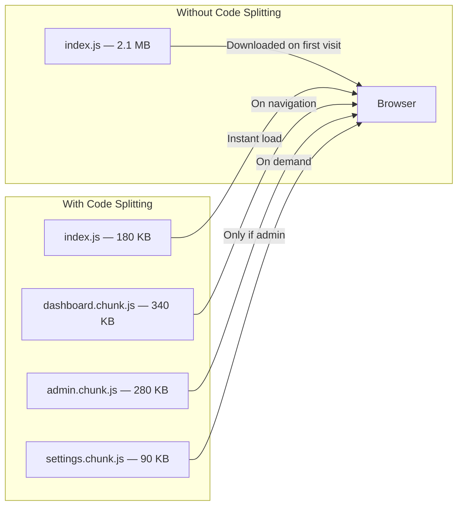
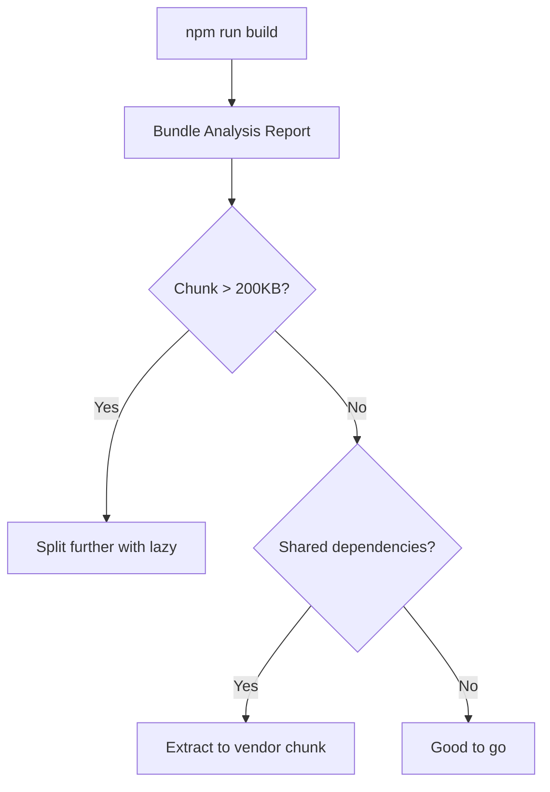

## Learning Objectives

- Implement route-based code splitting with React.lazy and Suspense
- Design loading states that minimize perceived latency
- Build error boundaries that recover gracefully from chunk load failures
- Prefetch routes on hover and viewport entry for instant navigation
- Measure and optimize bundle sizes with analysis tools

## Prerequisites

- React Router v7 with createBrowserRouter
- Understanding of JavaScript modules and dynamic imports
- Basic awareness of how bundlers work (Vite/Rollup)

## Core Concepts

### Why Code Splitting?

A typical React SPA bundles everything into a single JavaScript file. As the app grows, users download megabytes of code before seeing anything — even for pages they may never visit.



### React.lazy and Suspense

`React.lazy` creates a component that loads its code on first render:

```typescript
import { lazy, Suspense } from "react";

const Dashboard = lazy(() => import("./pages/Dashboard"));
const AdminPanel = lazy(() => import("./pages/AdminPanel"));
const Settings = lazy(() => import("./pages/Settings"));
const Analytics = lazy(() => import("./pages/Analytics"));

function App() {
  return (
    <Suspense fallback={<PageSkeleton />}>
      <Routes>
        <Route path="/dashboard" element={<Dashboard />} />
        <Route path="/admin/*" element={<AdminPanel />} />
        <Route path="/settings" element={<Settings />} />
        <Route path="/analytics" element={<Analytics />} />
      </Routes>
    </Suspense>
  );
}
```

#### Named Exports with Lazy

`React.lazy` requires a default export. For named exports, re-export:

```typescript
const UserProfile = lazy(() =>
  import("./components/UserProfile").then((module) => ({
    default: module.UserProfile,
  }))
);
```

### Route-Based Splitting with createBrowserRouter

```typescript
import { createBrowserRouter } from "react-router";

const router = createBrowserRouter([
  {
    path: "/",
    lazy: () => import("./layouts/RootLayout"),
    children: [
      {
        index: true,
        lazy: () => import("./pages/Home"),
      },
      {
        path: "dashboard",
        lazy: () => import("./pages/Dashboard"),
      },
      {
        path: "projects/:projectId",
        lazy: async () => {
          const { ProjectDetail, projectLoader } = await import("./pages/ProjectDetail");
          return {
            Component: ProjectDetail,
            loader: projectLoader,
          };
        },
      },
      {
        path: "admin",
        lazy: () => import("./pages/Admin"),
        children: [
          {
            path: "users",
            lazy: () => import("./pages/admin/UserManagement"),
          },
        ],
      },
    ],
  },
]);
```

Each `lazy` route loads its component, loader, action, and error boundary only when navigated to.

### Designing Loading States

#### Skeleton Loading

```typescript
function PageSkeleton() {
  return (
    <div className="animate-pulse space-y-4 p-6">
      <div className="h-8 w-64 rounded bg-gray-200" />
      <div className="h-4 w-full rounded bg-gray-200" />
      <div className="h-4 w-3/4 rounded bg-gray-200" />
      <div className="grid grid-cols-3 gap-4">
        {Array.from({ length: 6 }).map((_, i) => (
          <div key={i} className="h-32 rounded bg-gray-200" />
        ))}
      </div>
    </div>
  );
}
```

#### Granular Suspense Boundaries

Don't wrap the entire app in one Suspense — wrap at the route or feature level:

```typescript
function DashboardPage() {
  return (
    <div className="grid grid-cols-12 gap-6">
      <div className="col-span-8">
        <Suspense fallback={<ChartSkeleton />}>
          <RevenueChart />
        </Suspense>
      </div>
      <div className="col-span-4">
        <Suspense fallback={<ListSkeleton count={5} />}>
          <RecentOrders />
        </Suspense>
      </div>
      <div className="col-span-12">
        <Suspense fallback={<TableSkeleton rows={10} />}>
          <DataTable />
        </Suspense>
      </div>
    </div>
  );
}
```

### Error Boundaries for Chunk Failures

Network errors during chunk loading crash the app silently. Catch and recover:

```typescript
import { Component, type ReactNode } from "react";

interface Props {
  fallback?: ReactNode;
  onRetry?: () => void;
  children: ReactNode;
}

interface State {
  hasError: boolean;
  error: Error | null;
}

class ChunkErrorBoundary extends Component<Props, State> {
  state: State = { hasError: false, error: null };

  static getDerivedStateFromError(error: Error): State {
    return { hasError: true, error };
  }

  handleRetry = () => {
    this.setState({ hasError: false, error: null });
    this.props.onRetry?.();
  };

  render() {
    if (this.state.hasError) {
      const isChunkError =
        this.state.error?.message.includes("Failed to fetch dynamically imported module") ||
        this.state.error?.message.includes("Loading chunk");

      if (isChunkError) {
        return (
          <div className="flex flex-col items-center justify-center py-20">
            <h2 className="text-xl font-semibold">Update Available</h2>
            <p className="mt-2 text-gray-600">
              A new version is available. Please reload to continue.
            </p>
            <button
              onClick={() => window.location.reload()}
              className="mt-4 rounded bg-blue-600 px-4 py-2 text-white"
            >
              Reload Page
            </button>
          </div>
        );
      }

      return this.props.fallback ?? (
        <div className="flex flex-col items-center justify-center py-20">
          <h2 className="text-xl font-semibold text-red-700">Something went wrong</h2>
          <button
            onClick={this.handleRetry}
            className="mt-4 rounded border px-4 py-2 hover:bg-gray-50"
          >
            Try Again
          </button>
        </div>
      );
    }

    return this.props.children;
  }
}
```

### Prefetching Strategies

#### Prefetch on Hover

```typescript
import { useCallback } from "react";

const routeModules: Record<string, () => Promise<unknown>> = {
  "/dashboard": () => import("./pages/Dashboard"),
  "/settings": () => import("./pages/Settings"),
  "/analytics": () => import("./pages/Analytics"),
};

function PrefetchLink({
  to,
  children,
  ...props
}: { to: string; children: ReactNode } & React.AnchorHTMLAttributes<HTMLAnchorElement>) {
  const navigate = useNavigate();

  const handleMouseEnter = useCallback(() => {
    const prefetch = routeModules[to];
    if (prefetch) prefetch();
  }, [to]);

  return (
    <a
      href={to}
      onMouseEnter={handleMouseEnter}
      onClick={(e) => {
        e.preventDefault();
        navigate(to);
      }}
      {...props}
    >
      {children}
    </a>
  );
}
```

#### Prefetch on Viewport Entry

```typescript
function usePrefetchOnVisible(
  ref: React.RefObject<HTMLElement | null>,
  importFn: () => Promise<unknown>
) {
  useEffect(() => {
    const element = ref.current;
    if (!element) return;

    const observer = new IntersectionObserver(
      (entries) => {
        if (entries[0]?.isIntersecting) {
          importFn();
          observer.disconnect();
        }
      },
      { rootMargin: "200px" }
    );

    observer.observe(element);
    return () => observer.disconnect();
  }, [ref, importFn]);
}

function FeatureSection() {
  const sectionRef = useRef<HTMLDivElement>(null);

  usePrefetchOnVisible(sectionRef, () => import("./pages/FeatureDetail"));

  return (
    <div ref={sectionRef}>
      <Link to="/features">View All Features →</Link>
    </div>
  );
}
```

#### Idle-Time Prefetching

```typescript
function prefetchOnIdle(importFns: Array<() => Promise<unknown>>) {
  if ("requestIdleCallback" in window) {
    importFns.forEach((fn) => {
      requestIdleCallback(() => fn(), { timeout: 5000 });
    });
  } else {
    setTimeout(() => importFns.forEach((fn) => fn()), 2000);
  }
}

// Call after initial render
useEffect(() => {
  prefetchOnIdle([
    () => import("./pages/Dashboard"),
    () => import("./pages/Settings"),
  ]);
}, []);
```

### Bundle Analysis

```bash
# Install the analyzer
npm install -D rollup-plugin-visualizer

# Add to vite.config.ts
import { visualizer } from "rollup-plugin-visualizer";

export default defineConfig({
  plugins: [
    react(),
    visualizer({
      open: true,
      filename: "bundle-analysis.html",
      gzipSize: true,
    }),
  ],
  build: {
    rollupOptions: {
      output: {
        manualChunks: {
          vendor: ["react", "react-dom"],
          router: ["react-router"],
          query: ["@tanstack/react-query"],
        },
      },
    },
  },
});
```



## Best Practices

1. **Split at route boundaries** — each page is a natural code splitting point
2. **Granular Suspense boundaries** — wrap features, not the whole app
3. **Prefetch likely navigation** — hover and viewport-based prefetching eliminates wait
4. **Handle chunk failures** — network errors during lazy loading need recovery UI
5. **Set a performance budget** — no initial bundle over 200KB gzipped
6. **Analyze regularly** — run bundle analysis as part of your CI pipeline

## Anti-Patterns to Avoid

- **Splitting too aggressively** — a 2KB component doesn't need its own chunk
- **Nesting Suspense arbitrarily** — more boundaries means more loading spinners
- **Ignoring chunk errors** — stale deployments cause chunk 404s; handle gracefully
- **No loading state** — a blank screen while loading is worse than a spinner

## Hands-On Exercise

### Optimize a Large Application

1. Start with a monolithic app bundle and measure its size with `rollup-plugin-visualizer`
2. Add `React.lazy` to all top-level route components
3. Create a `ChunkErrorBoundary` that offers reload on chunk failures
4. Implement `PrefetchLink` that preloads routes on hover
5. Add viewport-based prefetching for below-the-fold content
6. Configure `manualChunks` to separate vendor libraries
7. Measure the improvement: compare initial bundle size and Time to Interactive

## Key Takeaways

- Route-based code splitting is the highest-impact performance optimization for SPAs
- React.lazy + Suspense make splitting seamless — components load transparently
- Always handle chunk load failures with error boundaries and retry/reload UI
- Prefetching on hover eliminates perceived loading time for most navigations
- Bundle analysis should be a regular part of your development workflow

## External Resources

- [React docs: Code Splitting](https://react.dev/reference/react/lazy)
- [Vite: Code Splitting](https://vite.dev/guide/features.html#async-chunk-loading-optimization)
- [web.dev: Code Splitting](https://web.dev/articles/reduce-javascript-payloads-with-code-splitting)
- [Philip Walton: Idle Until Urgent](https://philipwalton.com/articles/idle-until-urgent/)
