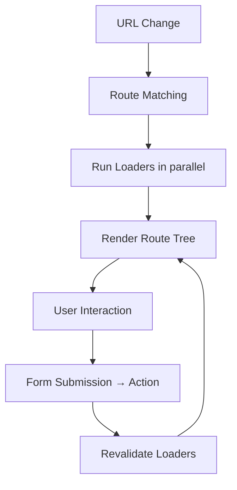
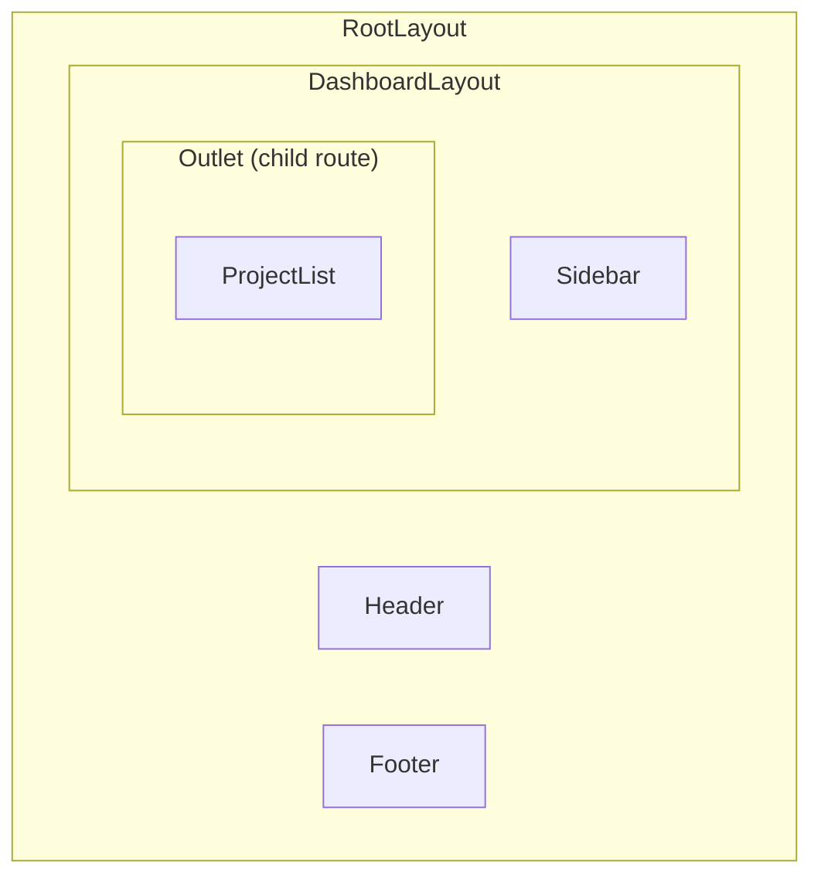

## Learning Objectives

- Configure React Router v7 with `createBrowserRouter` and the data router API
- Build nested route hierarchies with layouts and shared navigation using `<Outlet>`
- Implement loaders and actions for data fetching and mutations colocated with routes
- Handle errors gracefully with route-level error boundaries
- Use route params, search params, and navigation guards effectively

## Prerequisites

- Comfortable building React components with TypeScript
- Basic understanding of HTTP methods (GET, POST, PUT, DELETE)
- Familiarity with async/await

## Core Concepts

### Why React Router v7?

React Router v7 introduces the **data router** — routes aren't just path-to-component mappings, they're full-stack units with built-in data loading, mutations, and error handling.



### Installation and Setup

```bash
npm install react-router
```

```typescript
import { createBrowserRouter, RouterProvider } from "react-router";

const router = createBrowserRouter([
  {
    path: "/",
    element: <RootLayout />,
    errorElement: <RootErrorBoundary />,
    children: [
      { index: true, element: <HomePage /> },
      {
        path: "dashboard",
        element: <DashboardLayout />,
        loader: dashboardLoader,
        children: [
          { index: true, element: <DashboardOverview /> },
          {
            path: "projects",
            element: <ProjectList />,
            loader: projectsLoader,
          },
          {
            path: "projects/:projectId",
            element: <ProjectDetail />,
            loader: projectDetailLoader,
            action: projectAction,
            errorElement: <ProjectErrorBoundary />,
          },
        ],
      },
      {
        path: "settings",
        element: <SettingsLayout />,
        children: [
          { index: true, element: <GeneralSettings /> },
          { path: "profile", element: <ProfileSettings /> },
          { path: "notifications", element: <NotificationSettings /> },
        ],
      },
    ],
  },
]);

function App() {
  return <RouterProvider router={router} />;
}
```

### Layouts with Outlet

The `<Outlet>` component renders child routes within a parent layout:

```typescript
import { Outlet, NavLink, useNavigation } from "react-router";

function DashboardLayout() {
  const navigation = useNavigation();
  const isLoading = navigation.state === "loading";

  return (
    <div className="flex h-screen">
      <aside className="w-64 border-r bg-gray-50 p-4">
        <nav className="flex flex-col gap-1">
          <NavLink
            to="/dashboard"
            end
            className={({ isActive }) =>
              `rounded px-3 py-2 ${isActive ? "bg-blue-100 text-blue-700" : "hover:bg-gray-100"}`
            }
          >
            Overview
          </NavLink>
          <NavLink
            to="/dashboard/projects"
            className={({ isActive }) =>
              `rounded px-3 py-2 ${isActive ? "bg-blue-100 text-blue-700" : "hover:bg-gray-100"}`
            }
          >
            Projects
          </NavLink>
        </nav>
      </aside>
      <main className="flex-1 overflow-auto p-6">
        {isLoading && <LoadingBar />}
        <Outlet />
      </main>
    </div>
  );
}
```



### Loaders: Data Fetching

Loaders run before a route renders, ensuring data is available on first paint:

```typescript
import { useLoaderData, type LoaderFunctionArgs } from "react-router";

interface Project {
  id: string;
  name: string;
  description: string;
  members: User[];
  status: "active" | "archived";
}

async function projectsLoader(): Promise<Project[]> {
  const response = await fetch("/api/projects");
  if (!response.ok) {
    throw new Response("Failed to load projects", { status: response.status });
  }
  return response.json();
}

function ProjectList() {
  const projects = useLoaderData<typeof projectsLoader>();

  return (
    <div className="grid grid-cols-1 gap-4 md:grid-cols-2 lg:grid-cols-3">
      {projects.map((project) => (
        <ProjectCard key={project.id} project={project} />
      ))}
    </div>
  );
}

async function projectDetailLoader({ params }: LoaderFunctionArgs) {
  const { projectId } = params;
  if (!projectId) throw new Response("Project ID required", { status: 400 });

  const [projectRes, tasksRes] = await Promise.all([
    fetch(`/api/projects/${projectId}`),
    fetch(`/api/projects/${projectId}/tasks`),
  ]);

  if (!projectRes.ok) {
    throw new Response("Project not found", { status: 404 });
  }

  return {
    project: (await projectRes.json()) as Project,
    tasks: (await tasksRes.json()) as Task[],
  };
}
```

### Actions: Handling Mutations

Actions handle form submissions and mutations, then React Router revalidates loaders automatically:

```typescript
import { Form, useActionData, useNavigation, redirect, type ActionFunctionArgs } from "react-router";

async function projectAction({ request, params }: ActionFunctionArgs) {
  const formData = await request.formData();
  const intent = formData.get("intent");

  switch (intent) {
    case "update": {
      const name = formData.get("name") as string;
      const description = formData.get("description") as string;

      const errors: Record<string, string> = {};
      if (!name?.trim()) errors.name = "Name is required";
      if (name && name.length < 3) errors.name = "Name must be at least 3 characters";
      if (Object.keys(errors).length) return { errors };

      await fetch(`/api/projects/${params.projectId}`, {
        method: "PUT",
        headers: { "Content-Type": "application/json" },
        body: JSON.stringify({ name, description }),
      });
      return { success: true };
    }

    case "delete": {
      await fetch(`/api/projects/${params.projectId}`, { method: "DELETE" });
      return redirect("/dashboard/projects");
    }

    default:
      throw new Response(`Unknown intent: ${intent}`, { status: 400 });
  }
}

function ProjectEditForm({ project }: { project: Project }) {
  const actionData = useActionData<typeof projectAction>();
  const navigation = useNavigation();
  const isSubmitting = navigation.state === "submitting";

  return (
    <Form method="post" className="space-y-4">
      <input type="hidden" name="intent" value="update" />
      <div>
        <label htmlFor="name" className="block text-sm font-medium">
          Project Name
        </label>
        <input
          id="name"
          name="name"
          defaultValue={project.name}
          className="mt-1 block w-full rounded border px-3 py-2"
        />
        {actionData?.errors?.name && (
          <p className="mt-1 text-sm text-red-600">{actionData.errors.name}</p>
        )}
      </div>
      <div>
        <label htmlFor="description" className="block text-sm font-medium">
          Description
        </label>
        <textarea
          id="description"
          name="description"
          defaultValue={project.description}
          rows={4}
          className="mt-1 block w-full rounded border px-3 py-2"
        />
      </div>
      <button
        type="submit"
        disabled={isSubmitting}
        className="rounded bg-blue-600 px-4 py-2 text-white disabled:opacity-50"
      >
        {isSubmitting ? "Saving..." : "Save Changes"}
      </button>
    </Form>
  );
}
```

### Search Params

```typescript
import { useSearchParams } from "react-router";

function ProjectList() {
  const [searchParams, setSearchParams] = useSearchParams();
  const status = searchParams.get("status") ?? "all";
  const sort = searchParams.get("sort") ?? "name";
  const page = Number(searchParams.get("page") ?? "1");

  const updateFilters = (updates: Record<string, string>) => {
    setSearchParams((prev) => {
      const next = new URLSearchParams(prev);
      for (const [key, value] of Object.entries(updates)) {
        if (value) next.set(key, value);
        else next.delete(key);
      }
      return next;
    });
  };

  return (
    <div>
      <div className="mb-4 flex gap-2">
        {(["all", "active", "archived"] as const).map((s) => (
          <button
            key={s}
            onClick={() => updateFilters({ status: s === "all" ? "" : s, page: "1" })}
            className={status === s ? "font-bold underline" : ""}
          >
            {s}
          </button>
        ))}
      </div>
      {/* Project list filtered by status */}
    </div>
  );
}
```

### Route-Level Error Boundaries

```typescript
import { useRouteError, isRouteErrorResponse, Link } from "react-router";

function ProjectErrorBoundary() {
  const error = useRouteError();

  if (isRouteErrorResponse(error)) {
    if (error.status === 404) {
      return (
        <div className="flex flex-col items-center justify-center py-20">
          <h1 className="text-4xl font-bold">Project Not Found</h1>
          <p className="mt-2 text-gray-600">
            The project you're looking for doesn't exist or has been deleted.
          </p>
          <Link to="/dashboard/projects" className="mt-4 text-blue-600 hover:underline">
            Back to Projects
          </Link>
        </div>
      );
    }

    return (
      <div className="rounded border border-red-200 bg-red-50 p-6">
        <h2 className="text-lg font-bold text-red-800">Error {error.status}</h2>
        <p className="text-red-700">{error.statusText}</p>
      </div>
    );
  }

  return (
    <div className="rounded border border-red-200 bg-red-50 p-6">
      <h2 className="text-lg font-bold text-red-800">Something went wrong</h2>
      <p className="text-red-700">{error instanceof Error ? error.message : "Unknown error"}</p>
    </div>
  );
}
```

## Best Practices

1. **Colocate data with routes** — loaders and actions belong next to the route definition
2. **Parallel loaders** — nested route loaders run in parallel by default; don't create waterfall chains
3. **Use `<Form>` over `fetch`** — React Router's `<Form>` integrates with the revalidation cycle
4. **Throw `Response` objects** — they integrate with `isRouteErrorResponse` for typed error handling
5. **Use `NavLink`** — it provides `isActive` and `isPending` for navigation state styling
6. **Typed loaders** — use `useLoaderData<typeof loader>()` for end-to-end type safety

## Anti-Patterns to Avoid

- **useEffect for data fetching** — loaders replace `useEffect` + loading state for route data
- **Global loading spinners** — use `useNavigation()` for route-specific loading indicators
- **Deeply nested `<Routes>`** — use `createBrowserRouter` for the full data router experience
- **Ignoring revalidation** — after an action, loaders revalidate automatically; don't manually refetch

## Hands-On Exercise

### Build a Blog Admin Dashboard

1. Create a router with these routes: `/`, `/posts`, `/posts/:postId`, `/posts/:postId/edit`, `/posts/new`, `/settings`
2. Implement a `DashboardLayout` with sidebar navigation using `NavLink` and `Outlet`
3. Add loaders that fetch post lists and individual posts
4. Create an action for the post edit form with validation and error display
5. Add a delete action that redirects to the post list after deletion
6. Implement route-level error boundaries for 404 and server errors

## Key Takeaways

- React Router v7's data router makes routes full-stack units with loaders, actions, and error boundaries
- `<Outlet>` enables layout composition — nest routes for shared UI chrome
- Loaders eliminate the `useEffect` fetch-on-render waterfall with parallel data loading
- Actions + `<Form>` handle mutations with automatic cache revalidation
- Route error boundaries catch errors at the right granularity — a broken child doesn't crash the whole app

## External Resources

- [React Router v7 Documentation](https://reactrouter.com/)
- [React Router Tutorial](https://reactrouter.com/en/main/start/tutorial)
- [Remix — the React Router framework](https://remix.run/)
- [Ryan Florence: When to Fetch](https://www.youtube.com/watch?v=95B8mnhzoCM)
