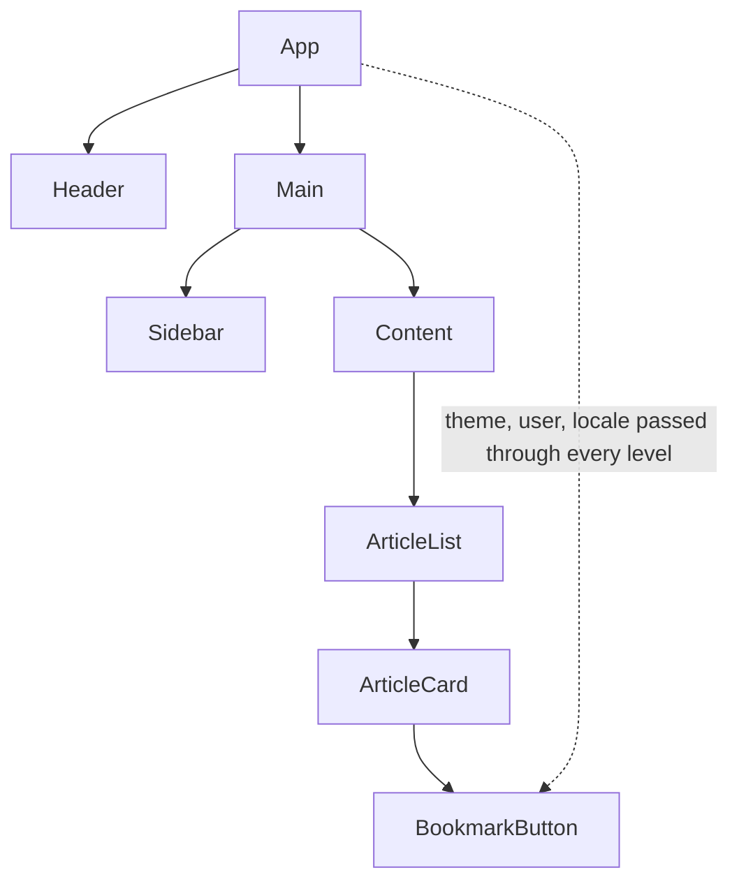
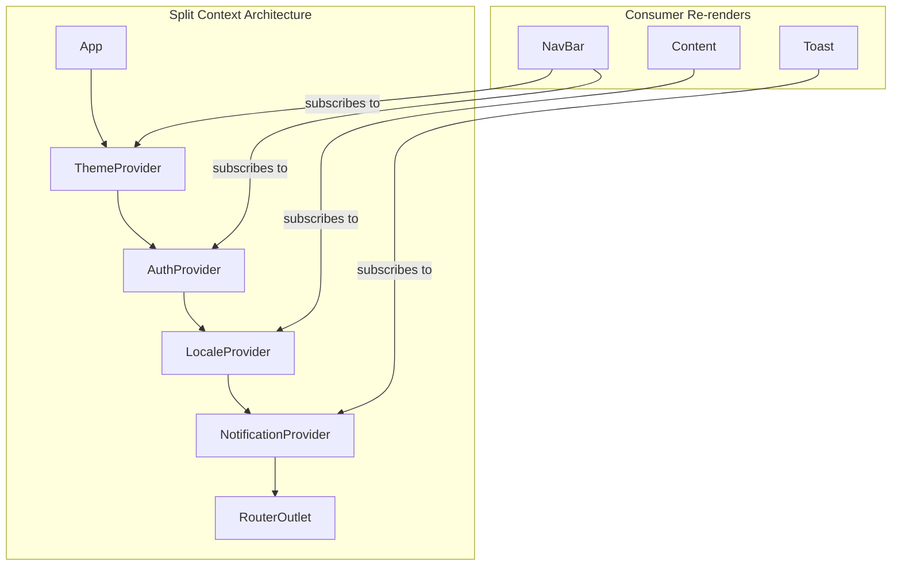

## Learning Objectives

- Design effective Context providers with TypeScript for type-safe consumption
- Implement the compound component pattern for flexible, declarative APIs
- Solve prop drilling through composition before reaching for Context
- Understand Context's re-render behavior and when it becomes a performance problem
- Recognize when NOT to use Context and choose the right alternative

## Prerequisites

- Solid understanding of useState and useReducer
- Familiarity with React component composition (children, render props)
- TypeScript generics basics

## Core Concepts

### The Prop Drilling Problem



Props flow one-way in React. When deeply nested components need data from far above, every intermediate component must forward those props — even if it doesn't use them. This is **prop drilling**.

### Solution 1: Composition First

Before reaching for Context, restructure your component tree:

```typescript
// Before: prop drilling
function App() {
  const [user, setUser] = useState<User | null>(null);
  return <Layout user={user} />;
}
function Layout({ user }: { user: User | null }) {
  return <Sidebar user={user} />;
}
function Sidebar({ user }: { user: User | null }) {
  return <UserMenu user={user} />;
}

// After: composition via children
function App() {
  const [user, setUser] = useState<User | null>(null);
  return (
    <Layout sidebar={<Sidebar><UserMenu user={user} /></Sidebar>}>
      <MainContent />
    </Layout>
  );
}

function Layout({ sidebar, children }: { sidebar: React.ReactNode; children: React.ReactNode }) {
  return (
    <div className="flex">
      <aside>{sidebar}</aside>
      <main>{children}</main>
    </div>
  );
}
```

Now `Layout` and `Sidebar` don't need to know about `user` at all. The component that **owns** the state passes it directly to the component that **uses** it.

### Solution 2: Context API

When composition isn't enough — when many components at various depths need the same data — Context is the right tool.

#### Creating Type-Safe Context

```typescript
import { createContext, useContext, useState, useCallback, type ReactNode } from "react";

interface AuthState {
  user: User | null;
  isAuthenticated: boolean;
}

interface AuthContextValue extends AuthState {
  login: (credentials: Credentials) => Promise<void>;
  logout: () => void;
  updateProfile: (updates: Partial<User>) => Promise<void>;
}

const AuthContext = createContext<AuthContextValue | null>(null);

export function useAuth(): AuthContextValue {
  const context = useContext(AuthContext);
  if (!context) {
    throw new Error("useAuth must be used within an AuthProvider");
  }
  return context;
}

export function AuthProvider({ children }: { children: ReactNode }) {
  const [state, setState] = useState<AuthState>({
    user: null,
    isAuthenticated: false,
  });

  const login = useCallback(async (credentials: Credentials) => {
    const response = await fetch("/api/auth/login", {
      method: "POST",
      headers: { "Content-Type": "application/json" },
      body: JSON.stringify(credentials),
    });
    const user = await response.json();
    setState({ user, isAuthenticated: true });
  }, []);

  const logout = useCallback(() => {
    setState({ user: null, isAuthenticated: false });
    fetch("/api/auth/logout", { method: "POST" });
  }, []);

  const updateProfile = useCallback(async (updates: Partial<User>) => {
    const response = await fetch("/api/user/profile", {
      method: "PATCH",
      headers: { "Content-Type": "application/json" },
      body: JSON.stringify(updates),
    });
    const updatedUser = await response.json();
    setState((prev) => ({ ...prev, user: updatedUser }));
  }, []);

  const value: AuthContextValue = {
    ...state,
    login,
    logout,
    updateProfile,
  };

  return <AuthContext.Provider value={value}>{children}</AuthContext.Provider>;
}
```

#### Split Context for Performance

A single context that holds everything forces all consumers to re-render on any change:

```typescript
// Anti-pattern: one giant context
const AppContext = createContext<{
  theme: Theme;
  user: User;
  locale: string;
  notifications: Notification[];
} | null>(null);

// Better: split by update frequency
const ThemeContext = createContext<ThemeContextValue | null>(null);
const UserContext = createContext<UserContextValue | null>(null);
const LocaleContext = createContext<LocaleContextValue | null>(null);
const NotificationContext = createContext<NotificationContextValue | null>(null);
```



#### Separate State from Dispatch

```typescript
const TodoStateContext = createContext<TodoState | null>(null);
const TodoDispatchContext = createContext<React.Dispatch<TodoAction> | null>(null);

export function useTodoState() {
  const context = useContext(TodoStateContext);
  if (!context) throw new Error("useTodoState must be used within TodoProvider");
  return context;
}

export function useTodoDispatch() {
  const context = useContext(TodoDispatchContext);
  if (!context) throw new Error("useTodoDispatch must be used within TodoProvider");
  return context;
}

export function TodoProvider({ children }: { children: ReactNode }) {
  const [state, dispatch] = useReducer(todoReducer, initialState);

  return (
    <TodoStateContext.Provider value={state}>
      <TodoDispatchContext.Provider value={dispatch}>
        {children}
      </TodoDispatchContext.Provider>
    </TodoStateContext.Provider>
  );
}
```

Components that only dispatch actions (buttons, forms) won't re-render when state changes.

### Compound Component Pattern

Build components with implicit shared state, like native HTML `<select>` and `<option>`:

```typescript
interface AccordionContextValue {
  openItems: Set<string>;
  toggle: (id: string) => void;
  allowMultiple: boolean;
}

const AccordionContext = createContext<AccordionContextValue | null>(null);

function useAccordionContext() {
  const ctx = useContext(AccordionContext);
  if (!ctx) throw new Error("Accordion components must be used within <Accordion>");
  return ctx;
}

interface AccordionProps {
  children: ReactNode;
  allowMultiple?: boolean;
  defaultOpen?: string[];
}

function Accordion({ children, allowMultiple = false, defaultOpen = [] }: AccordionProps) {
  const [openItems, setOpenItems] = useState<Set<string>>(new Set(defaultOpen));

  const toggle = useCallback(
    (id: string) => {
      setOpenItems((prev) => {
        const next = new Set(prev);
        if (next.has(id)) {
          next.delete(id);
        } else {
          if (!allowMultiple) next.clear();
          next.add(id);
        }
        return next;
      });
    },
    [allowMultiple]
  );

  return (
    <AccordionContext.Provider value={{ openItems, toggle, allowMultiple }}>
      <div role="region" className="divide-y divide-gray-200">
        {children}
      </div>
    </AccordionContext.Provider>
  );
}

interface AccordionItemProps {
  id: string;
  children: ReactNode;
}

function AccordionItem({ id, children }: AccordionItemProps) {
  const { openItems } = useAccordionContext();
  const isOpen = openItems.has(id);

  return (
    <div data-state={isOpen ? "open" : "closed"}>
      {children}
    </div>
  );
}

function AccordionTrigger({ id, children }: { id: string; children: ReactNode }) {
  const { openItems, toggle } = useAccordionContext();
  const isOpen = openItems.has(id);

  return (
    <button
      onClick={() => toggle(id)}
      aria-expanded={isOpen}
      className="flex w-full items-center justify-between py-4 font-medium"
    >
      {children}
      <ChevronIcon className={`transition-transform ${isOpen ? "rotate-180" : ""}`} />
    </button>
  );
}

function AccordionContent({ id, children }: { id: string; children: ReactNode }) {
  const { openItems } = useAccordionContext();
  const isOpen = openItems.has(id);

  if (!isOpen) return null;

  return (
    <div role="region" className="pb-4 text-sm text-gray-600">
      {children}
    </div>
  );
}

// Attach sub-components for a clean API
Accordion.Item = AccordionItem;
Accordion.Trigger = AccordionTrigger;
Accordion.Content = AccordionContent;

// Usage — clean, declarative, no prop drilling
function FAQ() {
  return (
    <Accordion allowMultiple defaultOpen={["q1"]}>
      <Accordion.Item id="q1">
        <Accordion.Trigger id="q1">What is React?</Accordion.Trigger>
        <Accordion.Content id="q1">
          React is a JavaScript library for building user interfaces.
        </Accordion.Content>
      </Accordion.Item>
      <Accordion.Item id="q2">
        <Accordion.Trigger id="q2">What is TypeScript?</Accordion.Trigger>
        <Accordion.Content id="q2">
          TypeScript adds static type checking to JavaScript.
        </Accordion.Content>
      </Accordion.Item>
    </Accordion>
  );
}
```

### Provider Pattern for Dependency Injection

```typescript
interface ApiClient {
  get<T>(url: string): Promise<T>;
  post<T>(url: string, body: unknown): Promise<T>;
}

const ApiClientContext = createContext<ApiClient | null>(null);

export function useApiClient(): ApiClient {
  const client = useContext(ApiClientContext);
  if (!client) throw new Error("useApiClient requires <ApiClientProvider>");
  return client;
}

export function ApiClientProvider({
  baseUrl,
  children,
}: {
  baseUrl: string;
  children: ReactNode;
}) {
  const client = useMemo<ApiClient>(
    () => ({
      async get<T>(url: string) {
        const res = await fetch(`${baseUrl}${url}`);
        if (!res.ok) throw new ApiError(res.status, await res.text());
        return res.json() as Promise<T>;
      },
      async post<T>(url: string, body: unknown) {
        const res = await fetch(`${baseUrl}${url}`, {
          method: "POST",
          headers: { "Content-Type": "application/json" },
          body: JSON.stringify(body),
        });
        if (!res.ok) throw new ApiError(res.status, await res.text());
        return res.json() as Promise<T>;
      },
    }),
    [baseUrl]
  );

  return (
    <ApiClientContext.Provider value={client}>{children}</ApiClientContext.Provider>
  );
}
```

This makes components testable — swap in a mock provider during tests.

## When NOT to Use Context

| Scenario | Better Alternative |
|----------|-------------------|
| Frequently changing values (60fps animations, mouse position) | useRef + subscription |
| Server state (API data, caching) | TanStack Query / SWR |
| Complex global state with selectors | Zustand / Jotai |
| Theme/locale (read-mostly) | Context is fine here |
| Auth state (read-mostly, rare updates) | Context is fine here |
| Form state | React Hook Form / component state |

## Best Practices

1. **Composition first** — restructure your tree before adding Context
2. **Split contexts** by update frequency — theme and auth shouldn't share a provider
3. **Always throw on missing context** — `null` defaults hide bugs
4. **Memoize provider values** — use `useMemo` for object values, `useCallback` for functions
5. **Co-locate the custom hook** with the provider — export `useAuth`, not `AuthContext`
6. **Separate state from dispatch** when only some consumers need to write

## Anti-Patterns to Avoid

- **Context as global state** — Context is not Redux. It has no selectors, no middleware, no devtools.
- **One mega-provider** — a single context with all app state causes unnecessary re-renders everywhere.
- **Unstable references** — creating new objects in `value={}` on every render forces all consumers to update.
- **Deeply nested providers** — if you have 10+ providers wrapping `<App>`, consider Zustand or a provider composer utility.

## Hands-On Exercise

### Build a Theme System with Compound Components

1. Create a `ThemeProvider` with `light`, `dark`, and `system` modes
2. Implement `useTheme()` hook that returns current theme and a toggle function
3. Build a compound `<Card>` component: `Card`, `Card.Header`, `Card.Body`, `Card.Footer` that share padding/border context
4. Create a `<DataTable>` compound component with `DataTable`, `DataTable.Header`, `DataTable.Row`, `DataTable.Cell` that share column definitions via context
5. Add a `ThemePreview` component that lets users switch themes and see live preview

**Stretch goal:** Implement CSS custom properties that update when the theme context changes, so non-React styles also respond.

## Key Takeaways

- Composition through children and slots eliminates most prop drilling without any state management library
- Context is ideal for low-frequency, read-heavy data like themes, auth, and locale
- Split contexts by domain and update frequency to prevent unnecessary re-renders
- Compound components create declarative APIs by sharing implicit context between related sub-components
- Always export a typed custom hook — never export the raw context object

## External Resources

- [React docs: Passing Data Deeply with Context](https://react.dev/learn/passing-data-deeply-with-context)
- [Kent C. Dodds: How to use React Context effectively](https://kentcdodds.com/blog/how-to-use-react-context-effectively)
- [Compound Components pattern](https://www.patterns.dev/react/compound-pattern)
- [React docs: Composition vs Inheritance](https://react.dev/learn/thinking-in-react)
