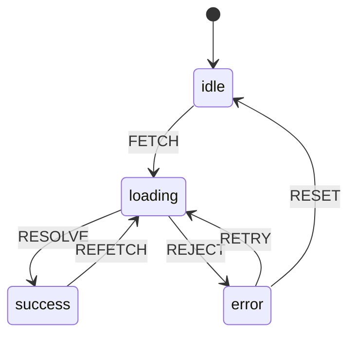
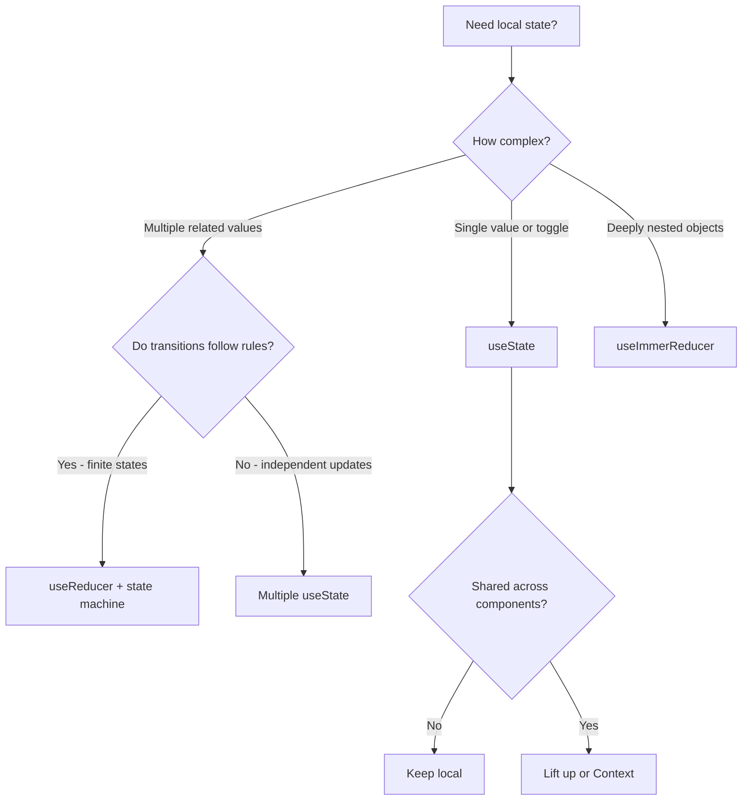

## Learning Objectives

- Master advanced useState patterns including lazy initialization and functional updates
- Implement useReducer for complex state transitions with TypeScript discriminated unions
- Model UI state as finite state machines for predictable behavior
- Integrate Immer for immutable state updates with mutable syntax
- Build optimistic update patterns for responsive user experiences

## Prerequisites

- Comfortable with React hooks basics (useState, useEffect)
- TypeScript generics and discriminated unions
- Understanding of immutability concepts

## Core Concepts

### Beyond Basic useState

Most tutorials show `useState` with primitives. Real applications demand more sophisticated patterns.

#### Lazy Initialization

When initial state requires expensive computation, pass a function instead of a value:

```typescript
// Bad — runs JSON.parse on EVERY render
const [user, setUser] = useState(JSON.parse(localStorage.getItem("user") ?? "null"));

// Good — runs JSON.parse only on mount
const [user, setUser] = useState(() => {
  const stored = localStorage.getItem("user");
  return stored ? (JSON.parse(stored) as User) : null;
});
```

React calls the initializer function only during the first render. Subsequent renders ignore it entirely.

#### Functional Updates

When new state depends on previous state, always use the updater function:

```typescript
interface CartItem {
  id: string;
  name: string;
  quantity: number;
  price: number;
}

function useCart() {
  const [items, setItems] = useState<CartItem[]>([]);

  const addItem = (product: Omit<CartItem, "quantity">) => {
    // Bad — stale closure risk with concurrent features
    // setItems([...items, { ...product, quantity: 1 }]);

    // Good — always reads latest state
    setItems((prev) => {
      const existing = prev.find((item) => item.id === product.id);
      if (existing) {
        return prev.map((item) =>
          item.id === product.id
            ? { ...item, quantity: item.quantity + 1 }
            : item
        );
      }
      return [...prev, { ...product, quantity: 1 }];
    });
  };

  const removeItem = (id: string) => {
    setItems((prev) => prev.filter((item) => item.id !== id));
  };

  const total = items.reduce((sum, item) => sum + item.price * item.quantity, 0);

  return { items, addItem, removeItem, total };
}
```

#### Grouped vs. Split State

```typescript
// Split — when values change independently
const [name, setName] = useState("");
const [email, setEmail] = useState("");

// Grouped — when values change together or represent one concept
const [position, setPosition] = useState({ x: 0, y: 0 });

// Anti-pattern: splitting what should be grouped
const [x, setX] = useState(0);
const [y, setY] = useState(0);
// This causes TWO re-renders for a single drag event
```

### useReducer for Complex State

When state transitions follow rules, `useReducer` brings predictability.

#### TypeScript-First Reducer Pattern

```typescript
interface TodoState {
  todos: Todo[];
  filter: "all" | "active" | "completed";
  editingId: string | null;
}

type TodoAction =
  | { type: "ADD_TODO"; payload: { text: string } }
  | { type: "TOGGLE_TODO"; payload: { id: string } }
  | { type: "DELETE_TODO"; payload: { id: string } }
  | { type: "SET_FILTER"; payload: { filter: TodoState["filter"] } }
  | { type: "START_EDITING"; payload: { id: string } }
  | { type: "SAVE_EDIT"; payload: { id: string; text: string } }
  | { type: "CANCEL_EDITING" };

function todoReducer(state: TodoState, action: TodoAction): TodoState {
  switch (action.type) {
    case "ADD_TODO":
      return {
        ...state,
        todos: [
          ...state.todos,
          {
            id: crypto.randomUUID(),
            text: action.payload.text,
            completed: false,
            createdAt: new Date(),
          },
        ],
      };

    case "TOGGLE_TODO":
      return {
        ...state,
        todos: state.todos.map((todo) =>
          todo.id === action.payload.id
            ? { ...todo, completed: !todo.completed }
            : todo
        ),
      };

    case "DELETE_TODO":
      return {
        ...state,
        todos: state.todos.filter((todo) => todo.id !== action.payload.id),
      };

    case "SET_FILTER":
      return { ...state, filter: action.payload.filter };

    case "START_EDITING":
      return { ...state, editingId: action.payload.id };

    case "SAVE_EDIT":
      return {
        ...state,
        editingId: null,
        todos: state.todos.map((todo) =>
          todo.id === action.payload.id
            ? { ...todo, text: action.payload.text }
            : todo
        ),
      };

    case "CANCEL_EDITING":
      return { ...state, editingId: null };
  }
}

const initialState: TodoState = {
  todos: [],
  filter: "all",
  editingId: null,
};

function TodoApp() {
  const [state, dispatch] = useReducer(todoReducer, initialState);

  const filteredTodos = state.todos.filter((todo) => {
    if (state.filter === "active") return !todo.completed;
    if (state.filter === "completed") return todo.completed;
    return true;
  });

  return (
    <div>
      <TodoInput onAdd={(text) => dispatch({ type: "ADD_TODO", payload: { text } })} />
      <FilterBar
        current={state.filter}
        onChange={(filter) => dispatch({ type: "SET_FILTER", payload: { filter } })}
      />
      <TodoList
        todos={filteredTodos}
        editingId={state.editingId}
        onToggle={(id) => dispatch({ type: "TOGGLE_TODO", payload: { id } })}
        onDelete={(id) => dispatch({ type: "DELETE_TODO", payload: { id } })}
        onStartEdit={(id) => dispatch({ type: "START_EDITING", payload: { id } })}
        onSaveEdit={(id, text) => dispatch({ type: "SAVE_EDIT", payload: { id, text } })}
        onCancelEdit={() => dispatch({ type: "CANCEL_EDITING" })}
      />
    </div>
  );
}
```

### State Machines with useReducer

Model UI states explicitly to eliminate impossible states:



```typescript
type FetchState<T> =
  | { status: "idle" }
  | { status: "loading" }
  | { status: "success"; data: T; lastUpdated: Date }
  | { status: "error"; error: Error; retryCount: number };

type FetchAction<T> =
  | { type: "FETCH" }
  | { type: "RESOLVE"; data: T }
  | { type: "REJECT"; error: Error }
  | { type: "RETRY" }
  | { type: "RESET" };

function createFetchReducer<T>() {
  return function fetchReducer(
    state: FetchState<T>,
    action: FetchAction<T>
  ): FetchState<T> {
    switch (state.status) {
      case "idle":
        if (action.type === "FETCH") return { status: "loading" };
        return state;

      case "loading":
        if (action.type === "RESOLVE")
          return { status: "success", data: action.data, lastUpdated: new Date() };
        if (action.type === "REJECT")
          return { status: "error", error: action.error, retryCount: 0 };
        return state;

      case "success":
        if (action.type === "FETCH") return { status: "loading" };
        return state;

      case "error":
        if (action.type === "RETRY") {
          return { status: "loading" };
        }
        if (action.type === "RESET") return { status: "idle" };
        return state;
    }
  };
}

function useFetch<T>(fetcher: () => Promise<T>) {
  const reducer = useMemo(() => createFetchReducer<T>(), []);
  const [state, dispatch] = useReducer(reducer, { status: "idle" });

  const execute = useCallback(async () => {
    dispatch({ type: "FETCH" });
    try {
      const data = await fetcher();
      dispatch({ type: "RESOLVE", data });
    } catch (err) {
      dispatch({ type: "REJECT", error: err instanceof Error ? err : new Error(String(err)) });
    }
  }, [fetcher]);

  return { ...state, execute, dispatch };
}
```

### Immutable Updates with Immer

Nested state updates become error-prone. Immer lets you write mutable-style code that produces immutable results:

```bash
npm install immer use-immer
```

```typescript
import { useImmerReducer } from "use-immer";

interface SpreadsheetState {
  cells: Record<string, { value: string; formula?: string }>;
  selectedCell: string | null;
  history: string[][];
}

type SpreadsheetAction =
  | { type: "SET_CELL"; row: number; col: number; value: string }
  | { type: "SELECT_CELL"; cell: string | null }
  | { type: "CLEAR_ROW"; row: number };

function spreadsheetReducer(draft: SpreadsheetState, action: SpreadsheetAction) {
  switch (action.type) {
    case "SET_CELL": {
      const key = `${action.row}:${action.col}`;
      draft.cells[key] = { value: action.value };
      break;
    }
    case "SELECT_CELL":
      draft.selectedCell = action.cell;
      break;
    case "CLEAR_ROW": {
      for (const key of Object.keys(draft.cells)) {
        if (key.startsWith(`${action.row}:`)) {
          delete draft.cells[key];
        }
      }
      break;
    }
  }
}
```

### Optimistic Updates Pattern

Update the UI immediately, then reconcile with the server response:

```typescript
type OptimisticAction<T> =
  | { type: "OPTIMISTIC_UPDATE"; optimisticData: T }
  | { type: "CONFIRM"; confirmedData: T }
  | { type: "ROLLBACK"; previousData: T };

function useOptimisticState<T>(initialData: T) {
  const [state, setState] = useState({
    data: initialData,
    previousData: initialData,
    isPending: false,
  });

  const optimisticUpdate = useCallback(
    async (newData: T, serverAction: () => Promise<T>) => {
      setState((prev) => ({
        data: newData,
        previousData: prev.data,
        isPending: true,
      }));

      try {
        const confirmed = await serverAction();
        setState({ data: confirmed, previousData: confirmed, isPending: false });
      } catch {
        setState((prev) => ({
          data: prev.previousData,
          previousData: prev.previousData,
          isPending: false,
        }));
      }
    },
    []
  );

  return { ...state, optimisticUpdate };
}

function LikeButton({ postId, initialCount }: { postId: string; initialCount: number }) {
  const { data: count, isPending, optimisticUpdate } = useOptimisticState(initialCount);

  const handleLike = () => {
    optimisticUpdate(count + 1, () =>
      fetch(`/api/posts/${postId}/like`, { method: "POST" }).then((r) => r.json())
    );
  };

  return (
    <button onClick={handleLike} disabled={isPending} className="flex items-center gap-2">
      <HeartIcon className={isPending ? "animate-pulse" : ""} />
      <span>{count}</span>
    </button>
  );
}
```

## When to Use useState vs. useReducer



## Best Practices

1. **Derive, don't store** — if a value can be computed from existing state, compute it. Don't `useState` for `fullName` when you have `firstName` and `lastName`.
2. **Normalize nested data** — flatten arrays of objects into `Record<string, T>` plus an `ids: string[]` array.
3. **Use discriminated unions** — TypeScript catches impossible states at compile time.
4. **Keep reducers pure** — no side effects, no API calls inside reducers.
5. **Colocate state** — start with state in the component that needs it. Lift only when required.

## Anti-Patterns to Avoid

- **Mirroring props in state** — use the prop directly or derive from it. `useEffect` to sync props to state is almost always wrong.
- **State for refs** — DOM references and mutable values that don't trigger renders belong in `useRef`.
- **Giant monolithic state** — a single `useState` object with 15 fields. Split into logical groups.
- **Dispatching in loops** — batch multiple related changes in one reducer action.

## Hands-On Exercise

### Build a Shopping Cart with Undo/Redo

1. Model cart state with `useImmerReducer` — items, quantities, applied coupons
2. Implement an undo stack by storing previous states (limit to 10 entries)
3. Add optimistic quantity updates that roll back on server error
4. Use discriminated unions for cart item states: `"in-stock"`, `"low-stock"`, `"out-of-stock"`
5. Derive the subtotal, tax, and total — never store computed values

**Stretch goal:** Implement a state machine for checkout flow: `cart → shipping → payment → review → confirmed`.

## Key Takeaways

- `useState` handles simple, independent state; `useReducer` handles state with rules
- Functional updates prevent stale closure bugs, especially with React 19 concurrent features
- State machines eliminate impossible UI states — model your status as discriminated unions
- Immer simplifies nested immutable updates without sacrificing performance
- Optimistic updates make UIs feel instant — always plan for rollback

## External Resources

- [React docs: Managing State](https://react.dev/learn/managing-state)
- [Immer Documentation](https://immerjs.github.io/immer/)
- [XState — State Machines for React](https://xstate.js.org/)
- [Kent C. Dodds: State Colocation](https://kentcdodds.com/blog/state-colocation-will-make-your-react-app-faster)
- [React 19 useOptimistic](https://react.dev/reference/react/useOptimistic)
