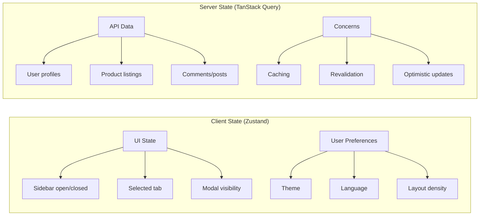
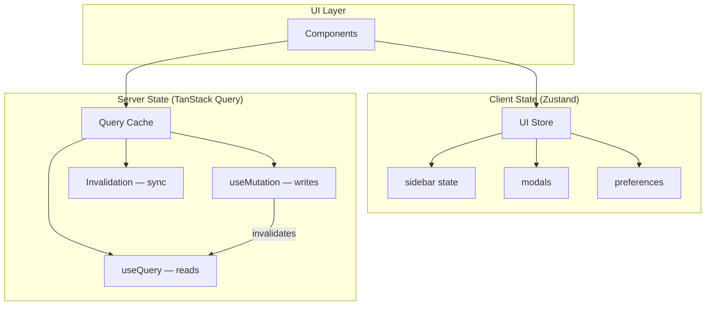

## Learning Objectives

- Distinguish client state from server state and choose the right tool for each
- Build type-safe Zustand stores with slices, middleware, and persistence
- Implement TanStack Query for data fetching with caching, mutations, and optimistic updates
- Design infinite query patterns for paginated lists
- Combine Zustand and TanStack Query for a complete state management architecture

## Prerequisites

- Solid understanding of Context API and its limitations
- Familiarity with async/await and REST APIs
- TypeScript generics and utility types

## Core Concepts

### Client State vs. Server State



**Client state** is owned by the browser — UI toggles, form inputs, preferences. It's synchronous, deterministic, and controlled entirely by user actions.

**Server state** is owned by the backend — it's async, can become stale, may be updated by other users, and requires caching strategy.

### Zustand: Lightweight Client State

```bash
npm install zustand
```

#### Basic Store

```typescript
import { create } from "zustand";

interface CounterStore {
  count: number;
  increment: () => void;
  decrement: () => void;
  reset: () => void;
}

const useCounterStore = create<CounterStore>((set) => ({
  count: 0,
  increment: () => set((state) => ({ count: state.count + 1 })),
  decrement: () => set((state) => ({ count: state.count - 1 })),
  reset: () => set({ count: 0 }),
}));

function Counter() {
  const { count, increment, decrement } = useCounterStore();
  return (
    <div className="flex items-center gap-4">
      <button onClick={decrement}>-</button>
      <span>{count}</span>
      <button onClick={increment}>+</button>
    </div>
  );
}
```

#### Selectors Prevent Unnecessary Re-renders

```typescript
// Bad — re-renders on ANY store change
const store = useCounterStore();

// Good — only re-renders when count changes
const count = useCounterStore((state) => state.count);

// Good — only re-renders when increment reference changes (it won't)
const increment = useCounterStore((state) => state.increment);
```

#### Real-World Store with Slices

```typescript
interface User {
  id: string;
  name: string;
  email: string;
  avatar: string;
}

interface Notification {
  id: string;
  message: string;
  type: "info" | "success" | "warning" | "error";
  read: boolean;
  createdAt: Date;
}

interface UISlice {
  sidebarOpen: boolean;
  commandPaletteOpen: boolean;
  toggleSidebar: () => void;
  openCommandPalette: () => void;
  closeCommandPalette: () => void;
}

interface NotificationSlice {
  notifications: Notification[];
  unreadCount: number;
  addNotification: (notification: Omit<Notification, "id" | "read" | "createdAt">) => void;
  markAsRead: (id: string) => void;
  markAllAsRead: () => void;
  dismissNotification: (id: string) => void;
}

interface AppStore extends UISlice, NotificationSlice {}

const useAppStore = create<AppStore>((set, get) => ({
  // UI Slice
  sidebarOpen: true,
  commandPaletteOpen: false,
  toggleSidebar: () => set((state) => ({ sidebarOpen: !state.sidebarOpen })),
  openCommandPalette: () => set({ commandPaletteOpen: true }),
  closeCommandPalette: () => set({ commandPaletteOpen: false }),

  // Notification Slice
  notifications: [],
  unreadCount: 0,
  addNotification: (notification) =>
    set((state) => {
      const newNotification: Notification = {
        ...notification,
        id: crypto.randomUUID(),
        read: false,
        createdAt: new Date(),
      };
      const notifications = [newNotification, ...state.notifications];
      return {
        notifications,
        unreadCount: notifications.filter((n) => !n.read).length,
      };
    }),
  markAsRead: (id) =>
    set((state) => {
      const notifications = state.notifications.map((n) =>
        n.id === id ? { ...n, read: true } : n
      );
      return {
        notifications,
        unreadCount: notifications.filter((n) => !n.read).length,
      };
    }),
  markAllAsRead: () =>
    set((state) => ({
      notifications: state.notifications.map((n) => ({ ...n, read: true })),
      unreadCount: 0,
    })),
  dismissNotification: (id) =>
    set((state) => {
      const notifications = state.notifications.filter((n) => n.id !== id);
      return {
        notifications,
        unreadCount: notifications.filter((n) => !n.read).length,
      };
    }),
}));
```

#### Middleware: Persistence and Devtools

```typescript
import { create } from "zustand";
import { devtools, persist, subscribeWithSelector } from "zustand/middleware";
import { immer } from "zustand/middleware/immer";

interface SettingsStore {
  theme: "light" | "dark" | "system";
  language: string;
  fontSize: number;
  setTheme: (theme: SettingsStore["theme"]) => void;
  setLanguage: (language: string) => void;
  setFontSize: (size: number) => void;
}

const useSettingsStore = create<SettingsStore>()(
  devtools(
    persist(
      immer((set) => ({
        theme: "system",
        language: "en",
        fontSize: 16,
        setTheme: (theme) =>
          set((state) => {
            state.theme = theme;
          }),
        setLanguage: (language) =>
          set((state) => {
            state.language = language;
          }),
        setFontSize: (size) =>
          set((state) => {
            state.fontSize = Math.max(12, Math.min(24, size));
          }),
      })),
      { name: "settings-storage" }
    ),
    { name: "SettingsStore" }
  )
);
```

### TanStack Query: Server State Management

```bash
npm install @tanstack/react-query @tanstack/react-query-devtools
```

#### Setup

```typescript
import { QueryClient, QueryClientProvider } from "@tanstack/react-query";
import { ReactQueryDevtools } from "@tanstack/react-query-devtools";

const queryClient = new QueryClient({
  defaultOptions: {
    queries: {
      staleTime: 1000 * 60 * 5, // 5 minutes
      gcTime: 1000 * 60 * 30,   // 30 minutes (garbage collection)
      retry: 3,
      refetchOnWindowFocus: true,
    },
  },
});

function App() {
  return (
    <QueryClientProvider client={queryClient}>
      <Router />
      <ReactQueryDevtools initialIsOpen={false} />
    </QueryClientProvider>
  );
}
```

#### Typed Query Hooks

```typescript
import { useQuery, useMutation, useQueryClient } from "@tanstack/react-query";

interface Post {
  id: string;
  title: string;
  content: string;
  author: User;
  createdAt: string;
  tags: string[];
}

const postKeys = {
  all: ["posts"] as const,
  lists: () => [...postKeys.all, "list"] as const,
  list: (filters: PostFilters) => [...postKeys.lists(), filters] as const,
  details: () => [...postKeys.all, "detail"] as const,
  detail: (id: string) => [...postKeys.details(), id] as const,
};

async function fetchPosts(filters: PostFilters): Promise<Post[]> {
  const params = new URLSearchParams(filters as Record<string, string>);
  const response = await fetch(`/api/posts?${params}`);
  if (!response.ok) throw new Error("Failed to fetch posts");
  return response.json();
}

function usePosts(filters: PostFilters) {
  return useQuery({
    queryKey: postKeys.list(filters),
    queryFn: () => fetchPosts(filters),
    placeholderData: (previousData) => previousData,
  });
}

function usePost(id: string) {
  return useQuery({
    queryKey: postKeys.detail(id),
    queryFn: async () => {
      const response = await fetch(`/api/posts/${id}`);
      if (!response.ok) throw new Error("Post not found");
      return response.json() as Promise<Post>;
    },
    enabled: !!id,
  });
}
```

#### Mutations with Optimistic Updates

```typescript
function useCreatePost() {
  const queryClient = useQueryClient();

  return useMutation({
    mutationFn: async (newPost: CreatePostInput) => {
      const response = await fetch("/api/posts", {
        method: "POST",
        headers: { "Content-Type": "application/json" },
        body: JSON.stringify(newPost),
      });
      if (!response.ok) throw new Error("Failed to create post");
      return response.json() as Promise<Post>;
    },
    onMutate: async (newPost) => {
      await queryClient.cancelQueries({ queryKey: postKeys.lists() });

      const previousPosts = queryClient.getQueryData<Post[]>(postKeys.lists());

      const optimisticPost: Post = {
        id: `temp-${Date.now()}`,
        ...newPost,
        author: getCurrentUser(),
        createdAt: new Date().toISOString(),
      };

      queryClient.setQueryData<Post[]>(postKeys.lists(), (old) =>
        old ? [optimisticPost, ...old] : [optimisticPost]
      );

      return { previousPosts };
    },
    onError: (_err, _newPost, context) => {
      if (context?.previousPosts) {
        queryClient.setQueryData(postKeys.lists(), context.previousPosts);
      }
    },
    onSettled: () => {
      queryClient.invalidateQueries({ queryKey: postKeys.lists() });
    },
  });
}
```

#### Infinite Queries for Pagination

```typescript
import { useInfiniteQuery } from "@tanstack/react-query";

interface PaginatedResponse<T> {
  data: T[];
  nextCursor: string | null;
  totalCount: number;
}

function useInfinitePosts(filters: PostFilters) {
  return useInfiniteQuery({
    queryKey: [...postKeys.list(filters), "infinite"],
    queryFn: async ({ pageParam }) => {
      const params = new URLSearchParams({
        ...filters,
        cursor: pageParam ?? "",
        limit: "20",
      });
      const response = await fetch(`/api/posts?${params}`);
      if (!response.ok) throw new Error("Failed to fetch");
      return response.json() as Promise<PaginatedResponse<Post>>;
    },
    initialPageParam: null as string | null,
    getNextPageParam: (lastPage) => lastPage.nextCursor,
  });
}

function InfinitePostList() {
  const { data, fetchNextPage, hasNextPage, isFetchingNextPage, status } =
    useInfinitePosts({ tag: "react" });

  const allPosts = data?.pages.flatMap((page) => page.data) ?? [];

  if (status === "pending") return <PostListSkeleton />;
  if (status === "error") return <ErrorMessage />;

  return (
    <div>
      {allPosts.map((post) => (
        <PostCard key={post.id} post={post} />
      ))}
      {hasNextPage && (
        <button
          onClick={() => fetchNextPage()}
          disabled={isFetchingNextPage}
          className="mt-4 w-full rounded bg-blue-600 px-4 py-2 text-white"
        >
          {isFetchingNextPage ? "Loading more..." : "Load More"}
        </button>
      )}
    </div>
  );
}
```

### Combining Zustand + TanStack Query



```typescript
// Zustand for UI state
const useEditorStore = create<EditorStore>((set) => ({
  selectedPostId: null,
  isEditing: false,
  draftContent: "",
  selectPost: (id: string) => set({ selectedPostId: id, isEditing: false }),
  startEditing: () => set({ isEditing: true }),
  updateDraft: (content: string) => set({ draftContent: content }),
  cancelEditing: () => set({ isEditing: false, draftContent: "" }),
}));

// TanStack Query for server data
function PostEditor() {
  const { selectedPostId, isEditing, draftContent, startEditing, updateDraft, cancelEditing } =
    useEditorStore();

  const { data: post, isLoading } = usePost(selectedPostId ?? "");
  const updatePost = useUpdatePost();

  const handleSave = () => {
    if (!selectedPostId) return;
    updatePost.mutate(
      { id: selectedPostId, content: draftContent },
      {
        onSuccess: () => cancelEditing(),
      }
    );
  };

  if (isLoading) return <EditorSkeleton />;
  if (!post) return <EmptyState />;

  return (
    <article>
      <h1>{post.title}</h1>
      {isEditing ? (
        <div>
          <textarea value={draftContent} onChange={(e) => updateDraft(e.target.value)} />
          <div className="flex gap-2">
            <button onClick={handleSave}>Save</button>
            <button onClick={cancelEditing}>Cancel</button>
          </div>
        </div>
      ) : (
        <div>
          <p>{post.content}</p>
          <button onClick={startEditing}>Edit</button>
        </div>
      )}
    </article>
  );
}
```

## Best Practices

1. **Use query key factories** — centralize keys to avoid mismatches when invalidating
2. **Set appropriate staleTime** — not everything needs real-time freshness
3. **Zustand selectors** — always select the minimum slice to prevent re-renders
4. **Separate concerns** — Zustand for UI, TanStack Query for server data, never mix
5. **Optimistic updates for UX** — update the cache before the server confirms, roll back on error
6. **Prefetch on hover** — use `queryClient.prefetchQuery` for instant navigation

## Anti-Patterns to Avoid

- **Storing server data in Zustand** — use TanStack Query for anything from an API
- **Manual cache management** — let TanStack Query handle staleness, refetching, and garbage collection
- **Too many stores** — Zustand stores are cheap, but group related state logically
- **Ignoring error/loading states** — TanStack Query gives you these for free, always handle them
- **Not using devtools** — both Zustand and TanStack Query have excellent devtools

## Hands-On Exercise

### Build a Task Dashboard

1. Create a Zustand store for UI state: selected project, view mode (board/list/calendar), sidebar filters
2. Use TanStack Query to fetch projects, tasks, and team members from a REST API
3. Implement optimistic updates for task status changes (drag & drop between columns)
4. Add infinite scrolling for the activity feed using `useInfiniteQuery`
5. Implement prefetching: hover over a task card to prefetch its detail view
6. Persist the Zustand UI preferences to localStorage

## Key Takeaways

- Client state (UI) and server state (API data) are fundamentally different — use different tools
- Zustand offers a minimal API with excellent TypeScript support and selector-based re-render optimization
- TanStack Query handles caching, background refetching, pagination, and mutations out of the box
- Query key factories prevent cache invalidation bugs in large applications
- Combining both libraries gives you a clean, scalable state management architecture

## External Resources

- [Zustand Documentation](https://zustand-demo.pmnd.rs/)
- [TanStack Query Documentation](https://tanstack.com/query/latest)
- [TkDodo's Blog: Practical React Query](https://tkdodo.eu/blog/practical-react-query)
- [Zustand: Splitting stores into slices](https://zustand-demo.pmnd.rs/docs/guides/slices-pattern)
- [TanStack Query: Query Key Factory](https://tkdodo.eu/blog/effective-react-query-keys)
