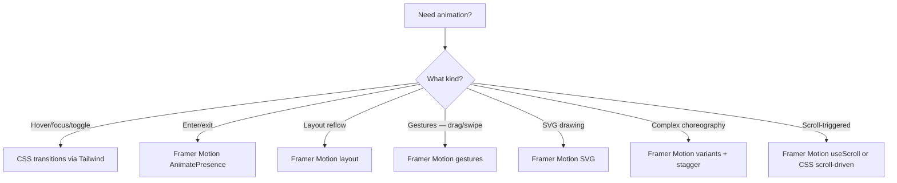

## Learning Objectives

- Implement fluid animations with Framer Motion's declarative API
- Apply CSS transitions and keyframes for lightweight effects
- Build layout animations that smoothly transition between DOM states
- Add gesture-based interactions: drag, hover, tap, and swipe
- Create page transitions with AnimatePresence for route changes
- Animate SVG paths for drawing effects and data visualization

## Prerequisites

- React component patterns and state management
- Tailwind CSS for styling
- Basic understanding of CSS transforms and transitions

## Core Concepts

### CSS Transitions: The Lightweight Default

For simple hover, focus, and toggle effects, CSS transitions via Tailwind are sufficient:

```typescript
function AnimatedCard({ title, children }: { title: string; children: ReactNode }) {
  return (
    <div
      className="rounded-lg border bg-white p-6 shadow-sm
                 transition-all duration-200 ease-out
                 hover:-translate-y-1 hover:shadow-lg
                 active:scale-[0.98]
                 dark:bg-gray-800"
    >
      <h3 className="font-semibold">{title}</h3>
      <div className="mt-2">{children}</div>
    </div>
  );
}

function ExpandableSection({ title, children }: { title: string; children: ReactNode }) {
  const [isOpen, setIsOpen] = useState(false);

  return (
    <div className="border-b">
      <button
        onClick={() => setIsOpen(!isOpen)}
        className="flex w-full items-center justify-between py-4"
      >
        <span className="font-medium">{title}</span>
        <svg
          className={`h-5 w-5 transition-transform duration-200 ${isOpen ? "rotate-180" : ""}`}
          viewBox="0 0 20 20"
          fill="currentColor"
        >
          <path fillRule="evenodd" d="M5.23 7.21a.75.75 0 011.06.02L10 11.168l3.71-3.938a.75.75 0 111.08 1.04l-4.25 4.5a.75.75 0 01-1.08 0l-4.25-4.5a.75.75 0 01.02-1.06z" />
        </svg>
      </button>
      <div
        className={`grid transition-[grid-template-rows] duration-300 ease-out ${
          isOpen ? "grid-rows-[1fr]" : "grid-rows-[0fr]"
        }`}
      >
        <div className="overflow-hidden">
          <div className="pb-4">{children}</div>
        </div>
      </div>
    </div>
  );
}
```

### CSS Keyframe Animations

```typescript
// Add to your CSS
const keyframeStyles = `
@keyframes shimmer {
  0% { background-position: -200% 0; }
  100% { background-position: 200% 0; }
}

@keyframes bounce-in {
  0% { transform: scale(0); opacity: 0; }
  50% { transform: scale(1.1); }
  100% { transform: scale(1); opacity: 1; }
}

@keyframes slide-in-right {
  from { transform: translateX(100%); opacity: 0; }
  to { transform: translateX(0); opacity: 1; }
}
`;

function SkeletonLoader({ className }: { className?: string }) {
  return (
    <div
      className={cn(
        "animate-pulse rounded bg-gradient-to-r from-gray-200 via-gray-100 to-gray-200 bg-[length:200%_100%]",
        className
      )}
      style={{ animation: "shimmer 1.5s infinite" }}
    />
  );
}

function NotificationToast({ message }: { message: string }) {
  return (
    <div
      className="rounded-lg bg-gray-900 px-4 py-3 text-white shadow-lg"
      style={{ animation: "slide-in-right 0.3s ease-out" }}
    >
      {message}
    </div>
  );
}
```

### Framer Motion: Production-Grade Animation

```bash
npm install motion
```

#### Basic Animations

```typescript
import { motion } from "motion/react";

function FadeInCard({ children }: { children: ReactNode }) {
  return (
    <motion.div
      initial={{ opacity: 0, y: 20 }}
      animate={{ opacity: 1, y: 0 }}
      transition={{ duration: 0.4, ease: "easeOut" }}
      className="rounded-lg border bg-white p-6 shadow-sm"
    >
      {children}
    </motion.div>
  );
}

function StaggeredList({ items }: { items: Item[] }) {
  return (
    <motion.ul
      initial="hidden"
      animate="visible"
      variants={{
        hidden: { opacity: 0 },
        visible: {
          opacity: 1,
          transition: { staggerChildren: 0.08 },
        },
      }}
      className="space-y-2"
    >
      {items.map((item) => (
        <motion.li
          key={item.id}
          variants={{
            hidden: { opacity: 0, x: -20 },
            visible: { opacity: 1, x: 0 },
          }}
          className="rounded border p-3"
        >
          {item.name}
        </motion.li>
      ))}
    </motion.ul>
  );
}
```

#### AnimatePresence: Enter/Exit Animations

```typescript
import { AnimatePresence, motion } from "motion/react";

function NotificationStack({ notifications }: { notifications: Notification[] }) {
  return (
    <div className="fixed bottom-4 right-4 z-50 flex flex-col gap-2">
      <AnimatePresence>
        {notifications.map((notification) => (
          <motion.div
            key={notification.id}
            initial={{ opacity: 0, x: 100, scale: 0.9 }}
            animate={{ opacity: 1, x: 0, scale: 1 }}
            exit={{ opacity: 0, x: 100, scale: 0.9 }}
            transition={{ type: "spring", stiffness: 300, damping: 25 }}
            className="w-80 rounded-lg bg-white p-4 shadow-lg"
          >
            <p className="font-medium">{notification.title}</p>
            <p className="text-sm text-gray-600">{notification.message}</p>
          </motion.div>
        ))}
      </AnimatePresence>
    </div>
  );
}
```

#### Layout Animations

Framer Motion can animate layout changes — items reordering, sizes changing:

```typescript
function FilterableGrid({ items }: { items: Item[] }) {
  const [filter, setFilter] = useState("all");

  const filteredItems = items.filter(
    (item) => filter === "all" || item.category === filter
  );

  return (
    <div>
      <div className="mb-4 flex gap-2">
        {["all", "design", "engineering", "marketing"].map((cat) => (
          <button
            key={cat}
            onClick={() => setFilter(cat)}
            className={cn(
              "rounded-full px-3 py-1 text-sm capitalize",
              filter === cat ? "bg-blue-600 text-white" : "bg-gray-100"
            )}
          >
            {cat}
          </button>
        ))}
      </div>

      <motion.div layout className="grid grid-cols-3 gap-4">
        <AnimatePresence>
          {filteredItems.map((item) => (
            <motion.div
              key={item.id}
              layout
              initial={{ opacity: 0, scale: 0.8 }}
              animate={{ opacity: 1, scale: 1 }}
              exit={{ opacity: 0, scale: 0.8 }}
              transition={{ layout: { type: "spring", stiffness: 300, damping: 30 } }}
              className="rounded-lg border p-4"
            >
              <p className="font-medium">{item.name}</p>
              <span className="text-sm text-gray-500">{item.category}</span>
            </motion.div>
          ))}
        </AnimatePresence>
      </motion.div>
    </div>
  );
}
```

#### Gesture Animations

```typescript
function DraggableCard({ children }: { children: ReactNode }) {
  return (
    <motion.div
      drag
      dragConstraints={{ left: 0, right: 0, top: 0, bottom: 0 }}
      dragElastic={0.1}
      whileDrag={{ scale: 1.05, boxShadow: "0 10px 30px rgba(0,0,0,0.15)" }}
      whileHover={{ scale: 1.02 }}
      whileTap={{ scale: 0.98 }}
      className="cursor-grab rounded-lg border bg-white p-6 active:cursor-grabbing"
    >
      {children}
    </motion.div>
  );
}

function SwipeToDelete({
  children,
  onDelete,
}: {
  children: ReactNode;
  onDelete: () => void;
}) {
  return (
    <motion.div
      drag="x"
      dragConstraints={{ left: -150, right: 0 }}
      onDragEnd={(_, info) => {
        if (info.offset.x < -100) onDelete();
      }}
      className="relative"
    >
      <div className="absolute inset-y-0 right-0 flex items-center bg-red-500 px-6 text-white">
        Delete
      </div>
      <motion.div className="relative z-10 bg-white">{children}</motion.div>
    </motion.div>
  );
}
```

#### Page Transitions

```typescript
import { AnimatePresence, motion } from "motion/react";
import { useLocation, useOutlet } from "react-router";

function AnimatedOutlet() {
  const location = useLocation();
  const outlet = useOutlet();

  return (
    <AnimatePresence mode="wait">
      <motion.div
        key={location.pathname}
        initial={{ opacity: 0, y: 10 }}
        animate={{ opacity: 1, y: 0 }}
        exit={{ opacity: 0, y: -10 }}
        transition={{ duration: 0.2 }}
      >
        {outlet}
      </motion.div>
    </AnimatePresence>
  );
}

function Layout() {
  return (
    <div>
      <Navigation />
      <main className="p-6">
        <AnimatedOutlet />
      </main>
    </div>
  );
}
```

### SVG Animation

```typescript
function DrawingIcon() {
  return (
    <motion.svg
      width="100"
      height="100"
      viewBox="0 0 100 100"
      initial="hidden"
      animate="visible"
    >
      <motion.circle
        cx="50"
        cy="50"
        r="40"
        stroke="#3b82f6"
        strokeWidth="3"
        fill="none"
        variants={{
          hidden: { pathLength: 0 },
          visible: {
            pathLength: 1,
            transition: { duration: 1.5, ease: "easeInOut" },
          },
        }}
      />
      <motion.path
        d="M30 50 L45 65 L70 35"
        stroke="#10b981"
        strokeWidth="3"
        fill="none"
        strokeLinecap="round"
        strokeLinejoin="round"
        variants={{
          hidden: { pathLength: 0, opacity: 0 },
          visible: {
            pathLength: 1,
            opacity: 1,
            transition: { duration: 0.8, delay: 1.2, ease: "easeOut" },
          },
        }}
      />
    </motion.svg>
  );
}
```

### Respecting Reduced Motion

```typescript
import { useReducedMotion } from "motion/react";

function AccessibleAnimation({ children }: { children: ReactNode }) {
  const prefersReduced = useReducedMotion();

  return (
    <motion.div
      initial={prefersReduced ? false : { opacity: 0, y: 20 }}
      animate={{ opacity: 1, y: 0 }}
      transition={prefersReduced ? { duration: 0 } : { duration: 0.4 }}
    >
      {children}
    </motion.div>
  );
}
```

## Animation Decision Tree



## Best Practices

1. **CSS transitions first** — Tailwind's `transition-*` handles 80% of animation needs
2. **Framer Motion for complex cases** — enter/exit, layout, gestures, choreography
3. **Spring physics > duration** — springs feel more natural than linear/ease-out
4. **Respect `prefers-reduced-motion`** — always check and respect this preference
5. **Animate transforms, not layout properties** — `transform` and `opacity` are GPU-accelerated
6. **Keep animations under 300ms** — longer feels sluggish for UI interactions

## Anti-Patterns to Avoid

- **Animating `width`, `height`, `margin`** — causes layout recalculation; use `transform: scale()`
- **Animation for animation's sake** — every animation should communicate state change or guide attention
- **Blocking interactions** — users should be able to act during animations
- **Inconsistent timing** — use a shared motion config for consistent feel across the app

## Hands-On Exercise

### Build an Animated Dashboard

1. Create staggered fade-in for dashboard cards on page load
2. Build an `AnimatePresence`-powered notification system with enter/exit animations
3. Implement a filterable grid with layout animations when items reorder
4. Add a swipe-to-delete gesture on a list of items
5. Create page transitions between dashboard routes
6. Build a drawing SVG logo animation for the loading screen

## Key Takeaways

- CSS transitions handle simple hover/toggle animations with zero JavaScript overhead
- Framer Motion excels at enter/exit, layout, gesture, and choreographed animations
- Spring physics produce more natural-feeling motion than duration-based easing
- `AnimatePresence` is essential for exit animations — React normally unmounts instantly
- Always respect `prefers-reduced-motion` for accessibility compliance

## External Resources

- [Framer Motion Documentation](https://motion.dev/)
- [web.dev: Animations and Performance](https://web.dev/articles/animations-and-performance)
- [MDN: CSS Transitions](https://developer.mozilla.org/en-US/docs/Web/CSS/CSS_transitions)
- [Josh Comeau: An Interactive Guide to CSS Transitions](https://www.joshwcomeau.com/animation/css-transitions/)
- [prefers-reduced-motion](https://developer.mozilla.org/en-US/docs/Web/CSS/@media/prefers-reduced-motion)
