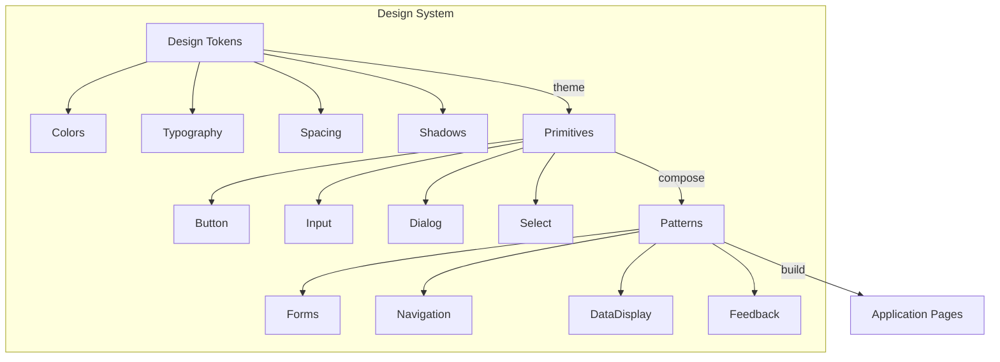

## Learning Objectives

- Understand design system principles: consistency, composability, accessibility
- Adopt the shadcn/ui architecture — copy-paste components you own
- Build on Radix UI primitives for accessible, unstyled base components
- Implement variant APIs using Class Variance Authority (CVA)
- Design components that are flexible, accessible, and consistent by default

## Prerequisites

- Tailwind CSS utility-first styling
- Advanced render patterns (compound components, headless hooks)
- Basic understanding of WAI-ARIA attributes

## Core Concepts

### What Is a Design System?



A design system provides three layers:
1. **Design Tokens** — colors, typography, spacing, borders, shadows
2. **Primitives** — atomic, accessible components (Button, Input, Dialog)
3. **Patterns** — composed components for common UX scenarios (Forms, Data Tables)

### The shadcn/ui Philosophy

Unlike traditional component libraries (Material UI, Ant Design), shadcn/ui gives you the source code. Components are copied into your project, not installed as dependencies.

**Benefits:**
- Full ownership — modify any component without fighting library internals
- No version lock — update components independently
- Tree-shakeable by default — only import what you use
- Style with your own design tokens

```bash
# Initialize shadcn/ui
npx shadcn@latest init
npx shadcn@latest add button dialog input
```

This creates files in `src/components/ui/` that you own and can modify.

### Radix UI Primitives

Radix provides unstyled, accessible component primitives:

```bash
npm install @radix-ui/react-dialog @radix-ui/react-dropdown-menu @radix-ui/react-tooltip
```

```typescript
import * as Dialog from "@radix-ui/react-dialog";

function ConfirmDialog({
  trigger,
  title,
  description,
  onConfirm,
  confirmLabel = "Confirm",
  cancelLabel = "Cancel",
}: {
  trigger: ReactNode;
  title: string;
  description: string;
  onConfirm: () => void;
  confirmLabel?: string;
  cancelLabel?: string;
}) {
  return (
    <Dialog.Root>
      <Dialog.Trigger asChild>{trigger}</Dialog.Trigger>
      <Dialog.Portal>
        <Dialog.Overlay className="fixed inset-0 bg-black/50 data-[state=open]:animate-fade-in" />
        <Dialog.Content
          className="fixed left-1/2 top-1/2 w-full max-w-md -translate-x-1/2 -translate-y-1/2
                     rounded-lg bg-white p-6 shadow-xl
                     data-[state=open]:animate-slide-up
                     dark:bg-gray-900"
        >
          <Dialog.Title className="text-lg font-semibold">{title}</Dialog.Title>
          <Dialog.Description className="mt-2 text-sm text-gray-600 dark:text-gray-400">
            {description}
          </Dialog.Description>
          <div className="mt-6 flex justify-end gap-3">
            <Dialog.Close asChild>
              <button className="rounded-md border px-4 py-2 text-sm hover:bg-gray-50">
                {cancelLabel}
              </button>
            </Dialog.Close>
            <Dialog.Close asChild>
              <button
                onClick={onConfirm}
                className="rounded-md bg-red-600 px-4 py-2 text-sm text-white hover:bg-red-700"
              >
                {confirmLabel}
              </button>
            </Dialog.Close>
          </div>
          <Dialog.Close asChild>
            <button
              className="absolute right-4 top-4 text-gray-400 hover:text-gray-600"
              aria-label="Close"
            >
              ✕
            </button>
          </Dialog.Close>
        </Dialog.Content>
      </Dialog.Portal>
    </Dialog.Root>
  );
}
```

Radix handles:
- Focus trapping inside the dialog
- Escape key to close
- Click outside to close
- Scroll locking on the body
- Proper ARIA attributes
- Animation states via `data-[state=open/closed]`

### Class Variance Authority (CVA)

CVA creates variant-driven class generation with full TypeScript support:

```bash
npm install class-variance-authority
```

```typescript
import { cva, type VariantProps } from "class-variance-authority";
import { cn } from "@/lib/utils";

const buttonVariants = cva(
  // Base styles (always applied)
  "inline-flex items-center justify-center rounded-md text-sm font-medium transition-colors focus-visible:outline-none focus-visible:ring-2 focus-visible:ring-ring disabled:pointer-events-none disabled:opacity-50",
  {
    variants: {
      variant: {
        default: "bg-primary text-primary-foreground hover:bg-primary/90",
        destructive: "bg-destructive text-destructive-foreground hover:bg-destructive/90",
        outline: "border border-input bg-background hover:bg-accent hover:text-accent-foreground",
        secondary: "bg-secondary text-secondary-foreground hover:bg-secondary/80",
        ghost: "hover:bg-accent hover:text-accent-foreground",
        link: "text-primary underline-offset-4 hover:underline",
      },
      size: {
        sm: "h-8 rounded-md px-3 text-xs",
        md: "h-10 px-4 py-2",
        lg: "h-12 rounded-md px-8 text-base",
        icon: "h-10 w-10",
      },
    },
    defaultVariants: {
      variant: "default",
      size: "md",
    },
  }
);

interface ButtonProps
  extends React.ButtonHTMLAttributes<HTMLButtonElement>,
    VariantProps<typeof buttonVariants> {
  asChild?: boolean;
}

const Button = forwardRef<HTMLButtonElement, ButtonProps>(
  ({ className, variant, size, asChild = false, ...props }, ref) => {
    const Comp = asChild ? Slot : "button";
    return (
      <Comp
        className={cn(buttonVariants({ variant, size, className }))}
        ref={ref}
        {...props}
      />
    );
  }
);
Button.displayName = "Button";

export { Button, buttonVariants };
```

Usage:

```typescript
<Button>Default</Button>
<Button variant="destructive" size="lg">Delete Account</Button>
<Button variant="outline" size="sm">Cancel</Button>
<Button variant="ghost" size="icon"><SearchIcon /></Button>
<Button variant="link">Learn more</Button>
```

### Building Accessible Components

```typescript
import { cva, type VariantProps } from "class-variance-authority";
import { cn } from "@/lib/utils";

const badgeVariants = cva(
  "inline-flex items-center rounded-full border px-2.5 py-0.5 text-xs font-semibold transition-colors",
  {
    variants: {
      variant: {
        default: "border-transparent bg-primary text-primary-foreground",
        secondary: "border-transparent bg-secondary text-secondary-foreground",
        success: "border-transparent bg-green-100 text-green-800 dark:bg-green-900 dark:text-green-100",
        warning: "border-transparent bg-yellow-100 text-yellow-800 dark:bg-yellow-900 dark:text-yellow-100",
        destructive: "border-transparent bg-red-100 text-red-800 dark:bg-red-900 dark:text-red-100",
        outline: "text-foreground",
      },
    },
    defaultVariants: {
      variant: "default",
    },
  }
);

interface BadgeProps
  extends React.HTMLAttributes<HTMLDivElement>,
    VariantProps<typeof badgeVariants> {}

function Badge({ className, variant, ...props }: BadgeProps) {
  return <div className={cn(badgeVariants({ variant }), className)} {...props} />;
}
```

### Input Component with Label and Error

```typescript
import { forwardRef, useId } from "react";
import { cn } from "@/lib/utils";

interface InputProps extends React.InputHTMLAttributes<HTMLInputElement> {
  label?: string;
  error?: string;
  hint?: string;
}

const Input = forwardRef<HTMLInputElement, InputProps>(
  ({ className, label, error, hint, id: providedId, ...props }, ref) => {
    const generatedId = useId();
    const id = providedId ?? generatedId;
    const errorId = `${id}-error`;
    const hintId = `${id}-hint`;

    return (
      <div className="space-y-1.5">
        {label && (
          <label htmlFor={id} className="block text-sm font-medium text-gray-700 dark:text-gray-300">
            {label}
            {props.required && <span className="ml-1 text-red-500">*</span>}
          </label>
        )}
        <input
          id={id}
          ref={ref}
          aria-invalid={!!error}
          aria-describedby={cn(error && errorId, hint && hintId)}
          className={cn(
            "flex h-10 w-full rounded-md border border-input bg-background px-3 py-2 text-sm",
            "placeholder:text-muted-foreground",
            "focus-visible:outline-none focus-visible:ring-2 focus-visible:ring-ring",
            "disabled:cursor-not-allowed disabled:opacity-50",
            error && "border-red-500 focus-visible:ring-red-500",
            className
          )}
          {...props}
        />
        {hint && !error && (
          <p id={hintId} className="text-xs text-gray-500">{hint}</p>
        )}
        {error && (
          <p id={errorId} role="alert" className="text-xs text-red-600">{error}</p>
        )}
      </div>
    );
  }
);
Input.displayName = "Input";
```

### Component Composition in Practice

```typescript
function UserSettingsForm() {
  return (
    <form className="space-y-6">
      <div className="grid gap-4 sm:grid-cols-2">
        <Input label="First Name" placeholder="John" required />
        <Input label="Last Name" placeholder="Doe" required />
      </div>
      <Input label="Email" type="email" hint="We'll never share your email." required />
      <Input label="Bio" error="Bio must be under 200 characters" />
      <div className="flex items-center gap-2">
        <Badge variant="success">Active</Badge>
        <Badge variant="secondary">Pro Plan</Badge>
      </div>
      <div className="flex gap-3">
        <Button type="submit">Save Changes</Button>
        <Button variant="outline" type="button">Cancel</Button>
        <ConfirmDialog
          trigger={<Button variant="destructive">Delete Account</Button>}
          title="Delete Account?"
          description="This action cannot be undone. All your data will be permanently removed."
          onConfirm={() => deleteAccount()}
          confirmLabel="Yes, delete my account"
        />
      </div>
    </form>
  );
}
```

## Accessibility Checklist

| Requirement | Implementation |
|------------|----------------|
| Keyboard navigation | Radix handles focus, Tab, Escape, Arrow keys |
| Screen reader labels | `aria-label`, `aria-describedby`, semantic HTML |
| Color contrast | WCAG AA (4.5:1 for text, 3:1 for large text) |
| Focus indicators | `focus-visible:ring-2` utility |
| Error announcements | `role="alert"` on error messages |
| Reduced motion | `motion-reduce:` Tailwind variant |

## Best Practices

1. **Build on Radix primitives** — don't reinvent keyboard navigation and focus management
2. **CVA for all variant components** — type-safe variants with composable defaults
3. **Always forward `ref`** — library components must work with `forwardRef`
4. **Accept `className` prop** — let consumers extend styles through `cn()`
5. **Auto-generate IDs** — use `useId()` for label-input associations
6. **ARIA by default** — `aria-invalid`, `aria-describedby`, `role="alert"` on errors

## Anti-Patterns to Avoid

- **Wrapping Radix without `asChild`** — extra DOM nodes break styling and semantics
- **Hardcoded colors in components** — use design tokens for theme-ability
- **Missing keyboard support** — every interactive element must be keyboard accessible
- **Prop explosion** — use CVA variants instead of boolean props for visual variations
- **Ignoring `displayName`** — React DevTools need it for debugging `forwardRef` components

## Hands-On Exercise

### Build a Component Library

1. Set up a project with Tailwind CSS, Radix UI, and CVA
2. Create these core components: `Button`, `Input`, `Badge`, `Card`, `Dialog`, `DropdownMenu`
3. Add variant support to each: sizes, colors, states
4. Ensure every component passes keyboard and screen reader testing
5. Create a Storybook-style showcase page that demonstrates all variants
6. Build a complete form using your components: login, registration, or settings

## Key Takeaways

- Design systems provide tokens, primitives, and patterns for consistent UI
- shadcn/ui gives you ownership — copy components into your project, modify freely
- Radix UI handles the hardest part of component design: accessibility
- CVA creates type-safe variant APIs that compose cleanly with Tailwind
- Always build accessible by default — `aria-*` attributes, keyboard navigation, focus management

## External Resources

- [shadcn/ui Documentation](https://ui.shadcn.com/)
- [Radix UI Primitives](https://www.radix-ui.com/primitives)
- [CVA Documentation](https://cva.style/docs)
- [WAI-ARIA Authoring Practices](https://www.w3.org/WAI/ARIA/apg/)
- [Inclusive Components by Heydon Pickering](https://inclusive-components.design/)
