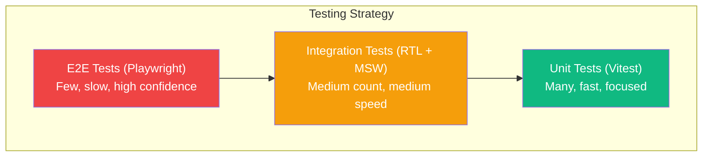

## Learning Objectives

- Write end-to-end tests with Playwright that cover real user workflows
- Implement component testing for isolated UI verification
- Set up visual regression testing to catch unintended style changes
- Test accessibility compliance with automated axe-core scans
- Integrate all test types into a CI/CD pipeline

## Prerequisites

- Unit testing with Vitest and React Testing Library
- React Router for multi-page navigation
- Basic CI/CD concepts (GitHub Actions)

## Core Concepts

### The Testing Pyramid



| Layer | Tool | Speed | Confidence | What to Test |
|-------|------|-------|-----------|--------------|
| Unit | Vitest + RTL | Fast (ms) | Component-level | Individual components, hooks, utils |
| Integration | RTL + MSW | Medium (ms) | Feature-level | User flows within a page |
| E2E | Playwright | Slow (seconds) | System-level | Critical user journeys across pages |

### Playwright Setup

```bash
npm install -D @playwright/test
npx playwright install
```

```typescript
// playwright.config.ts
import { defineConfig, devices } from "@playwright/test";

export default defineConfig({
  testDir: "./e2e",
  fullyParallel: true,
  forbidOnly: !!process.env.CI,
  retries: process.env.CI ? 2 : 0,
  workers: process.env.CI ? 1 : undefined,
  reporter: process.env.CI ? "github" : "html",
  use: {
    baseURL: "http://localhost:5173",
    trace: "on-first-retry",
    screenshot: "only-on-failure",
  },
  projects: [
    { name: "chromium", use: { ...devices["Desktop Chrome"] } },
    { name: "firefox", use: { ...devices["Desktop Firefox"] } },
    { name: "webkit", use: { ...devices["Desktop Safari"] } },
    { name: "mobile-chrome", use: { ...devices["Pixel 5"] } },
    { name: "mobile-safari", use: { ...devices["iPhone 12"] } },
  ],
  webServer: {
    command: "npm run dev",
    url: "http://localhost:5173",
    reuseExistingServer: !process.env.CI,
  },
});
```

### Writing E2E Tests

```typescript
// e2e/auth.spec.ts
import { test, expect } from "@playwright/test";

test.describe("Authentication", () => {
  test("user can log in and access dashboard", async ({ page }) => {
    await page.goto("/login");

    await page.getByLabel(/email/i).fill("user@example.com");
    await page.getByLabel(/password/i).fill("password123");
    await page.getByRole("button", { name: /sign in/i }).click();

    await expect(page).toHaveURL("/dashboard");
    await expect(page.getByRole("heading", { name: /dashboard/i })).toBeVisible();
    await expect(page.getByText(/welcome.*jane/i)).toBeVisible();
  });

  test("shows error for invalid credentials", async ({ page }) => {
    await page.goto("/login");

    await page.getByLabel(/email/i).fill("wrong@example.com");
    await page.getByLabel(/password/i).fill("wrongpassword");
    await page.getByRole("button", { name: /sign in/i }).click();

    await expect(page.getByText(/invalid credentials/i)).toBeVisible();
    await expect(page).toHaveURL("/login");
  });

  test("redirects unauthenticated users to login", async ({ page }) => {
    await page.goto("/dashboard");
    await expect(page).toHaveURL(/\/login/);
  });

  test("logout clears session", async ({ page }) => {
    // Login first
    await page.goto("/login");
    await page.getByLabel(/email/i).fill("user@example.com");
    await page.getByLabel(/password/i).fill("password123");
    await page.getByRole("button", { name: /sign in/i }).click();
    await expect(page).toHaveURL("/dashboard");

    // Logout
    await page.getByRole("button", { name: /user menu/i }).click();
    await page.getByRole("menuitem", { name: /log out/i }).click();

    await expect(page).toHaveURL("/login");

    // Verify can't access protected page
    await page.goto("/dashboard");
    await expect(page).toHaveURL(/\/login/);
  });
});
```

### Page Object Model

```typescript
// e2e/pages/LoginPage.ts
import { type Page, type Locator, expect } from "@playwright/test";

export class LoginPage {
  readonly page: Page;
  readonly emailInput: Locator;
  readonly passwordInput: Locator;
  readonly submitButton: Locator;
  readonly errorMessage: Locator;

  constructor(page: Page) {
    this.page = page;
    this.emailInput = page.getByLabel(/email/i);
    this.passwordInput = page.getByLabel(/password/i);
    this.submitButton = page.getByRole("button", { name: /sign in/i });
    this.errorMessage = page.getByRole("alert");
  }

  async goto() {
    await this.page.goto("/login");
  }

  async login(email: string, password: string) {
    await this.emailInput.fill(email);
    await this.passwordInput.fill(password);
    await this.submitButton.click();
  }

  async expectError(message: string | RegExp) {
    await expect(this.errorMessage).toContainText(message);
  }
}

// e2e/pages/DashboardPage.ts
export class DashboardPage {
  readonly page: Page;
  readonly heading: Locator;
  readonly projectList: Locator;

  constructor(page: Page) {
    this.page = page;
    this.heading = page.getByRole("heading", { name: /dashboard/i });
    this.projectList = page.getByRole("list", { name: /projects/i });
  }

  async expectLoaded() {
    await expect(this.heading).toBeVisible();
  }

  async getProjectCount() {
    return this.projectList.getByRole("listitem").count();
  }

  async clickProject(name: string) {
    await this.projectList.getByRole("link", { name }).click();
  }
}
```

Using Page Objects:

```typescript
// e2e/workflows/project-management.spec.ts
import { test, expect } from "@playwright/test";
import { LoginPage } from "../pages/LoginPage";
import { DashboardPage } from "../pages/DashboardPage";

test.describe("Project Management", () => {
  let loginPage: LoginPage;
  let dashboardPage: DashboardPage;

  test.beforeEach(async ({ page }) => {
    loginPage = new LoginPage(page);
    dashboardPage = new DashboardPage(page);

    await loginPage.goto();
    await loginPage.login("user@example.com", "password123");
    await dashboardPage.expectLoaded();
  });

  test("user can view project list", async () => {
    const count = await dashboardPage.getProjectCount();
    expect(count).toBeGreaterThan(0);
  });

  test("user can navigate to project details", async ({ page }) => {
    await dashboardPage.clickProject("My Project");
    await expect(page).toHaveURL(/\/projects\/\w+/);
    await expect(page.getByRole("heading", { name: "My Project" })).toBeVisible();
  });
});
```

### Visual Regression Testing

```typescript
// e2e/visual.spec.ts
import { test, expect } from "@playwright/test";

test.describe("Visual Regression", () => {
  test("login page matches snapshot", async ({ page }) => {
    await page.goto("/login");
    await page.waitForLoadState("networkidle");
    await expect(page).toHaveScreenshot("login-page.png", {
      maxDiffPixels: 100,
    });
  });

  test("dashboard matches snapshot", async ({ page }) => {
    await page.goto("/login");
    await page.getByLabel(/email/i).fill("user@example.com");
    await page.getByLabel(/password/i).fill("password123");
    await page.getByRole("button", { name: /sign in/i }).click();
    await page.waitForLoadState("networkidle");

    await expect(page).toHaveScreenshot("dashboard.png", {
      fullPage: true,
      maxDiffPixelRatio: 0.01,
    });
  });

  test("dark mode matches snapshot", async ({ page }) => {
    await page.goto("/");
    await page.getByRole("button", { name: /theme/i }).click();
    await page.getByRole("menuitem", { name: /dark/i }).click();
    await expect(page).toHaveScreenshot("home-dark.png");
  });

  test("mobile layout matches snapshot", async ({ page }) => {
    await page.setViewportSize({ width: 375, height: 812 });
    await page.goto("/");
    await expect(page).toHaveScreenshot("home-mobile.png");
  });
});
```

### Accessibility Testing

```bash
npm install -D @axe-core/playwright
```

```typescript
// e2e/accessibility.spec.ts
import { test, expect } from "@playwright/test";
import AxeBuilder from "@axe-core/playwright";

test.describe("Accessibility", () => {
  test("login page has no accessibility violations", async ({ page }) => {
    await page.goto("/login");

    const results = await new AxeBuilder({ page })
      .withTags(["wcag2a", "wcag2aa", "wcag21a", "wcag21aa"])
      .analyze();

    expect(results.violations).toEqual([]);
  });

  test("dashboard has no accessibility violations", async ({ page }) => {
    await page.goto("/login");
    await page.getByLabel(/email/i).fill("user@example.com");
    await page.getByLabel(/password/i).fill("password123");
    await page.getByRole("button", { name: /sign in/i }).click();

    const results = await new AxeBuilder({ page })
      .withTags(["wcag2a", "wcag2aa"])
      .exclude(".chart-container") // Charts may have known violations
      .analyze();

    expect(results.violations).toEqual([]);
  });

  test("dialog is accessible when open", async ({ page }) => {
    await page.goto("/settings");
    await page.getByRole("button", { name: /delete account/i }).click();

    const dialog = page.getByRole("dialog");
    await expect(dialog).toBeVisible();

    const results = await new AxeBuilder({ page })
      .include('[role="dialog"]')
      .analyze();

    expect(results.violations).toEqual([]);
  });
});
```

### CI Integration

```yaml
# .github/workflows/test.yml
name: Tests
on: [push, pull_request]

jobs:
  unit-tests:
    runs-on: ubuntu-latest
    steps:
      - uses: actions/checkout@v4
      - uses: actions/setup-node@v4
        with: { node-version: 20 }
      - run: npm ci
      - run: npm run test -- --coverage
      - uses: actions/upload-artifact@v4
        with:
          name: coverage
          path: coverage/

  e2e-tests:
    runs-on: ubuntu-latest
    steps:
      - uses: actions/checkout@v4
      - uses: actions/setup-node@v4
        with: { node-version: 20 }
      - run: npm ci
      - run: npx playwright install --with-deps
      - run: npx playwright test
      - uses: actions/upload-artifact@v4
        if: failure()
        with:
          name: playwright-report
          path: playwright-report/
          retention-days: 7
```

## Best Practices

1. **E2E for critical paths only** — login, checkout, core workflows
2. **Page Object Model** — encapsulate page interactions for maintainability
3. **Run visual tests in CI** — catch style regressions before merging
4. **Accessibility on every page** — automate axe-core scans in the pipeline
5. **Parallel execution** — Playwright runs tests in parallel by default
6. **Trace on failure** — `trace: "on-first-retry"` captures a full timeline for debugging

## Anti-Patterns to Avoid

- **E2E for every scenario** — use unit/integration tests for edge cases
- **Hardcoded waits** — use `expect().toBeVisible()` and auto-waiting, not `page.waitForTimeout`
- **Flaky selectors** — use roles and labels, not CSS classes or XPaths
- **Testing third-party services** — mock external APIs in E2E with route interception
- **Skipping mobile viewports** — test at least one mobile breakpoint

## Hands-On Exercise

### Build a Complete Test Suite

1. Write 5 E2E tests covering: login, navigation, form submission, search, logout
2. Create Page Object Models for the login, dashboard, and settings pages
3. Add visual regression tests for 3 key pages (light and dark mode)
4. Run accessibility scans on all main pages and fix violations
5. Set up a GitHub Actions workflow that runs unit tests, E2E tests, and accessibility checks
6. Configure test retries and artifact uploads for failure debugging

## Key Takeaways

- Playwright provides reliable, fast E2E testing across Chromium, Firefox, and WebKit
- Page Object Model keeps E2E tests maintainable as the app evolves
- Visual regression testing catches CSS bugs that unit tests miss
- Automated accessibility scanning ensures WCAG compliance on every commit
- A complete test strategy combines unit, integration, E2E, visual, and accessibility tests

## External Resources

- [Playwright Documentation](https://playwright.dev/)
- [Playwright Best Practices](https://playwright.dev/docs/best-practices)
- [axe-core: Accessibility Testing](https://github.com/dequelabs/axe-core)
- [web.dev: Accessibility](https://web.dev/accessibility/)
- [Testing Trophy by Kent C. Dodds](https://kentcdodds.com/blog/the-testing-trophy-and-testing-classifications)
