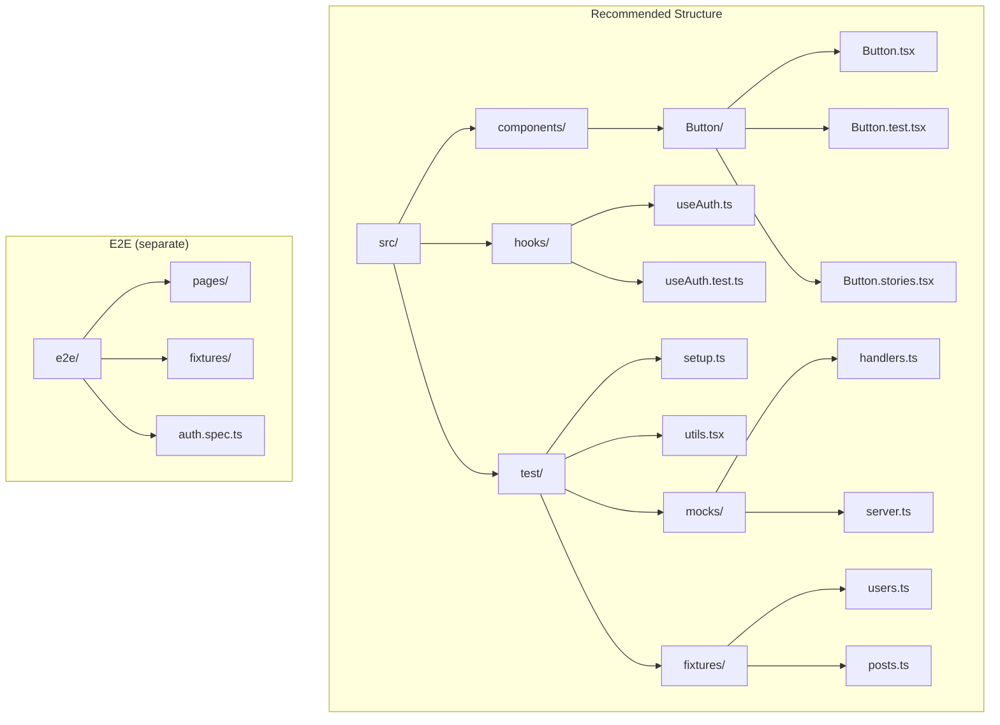

## Learning Objectives

- Organize test files and suites for scalability and discoverability
- Build test fixtures and factories for consistent, readable test data
- Create custom render wrappers for components with providers and routing
- Test custom hooks in isolation using renderHook
- Apply snapshot testing strategically without creating maintenance burden

## Prerequisites

- Unit testing with Vitest and React Testing Library
- E2E testing with Playwright
- Custom hooks development experience

## Core Concepts

### Test Organization



**Principles:**
- Co-locate unit tests with source files (`Button.test.tsx` next to `Button.tsx`)
- Shared test utilities in `src/test/`
- E2E tests in a separate top-level directory
- Test fixtures and factories in dedicated files

### Test Naming Conventions

```typescript
describe("UserCard", () => {
  // Group by feature or behavior
  describe("rendering", () => {
    it("displays the user name and avatar", () => { /* ... */ });
    it("shows a fallback avatar when image fails to load", () => { /* ... */ });
    it("truncates long names with ellipsis", () => { /* ... */ });
  });

  describe("interactions", () => {
    it("calls onSelect when clicked", () => { /* ... */ });
    it("shows the context menu on right-click", () => { /* ... */ });
    it("navigates to profile on double-click", () => { /* ... */ });
  });

  describe("accessibility", () => {
    it("has the correct ARIA role", () => { /* ... */ });
    it("is focusable via keyboard", () => { /* ... */ });
    it("announces the user name to screen readers", () => { /* ... */ });
  });
});
```

### Test Fixtures and Factories

```typescript
// src/test/fixtures/users.ts
import type { User } from "@/types";

let idCounter = 0;

export function createUser(overrides: Partial<User> = {}): User {
  idCounter++;
  return {
    id: `user-${idCounter}`,
    name: `Test User ${idCounter}`,
    email: `user${idCounter}@example.com`,
    avatar: `https://i.pravatar.cc/150?u=${idCounter}`,
    role: "viewer",
    createdAt: new Date().toISOString(),
    ...overrides,
  };
}

export function createUsers(count: number, overrides: Partial<User> = {}): User[] {
  return Array.from({ length: count }, () => createUser(overrides));
}

export const fixtures = {
  admin: createUser({ name: "Admin User", role: "admin", email: "admin@example.com" }),
  editor: createUser({ name: "Editor User", role: "editor", email: "editor@example.com" }),
  viewer: createUser({ name: "Viewer User", role: "viewer", email: "viewer@example.com" }),
};
```

```typescript
// src/test/fixtures/posts.ts
import type { Post } from "@/types";
import { createUser } from "./users";

export function createPost(overrides: Partial<Post> = {}): Post {
  return {
    id: crypto.randomUUID(),
    title: "Test Post Title",
    content: "This is test content for the post.",
    author: createUser(),
    status: "published",
    tags: ["react", "typescript"],
    createdAt: new Date().toISOString(),
    updatedAt: new Date().toISOString(),
    ...overrides,
  };
}
```

Usage in tests:

```typescript
import { createUser, createUsers, fixtures } from "@/test/fixtures/users";
import { createPost } from "@/test/fixtures/posts";

describe("UserList", () => {
  it("renders a list of users", () => {
    const users = createUsers(5);
    render(<UserList users={users} />);
    expect(screen.getAllByRole("listitem")).toHaveLength(5);
  });

  it("shows admin badge for admin users", () => {
    render(<UserCard user={fixtures.admin} />);
    expect(screen.getByText(/admin/i)).toBeInTheDocument();
  });

  it("filters posts by author", () => {
    const author = createUser({ name: "Jane Doe" });
    const posts = [
      createPost({ author, title: "Jane's Post" }),
      createPost({ title: "Other Post" }),
    ];
    render(<PostList posts={posts} filterAuthor={author.id} />);
    expect(screen.getByText("Jane's Post")).toBeInTheDocument();
    expect(screen.queryByText("Other Post")).not.toBeInTheDocument();
  });
});
```

### Custom Render Wrappers

```typescript
// src/test/utils.tsx
import { render, type RenderOptions } from "@testing-library/react";
import { QueryClient, QueryClientProvider } from "@tanstack/react-query";
import { MemoryRouter, type MemoryRouterProps } from "react-router";

interface WrapperOptions {
  route?: string;
  routerProps?: Partial<MemoryRouterProps>;
  queryClient?: QueryClient;
  authState?: { user: User | null; isAuthenticated: boolean };
}

function createWrapper(options: WrapperOptions = {}) {
  const {
    route = "/",
    routerProps,
    queryClient = new QueryClient({
      defaultOptions: {
        queries: { retry: false, gcTime: 0 },
      },
    }),
    authState = { user: null, isAuthenticated: false },
  } = options;

  return function Wrapper({ children }: { children: ReactNode }) {
    return (
      <QueryClientProvider client={queryClient}>
        <MemoryRouter initialEntries={[route]} {...routerProps}>
          <MockAuthProvider {...authState}>{children}</MockAuthProvider>
        </MemoryRouter>
      </QueryClientProvider>
    );
  };
}

export function renderWithProviders(
  ui: React.ReactElement,
  options: WrapperOptions & Omit<RenderOptions, "wrapper"> = {}
) {
  const { route, routerProps, queryClient, authState, ...renderOptions } = options;
  const wrapper = createWrapper({ route, routerProps, queryClient, authState });

  return {
    ...render(ui, { wrapper, ...renderOptions }),
    queryClient: queryClient ?? new QueryClient(),
  };
}
```

Usage:

```typescript
it("shows dashboard for authenticated users", () => {
  renderWithProviders(<DashboardPage />, {
    route: "/dashboard",
    authState: { user: fixtures.admin, isAuthenticated: true },
  });

  expect(screen.getByRole("heading", { name: /dashboard/i })).toBeInTheDocument();
});
```

### Testing Custom Hooks

```typescript
import { renderHook, act, waitFor } from "@testing-library/react";

// src/hooks/useCounter.ts
function useCounter(initialValue = 0) {
  const [count, setCount] = useState(initialValue);
  const increment = useCallback(() => setCount((c) => c + 1), []);
  const decrement = useCallback(() => setCount((c) => c - 1), []);
  const reset = useCallback(() => setCount(initialValue), [initialValue]);
  return { count, increment, decrement, reset };
}

// src/hooks/useCounter.test.ts
describe("useCounter", () => {
  it("starts with the initial value", () => {
    const { result } = renderHook(() => useCounter(10));
    expect(result.current.count).toBe(10);
  });

  it("increments the count", () => {
    const { result } = renderHook(() => useCounter());

    act(() => {
      result.current.increment();
    });

    expect(result.current.count).toBe(1);
  });

  it("resets to initial value", () => {
    const { result } = renderHook(() => useCounter(5));

    act(() => {
      result.current.increment();
      result.current.increment();
    });
    expect(result.current.count).toBe(7);

    act(() => {
      result.current.reset();
    });
    expect(result.current.count).toBe(5);
  });
});
```

#### Testing Async Hooks

```typescript
function useUsers() {
  const [users, setUsers] = useState<User[]>([]);
  const [isLoading, setIsLoading] = useState(true);
  const [error, setError] = useState<string | null>(null);

  useEffect(() => {
    fetch("/api/users")
      .then((r) => {
        if (!r.ok) throw new Error("Failed");
        return r.json();
      })
      .then(setUsers)
      .catch((e) => setError(e.message))
      .finally(() => setIsLoading(false));
  }, []);

  return { users, isLoading, error };
}

describe("useUsers", () => {
  it("fetches and returns users", async () => {
    const { result } = renderHook(() => useUsers());

    expect(result.current.isLoading).toBe(true);

    await waitFor(() => {
      expect(result.current.isLoading).toBe(false);
    });

    expect(result.current.users).toHaveLength(2);
    expect(result.current.error).toBeNull();
  });

  it("handles fetch errors", async () => {
    server.use(
      http.get("/api/users", () => new HttpResponse(null, { status: 500 }))
    );

    const { result } = renderHook(() => useUsers());

    await waitFor(() => {
      expect(result.current.isLoading).toBe(false);
    });

    expect(result.current.error).toBe("Failed");
    expect(result.current.users).toHaveLength(0);
  });
});
```

### Snapshot Testing Done Right

Snapshots are useful for specific, stable structures — not for entire rendered components:

```typescript
// Good — snapshot a specific, stable structure
it("generates the correct API request payload", () => {
  const payload = buildCreateUserPayload({
    name: "Jane Doe",
    email: "jane@example.com",
    role: "editor",
  });

  expect(payload).toMatchInlineSnapshot(`
    {
      "email": "jane@example.com",
      "name": "Jane Doe",
      "permissions": [
        "posts:read",
        "posts:write",
      ],
      "role": "editor",
    }
  `);
});

// Good — snapshot SVG icons or short markup
it("renders the correct icon", () => {
  const { container } = render(<CheckIcon />);
  expect(container.firstChild).toMatchSnapshot();
});

// Bad — snapshot an entire page component
it("renders correctly", () => {
  const { container } = render(<DashboardPage />);
  expect(container).toMatchSnapshot(); // Breaks on every UI change
});
```

### Testing Error Scenarios

```typescript
describe("ErrorBoundary", () => {
  const ThrowingComponent = () => {
    throw new Error("Test error");
  };

  it("renders fallback UI when child throws", () => {
    // Suppress console.error for expected errors
    const spy = vi.spyOn(console, "error").mockImplementation(() => {});

    render(
      <ErrorBoundary fallback={<p>Something went wrong</p>}>
        <ThrowingComponent />
      </ErrorBoundary>
    );

    expect(screen.getByText("Something went wrong")).toBeInTheDocument();
    spy.mockRestore();
  });

  it("calls onError callback", () => {
    const spy = vi.spyOn(console, "error").mockImplementation(() => {});
    const onError = vi.fn();

    render(
      <ErrorBoundary onError={onError}>
        <ThrowingComponent />
      </ErrorBoundary>
    );

    expect(onError).toHaveBeenCalledWith(
      expect.any(Error),
      expect.objectContaining({ componentStack: expect.any(String) })
    );
    spy.mockRestore();
  });
});
```

### Testing with Timers

```typescript
describe("Debounced Search", () => {
  beforeEach(() => {
    vi.useFakeTimers();
  });

  afterEach(() => {
    vi.useRealTimers();
  });

  it("debounces search input", async () => {
    const onSearch = vi.fn();
    const user = userEvent.setup({ advanceTimers: vi.advanceTimersByTime });

    render(<SearchInput onSearch={onSearch} debounceMs={300} />);

    await user.type(screen.getByRole("searchbox"), "react");

    expect(onSearch).not.toHaveBeenCalled();

    vi.advanceTimersByTime(300);

    expect(onSearch).toHaveBeenCalledTimes(1);
    expect(onSearch).toHaveBeenCalledWith("react");
  });
});
```

## Test Coverage Strategy

| What to Cover | Coverage Target | Notes |
|--------------|----------------|-------|
| Utility functions | 90%+ | Pure functions are easy to test |
| Custom hooks | 80%+ | Test inputs/outputs, not internals |
| Components (logic) | 70%+ | Focus on user-facing behavior |
| Components (layout) | Skip | Visual regression tests handle this |
| E2E critical paths | 100% of happy paths | Login, checkout, core workflows |

## Best Practices

1. **Factories over fixtures** — `createUser()` with overrides is more flexible than static data
2. **One assertion per behavior** — each `it` block tests one observable behavior
3. **Inline snapshots** — `toMatchInlineSnapshot` keeps expected output visible in the test file
4. **Test IDs as last resort** — exhaust semantic queries before adding `data-testid`
5. **Fake timers for debounce** — control time instead of adding real delays
6. **Suppress expected errors** — `vi.spyOn(console, 'error')` for error boundary tests

## Anti-Patterns to Avoid

- **Testing library internals** — don't assert on React Hook Form's internal state
- **100% coverage as a goal** — coverage measures quantity, not quality
- **Large snapshot files** — they become "auto-approve" liabilities
- **Testing CSS** — use visual regression tests, not unit tests, for styles
- **Coupling to component structure** — test what the user sees, not the DOM hierarchy

## Hands-On Exercise

### Build a Test Suite for a Feature Module

1. Create test fixtures for Users, Posts, and Comments using factory functions
2. Write a custom render wrapper that includes providers and accepts auth state
3. Test a `useDebounce` hook with fake timers
4. Test an `ErrorBoundary` component — error rendering, recovery, and callback
5. Write 3 inline snapshot tests for API payload builders
6. Organize tests into `describe` blocks by feature and behavior

## Key Takeaways

- Co-locate tests with source files; share utilities in a dedicated test directory
- Factory functions (`createUser()`) produce flexible, readable test data
- Custom render wrappers eliminate provider boilerplate across all test files
- `renderHook` tests hooks in isolation — test the API, not the implementation
- Snapshot testing works best for small, stable structures — not full page renders

## External Resources

- [Testing Library: Custom Render](https://testing-library.com/docs/react-testing-library/setup)
- [Vitest: Mocking](https://vitest.dev/guide/mocking.html)
- [Kent C. Dodds: AHA Testing](https://kentcdodds.com/blog/aha-testing)
- [MSW: Best Practices](https://mswjs.io/docs/best-practices)
- [Effective Snapshot Testing](https://kentcdodds.com/blog/effective-snapshot-testing)
