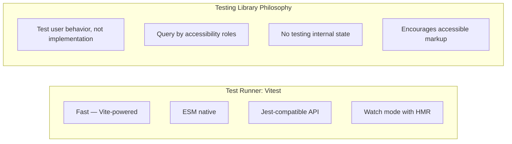

## Learning Objectives

- Set up Vitest with React Testing Library for fast, reliable component tests
- Write tests that interact with components the way users do
- Use user-event for realistic user interactions (click, type, select)
- Test async components with proper waiting and assertion patterns
- Mock API calls with MSW (Mock Service Worker) for integration-level tests

## Prerequisites

- React component development with hooks
- Basic understanding of testing concepts (assertions, test structure)
- Familiarity with async/await

## Core Concepts

### Why Vitest + React Testing Library?



### Setup

```bash
npm install -D vitest @testing-library/react @testing-library/jest-dom @testing-library/user-event jsdom
```

```typescript
// vite.config.ts
/// <reference types="vitest/config" />
import { defineConfig } from "vite";
import react from "@vitejs/plugin-react";

export default defineConfig({
  plugins: [react()],
  test: {
    globals: true,
    environment: "jsdom",
    setupFiles: ["./src/test/setup.ts"],
    css: true,
  },
});
```

```typescript
// src/test/setup.ts
import "@testing-library/jest-dom/vitest";
import { cleanup } from "@testing-library/react";
import { afterEach } from "vitest";

afterEach(() => {
  cleanup();
});
```

### Writing Your First Test

```typescript
// src/components/Counter.tsx
function Counter({ initialCount = 0 }: { initialCount?: number }) {
  const [count, setCount] = useState(initialCount);

  return (
    <div>
      <h2>Count: {count}</h2>
      <button onClick={() => setCount((c) => c - 1)}>Decrement</button>
      <button onClick={() => setCount((c) => c + 1)}>Increment</button>
      <button onClick={() => setCount(0)}>Reset</button>
    </div>
  );
}
```

```typescript
// src/components/Counter.test.tsx
import { render, screen } from "@testing-library/react";
import userEvent from "@testing-library/user-event";
import { Counter } from "./Counter";

describe("Counter", () => {
  it("renders with initial count", () => {
    render(<Counter initialCount={5} />);
    expect(screen.getByText("Count: 5")).toBeInTheDocument();
  });

  it("increments when clicking the increment button", async () => {
    const user = userEvent.setup();
    render(<Counter />);

    await user.click(screen.getByRole("button", { name: /increment/i }));

    expect(screen.getByText("Count: 1")).toBeInTheDocument();
  });

  it("decrements when clicking the decrement button", async () => {
    const user = userEvent.setup();
    render(<Counter initialCount={3} />);

    await user.click(screen.getByRole("button", { name: /decrement/i }));

    expect(screen.getByText("Count: 2")).toBeInTheDocument();
  });

  it("resets to zero", async () => {
    const user = userEvent.setup();
    render(<Counter initialCount={10} />);

    await user.click(screen.getByRole("button", { name: /reset/i }));

    expect(screen.getByText("Count: 0")).toBeInTheDocument();
  });
});
```

### Query Priority

React Testing Library provides queries in order of preference:

| Priority | Query | When to Use |
|----------|-------|-------------|
| 1 | `getByRole` | Buttons, links, headings, forms |
| 2 | `getByLabelText` | Form inputs with labels |
| 3 | `getByPlaceholderText` | Inputs without visible labels |
| 4 | `getByText` | Non-interactive text content |
| 5 | `getByDisplayValue` | Filled input values |
| 6 | `getByAltText` | Images |
| 7 | `getByTestId` | Last resort — no semantic query available |

```typescript
// Good — queries that reflect how users find elements
screen.getByRole("button", { name: /submit/i });
screen.getByLabelText(/email/i);
screen.getByRole("heading", { level: 1 });
screen.getByRole("link", { name: /sign up/i });

// Avoid — implementation-dependent queries
screen.getByTestId("submit-btn");
document.querySelector(".btn-primary");
```

### User Event for Realistic Interactions

```typescript
import userEvent from "@testing-library/user-event";

describe("LoginForm", () => {
  it("submits with valid credentials", async () => {
    const user = userEvent.setup();
    const onSubmit = vi.fn();
    render(<LoginForm onSubmit={onSubmit} />);

    await user.type(screen.getByLabelText(/email/i), "user@example.com");
    await user.type(screen.getByLabelText(/password/i), "secret123");
    await user.click(screen.getByRole("button", { name: /sign in/i }));

    expect(onSubmit).toHaveBeenCalledWith({
      email: "user@example.com",
      password: "secret123",
    });
  });

  it("shows validation errors for empty fields", async () => {
    const user = userEvent.setup();
    render(<LoginForm onSubmit={vi.fn()} />);

    await user.click(screen.getByRole("button", { name: /sign in/i }));

    expect(screen.getByText(/email is required/i)).toBeInTheDocument();
    expect(screen.getByText(/password is required/i)).toBeInTheDocument();
  });

  it("clears errors when user starts typing", async () => {
    const user = userEvent.setup();
    render(<LoginForm onSubmit={vi.fn()} />);

    await user.click(screen.getByRole("button", { name: /sign in/i }));
    expect(screen.getByText(/email is required/i)).toBeInTheDocument();

    await user.type(screen.getByLabelText(/email/i), "a");
    expect(screen.queryByText(/email is required/i)).not.toBeInTheDocument();
  });
});
```

### Testing Async Components

```typescript
import { render, screen, waitFor } from "@testing-library/react";

function UserProfile({ userId }: { userId: string }) {
  const [user, setUser] = useState<User | null>(null);
  const [error, setError] = useState<string | null>(null);

  useEffect(() => {
    fetch(`/api/users/${userId}`)
      .then((r) => {
        if (!r.ok) throw new Error("User not found");
        return r.json();
      })
      .then(setUser)
      .catch((e) => setError(e.message));
  }, [userId]);

  if (error) return <p role="alert">{error}</p>;
  if (!user) return <p>Loading...</p>;
  return <h1>{user.name}</h1>;
}
```

```typescript
describe("UserProfile", () => {
  it("shows user name after loading", async () => {
    render(<UserProfile userId="1" />);

    expect(screen.getByText(/loading/i)).toBeInTheDocument();

    await waitFor(() => {
      expect(screen.getByRole("heading")).toHaveTextContent("Jane Doe");
    });
  });

  it("shows error when user not found", async () => {
    render(<UserProfile userId="999" />);

    await waitFor(() => {
      expect(screen.getByRole("alert")).toHaveTextContent(/user not found/i);
    });
  });
});
```

### MSW: Mocking API Calls

```bash
npm install -D msw
```

```typescript
// src/test/mocks/handlers.ts
import { http, HttpResponse } from "msw";

export const handlers = [
  http.get("/api/users/:userId", ({ params }) => {
    const { userId } = params;

    if (userId === "999") {
      return new HttpResponse(null, { status: 404 });
    }

    return HttpResponse.json({
      id: userId,
      name: "Jane Doe",
      email: "jane@example.com",
    });
  }),

  http.get("/api/posts", ({ request }) => {
    const url = new URL(request.url);
    const page = Number(url.searchParams.get("page") ?? "1");

    return HttpResponse.json({
      posts: [
        { id: "1", title: "First Post", content: "Hello world" },
        { id: "2", title: "Second Post", content: "More content" },
      ],
      totalPages: 5,
      currentPage: page,
    });
  }),

  http.post("/api/auth/login", async ({ request }) => {
    const body = (await request.json()) as { email: string; password: string };

    if (body.email === "user@example.com" && body.password === "secret123") {
      return HttpResponse.json({
        user: { id: "1", name: "Jane Doe", email: body.email },
        token: "mock-jwt-token",
      });
    }

    return HttpResponse.json(
      { message: "Invalid credentials" },
      { status: 401 }
    );
  }),
];
```

```typescript
// src/test/mocks/server.ts
import { setupServer } from "msw/node";
import { handlers } from "./handlers";

export const server = setupServer(...handlers);
```

```typescript
// src/test/setup.ts
import "@testing-library/jest-dom/vitest";
import { cleanup } from "@testing-library/react";
import { afterAll, afterEach, beforeAll } from "vitest";
import { server } from "./mocks/server";

beforeAll(() => server.listen({ onUnhandledRequest: "error" }));
afterEach(() => {
  cleanup();
  server.resetHandlers();
});
afterAll(() => server.close());
```

Override handlers for specific tests:

```typescript
import { http, HttpResponse } from "msw";
import { server } from "../test/mocks/server";

it("handles server error", async () => {
  server.use(
    http.get("/api/users/:userId", () => {
      return HttpResponse.json(
        { message: "Internal server error" },
        { status: 500 }
      );
    })
  );

  render(<UserProfile userId="1" />);

  await waitFor(() => {
    expect(screen.getByRole("alert")).toBeInTheDocument();
  });
});
```

### Custom Render Wrapper

```typescript
// src/test/utils.tsx
import { render, type RenderOptions } from "@testing-library/react";
import { QueryClient, QueryClientProvider } from "@tanstack/react-query";
import { MemoryRouter } from "react-router";
import { AuthProvider } from "@/providers/AuthProvider";
import { ThemeProvider } from "@/providers/ThemeProvider";

function createTestQueryClient() {
  return new QueryClient({
    defaultOptions: {
      queries: { retry: false, gcTime: 0 },
      mutations: { retry: false },
    },
  });
}

interface CustomRenderOptions extends Omit<RenderOptions, "wrapper"> {
  initialRoute?: string;
}

function renderWithProviders(ui: React.ReactElement, options: CustomRenderOptions = {}) {
  const { initialRoute = "/", ...renderOptions } = options;
  const queryClient = createTestQueryClient();

  function Wrapper({ children }: { children: ReactNode }) {
    return (
      <QueryClientProvider client={queryClient}>
        <MemoryRouter initialEntries={[initialRoute]}>
          <AuthProvider>
            <ThemeProvider>{children}</ThemeProvider>
          </AuthProvider>
        </MemoryRouter>
      </QueryClientProvider>
    );
  }

  return {
    ...render(ui, { wrapper: Wrapper, ...renderOptions }),
    queryClient,
  };
}

export { renderWithProviders as render, screen, waitFor } from "@testing-library/react";
```

## Best Practices

1. **Test behavior, not implementation** — test what the user sees and does
2. **Query by role first** — it forces accessible markup
3. **Use `userEvent.setup()`** — it simulates real browser events (pointer, keyboard)
4. **Use MSW, not `vi.mock(fetch)`** — MSW intercepts at the network level, testing the full stack
5. **Custom render wrappers** — centralize providers so every test doesn't repeat boilerplate
6. **Avoid `getByTestId`** — if you need it, your component might have accessibility issues

## Anti-Patterns to Avoid

- **Testing internal state** — don't assert on `useState` values; assert on rendered output
- **Snapshot testing as primary strategy** — brittle, easily approved without review
- **Mocking child components** — test the integration; mock only external dependencies
- **`fireEvent` over `userEvent`** — `fireEvent` doesn't simulate real browser event chains
- **`waitFor` with side effects** — only put assertions inside `waitFor`, not actions

## Hands-On Exercise

### Test a Todo Application

1. Set up Vitest with React Testing Library and MSW
2. Write tests for a `TodoList` component: add, toggle, delete, filter
3. Test the search feature: type in search box, verify filtered results
4. Mock the API with MSW: test loading states, success, and error cases
5. Test keyboard navigation: Tab to buttons, Enter to submit
6. Create a custom render wrapper that includes your app's providers

## Key Takeaways

- React Testing Library tests components the way users interact with them
- Vitest provides a Jest-compatible API with Vite's speed (ESM, HMR, parallel)
- `userEvent` simulates realistic browser interactions, not just DOM events
- MSW mocks the network layer, giving you integration-level confidence without a server
- Custom render wrappers keep tests DRY by centralizing provider boilerplate

## External Resources

- [Testing Library Documentation](https://testing-library.com/docs/react-testing-library/intro)
- [Vitest Documentation](https://vitest.dev/)
- [MSW Documentation](https://mswjs.io/)
- [Kent C. Dodds: Testing Implementation Details](https://kentcdodds.com/blog/testing-implementation-details)
- [Kent C. Dodds: Common Mistakes with RTL](https://kentcdodds.com/blog/common-mistakes-with-react-testing-library)
