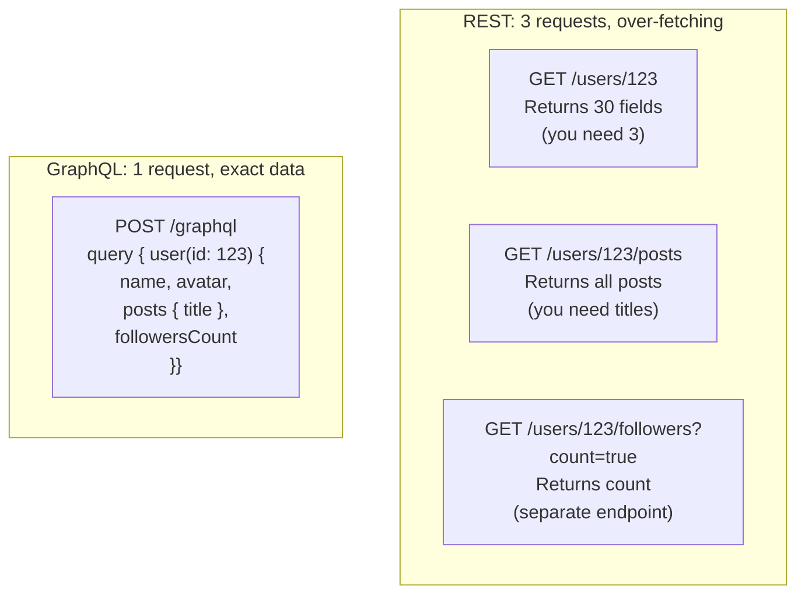
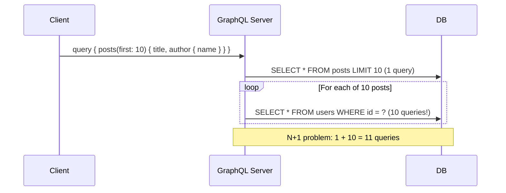
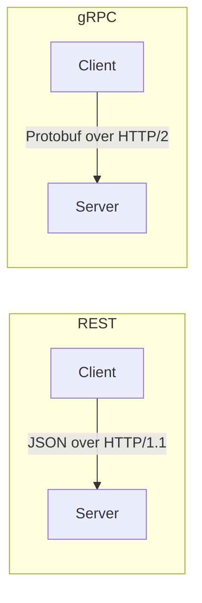
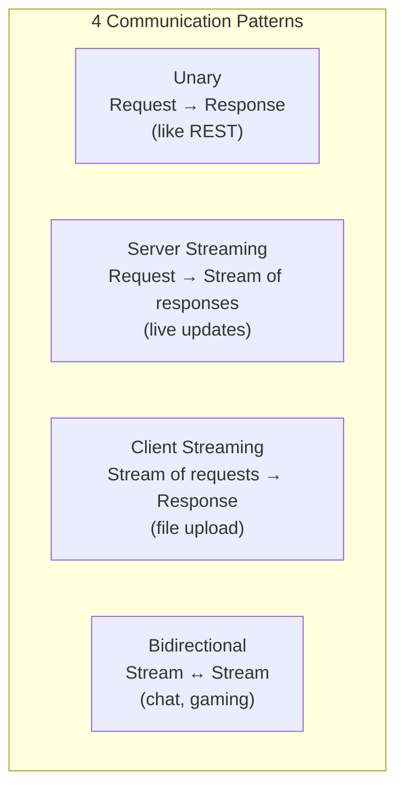
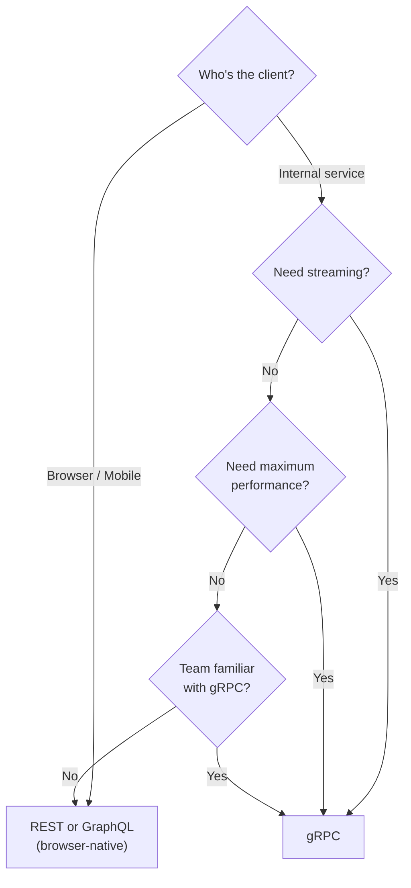
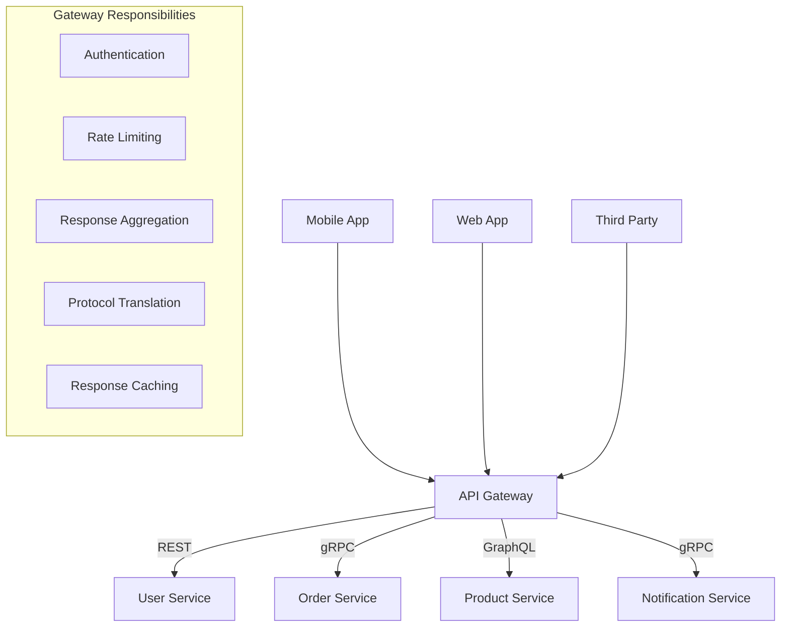
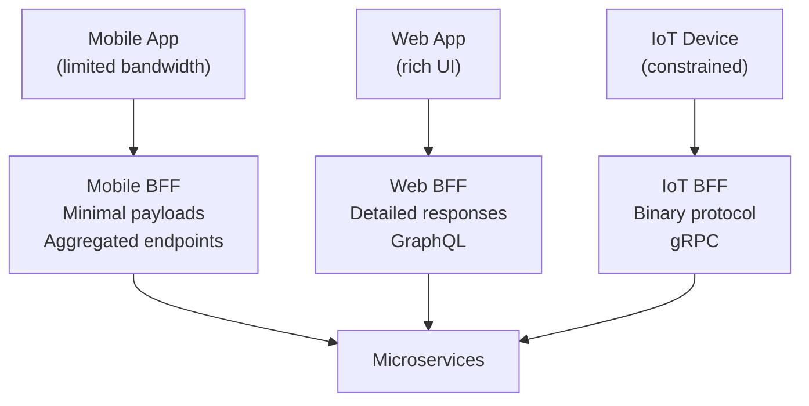
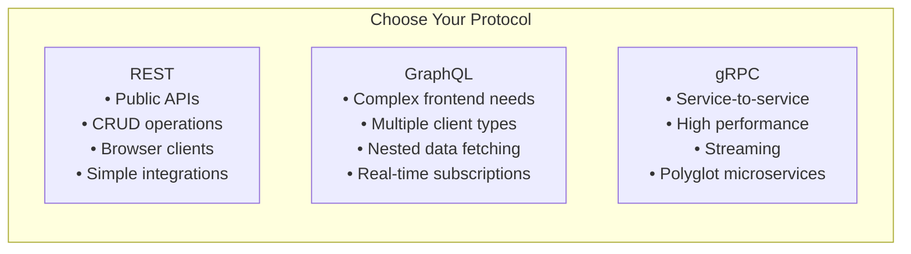

## Learning Objectives

- Design GraphQL schemas with types, queries, mutations, and subscriptions
- Identify and resolve the N+1 query problem with DataLoader batching
- Compare gRPC and REST for service-to-service communication
- Implement API gateways that aggregate and route across multiple protocols
- Choose the right API protocol based on client type, use case, and team capabilities

## Prerequisites

- Understanding of REST API design principles
- Familiarity with client-server communication patterns
- Basic knowledge of serialization formats (JSON, binary)

## GraphQL

### What Problem Does GraphQL Solve?

REST APIs often suffer from **over-fetching** and **under-fetching**:



GraphQL lets the **client specify exactly what data it needs** in a single request.

### Schema Definition

```graphql
type User {
  id: ID!
  name: String!
  email: String!
  avatar: String
  posts(first: Int, after: String): PostConnection!
  followers: [User!]!
  followersCount: Int!
  createdAt: DateTime!
}

type Post {
  id: ID!
  title: String!
  content: String!
  author: User!
  comments: [Comment!]!
  likes: Int!
  publishedAt: DateTime
}

type PostConnection {
  edges: [PostEdge!]!
  pageInfo: PageInfo!
}

type PostEdge {
  node: Post!
  cursor: String!
}

type PageInfo {
  hasNextPage: Boolean!
  endCursor: String
}

type Query {
  user(id: ID!): User
  users(first: Int, after: String): UserConnection!
  post(id: ID!): Post
  feed(userId: ID!, first: Int, after: String): PostConnection!
}

type Mutation {
  createPost(input: CreatePostInput!): Post!
  updateUser(id: ID!, input: UpdateUserInput!): User!
  deletePost(id: ID!): Boolean!
}

type Subscription {
  postCreated(userId: ID!): Post!
  commentAdded(postId: ID!): Comment!
}
```

### Query Examples

```graphql
# Client requests exactly what it needs
query {
  user(id: "123") {
    name
    avatar
    posts(first: 5) {
      edges {
        node {
          title
          likes
          publishedAt
        }
      }
      pageInfo {
        hasNextPage
        endCursor
      }
    }
    followersCount
  }
}
```

Response contains **only the requested fields**, reducing payload size and network usage.

### The N+1 Problem

The most common GraphQL performance pitfall:



### DataLoader Solution

**DataLoader** batches and caches database lookups within a single request:

```javascript
const userLoader = new DataLoader(async (userIds) => {
  const users = await db.query(
    'SELECT * FROM users WHERE id IN (?)',
    [userIds]
  );
  return userIds.map(id => users.find(u => u.id === id));
});

// Resolver
const resolvers = {
  Post: {
    author: (post) => userLoader.load(post.authorId)
  }
};

// Instead of 10 separate queries:
// SELECT * FROM users WHERE id IN (1, 2, 3, 4, 5, 6, 7, 8, 9, 10)
// 1 batched query!
```

### GraphQL Trade-offs

| Advantage | Disadvantage |
|-----------|-------------|
| No over/under-fetching | Complex server implementation |
| Single endpoint | Difficult to cache (POST requests) |
| Strongly typed schema | Unbounded query complexity |
| Great developer experience | Learning curve |
| Self-documenting (introspection) | File uploads are awkward |
| Real-time with subscriptions | Rate limiting is harder (not per-endpoint) |

### Query Complexity and Depth Limiting

Prevent abuse with query analysis:

```graphql
# Malicious query: deeply nested, expensive
query {
  user(id: "123") {
    followers {
      followers {
        followers {
          followers { name }
        }
      }
    }
  }
}
```

**Protections**:
- **Depth limiting**: Max query depth of 5-10 levels
- **Complexity scoring**: Assign costs to fields, reject queries exceeding budget
- **Timeout**: Kill queries running longer than 10 seconds
- **Persisted queries**: Only allow pre-approved query hashes in production

## gRPC

### What Is gRPC?

gRPC is a high-performance RPC framework using **Protocol Buffers** (protobuf) for serialization and **HTTP/2** for transport:



### Protocol Buffer Definition

```protobuf
syntax = "proto3";

package userservice;

service UserService {
  rpc GetUser(GetUserRequest) returns (User);
  rpc ListUsers(ListUsersRequest) returns (stream User);
  rpc CreateUser(CreateUserRequest) returns (User);
  rpc UpdateUser(UpdateUserRequest) returns (User);
  rpc WatchUserUpdates(WatchRequest) returns (stream UserUpdate);
}

message User {
  string id = 1;
  string name = 2;
  string email = 3;
  int64 created_at = 4;
}

message GetUserRequest {
  string id = 1;
}

message ListUsersRequest {
  int32 page_size = 1;
  string page_token = 2;
}

message CreateUserRequest {
  string name = 1;
  string email = 2;
}
```

### gRPC Communication Patterns



### gRPC vs. REST

| Feature | gRPC | REST |
|---------|------|------|
| **Serialization** | Protobuf (binary, ~10x smaller) | JSON (text, human-readable) |
| **Transport** | HTTP/2 (multiplexed, binary) | HTTP/1.1 or HTTP/2 |
| **Contract** | Strict (.proto files) | Loose (OpenAPI optional) |
| **Code generation** | Built-in (all languages) | Requires additional tools |
| **Streaming** | Native (4 patterns) | WebSocket (separate protocol) |
| **Browser support** | Limited (needs gRPC-Web proxy) | Native |
| **Latency** | ~1-5ms (internal) | ~5-50ms (internal) |
| **Debugging** | Hard (binary, needs tools) | Easy (curl, browser) |

### When to Use gRPC



## API Gateway Pattern

### Aggregation Layer

An API gateway sits between clients and microservices, providing a unified interface:



### Backend for Frontend (BFF)

Different clients need different API shapes:



**Popular API Gateways**: Kong, AWS API Gateway, Envoy, NGINX, Apollo Router (for GraphQL federation).

## Protocol Comparison



### Real-World Combinations

| Company | External API | Internal | Real-time |
|---------|-------------|----------|-----------|
| **Netflix** | REST | gRPC | gRPC streaming |
| **GitHub** | REST + GraphQL | Internal APIs | WebSocket |
| **Uber** | REST | gRPC (mostly) | gRPC streaming |
| **Airbnb** | REST | Thrift → gRPC migration | WebSocket |
| **Shopify** | REST + GraphQL | GraphQL + gRPC | WebSocket |

## Interview Approach

1. **Start with REST for external APIs**: It's the universal standard for public-facing APIs
2. **Consider GraphQL for complex frontends**: When mobile/web clients need flexible data fetching
3. **Use gRPC for internal services**: When you need performance and streaming between microservices
4. **Add an API gateway**: For auth, rate limiting, and protocol translation
5. **Address the N+1 problem**: If using GraphQL, mention DataLoader immediately

> **Pro tip**: "We'll expose a REST API for external clients and use gRPC for internal service-to-service communication. An API gateway handles authentication and rate limiting at the edge."

## Key Takeaways

1. **REST is the default**: Universal, well-understood, works everywhere. Start here unless you have a specific reason not to.
2. **GraphQL solves over/under-fetching**: Best for complex UIs with diverse data needs. Watch out for N+1 and complexity attacks.
3. **gRPC is for internal services**: Binary protocol, streaming, code generation. Not for browser clients.
4. **They're complementary**: Most companies use REST + gRPC, or REST + GraphQL, or all three.
5. **API gateways unify protocols**: Translate between REST, gRPC, and GraphQL at the edge.
6. **Schema-first design**: Whether it's OpenAPI, GraphQL SDL, or .proto files, define the contract before writing code.

## External Resources

- [GraphQL Official Documentation](https://graphql.org/learn/)
- [gRPC Documentation](https://grpc.io/docs/)
- [Protocol Buffers Language Guide](https://protobuf.dev/programming-guides/proto3/)
- [Apollo GraphQL Federation](https://www.apollographql.com/docs/federation/)
- [DataLoader: Generic Batching Utility](https://github.com/graphql/dataloader)
- [Google API Design Guide (gRPC)](https://cloud.google.com/apis/design)
