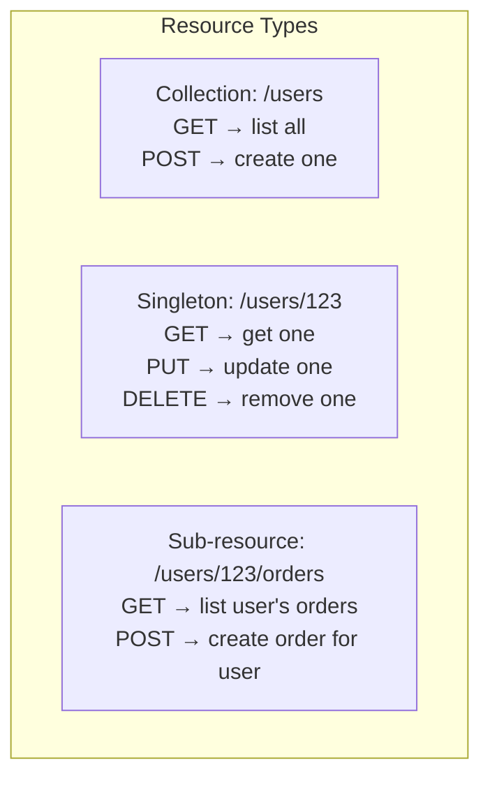
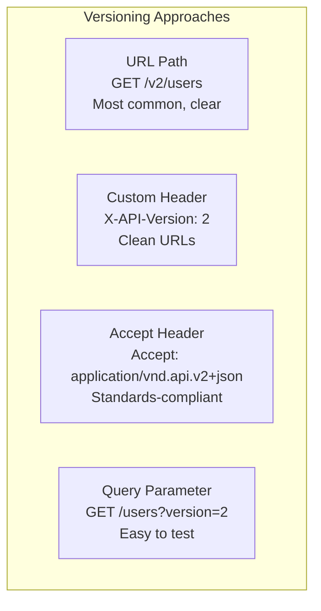
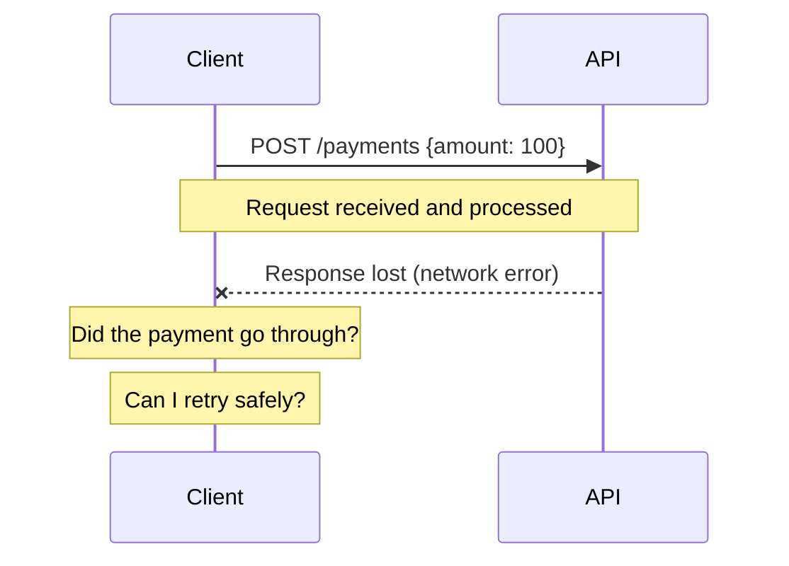

## Learning Objectives

- Design RESTful APIs with proper resource modeling and HTTP semantics
- Implement pagination, filtering, and sorting for collection endpoints
- Choose the right API versioning strategy for long-term maintainability
- Apply idempotency keys for safe retries in distributed systems
- Evaluate HATEOAS and when it adds value vs. complexity

## Prerequisites

- Familiarity with HTTP methods, status codes, and headers
- Understanding of client-server architecture
- Basic knowledge of JSON and API consumption

## REST Fundamentals

### Resources, Not Actions

REST models the world as **resources** (nouns), not procedures (verbs). Each resource has a unique URI:

```
Good (resource-oriented):
  GET    /users/123          → Get a user
  POST   /users              → Create a user
  PUT    /users/123          → Replace a user
  PATCH  /users/123          → Partially update a user
  DELETE /users/123          → Delete a user

Bad (RPC-style):
  POST   /getUser            → Verb in URL
  POST   /createUser         → Another verb
  POST   /deleteUser/123     → Using POST for deletion
```

### HTTP Methods and Semantics

| Method | Purpose | Idempotent | Safe | Request Body |
|--------|---------|-----------|------|-------------|
| **GET** | Read a resource | Yes | Yes | No |
| **POST** | Create a resource | No | No | Yes |
| **PUT** | Replace a resource entirely | Yes | No | Yes |
| **PATCH** | Partial update | No* | No | Yes |
| **DELETE** | Remove a resource | Yes | No | No |

*PATCH can be idempotent if designed carefully (JSON Merge Patch), but isn't guaranteed.

**Idempotent** means calling the same operation multiple times produces the same result. `PUT /users/123 {name: "Alice"}` always results in the name being "Alice", regardless of how many times you call it.

### HTTP Status Codes That Matter

```
2xx Success:
  200 OK              → Successful GET, PUT, PATCH, DELETE
  201 Created         → Successful POST (return Location header)
  204 No Content      → Successful DELETE (no response body)

3xx Redirection:
  301 Moved Permanently → Resource URL changed
  304 Not Modified      → Client cache is still valid

4xx Client Error:
  400 Bad Request     → Malformed request body
  401 Unauthorized    → Missing or invalid authentication
  403 Forbidden       → Authenticated but not authorized
  404 Not Found       → Resource doesn't exist
  409 Conflict        → State conflict (e.g., duplicate email)
  422 Unprocessable   → Valid JSON but invalid data (wrong field types)
  429 Too Many Requests → Rate limit exceeded

5xx Server Error:
  500 Internal Server Error → Bug in your code
  502 Bad Gateway           → Upstream service unavailable
  503 Service Unavailable   → Server overloaded / maintenance
  504 Gateway Timeout       → Upstream service timeout
```

> **Interview Tip**: Know the difference between 401 and 403. 401 means "I don't know who you are" (missing/bad auth). 403 means "I know who you are, but you can't do this" (insufficient permissions).

## Resource Modeling

### Nested Resources

Model relationships through URL hierarchy:

```
/users/123/orders              → Orders belonging to user 123
/users/123/orders/456          → Specific order for user 123
/users/123/orders/456/items    → Items in that order

But avoid deep nesting (>3 levels):
  Bad:  /users/123/orders/456/items/789/reviews
  Good: /items/789/reviews (if item ID is globally unique)
```

### Collection vs. Singleton Resources



### Consistent Response Structure

```json
// Single resource response
{
  "data": {
    "id": "user_123",
    "type": "user",
    "attributes": {
      "name": "Alice Chen",
      "email": "alice@example.com",
      "createdAt": "2024-01-15T10:30:00Z"
    }
  }
}

// Error response
{
  "error": {
    "code": "VALIDATION_ERROR",
    "message": "Email address is invalid",
    "details": [
      {
        "field": "email",
        "message": "Must be a valid email format"
      }
    ]
  }
}
```

## Pagination

### Offset-Based Pagination

```
GET /users?offset=20&limit=10

Response:
{
  "data": [...10 users...],
  "pagination": {
    "offset": 20,
    "limit": 10,
    "total": 1543
  }
}
```

**Pros**: Simple, supports "jump to page 5."
**Cons**: Inconsistent with concurrent writes (inserts/deletes shift offsets). Slow for large offsets (`OFFSET 1000000` scans and discards 1M rows).

### Cursor-Based Pagination

```
GET /users?cursor=eyJ2IjoiMjAyNC0wMS0xNSJ9&limit=10

Response:
{
  "data": [...10 users...],
  "pagination": {
    "nextCursor": "eyJ2IjoiMjAyNC0wMS0yMCJ9",
    "hasMore": true
  }
}
```

The cursor encodes the position (e.g., base64 of the last item's sort key). The database query becomes:

```sql
-- Cursor-based: efficient at any depth
SELECT * FROM users
WHERE created_at > '2024-01-15'
ORDER BY created_at ASC
LIMIT 10;
```

**Pros**: Consistent with concurrent writes, O(1) performance regardless of page depth.
**Cons**: Can't jump to arbitrary pages, cursor is opaque to clients.

### Keyset Pagination

Similar to cursor-based but uses explicit field values:

```
GET /users?after_id=123&limit=10

-- Uses index efficiently
SELECT * FROM users WHERE id > 123 ORDER BY id LIMIT 10;
```

> **Interview Tip**: For infinite-scroll UIs (Twitter, Instagram), always use cursor-based pagination. Offset-based is for admin dashboards where "page 5 of 200" is useful.

## Filtering and Sorting

### Filtering

```
GET /products?category=electronics&price_min=100&price_max=500&in_stock=true

// More complex filtering (LHS brackets pattern):
GET /products?filter[category]=electronics&filter[price][gte]=100&filter[price][lte]=500
```

### Sorting

```
GET /products?sort=price         → Ascending by price
GET /products?sort=-price        → Descending by price (- prefix)
GET /products?sort=-rating,price → By rating desc, then price asc
```

### Field Selection (Sparse Fieldsets)

Reduce payload size by requesting only needed fields:

```
GET /users/123?fields=id,name,email

// Instead of returning 30 fields, return only 3
// Reduces bandwidth, especially on mobile
```

## API Versioning

### Versioning Strategies



| Strategy | Pros | Cons | Used By |
|----------|------|------|---------|
| **URL path** (`/v2/users`) | Explicit, easy to route | URLs change with versions | Stripe, Twitter |
| **Header** (`X-API-Version: 2`) | Clean URLs | Hidden, easy to forget | Azure |
| **Accept header** | Standards-compliant | Complex to parse | GitHub |
| **Query param** (`?v=2`) | Easy to test | Cache key pollution | Google |

**Recommendation**: URL path versioning (`/v1/`, `/v2/`). It's the most explicit, easiest to route, and most widely adopted.

### Breaking vs. Non-Breaking Changes

```
Non-breaking (safe to deploy):
  ✓ Adding a new field to a response
  ✓ Adding a new optional request parameter
  ✓ Adding a new endpoint
  ✓ Adding a new enum value (if clients handle unknown values)

Breaking (requires new version):
  ✗ Removing or renaming a field
  ✗ Changing a field's type (string → number)
  ✗ Making an optional field required
  ✗ Changing URL structure
  ✗ Changing error response format
```

## Idempotency Keys

### Safe Retries in Distributed Systems

Network failures mean clients can't always know if a request succeeded:



### Implementation

```
POST /v1/payments
Idempotency-Key: 550e8400-e29b-41d4-a716-446655440000
Content-Type: application/json

{
  "amount": 10000,
  "currency": "usd",
  "customer": "cust_123"
}
```

Server behavior:
1. **First request**: Process payment, store result keyed by idempotency key
2. **Retry with same key + same body**: Return stored result (no double-charge)
3. **Retry with same key + different body**: Return `422 Unprocessable Entity`
4. **Keys expire** after 24 hours (Stripe's policy)

### Which Methods Need Idempotency Keys?

- **GET, PUT, DELETE**: Already idempotent by HTTP spec
- **POST**: Needs explicit idempotency keys (creates resources, triggers side effects)
- **PATCH**: Consider adding keys for critical updates

## HATEOAS

### Hypertext As The Engine Of Application State

The response includes links to related actions and resources:

```json
{
  "data": {
    "id": "order_456",
    "status": "pending",
    "total": 99.99
  },
  "links": {
    "self": "/orders/456",
    "cancel": "/orders/456/cancel",
    "payment": "/orders/456/payment",
    "items": "/orders/456/items",
    "customer": "/users/123"
  }
}
```

### Should You Use HATEOAS?

**Pros**: API is self-documenting, clients discover capabilities, server controls valid transitions.

**Cons**: Extra payload, most clients hardcode URLs anyway, adds complexity.

**Reality**: Few APIs implement full HATEOAS. Include `self` links and pagination links at minimum. Full HATEOAS is overkill for most services.

## Real-World API Design Examples

### Stripe's API (Gold Standard)

```
Consistent patterns:
  POST   /v1/customers            → Create
  GET    /v1/customers/cus_123    → Retrieve
  POST   /v1/customers/cus_123    → Update (uses POST, not PATCH)
  DELETE /v1/customers/cus_123    → Delete
  GET    /v1/customers            → List (with pagination)

Features:
  - Idempotency keys on all POST requests
  - Cursor-based pagination (starting_after, ending_before)
  - Expand related objects inline (?expand[]=charges)
  - Versioning via date-based API versions (2024-01-15)
  - Consistent error format with machine-readable codes
```

### GitHub's API

```
Resource modeling:
  /repos/{owner}/{repo}/issues
  /repos/{owner}/{repo}/pulls
  /repos/{owner}/{repo}/commits

Features:
  - Accept header versioning
  - Link header for pagination
  - Conditional requests (If-None-Match with ETags)
  - Webhooks for event notifications
  - Rate limiting with clear headers (X-RateLimit-*)
```

## Interview Approach

When designing an API in a system design interview:

1. **Define resources**: What are the main entities? Users, orders, products?
2. **Define endpoints**: CRUD operations for each resource
3. **Choose pagination**: Cursor-based for user-facing, offset for admin
4. **Add filtering/sorting**: Based on likely query patterns
5. **Plan versioning**: URL-based versioning from day one
6. **Address idempotency**: Idempotency keys for POST endpoints
7. **Define error format**: Consistent error codes and messages

> **Pro tip**: Sketch a few example requests and responses. Interviewers appreciate concrete examples over abstract descriptions.

## Key Takeaways

1. **Resources, not actions**: Use nouns in URLs, HTTP methods for actions.
2. **Use correct status codes**: 201 for created, 404 for not found, 409 for conflicts.
3. **Cursor-based pagination for scale**: Offset-based is fine for small datasets but breaks at scale.
4. **Idempotency keys on POST**: Essential for financial operations and any side-effect-producing endpoint.
5. **Version from day one**: URL path versioning is the simplest and most common.
6. **Consistent response format**: Every endpoint should return data in the same structure.

## External Resources

- [Stripe API Reference (design inspiration)](https://stripe.com/docs/api)
- [GitHub REST API Documentation](https://docs.github.com/en/rest)
- [Microsoft REST API Guidelines](https://github.com/microsoft/api-guidelines)
- [Google API Design Guide](https://cloud.google.com/apis/design)
- [JSON:API Specification](https://jsonapi.org/)
- [Best Practices for Designing Pragmatic RESTful APIs](https://www.vinaysahni.com/best-practices-for-a-pragmatic-restful-api)
