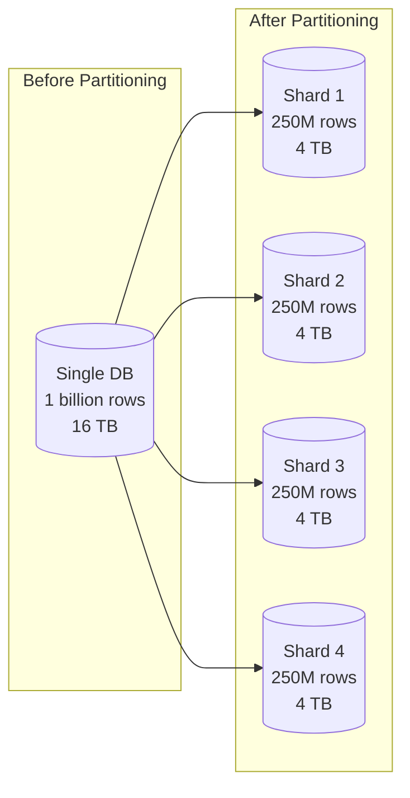
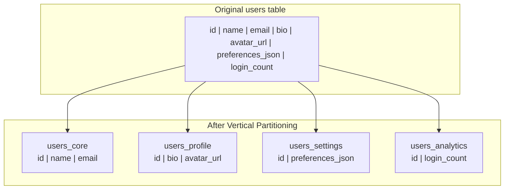
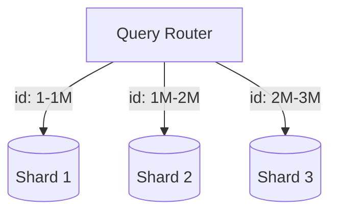
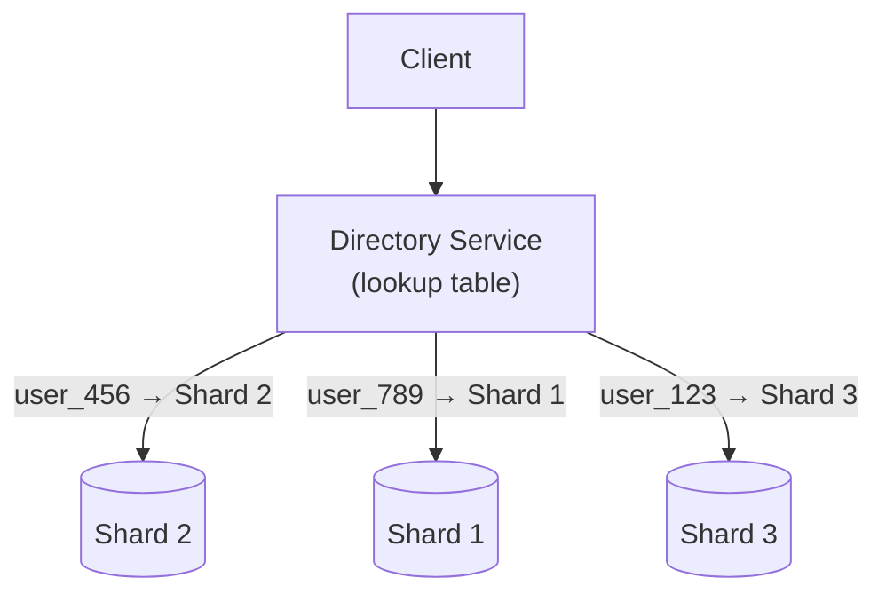
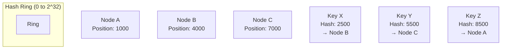
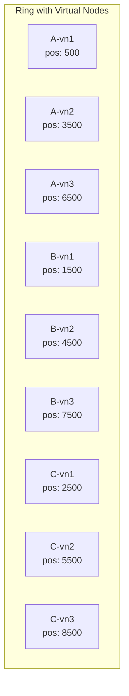
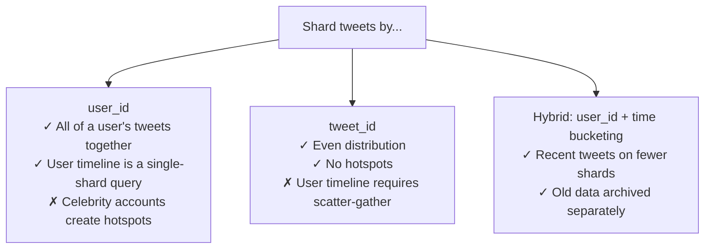
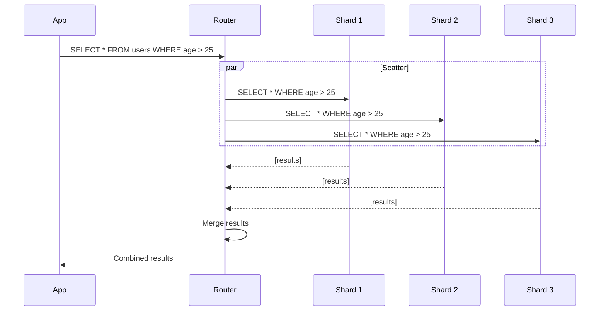

## Learning Objectives

- Distinguish between horizontal and vertical partitioning strategies
- Evaluate sharding strategies: range-based, hash-based, and directory-based
- Explain consistent hashing and its role in minimizing data movement during rebalancing
- Design partitioning schemes that avoid hotspots and support efficient queries
- Handle cross-partition queries and distributed joins

## Prerequisites

- Understanding of database types and access patterns
- Familiarity with hashing algorithms and modular arithmetic
- Knowledge of horizontal scaling concepts

## Why Partition Data?

A single database server has limits:

```
Single PostgreSQL server:
  Storage: ~16 TB practical limit
  Connections: ~500-1000 concurrent
  Write throughput: ~10,000-50,000 TPS
  Read throughput: ~50,000-200,000 QPS (with indexes)
```

When your data or traffic exceeds these limits, you need to **split the data across multiple machines**. This is partitioning (or sharding).



## Vertical vs. Horizontal Partitioning

### Vertical Partitioning

Split a table by **columns** into separate tables or databases:



**When to use**: When some columns are accessed far more frequently than others. Keep hot columns together, cold columns separate.

**Limitation**: Doesn't help when row count is the bottleneck.

### Horizontal Partitioning (Sharding)

Split a table by **rows** across multiple databases:

```
Users table → 3 shards:
  Shard 1: users with id 1-1,000,000
  Shard 2: users with id 1,000,001-2,000,000
  Shard 3: users with id 2,000,001-3,000,000
```

This is the primary technique for scaling beyond a single machine.

## Sharding Strategies

### 1. Range-Based Sharding

Partition by ranges of the shard key:



**Pros**: Range queries are efficient (e.g., "get all users created in January"). Simple to understand and implement.

**Cons**: **Hotspots**. If new users are always assigned incrementing IDs, all writes go to the last shard. Time-based keys concentrate all recent data on one shard.

**Mitigation**: Use a different shard key (e.g., hash of user_id instead of user_id), or add a random prefix to time-based keys.

### 2. Hash-Based Sharding

Apply a hash function to the shard key, then map to a shard:

```
shard_number = hash(user_id) % number_of_shards

hash("user_456") = 2847261
2847261 % 4 = 1  → Shard 1

hash("user_789") = 9123847
9123847 % 4 = 3  → Shard 3
```

**Pros**: Even distribution (good hash function eliminates hotspots).

**Cons**: Range queries become expensive (must query all shards). Adding/removing shards requires rehashing and massive data movement.

### 3. Directory-Based Sharding

A lookup service maps each key to its shard:



**Pros**: Maximum flexibility. Can place any key on any shard. Easy rebalancing.

**Cons**: Directory service is a single point of failure and a bottleneck. Must be highly available and cached aggressively.

## Consistent Hashing

### The Rebalancing Problem

With simple hash-based sharding (`hash(key) % N`), adding or removing a shard changes N, causing **most keys to remap**:

```
Before (3 shards):  hash("user_456") % 3 = 1 → Shard 1
After  (4 shards):  hash("user_456") % 4 = 3 → Shard 3  (moved!)

With 1M keys and 3→4 shards: ~75% of keys need to move
```

### How Consistent Hashing Works

Map both **keys and nodes** onto a circular hash ring:



Each key is assigned to the **first node clockwise** from its position on the ring. When a node is added or removed, only keys between the new/removed node and its predecessor are affected.

```
Adding Node D at position 5500:
  Keys between 4000-5500 move from Node C to Node D
  All other keys stay put!

  Data movement: ~1/N of total keys (not 75%)
```

### Virtual Nodes

A single physical node has multiple positions on the ring (virtual nodes), ensuring even distribution:



With 100-200 virtual nodes per physical node, the distribution becomes very even. DynamoDB, Cassandra, and Riak all use consistent hashing with virtual nodes.

## Choosing a Shard Key

### The Most Important Decision

A bad shard key leads to hotspots, cross-shard queries, and operational nightmares. Consider:

| Criterion | Good Shard Key | Bad Shard Key |
|-----------|---------------|---------------|
| **Cardinality** | user_id (millions of values) | country (< 200 values) |
| **Distribution** | Evenly spread | Skewed (1% of users = 50% of traffic) |
| **Query patterns** | Most queries include the key | Queries rarely filter by it |
| **Growth** | Grows evenly over time | All new data goes to one shard |

### Example: Twitter



Twitter actually uses a hybrid approach: tweets are sharded by `tweet_id` (based on Snowflake IDs that include a timestamp), with a separate user-timeline cache that denormalizes the data.

## Handling Cross-Shard Operations

### Scatter-Gather Queries

When a query can't be routed to a single shard:



Scatter-gather is expensive. **Design your shard key so the most common queries hit a single shard**.

### Cross-Shard Joins

JOINs across shards are extremely expensive. Strategies to avoid them:

1. **Denormalization**: Store related data together in the same shard
2. **Broadcast tables**: Small reference tables replicated to all shards
3. **Application-level joins**: Fetch from each shard and join in the application
4. **Avoid them**: Redesign your schema so joins aren't needed

## Rebalancing Strategies

### When to Rebalance

- A shard is running out of storage
- One shard handles disproportionate traffic (hotspot)
- You're adding or removing nodes

### Rebalancing Approaches

| Strategy | How It Works | Downtime |
|----------|-------------|----------|
| **Fixed partitions** | Pre-allocate many partitions (e.g., 1000), assign to nodes | None (move whole partitions) |
| **Dynamic splitting** | Split a large partition into two when it exceeds a threshold | Brief (for the splitting partition) |
| **Consistent hashing** | Add/remove virtual nodes; only affected key ranges move | None (gradual migration) |

**Fixed partitions** is the most common in practice. Cassandra, Elasticsearch, and Kafka all pre-allocate partitions. Adding a node means reassigning some partitions to the new node — no data splitting required.

## Capacity Estimation

For an e-commerce platform with 50M users, 500M products, and 2B orders:

```
Users: 50M × 2KB = 100 GB → Single PostgreSQL instance is fine
Products: 500M × 5KB = 2.5 TB → Need 3-5 shards
Orders: 2B × 1KB = 2 TB, growing 200M/year
  → Shard by user_id (orders belong to users)
  → 4 shards now, plan for 8 in 2 years

Shard key analysis:
  - Products by category_id? No, 100 categories → uneven
  - Products by product_id (hash)? Yes, even distribution
  - Orders by user_id? Yes, keeps user's orders together
  - Orders by order_date? No, all writes to latest shard
```

## Real-World Examples

### Instagram

Instagram shards PostgreSQL by user ID using a logical sharding scheme. Each "logical shard" maps to a physical PostgreSQL instance. They pre-allocate thousands of logical shards and can move them between physical servers without changing the application:

```
Logical Shard = user_id % 4096
Physical mapping: Logical Shards 0-511 → Server 1
                  Logical Shards 512-1023 → Server 2
                  ...
```

### Vitess (YouTube)

YouTube uses Vitess to shard MySQL. Vitess provides:
- A proxy layer that routes queries to the right shard
- Cross-shard query support (scatter-gather)
- Online schema migrations across all shards
- Transparent resharding

## Interview Approach

When discussing partitioning in an interview:

1. **Estimate the data size**: Do you actually need sharding? Many systems fit on one server.
2. **Identify the shard key**: Based on query patterns, not just data distribution.
3. **Choose the strategy**: Hash for even distribution, range for range queries.
4. **Address hotspots**: How will you handle celebrity users or viral content?
5. **Plan for rebalancing**: How will you add shards without downtime?
6. **Handle cross-shard queries**: Denormalize, broadcast tables, or accept scatter-gather.

> **Pro tip**: Start simple. Many interviewers want to see that you know when NOT to shard. "At our estimated scale of 10M users and 100GB of data, a single PostgreSQL instance with read replicas is sufficient. We'd consider sharding at 1TB+."

## Key Takeaways

1. **Vertical first, horizontal when needed**: Split columns before splitting rows. It's simpler.
2. **Shard key choice is critical**: It determines query efficiency, data distribution, and operational complexity.
3. **Consistent hashing minimizes data movement**: Essential for elastic systems that add/remove nodes.
4. **Avoid cross-shard operations**: Design your shard key so most queries hit one shard.
5. **Pre-allocate partitions**: Fixed partitions (like Kafka, Cassandra) simplify rebalancing.
6. **Don't shard prematurely**: A well-tuned single-node database handles more than you think.

## External Resources

- [Designing Data-Intensive Applications — Ch. 6: Partitioning](https://dataintensive.net/)
- [Consistent Hashing — Stanford (Original Paper)](https://cs.stanford.edu/)
- [Vitess: Scaling MySQL at YouTube](https://vitess.io/docs/)
- [Instagram Engineering: Sharding & IDs](https://instagram-engineering.com/sharding-ids-at-instagram-1cf5a71e5a5c)
- [DynamoDB Under the Hood: Partitioning](https://www.amazon.science/publications/amazon-dynamodb-a-scalable-predictably-performant-and-fully-managed-nosql-database-service)
- [Cassandra Partitioning Explained](https://cassandra.apache.org/doc/latest/cassandra/architecture/dynamo.html)
