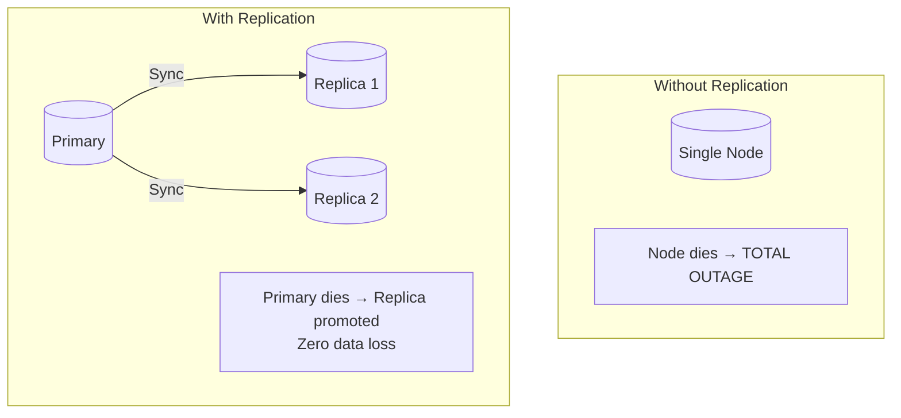
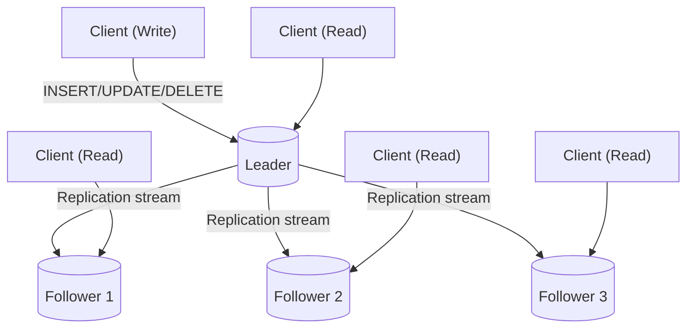
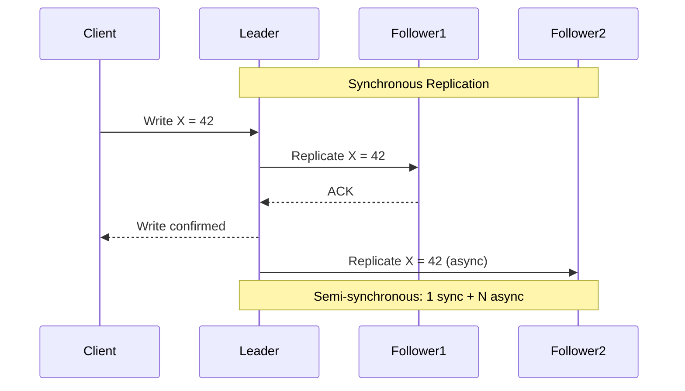
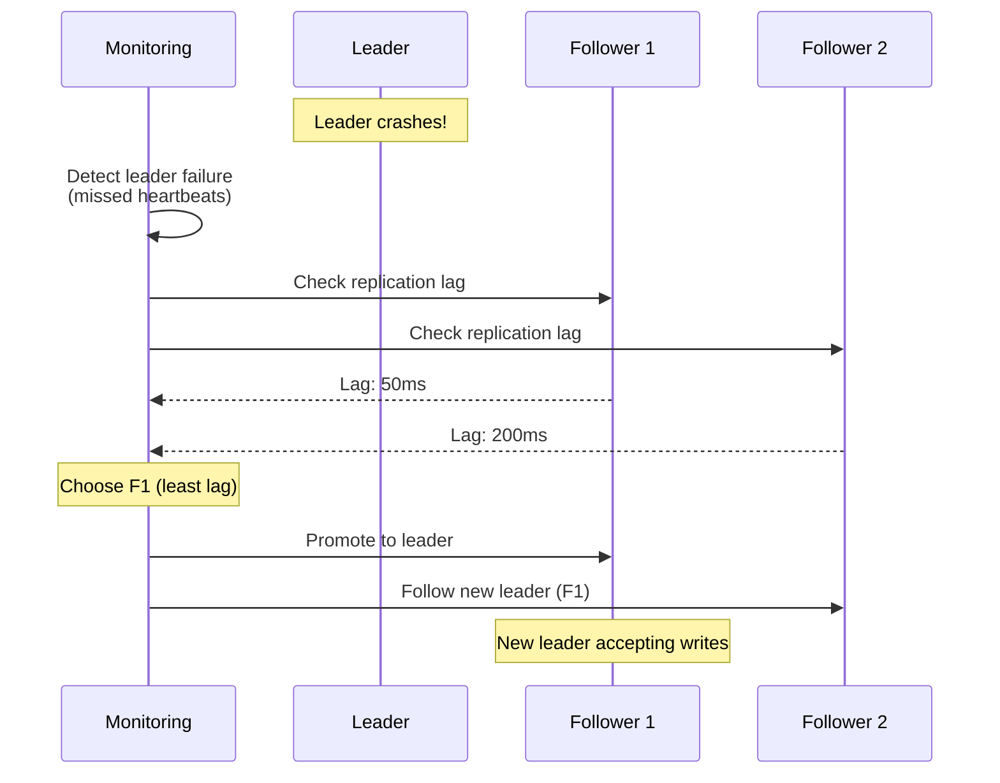
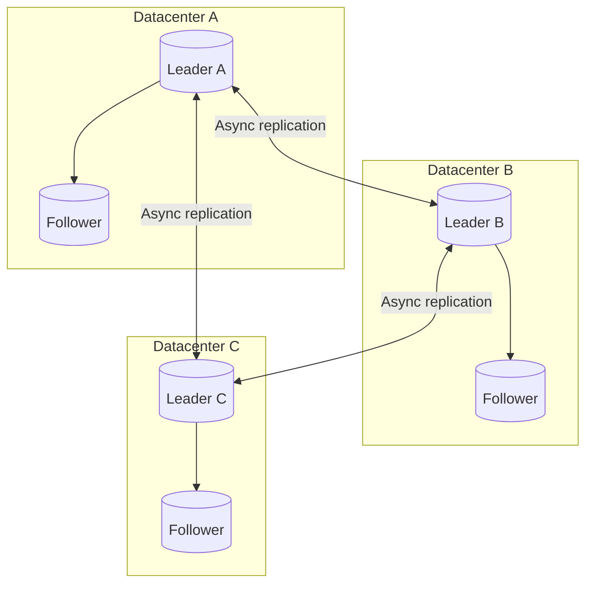
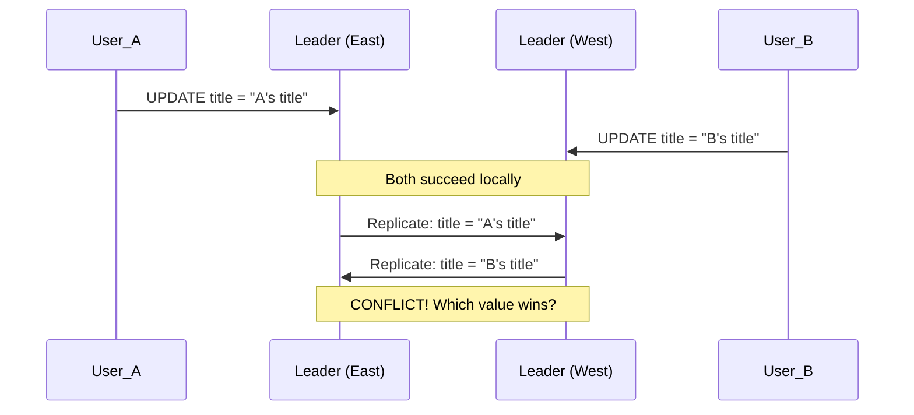
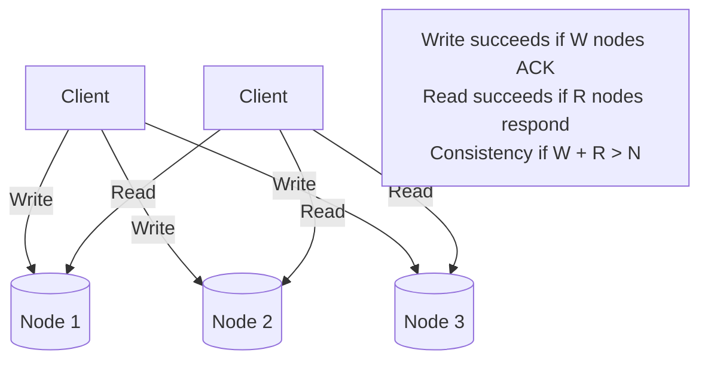
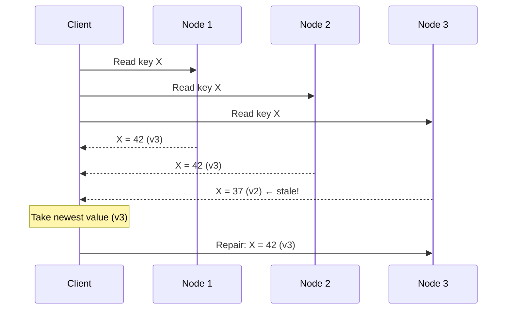
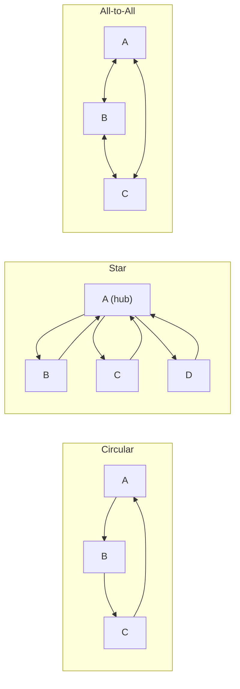
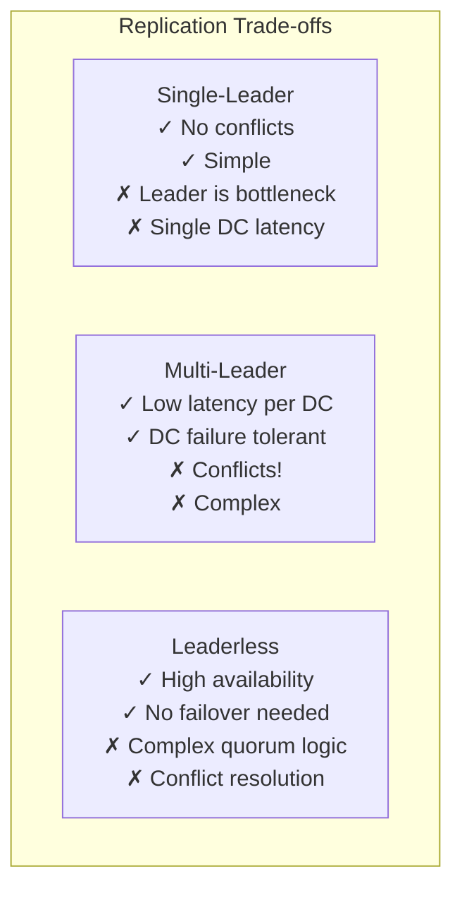

## Learning Objectives

- Compare single-leader, multi-leader, and leaderless replication architectures
- Analyze conflict resolution strategies for concurrent writes
- Design read replica architectures for read-heavy workloads
- Evaluate replication lag and its impact on user experience
- Choose the right replication strategy for a given set of requirements

## Prerequisites

- Understanding of data partitioning and sharding
- Familiarity with CAP theorem and consistency models
- Knowledge of network failures and split-brain scenarios

## Why Replicate?

Replication serves three goals:

1. **High availability**: If one node dies, others continue serving
2. **Low latency**: Serve reads from the nearest replica
3. **Read scalability**: Distribute read load across replicas



## Single-Leader Replication

### Architecture

One node is the **leader** (primary/master). All writes go to the leader. Replicas (followers/secondaries) receive a replication stream and apply changes locally.



### Synchronous vs. Asynchronous Replication



| Mode | Durability | Latency | Availability |
|------|-----------|---------|-------------|
| **Fully synchronous** | Highest (all replicas have data) | Highest (wait for slowest) | Lowest (one slow replica blocks writes) |
| **Semi-synchronous** | High (at least 2 copies) | Medium | Medium |
| **Fully asynchronous** | Lowest (leader crash = data loss) | Lowest | Highest |

**PostgreSQL** defaults to asynchronous replication. You can configure synchronous_standby_names for semi-synchronous.

**MySQL** uses semi-synchronous replication with the `rpl_semi_sync` plugin.

### Handling Leader Failure (Failover)



**Failover risks**:
- **Data loss**: If async replication, uncommitted writes on the old leader are lost
- **Split-brain**: Old leader comes back online and thinks it's still leader
- **Stale reads**: Clients cached the old leader's address

### Replication Lag Issues

With asynchronous replication, followers may be seconds behind the leader:

**Read-after-write inconsistency**:
```
User writes a post (goes to leader)
User refreshes page (reads from follower)
→ Post doesn't appear yet! (follower hasn't caught up)
```

**Solutions**:
1. **Read-your-own-writes**: After a write, read from the leader for a few seconds
2. **Monotonic reads**: Pin a user to one replica so they never go backward in time
3. **Consistent prefix reads**: Ensure causally related writes appear in order

## Multi-Leader Replication

### Architecture

Multiple nodes accept writes. Each leader replicates to the others:



### Use Cases

- **Multi-datacenter operation**: Each datacenter has a leader for low-latency local writes
- **Offline-capable clients**: Each client is a "leader" that syncs when online (CouchDB, mobile apps)
- **Collaborative editing**: Google Docs treats each user's changes as writes to their own "leader"

### The Conflict Problem

When two leaders accept conflicting writes simultaneously:



### Conflict Resolution Strategies

| Strategy | How It Works | Used By |
|----------|-------------|---------|
| **Last-write-wins (LWW)** | Highest timestamp wins; others discarded | Cassandra, DynamoDB |
| **Merge values** | Combine conflicting values | CouchDB (JSON merge) |
| **Custom resolution** | Application-specific logic | MongoDB (custom handlers) |
| **CRDT** | Data structures that auto-merge | Riak, Redis Enterprise |
| **Conflict-free by design** | Avoid conflicts through data modeling | Most practical systems |

**Last-write-wins** is simple but dangerous — it silently drops data. A user's edit disappears because another user's edit had a later timestamp (and clocks across DCs aren't perfectly synced).

### CRDTs (Conflict-Free Replicated Data Types)

CRDTs are data structures designed for automatic conflict resolution:

```
G-Counter (Grow-only counter):
  Node A: {A: 5, B: 0, C: 0}  → total = 5
  Node B: {A: 0, B: 3, C: 0}  → total = 3
  Node C: {A: 0, B: 0, C: 2}  → total = 2

  Merge: take max per node → {A: 5, B: 3, C: 2} → total = 10
  No conflicts, mathematically guaranteed convergence
```

**Practical CRDTs**: Counters (likes, views), sets (add/remove items from cart), registers (last-writer-wins), sequences (collaborative text editing).

## Leaderless Replication

### Architecture

No designated leader. **Any node can accept reads and writes**. The client sends writes to multiple replicas simultaneously:



### Read Repair and Anti-Entropy

Since writes may not reach all nodes, stale data must be fixed:

**Read repair**: When a read detects a stale value on a node, the client writes the correct value back:



**Anti-entropy**: A background process continuously compares data across replicas and copies missing data. Cassandra uses **Merkle trees** for efficient comparison.

### Sloppy Quorums and Hinted Handoff

During a network partition, strict quorums might not be achievable. A **sloppy quorum** allows writes to temporarily go to any available nodes:

```
Normal: Write to nodes A, B, C (the designated replicas)
Partition: Node C unreachable

Strict quorum: Write fails (can't reach C)
Sloppy quorum: Write to nodes A, B, D (D is a temporary stand-in)

When C recovers: D sends the "hint" (stored write) to C → "hinted handoff"
```

This improves availability at the cost of potential inconsistency — the classic AP trade-off.

## Replication Topologies

### Multi-Leader Topologies



| Topology | Fault Tolerance | Ordering | Complexity |
|----------|----------------|----------|------------|
| **Circular** | One node failure breaks chain | Causal order preserved | Low |
| **Star** | Hub failure breaks everything | Hub orders writes | Medium |
| **All-to-all** | Tolerates any single failure | Ordering challenges | High |

**All-to-all** is most common in practice (MySQL group replication, CockroachDB).

## Real-World Examples

### Amazon Aurora

Aurora separates compute and storage. The storage layer replicates data across 6 nodes in 3 AZs:

```
Write quorum: 4/6 (tolerates losing an entire AZ + one node)
Read quorum: 3/6 (fast reads from local AZ)
Replication: Storage-level, not SQL-level → 6x fewer network bytes
```

### Cassandra

Leaderless with tunable consistency:

```
Replication factor: 3
  - CONSISTENCY ONE:     W=1, R=1 (fast, eventually consistent)
  - CONSISTENCY QUORUM:  W=2, R=2 (balanced)
  - CONSISTENCY ALL:     W=3, R=3 (strong, but any node failure blocks operations)
```

### MongoDB

Single-leader with replica sets (typically 3 nodes):

```
Primary: accepts all writes
Secondary 1: async replication, can serve reads (with readPreference)
Secondary 2: async replication, can serve reads
Arbiter (optional): votes in elections but holds no data
```

When the primary fails, secondaries hold an election (Raft-based) and promote one to primary. Typical failover time: 5-15 seconds.

## Trade-Off Summary



## Interview Approach

1. **Start with single-leader**: It's the simplest and handles most use cases
2. **Add read replicas**: For read-heavy workloads (10:1 read/write ratio or higher)
3. **Consider multi-leader**: Only for multi-datacenter or offline-capable requirements
4. **Consider leaderless**: For ultra-high availability with tunable consistency
5. **Address replication lag**: Explain read-after-write consistency solutions
6. **Discuss failover**: How long, what data is lost, how clients reconnect

> **Pro tip**: "We'll use PostgreSQL with one primary and two read replicas in the same region. Reads go to replicas via a connection pooler like PgBouncer. If the primary fails, our cloud provider's managed service handles automatic failover in under 30 seconds."

## Key Takeaways

1. **Single-leader is the default**: Used by PostgreSQL, MySQL, MongoDB. Simple, no conflicts, well-understood.
2. **Async replication trades durability for speed**: Accept potential data loss during failover, or use semi-sync for critical data.
3. **Multi-leader is for multi-DC**: Don't use it unless you need writes in multiple datacenters.
4. **Leaderless requires quorum math**: W + R > N for strong consistency. Tune for your read/write ratio.
5. **Conflict resolution is hard**: Prefer conflict avoidance (single leader) over conflict resolution (multi-leader, leaderless).
6. **Read replicas don't solve write scaling**: They only help with read throughput. For write scaling, you need sharding.

## External Resources

- [Designing Data-Intensive Applications — Ch. 5: Replication](https://dataintensive.net/)
- [Amazon Aurora: Design Considerations](https://www.amazon.science/publications/amazon-aurora-design-considerations-for-high-throughput-cloud-native-relational-databases)
- [CRDTs Explained](https://crdt.tech/)
- [PostgreSQL Replication Documentation](https://www.postgresql.org/docs/current/high-availability.html)
- [MongoDB Replica Set Architecture](https://www.mongodb.com/docs/manual/replication/)
- [Cassandra Architecture: Replication](https://cassandra.apache.org/doc/latest/cassandra/architecture/dynamo.html)
