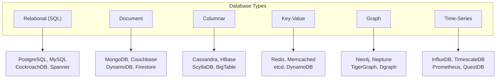
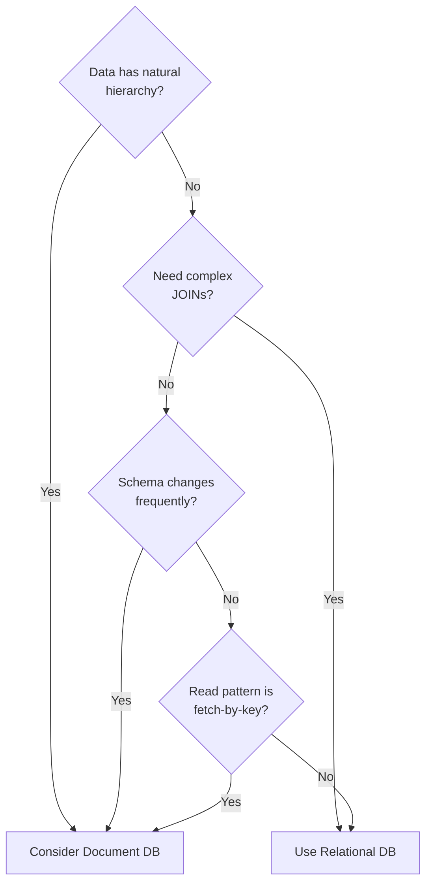
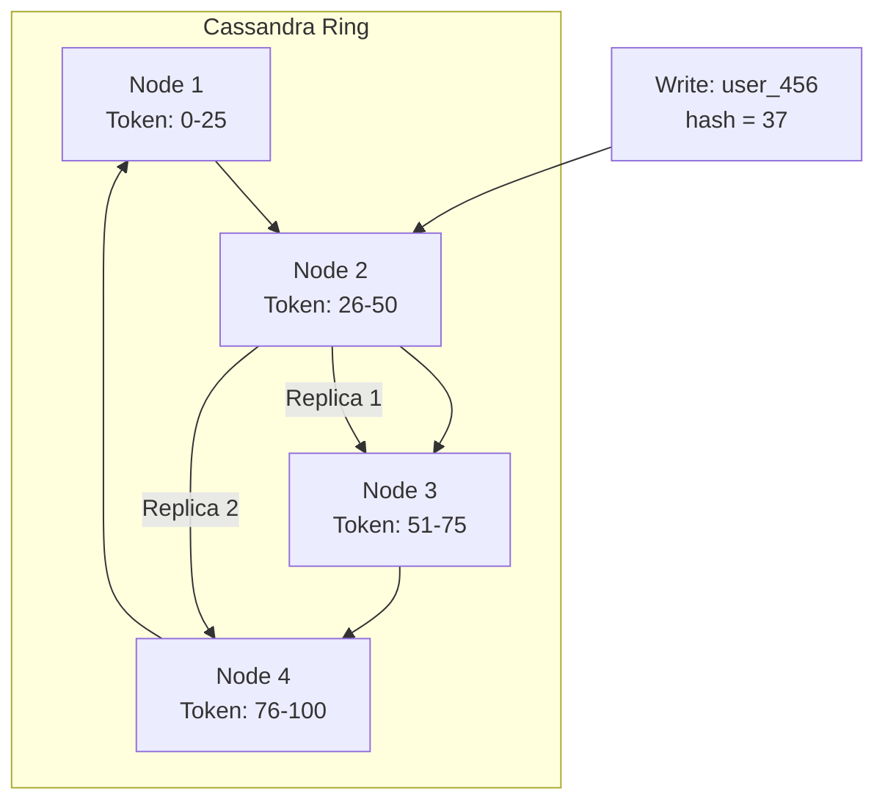
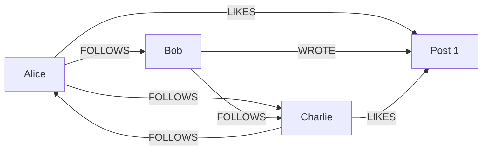
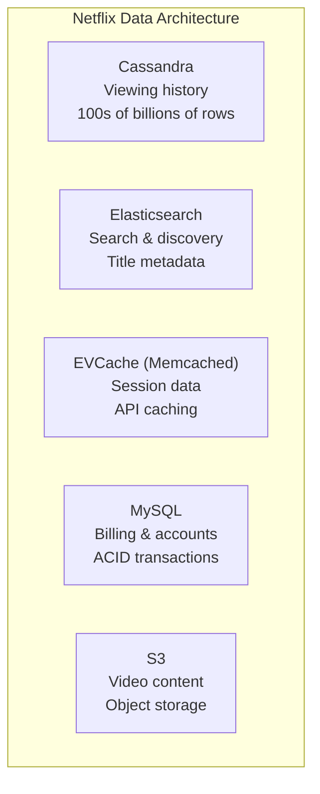
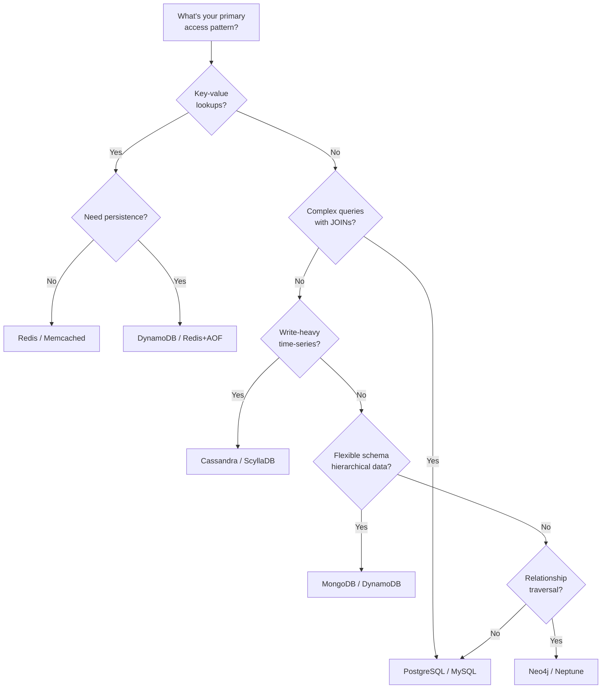

## Learning Objectives

- Compare relational, document, columnar, key-value, and graph database models
- Evaluate ACID vs BASE properties and their practical implications
- Choose the right database type based on access patterns, consistency needs, and scale
- Analyze real-world database choices made by major tech companies
- Avoid common pitfalls when selecting databases for system design interviews

## Prerequisites

- Understanding of basic database concepts (tables, indexes, queries)
- Familiarity with scalability patterns (vertical vs horizontal scaling)
- Basic SQL knowledge

## Database Categories Overview

### The Landscape



## Relational Databases (SQL)

### Core Principles

Relational databases organize data into **tables with predefined schemas**, enforce relationships through **foreign keys**, and guarantee **ACID transactions**.

```sql
-- Rigid schema with enforced relationships
CREATE TABLE users (
    id        SERIAL PRIMARY KEY,
    email     VARCHAR(255) UNIQUE NOT NULL,
    name      VARCHAR(100) NOT NULL,
    created_at TIMESTAMP DEFAULT NOW()
);

CREATE TABLE orders (
    id         SERIAL PRIMARY KEY,
    user_id    INTEGER REFERENCES users(id),
    total      DECIMAL(10,2) NOT NULL,
    status     VARCHAR(20) DEFAULT 'pending',
    created_at TIMESTAMP DEFAULT NOW()
);

-- JOIN across tables
SELECT u.name, COUNT(o.id) as order_count, SUM(o.total) as total_spent
FROM users u
LEFT JOIN orders o ON u.id = o.user_id
GROUP BY u.id
HAVING SUM(o.total) > 1000;
```

### ACID Properties

| Property | Guarantee | Example |
|----------|-----------|---------|
| **Atomicity** | All or nothing | Transfer: both debit and credit succeed, or neither does |
| **Consistency** | Data meets all constraints | Foreign keys, unique constraints, check constraints |
| **Isolation** | Concurrent transactions don't interfere | Two users buying the last item → only one succeeds |
| **Durability** | Committed data survives crashes | Write-ahead log ensures data persists |

### Strengths and Weaknesses

**Strengths**: Complex queries (JOINs, aggregations, subqueries), strict consistency, mature tooling, SQL is universal.

**Weaknesses**: Horizontal scaling is hard (sharding JOINs is painful), schema changes can be expensive, not ideal for hierarchical or highly variable data.

## Document Databases

### Data Model

Documents store data as **self-contained JSON-like objects** with flexible schemas:

```json
{
  "_id": "user_456",
  "name": "Alice Chen",
  "email": "alice@example.com",
  "addresses": [
    {
      "type": "home",
      "street": "123 Main St",
      "city": "San Francisco",
      "state": "CA"
    },
    {
      "type": "work",
      "street": "456 Market St",
      "city": "San Francisco",
      "state": "CA"
    }
  ],
  "orders": [
    {
      "id": "ord_789",
      "items": ["widget_a", "gadget_b"],
      "total": 99.99,
      "status": "shipped"
    }
  ]
}
```

### When Documents Shine



**MongoDB** example use cases: content management systems, product catalogs with varying attributes, user profiles, real-time analytics.

### BASE Properties

Document databases (and NoSQL in general) often follow BASE instead of ACID:

| Property | Meaning |
|----------|---------|
| **Basically Available** | System guarantees availability (may return stale data) |
| **Soft State** | State may change over time even without input (due to eventual consistency) |
| **Eventually Consistent** | System will converge to consistent state given no new updates |

## Columnar Databases

### Wide-Column Stores

Columnar databases like Cassandra and HBase store data by **column families** rather than rows, optimized for write-heavy workloads and time-series data:

```
Row Key: user_456
  Column Family "profile":
    name: "Alice"        timestamp: 1699000001
    email: "a@test.com"  timestamp: 1699000001

  Column Family "activity":
    last_login: "2024-11-03"  timestamp: 1699000100
    page_views: 1542          timestamp: 1699000200
    last_order: "ord_789"     timestamp: 1699000300
```

### Cassandra's Architecture



**Best for**: Time-series data, IoT sensor data, user activity logs, messaging systems, write-heavy workloads.

**Not ideal for**: Complex queries with JOINs, ad-hoc analytics, data requiring frequent updates.

## Key-Value Stores

### Redis: More Than a Cache

```
SET user:456:session "eyJhbGciOiJIUzI1NiJ9..." EX 3600
GET user:456:session

HSET user:456:profile name "Alice" email "alice@test.com"
HGETALL user:456:profile

ZADD leaderboard 9500 "player_a" 8700 "player_b" 9200 "player_c"
ZREVRANGE leaderboard 0 9 WITHSCORES
```

**Use cases**: Session storage, caching, rate limiting, leaderboards, real-time counters, pub/sub messaging.

**Limitations**: Limited query capabilities, data must fit in memory (for Redis), no relationships.

## Graph Databases

### When Relationships Are First-Class



```cypher
// Neo4j Cypher: "Friends of friends who liked a post I wrote"
MATCH (me:User {name: 'Alice'})-[:FOLLOWS]->(friend)-[:FOLLOWS]->(fof)
WHERE fof <> me
AND NOT (me)-[:FOLLOWS]->(fof)
MATCH (fof)-[:LIKES]->(post)<-[:WROTE]-(me)
RETURN DISTINCT fof.name, post.title
```

This query would require **multiple self-JOINs** in SQL, becoming exponentially slower as the graph grows. In a graph database, it's a constant-time traversal per relationship.

**Use cases**: Social networks, fraud detection, recommendation engines, knowledge graphs, network topology.

## Comparison Matrix

| Factor | Relational | Document | Columnar | Key-Value | Graph |
|--------|-----------|----------|----------|-----------|-------|
| **Schema** | Fixed | Flexible | Fixed column families | Schema-free | Schema-free |
| **Scaling** | Vertical (mostly) | Horizontal | Horizontal | Horizontal | Vertical (mostly) |
| **Consistency** | Strong (ACID) | Tunable | Tunable | Eventual | ACID (per node) |
| **Query** | SQL (complex) | JSON queries | Limited (by key) | Get/Set by key | Graph traversal |
| **Best write perf** | Medium | High | Very High | Very High | Medium |
| **Best read perf** | Complex queries | By document | By partition key | By key | Traversals |

## Real-World Database Choices

### Netflix



- **Cassandra** for viewing history: Write-heavy, time-series, no JOINs needed
- **MySQL** for billing: ACID transactions for financial data
- **EVCache** for sessions: Sub-millisecond reads, ephemeral data
- **Elasticsearch** for search: Full-text search across catalog

### Uber

- **MySQL/PostgreSQL**: Trip data, user accounts (structured, relational)
- **Cassandra**: Real-time driver location updates (write-heavy, geo-distributed)
- **Redis**: Real-time pricing, surge calculations (in-memory speed)
- **Elasticsearch**: Trip search, driver search (full-text + geo queries)

## Decision Framework

### Choosing the Right Database



### Questions to Ask

1. **What are the read/write patterns?** Read-heavy → optimize for reads (indexes, caching). Write-heavy → consider Cassandra or append-only stores.
2. **How structured is the data?** Fixed schema → SQL. Variable attributes → Document.
3. **Do you need JOINs?** Frequent JOINs → SQL. Denormalized access → NoSQL.
4. **What's the consistency requirement?** Financial data → ACID. Social feeds → eventual.
5. **What's the scale?** Under 1TB with complex queries → PostgreSQL handles it. Petabytes of writes → Cassandra.

## Common Interview Mistakes

1. **"MongoDB can't do transactions"**: MongoDB has supported multi-document ACID transactions since v4.0 (2018).
2. **"NoSQL is always faster"**: For complex analytical queries, PostgreSQL with proper indexes often beats document databases.
3. **"SQL doesn't scale"**: Vitess (YouTube), CockroachDB, Google Spanner, and CitusDB all scale SQL horizontally.
4. **"Choose one database"**: Real systems use multiple databases (polyglot persistence).
5. **"Schema-less means no schema"**: Document databases still have implicit schemas. Use schema validation.

## Key Takeaways

1. **No one-size-fits-all**: Different data has different access patterns. Use the right tool for each.
2. **SQL is not dead**: PostgreSQL is one of the most versatile databases. Start with SQL unless you have a specific reason not to.
3. **Polyglot persistence**: Major systems use 3-5 different database types. Each optimized for its use case.
4. **ACID vs BASE is a spectrum**: Many NoSQL databases now offer configurable consistency. DynamoDB offers strong consistency reads.
5. **Access patterns drive the choice**: Model your queries first, then choose the database — not the other way around.
6. **Consider operational burden**: A "better" database that your team can't operate is worse than a "good enough" database you know well.

## External Resources

- [Designing Data-Intensive Applications — Ch. 2-3](https://dataintensive.net/)
- [Amazon DynamoDB Paper](https://www.allthingsdistributed.com/files/amazon-dynamo-sotp2007.pdf)
- [Google Bigtable Paper](https://research.google/pubs/pub27898/)
- [MongoDB Architecture Guide](https://www.mongodb.com/docs/manual/core/document/)
- [PostgreSQL vs MongoDB: A Complete Comparison](https://www.mongodb.com/compare/mongodb-postgresql)
- [Netflix Tech Blog — Data Architecture](https://netflixtechblog.com/)
