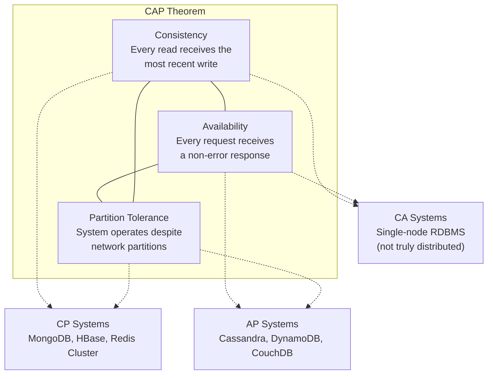
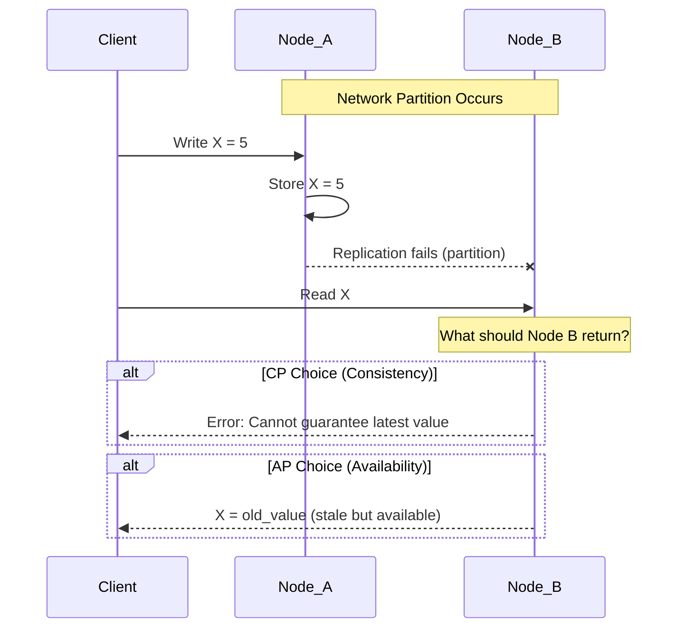
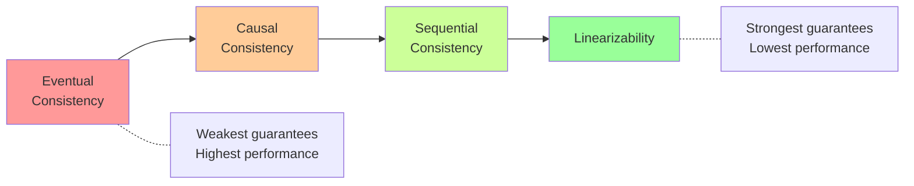
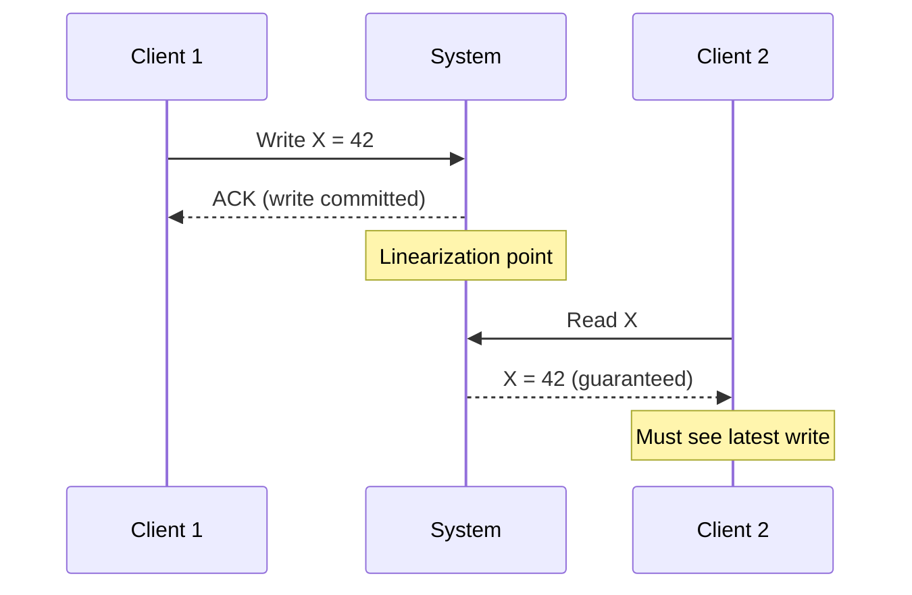
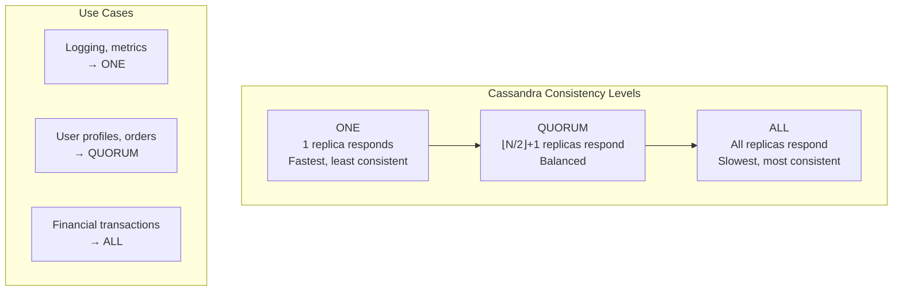
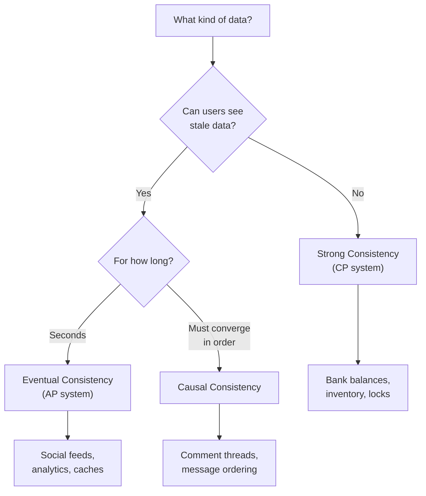

## Learning Objectives

- Explain the CAP theorem and its practical implications for distributed systems
- Compare consistency models: strong, eventual, causal, and linearizability
- Analyze real-world systems through the lens of CAP trade-offs
- Design systems that choose the right consistency guarantee for a given use case
- Reason about quorum-based consistency and tunable consistency levels

## Prerequisites

- Understanding of distributed system basics (replication, partitioning)
- Familiarity with database transactions and ACID properties
- Knowledge of client-server architecture and network fundamentals

## The CAP Theorem

### What CAP Really Says

In 2000, Eric Brewer conjectured (later proven by Gilbert and Lynch) that a distributed data store can provide at most **two of three** guarantees simultaneously:



The key insight most people miss: **partition tolerance is not optional** in a distributed system. Network partitions *will* happen. The real choice is between **consistency and availability** during a partition.

### The Partition Reality

When a network partition occurs between two nodes:



**CP choice**: Refuse to serve reads that might be stale. The system remains consistent but becomes unavailable to some clients.

**AP choice**: Serve reads from local state, even if stale. The system remains available but may return inconsistent data.

### Why CA Doesn't Exist in Practice

A CA system sacrifices partition tolerance, meaning it simply doesn't handle partitions. In a single-node PostgreSQL database, this is fine — there's no network to partition. But the moment you distribute data across nodes, you **must** handle partitions.

> **Interview Tip**: When someone says "we chose a CA system," ask whether they're truly distributed. A single-node database is CA by default but isn't a distributed system.

## Consistency Models Deep Dive

### The Consistency Spectrum

Consistency isn't binary. There's a spectrum from weakest to strongest:



### Eventual Consistency

The system guarantees that, **if no new updates are made**, all replicas will *eventually* converge to the same value. There's no bound on how long "eventually" takes.

```
Timeline:
  Client A writes X=5 to Node 1 at t=0
  Client B reads X from Node 2 at t=1  → gets X=3 (stale)
  Client B reads X from Node 2 at t=5  → gets X=3 (still stale)
  Replication completes at t=8
  Client B reads X from Node 2 at t=9  → gets X=5 (converged)
```

**Where it works**: DNS propagation, social media timelines, product catalog updates, analytics counters.

**Where it fails**: Bank account balances, inventory counts for limited items, distributed locks.

### Causal Consistency

Preserves the order of causally related operations. If operation A causes operation B, every node sees A before B. Concurrent operations (no causal relationship) can be seen in any order.

```
Causally related:
  Alice posts: "I got the job!"     (operation A)
  Bob replies: "Congratulations!"   (operation B, caused by A)
  → Every node must see A before B

Not causally related:
  Alice posts about her job
  Charlie posts about lunch
  → Different nodes can see these in either order
```

**Real-world example**: In a social media comment thread, replies must appear after the parent comment. But independent posts on different threads have no causal relationship.

### Sequential Consistency

All nodes see operations in **the same order**, though that order might not match real-time. Think of it as a single global timeline that all nodes agree on, even if operations aren't placed in their exact wall-clock order.

### Linearizability (Strong Consistency)

The strongest guarantee: every operation appears to take effect **atomically** at some point between its start and end time. Once a write completes, all subsequent reads see that write. This is what most people mean by "consistent."



**Cost of linearizability**: Higher latency (must coordinate across nodes), lower throughput, reduced availability during partitions.

## Quorum-Based Consistency

### The Quorum Formula

For a system with **N** replicas, define:
- **W** = number of nodes that must acknowledge a write
- **R** = number of nodes that must respond to a read

**If W + R > N**, reads and writes overlap, guaranteeing strong consistency:

```
N = 3 replicas

Strong consistency configurations:
  W=2, R=2 → 2+2=4 > 3 ✓ (balanced read/write)
  W=3, R=1 → 3+1=4 > 3 ✓ (fast reads, slow writes)
  W=1, R=3 → 1+3=4 > 3 ✓ (fast writes, slow reads)

Eventual consistency:
  W=1, R=1 → 1+1=2 ≤ 3 ✗ (fast but potentially stale)
```

### Tunable Consistency in Practice



**DynamoDB** offers eventual consistency (default) and strong consistency reads. Strong reads cost 2x the capacity units but guarantee you see the latest write.

## Real-World System Analysis

### How Major Systems Choose

| System | CAP Choice | Consistency Model | Why |
|--------|-----------|-------------------|-----|
| **Google Spanner** | CP | Linearizable | TrueTime API, GPS-synchronized clocks |
| **Amazon DynamoDB** | AP (default) | Eventual / Strong (tunable) | Shopping cart must always be available |
| **Apache Cassandra** | AP | Tunable (ONE to ALL) | Write-heavy workloads, multi-DC |
| **MongoDB** | CP | Linearizable (default) | Document consistency for primary reads |
| **CockroachDB** | CP | Serializable | SQL semantics require strong consistency |

### Netflix: Eventual Consistency in Practice

Netflix serves 200M+ subscribers. Their approach:

1. **Viewing history**: Eventual consistency. It's acceptable if your watch history takes a few seconds to sync across devices.
2. **Billing**: Strong consistency via a separate CP system. You can't double-charge or miss charges.
3. **Recommendations**: Eventual consistency. Stale recommendations are fine — they refresh frequently.

The lesson: **different parts of the same application can use different consistency models**.

### Amazon's Shopping Cart (Dynamo Paper)

Amazon's 2007 Dynamo paper chose availability over consistency for shopping carts:

> "An always-available shopping cart is more important than a perfectly consistent one. If there's a conflict, merge the carts — customers might see a previously removed item reappear, but they won't lose items they added."

This was a deliberate business decision: the cost of an unavailable cart (lost sales) exceeds the cost of an inconsistent cart (customer removes a re-added item).

## Trade-Off Analysis

### Consistency vs. Latency

Stronger consistency requires more coordination, which increases latency:

```
Linearizability: ~100-500ms (cross-datacenter coordination)
Sequential:      ~10-100ms  (single-leader replication)
Causal:          ~5-50ms    (vector clocks, local ordering)
Eventual:        ~1-10ms    (write locally, replicate async)
```

The **PACELC theorem** extends CAP: Even when there is no Partition, there's a trade-off between Latency and Consistency.

```
PACELC: If Partition → choose A or C
        Else → choose L or C

DynamoDB: PA/EL (Available during partition, Low latency otherwise)
Spanner:  PC/EC (Consistent always, accepts higher latency)
MongoDB:  PA/EC (Available during partition, Consistent otherwise)
```

### Decision Framework



## Capacity Estimation: Consistency Overhead

Consider a system with 3 replicas handling 100K requests/second:

| Consistency | Write Latency | Read Latency | Throughput |
|------------|---------------|--------------|------------|
| Eventual (W=1, R=1) | 2ms | 1ms | 100K rps |
| Quorum (W=2, R=2) | 15ms | 10ms | ~30K rps |
| Strong (W=3, R=1) | 50ms | 1ms | ~10K rps (writes) |

These are rough estimates. The key takeaway: **strong consistency can reduce throughput by 3-10x** compared to eventual consistency.

## Interview Approach

When asked about consistency in an interview:

1. **Identify the data**: What's being stored? User profiles, financial records, social posts?
2. **Assess staleness tolerance**: Can users see stale data? For how long?
3. **Consider failure modes**: What happens during a network partition?
4. **Evaluate business impact**: What's worse — showing stale data or being unavailable?
5. **Choose per-component**: Different data often needs different consistency levels.

**Common mistake**: Saying "we need strong consistency everywhere." This shows a lack of understanding of trade-offs. Identify which data needs strong consistency and which can tolerate staleness.

> **Pro tip**: In an interview, explicitly state: "For the user's account balance, we need strong consistency. For their notification count, eventual consistency is acceptable. This lets us optimize each path differently."

## Key Takeaways

1. **CAP is about partitions**: The real choice is consistency vs. availability *during* a network partition. Partitions are inevitable in distributed systems.
2. **Consistency is a spectrum**: From eventual to linearizable, each model offers different guarantees with different performance costs.
3. **Quorum math matters**: W + R > N gives you strong consistency. Tune W and R for your read/write ratio.
4. **PACELC extends CAP**: Even without partitions, you trade latency for consistency.
5. **Choose per-component**: A single application often uses multiple consistency models for different data types.
6. **Business drives the choice**: The right consistency level is determined by business requirements, not technical preference.

## External Resources

- [Brewer's CAP Theorem (Original Keynote)](https://www.infoq.com/articles/cap-twelve-years-later-how-the-rules-have-changed/)
- [Jepsen: Consistency Models](https://jepsen.io/consistency)
- [Amazon Dynamo Paper](https://www.allthingsdistributed.com/files/amazon-dynamo-sotp2007.pdf)
- [Google Spanner: TrueTime and External Consistency](https://research.google/pubs/pub39966/)
- [Martin Kleppmann — Designing Data-Intensive Applications, Ch. 9](https://dataintensive.net/)
- [PACELC Theorem Explained](https://en.wikipedia.org/wiki/PACELC_theorem)
