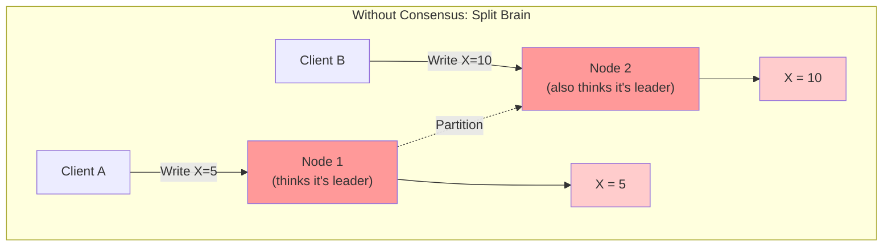
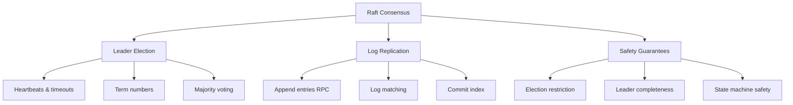
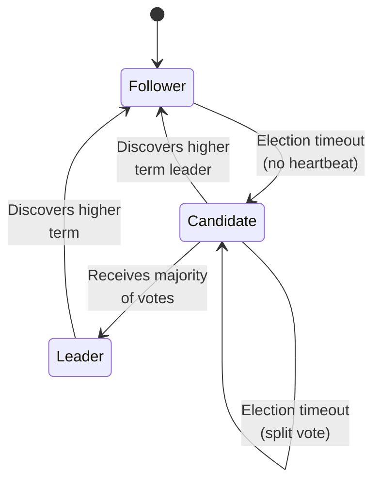
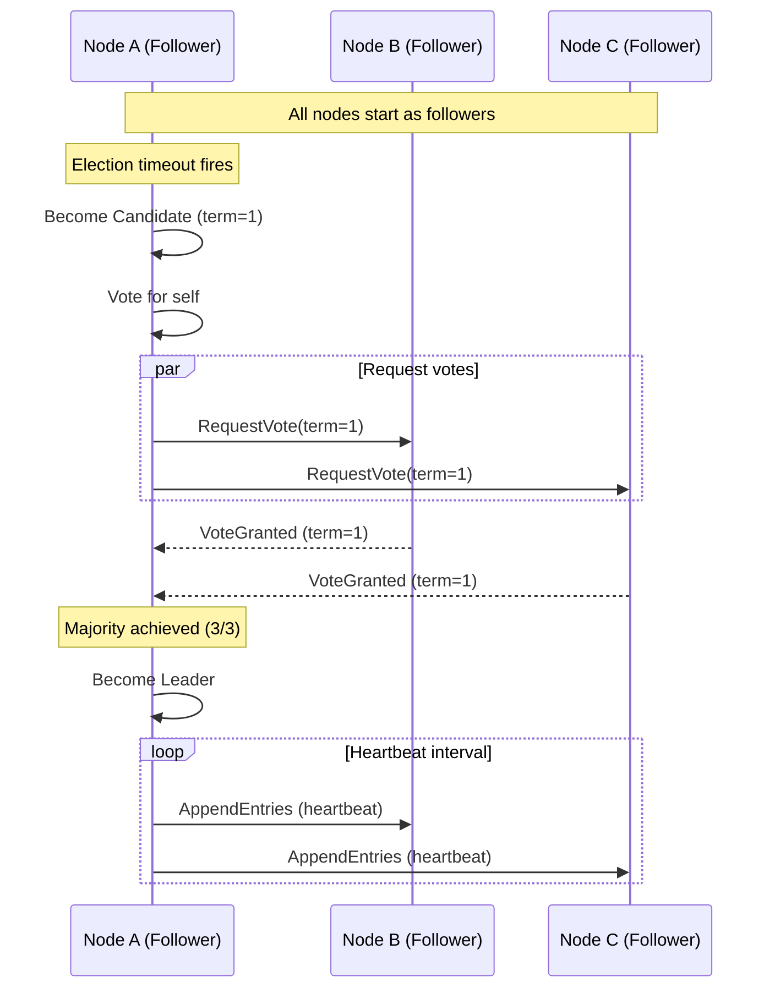
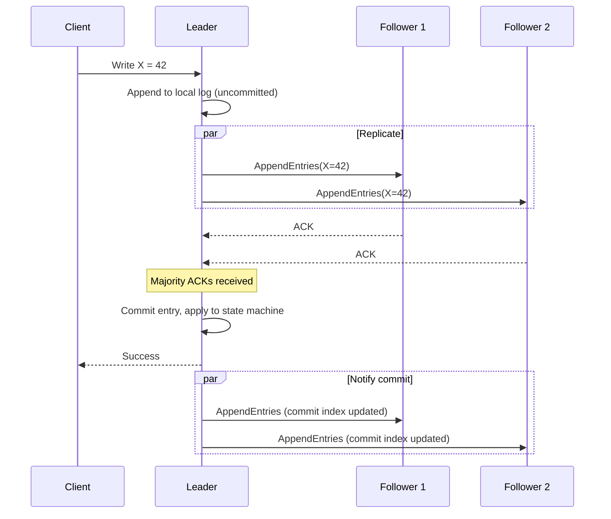
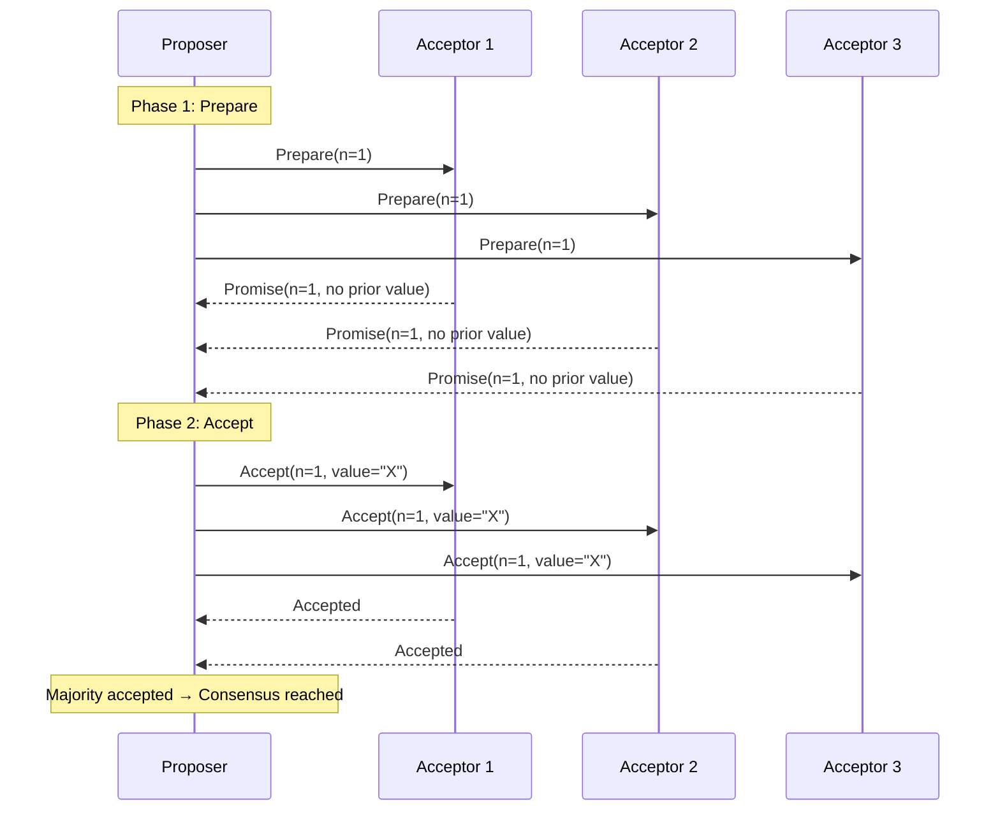
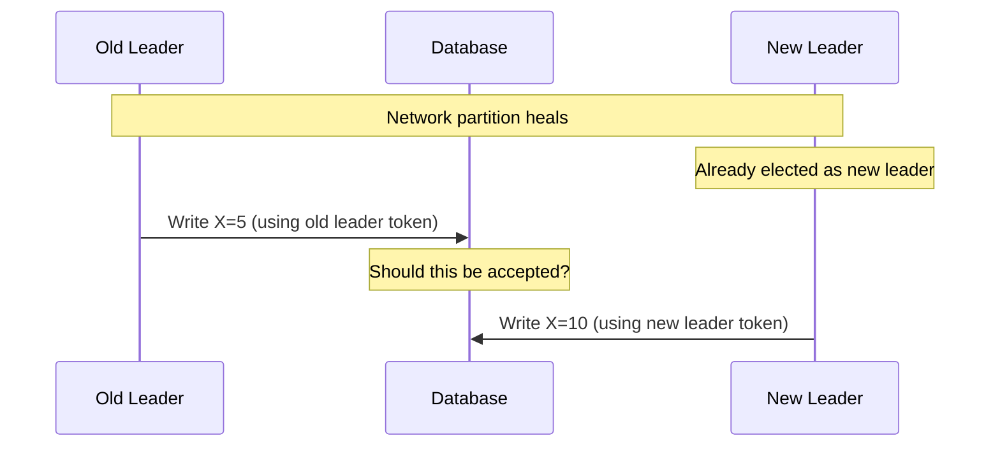
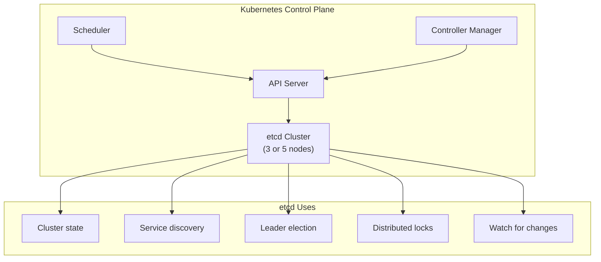
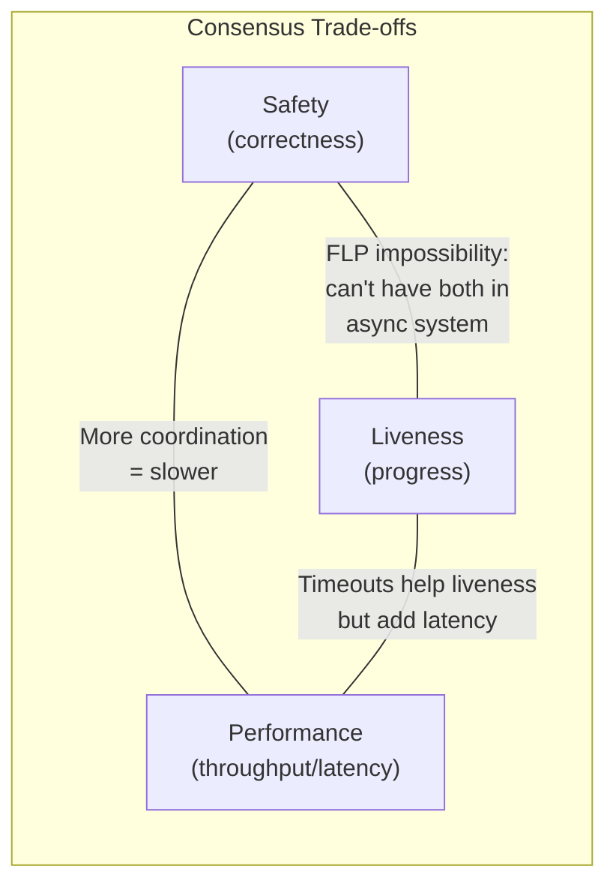

## Learning Objectives

- Explain why distributed consensus is necessary and when it's needed
- Compare Raft and Paxos consensus algorithms at a conceptual level
- Analyze leader election mechanisms and split-brain prevention
- Evaluate the role of coordination services like etcd and ZooKeeper
- Design systems that use consensus appropriately without over-relying on it

## Prerequisites

- Understanding of CAP theorem and consistency models
- Familiarity with distributed system failure modes
- Basic knowledge of state machines and replication

## Why Consensus Matters

### The Fundamental Problem

In a distributed system, multiple nodes must agree on a single value — which node is the leader, whether a transaction committed, what the current configuration is. Without consensus, you get **split-brain**: two nodes both think they're the leader, and data diverges irreversibly.



### When You Need Consensus

| Use Case | Why Consensus? |
|----------|---------------|
| Leader election | Only one leader must exist at any time |
| Distributed locks | Mutual exclusion across nodes |
| Atomic broadcast | All nodes must see the same messages in the same order |
| Configuration management | All nodes must agree on current config |
| Membership changes | Nodes must agree on who's in the cluster |

## The Raft Consensus Algorithm

### Why Raft Exists

Paxos (1989) is the foundational consensus algorithm, but it's notoriously difficult to understand and implement. Raft (2014) was designed to be **understandable** while providing the same guarantees. Most modern systems use Raft or a Raft variant.

### Raft's Three Sub-Problems



### Node States

Every node is in one of three states:



### Leader Election Walkthrough



**Key rules**:
- A node votes for at most one candidate per term
- The candidate with the most up-to-date log wins ties
- Randomized election timeouts prevent repeated split votes (typically 150-300ms)

### Log Replication

Once elected, the leader handles all client writes:



An entry is **committed** once the leader has replicated it to a majority of nodes. Committed entries are guaranteed to be durable — they survive leader failures.

## Paxos Simplified

### Single-Decree Paxos

Paxos solves consensus for a single value through three phases:



### Paxos vs. Raft

| Aspect | Paxos | Raft |
|--------|-------|------|
| **Understandability** | Notoriously complex | Designed for clarity |
| **Leader** | Optional (Multi-Paxos uses leader) | Required, single leader |
| **Log management** | Gaps allowed | No gaps, sequential |
| **Implementation** | Many variants, subtle bugs | Single spec, well-defined |
| **Used by** | Google Chubby, original Spanner | etcd, CockroachDB, TiKV |

> **Interview Tip**: You don't need to explain Paxos in detail. Mention that Raft provides the same safety guarantees as Multi-Paxos but is easier to implement. Know the phases at a high level.

## Split-Brain Prevention

### The Fencing Problem

Even with consensus, a deposed leader might not know it's been replaced. It might still try to process writes:



### Fencing Tokens

The solution: **monotonically increasing fencing tokens** (epoch numbers). Every leader gets a higher token. The storage layer rejects writes from tokens lower than the highest it has seen:

```
Leader 1 gets token 33 → writes accepted
Leader 1 partitioned, Leader 2 elected with token 34
Leader 2 writes with token 34 → accepted
Leader 1 recovers, tries to write with token 33 → REJECTED (34 > 33)
```

### Quorum-Based Protection

Another approach: require the leader to contact a majority before every write. If a new leader has been elected, the majority will inform the old leader that it's been superseded.

## Coordination Services

### etcd

etcd is a distributed key-value store that uses Raft for consensus. It's the backbone of Kubernetes:



**Key features**: Linearizable reads, watch API for change notifications, lease-based TTL, transactions (compare-and-swap).

### ZooKeeper

Apache ZooKeeper uses ZAB (ZooKeeper Atomic Broadcast), a protocol similar to Raft:

```
ZooKeeper Data Model:
/
├── /services
│   ├── /services/user-service
│   │   ├── /services/user-service/instance-001 (ephemeral)
│   │   └── /services/user-service/instance-002 (ephemeral)
│   └── /services/order-service
│       └── /services/order-service/instance-001 (ephemeral)
├── /config
│   └── /config/database-url
└── /locks
    └── /locks/payment-processing (ephemeral + sequential)
```

**Ephemeral nodes** automatically delete when the session ends, enabling service discovery and leader election. If a node crashes, its ephemeral nodes vanish, and watchers are notified.

### When to Use Coordination Services

| Use Case | Tool | Why |
|----------|------|-----|
| Kubernetes cluster state | etcd | Built-in, linearizable |
| Kafka broker coordination | ZooKeeper (legacy) / KRaft | Broker metadata, partition leaders |
| Distributed locking | etcd or ZooKeeper | Lease-based locks with TTL |
| Service discovery | etcd, ZooKeeper, Consul | Ephemeral nodes + watches |
| Feature flags | etcd | Watch API for real-time updates |

## Consensus Performance and Limitations

### Latency Characteristics

Consensus requires at least **one round trip** to a majority of nodes:

```
Same datacenter (3 nodes):
  Raft commit latency: ~2-5ms
  Throughput: ~10,000-50,000 writes/sec

Cross-datacenter (3 DCs, 100ms apart):
  Raft commit latency: ~200-400ms
  Throughput: ~500-2,000 writes/sec
```

This is why consensus-based systems are typically deployed within a single region, or use multi-region setups with careful placement of nodes.

### Scaling Consensus

Consensus does not scale horizontally for writes — every write must go through the single leader. Strategies to work around this:

1. **Partition the data**: Use consensus per partition (e.g., Kafka uses Raft per partition)
2. **Minimize what needs consensus**: Only use consensus for metadata; use other protocols for data
3. **Batching**: Group multiple operations into a single consensus round

## Trade-Off Analysis



**FLP Impossibility** (1985): No deterministic consensus algorithm can guarantee both safety and liveness in an asynchronous system with even one faulty process. Raft works around this with randomized timeouts — it's not deterministic, which sidesteps FLP.

## Interview Approach

When asked about consensus in a system design interview:

1. **Identify where consensus is needed**: Leader election? Configuration? Distributed locks?
2. **Don't reinvent the wheel**: Use etcd, ZooKeeper, or a built-in consensus mechanism
3. **Understand the cost**: Consensus is expensive — minimize what requires it
4. **Know the failure modes**: What happens when the leader dies? During a partition?
5. **Size the cluster**: 3 nodes tolerates 1 failure, 5 tolerates 2. Never use even numbers.

**Common mistake**: Using consensus for every operation. Consensus is for coordination metadata, not for every data write. Use it to elect a leader, then let the leader make fast local decisions.

## Key Takeaways

1. **Consensus solves agreement**: Multiple nodes agreeing on a single value is the foundation of reliable distributed systems.
2. **Raft is the practical choice**: Understandable, well-specified, and used by most modern systems (etcd, CockroachDB, TiKV).
3. **Split-brain is the enemy**: Fencing tokens and quorums prevent deposed leaders from causing damage.
4. **Consensus is expensive**: Minimize what requires consensus. Use it for metadata and coordination, not every data operation.
5. **Odd-numbered clusters**: Always use 3, 5, or 7 nodes. Even numbers don't improve fault tolerance.
6. **Coordination services exist**: Don't implement consensus yourself — use etcd, ZooKeeper, or your database's built-in consensus.

## External Resources

- [The Raft Consensus Algorithm (Visualization)](https://raft.github.io/)
- [In Search of an Understandable Consensus Algorithm (Raft Paper)](https://raft.github.io/raft.pdf)
- [Paxos Made Simple — Leslie Lamport](https://lamport.azurewebsites.net/pubs/paxos-simple.pdf)
- [etcd Documentation](https://etcd.io/docs/)
- [ZooKeeper Internals](https://zookeeper.apache.org/doc/current/zookeeperInternals.html)
- [FLP Impossibility Result Explained](https://www.the-paper-trail.org/post/2008-08-13-a-brief-tour-of-flp-impossibility/)
- [Designing Data-Intensive Applications — Ch. 9 Consensus](https://dataintensive.net/)
