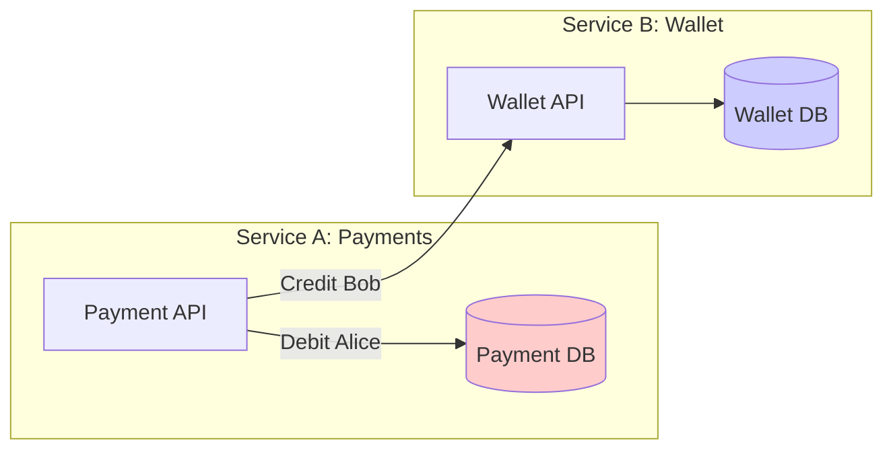
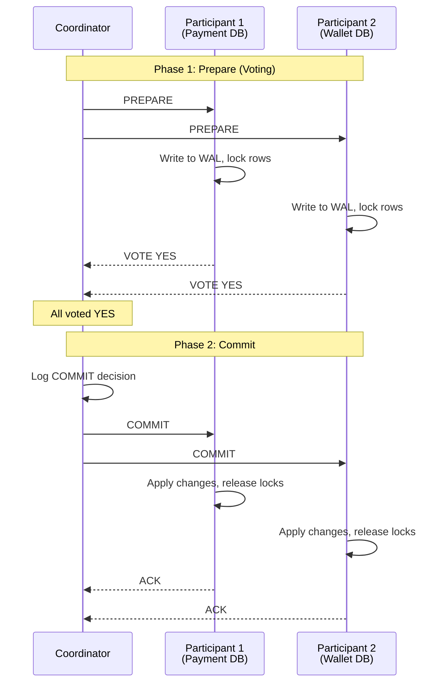
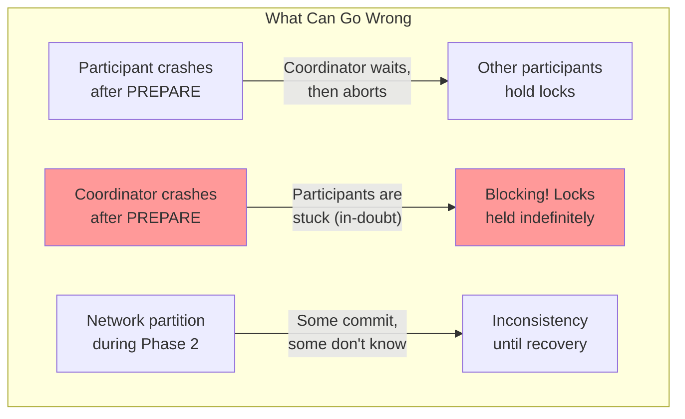
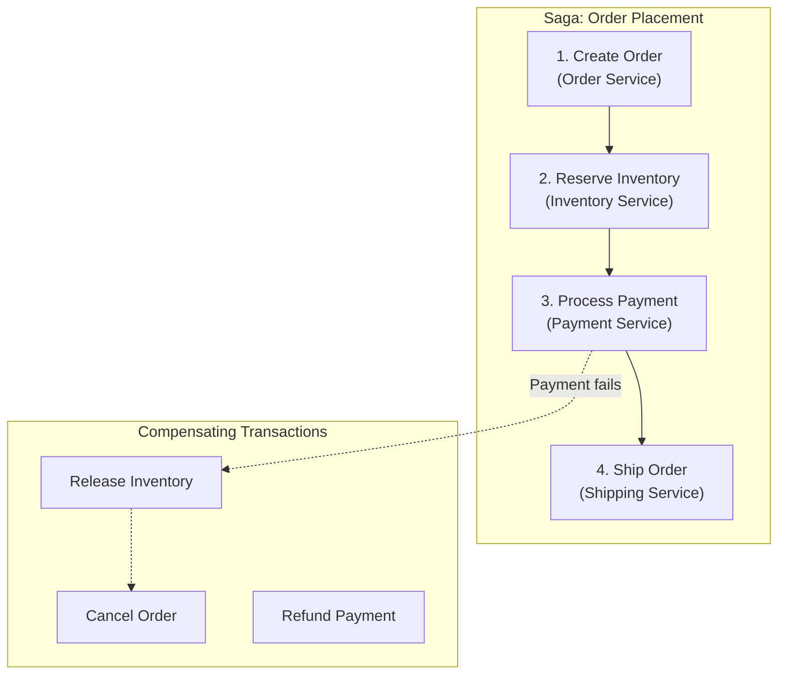
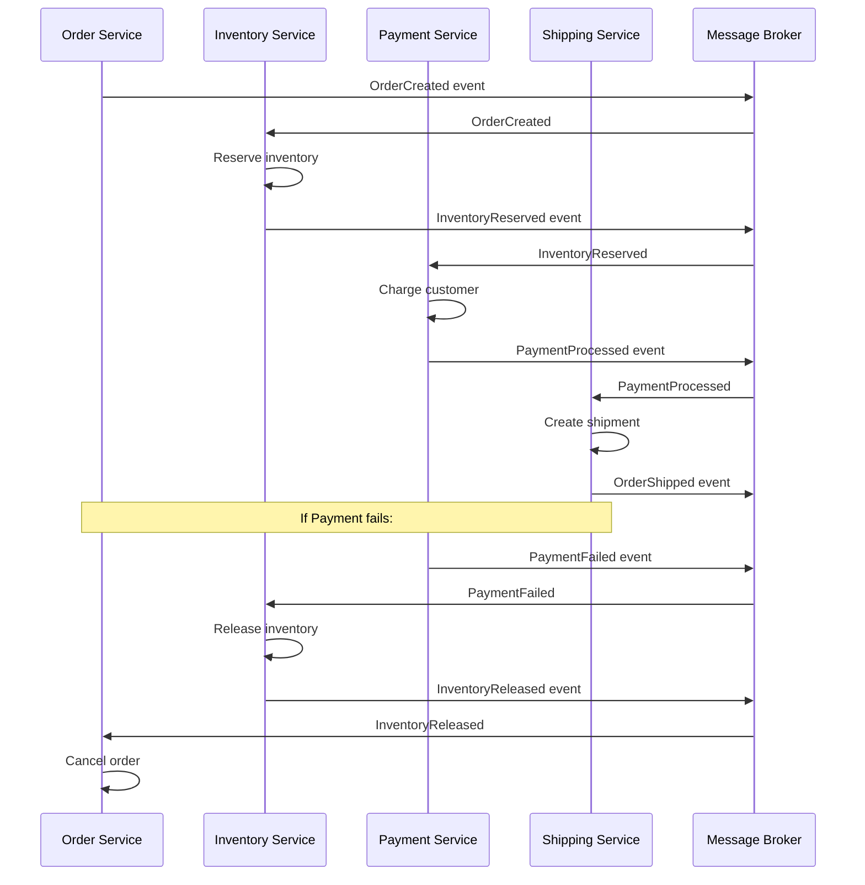
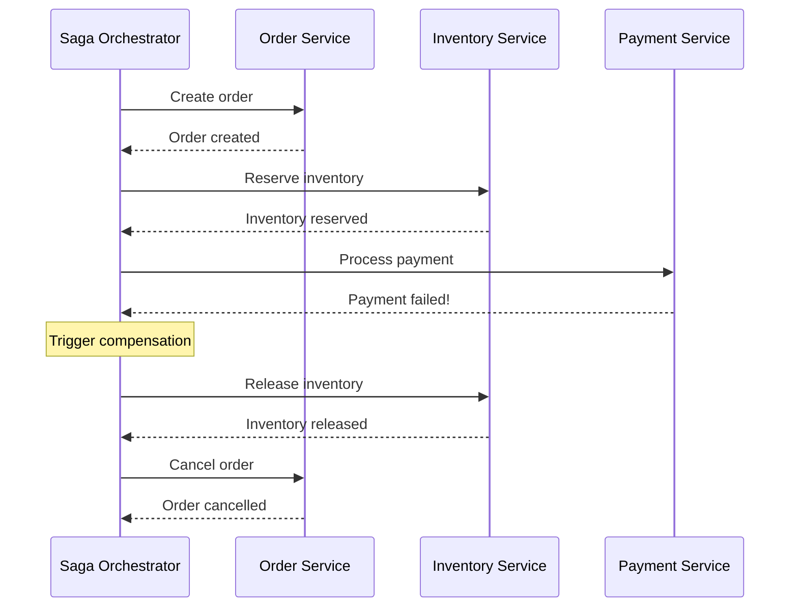
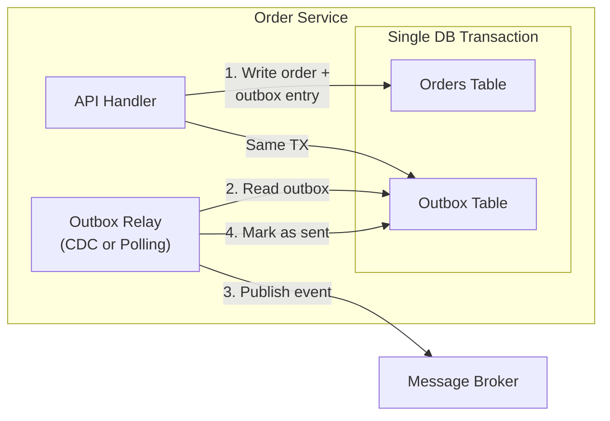
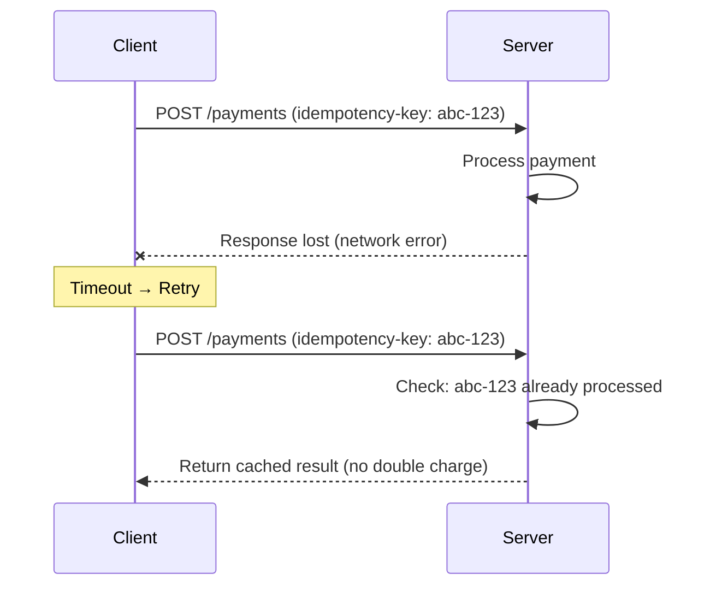
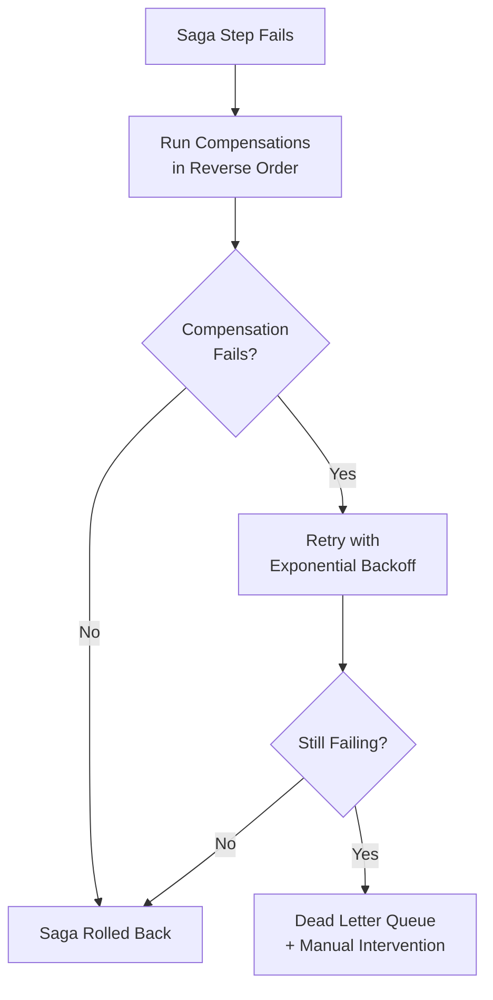
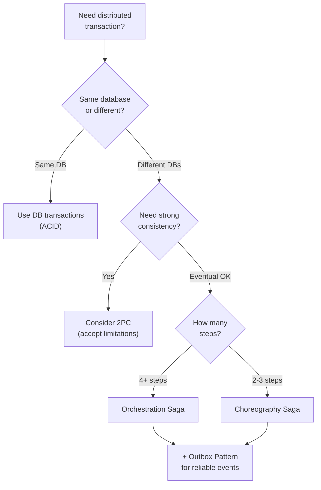

## Learning Objectives

- Explain the challenges of transactions across multiple services or databases
- Compare Two-Phase Commit (2PC) with saga-based patterns and their trade-offs
- Design idempotent operations for safe retries in distributed systems
- Implement the transactional outbox pattern for reliable event publishing
- Choose the right distributed transaction approach for a given architecture

## Prerequisites

- Understanding of ACID transactions in single-database systems
- Familiarity with microservices communication patterns
- Knowledge of consensus and consistency models

## The Distributed Transaction Problem

### Why Single-Node Transactions Don't Scale

In a monolith with a single database, transactions are straightforward:

```sql
BEGIN TRANSACTION;
  UPDATE accounts SET balance = balance - 100 WHERE id = 'alice';
  UPDATE accounts SET balance = balance + 100 WHERE id = 'bob';
COMMIT;
```

In a microservices architecture, Alice's account might be in the Payment Service and Bob's in the Wallet Service, each with its own database:



There's no single transaction coordinator. If the debit succeeds but the credit fails, the system is in an inconsistent state. Alice lost money that Bob never received.

## Two-Phase Commit (2PC)

### How 2PC Works

2PC uses a **coordinator** to ensure all participants either commit or abort:



If any participant votes NO, the coordinator sends ABORT to everyone.

### 2PC Failure Scenarios



### 2PC Limitations

| Problem | Impact |
|---------|--------|
| **Blocking** | If the coordinator crashes after PREPARE, participants hold locks indefinitely |
| **Latency** | At least 2 round trips; all participants must respond |
| **Availability** | System is unavailable if coordinator or any participant is down |
| **Scalability** | Locks span multiple databases; contention increases with participants |

> **Interview Tip**: 2PC is rarely used across microservices. It's used *within* databases (e.g., distributed SQL databases like CockroachDB use it internally). For microservices, prefer sagas.

## The Saga Pattern

### Choreography vs. Orchestration

Sagas break a distributed transaction into a sequence of **local transactions**, each with a **compensating transaction** to undo its effects if a later step fails.



### Choreography-Based Saga

Each service listens for events and decides what to do next:



**Pros**: Loose coupling, no central coordinator, easy to add new steps.
**Cons**: Hard to understand the full flow, difficult to debug, risk of cyclic dependencies.

### Orchestration-Based Saga

A central **saga orchestrator** coordinates the steps:



**Pros**: Clear control flow, easy to reason about, centralized error handling.
**Cons**: Orchestrator is a single point of complexity, risk of becoming a "god service."

### Choosing Between Choreography and Orchestration

| Factor | Choreography | Orchestration |
|--------|-------------|---------------|
| **Coupling** | Loose | Tighter (via orchestrator) |
| **Complexity** | Distributed across services | Centralized in orchestrator |
| **Debugging** | Hard (follow event chains) | Easier (single point of control) |
| **Best for** | Simple flows (2-3 steps) | Complex flows (4+ steps) |
| **Examples** | Simple e-commerce checkout | Travel booking (flight + hotel + car) |

## The Transactional Outbox Pattern

### The Dual-Write Problem

A common mistake: writing to the database AND publishing an event as two separate operations.

```
// DANGEROUS: Dual write
await database.save(order);        // Step 1: succeeds
await messageBroker.publish(event); // Step 2: fails! → inconsistency
```

If step 1 succeeds but step 2 fails, the order exists in the database but no event was published. Other services never learn about it.

### Outbox Solution

Write the event to an **outbox table** in the same database transaction as the business data. A separate process reads the outbox and publishes events:



```sql
-- Single atomic transaction
BEGIN;
  INSERT INTO orders (id, customer_id, total) VALUES ('ord-123', 'cust-456', 99.99);
  INSERT INTO outbox (id, aggregate_type, aggregate_id, event_type, payload)
    VALUES (gen_id(), 'Order', 'ord-123', 'OrderCreated', '{"orderId": "ord-123", ...}');
COMMIT;
```

The relay process can use **Change Data Capture (CDC)** tools like Debezium to tail the database transaction log, or simply poll the outbox table.

## Idempotency

### Why Idempotency Matters

In distributed systems, messages can be delivered **more than once** due to retries, network issues, or broker redelivery. Every operation must be safe to execute multiple times with the same result.



### Idempotency Implementation Strategies

**1. Idempotency Keys** (Stripe's approach):

```
Client sends: POST /v1/charges
Headers: Idempotency-Key: unique-request-id-123

Server:
  1. Check if key exists in idempotency store
  2. If yes → return stored response
  3. If no → process request, store response with key
  4. Keys expire after 24 hours
```

**2. Database Constraints**:

```sql
-- Unique constraint prevents duplicate processing
INSERT INTO payments (idempotency_key, amount, status)
VALUES ('abc-123', 100, 'completed')
ON CONFLICT (idempotency_key) DO NOTHING;
```

**3. Conditional Updates**:

```sql
-- Only debit if current balance matches expected value
UPDATE accounts
SET balance = balance - 100, version = version + 1
WHERE id = 'alice' AND version = 5;
-- If version changed, someone else modified it → retry with new version
```

## Compensating Transactions

### Designing Compensations

Not every operation has a natural "undo." Compensating transactions provide **semantic reversal**, not necessarily a technical rollback:

| Original Action | Compensation |
|-----------------|-------------|
| Create order | Cancel order (set status to CANCELLED) |
| Charge credit card | Issue refund |
| Reserve inventory | Release reservation |
| Send email | Send cancellation email (can't unsend!) |
| Ship package | Create return label |

### Compensation Challenges

1. **Non-reversible operations**: You can't unsend an email or un-ship a package. Design for this with corrective actions.
2. **Ordering**: Compensations must run in reverse order of the original saga steps.
3. **Compensation failures**: What if the compensation itself fails? You need retry logic and potentially manual intervention.



## Real-World Examples

### Uber's Saga Architecture

Uber's trip lifecycle is a saga:

1. **Match rider to driver** → Compensation: release driver
2. **Start trip** → Compensation: cancel trip
3. **Calculate fare** → Compensation: void fare
4. **Charge rider** → Compensation: refund
5. **Pay driver** → Compensation: debit driver

Each step is a local transaction in a separate microservice. Uber uses an orchestrator called **Cadence** (now Temporal) to manage saga state.

### Stripe's Idempotency

Stripe processes billions in payments. Their idempotency design:

- Every API request accepts an `Idempotency-Key` header
- Keys are stored with request parameters and response
- If a retried request has different parameters but the same key, Stripe returns a 422 error
- Keys expire after 24 hours
- Internally, Stripe uses a state machine to track request lifecycle

## Trade-Off Analysis

### Comparing Approaches

| Approach | Consistency | Availability | Complexity | Best For |
|----------|------------|-------------|------------|----------|
| **2PC** | Strong (ACID) | Low (blocking) | Medium | Single-database distributed SQL |
| **Saga (Choreography)** | Eventual | High | High (debugging) | Simple, loosely coupled flows |
| **Saga (Orchestration)** | Eventual | High | Medium | Complex multi-step workflows |
| **Outbox + CDC** | Eventual (reliable) | High | Medium | Reliable event publishing |

### When to Use What



## Capacity Estimation

For a payment system processing 10,000 transactions/second:

| Component | Estimate |
|-----------|----------|
| Idempotency key storage | 10K keys/sec × 86,400 sec × 1KB = ~860 GB/day (expire after 24h) |
| Outbox table throughput | 10K writes/sec (same as transactions) |
| Saga orchestrator state | 10K active sagas × 2KB state = ~20 MB in memory |
| Compensation rate | ~0.1-1% of transactions = 10-100 compensations/sec |

## Interview Approach

When designing a system with cross-service transactions:

1. **Acknowledge the problem**: "We can't use a single ACID transaction across services"
2. **Choose your pattern**: Sagas for most microservice architectures
3. **Handle failures explicitly**: Define compensating transactions for each step
4. **Ensure idempotency**: Every operation must be safe to retry
5. **Use the outbox pattern**: For reliable event publishing
6. **Consider observability**: How will you track saga state and debug failures?

> **Pro tip**: Draw the happy path first, then show what happens when step 3 of 5 fails. This demonstrates you think about failure modes, which is exactly what interviewers want to see.

## Key Takeaways

1. **2PC is a last resort**: It's blocking, slow, and reduces availability. Use it only within a single database system.
2. **Sagas are the standard**: For microservices, use sagas with compensating transactions.
3. **Orchestration over choreography**: For complex flows, an orchestrator (like Temporal) is easier to reason about and debug.
4. **Outbox pattern prevents data loss**: Never do dual writes. Use the outbox table within the same transaction.
5. **Idempotency is mandatory**: Every external-facing API and message handler must be idempotent.
6. **Design compensations early**: Think about how to undo each step before implementing the happy path.

## External Resources

- [Saga Pattern — Chris Richardson (Microservices.io)](https://microservices.io/patterns/data/saga.html)
- [Transactional Outbox Pattern](https://microservices.io/patterns/data/transactional-outbox.html)
- [Stripe Idempotent Requests](https://stripe.com/docs/api/idempotent_requests)
- [Temporal.io — Durable Execution](https://temporal.io/)
- [Designing Data-Intensive Applications — Ch. 9](https://dataintensive.net/)
- [Life Beyond Distributed Transactions — Pat Helland](https://queue.acm.org/detail.cfm?id=3025012)
