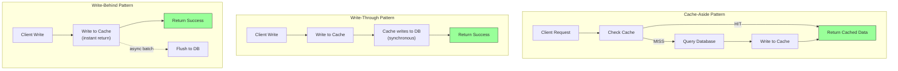
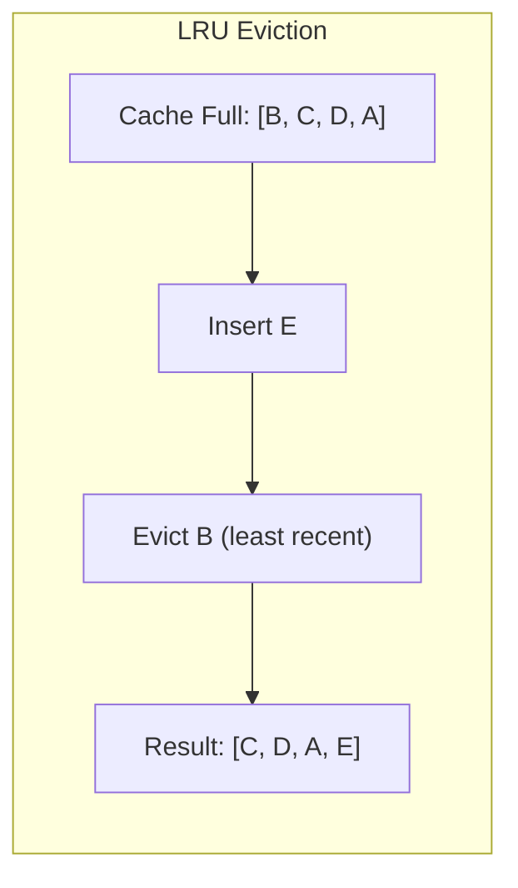

## Learning Objectives

- Implement cache-aside, write-through, and write-behind patterns with trade-off analysis
- Choose appropriate eviction policies (LRU, LFU, TTL) for different workloads
- Compare Redis vs Memcached and know when to use each
- Design a multi-layer caching strategy for a real application
- Identify and prevent common caching problems: stampede, penetration, and inconsistency

## Prerequisites

- Scalability basics: horizontal/vertical scaling, load balancing (previous lesson)
- Understanding of key-value data stores

## Core Concepts

### Why Cache?

Caching stores frequently accessed data in a fast storage layer (usually memory) to avoid expensive recomputation or slow storage reads.

**The numbers that motivate caching:**

| Operation | Latency |
|-----------|---------|
| L1 cache reference | ~1 ns |
| L2 cache reference | ~4 ns |
| Main memory (RAM) | ~100 ns |
| SSD random read | ~16 μs |
| Network round trip (same datacenter) | ~500 μs |
| HDD disk seek | ~2 ms |
| Network round trip (US East → West) | ~40 ms |
| Network round trip (US → Europe) | ~80 ms |

Reading from Redis (in-memory, same datacenter): ~0.5 ms
Reading from PostgreSQL (SSD, indexed query): ~2-5 ms
Reading from PostgreSQL (complex JOIN): ~50-500 ms

A cache hit can be **100-1000x faster** than a database query.

### Cache-Aside (Lazy Loading)

The application manages the cache directly. On read, check cache first. On miss, read from database and populate cache.

```
Read flow:
1. App checks cache for key
2. Cache HIT → return cached data
   Cache MISS → query database → write result to cache → return data

Write flow:
1. App writes to database
2. App invalidates (deletes) the cache entry
```

```python
import redis
import json

cache = redis.Redis(host='localhost', port=6379, db=0)
TTL = 3600  # 1 hour

def get_user(user_id: str) -> dict:
    cache_key = f"user:{user_id}"

    cached = cache.get(cache_key)
    if cached:
        return json.loads(cached)

    user = db.query("SELECT * FROM users WHERE id = %s", user_id)
    if user:
        cache.setex(cache_key, TTL, json.dumps(user))

    return user

def update_user(user_id: str, data: dict) -> None:
    db.execute("UPDATE users SET ... WHERE id = %s", user_id, data)
    cache.delete(f"user:{user_id}")  # Invalidate — next read will repopulate
```

**Pros:** Only caches data that's actually requested. Cache failure doesn't break the app (graceful degradation).

**Cons:** Cache miss incurs three operations (check cache + query DB + write cache). Stale data possible between write and next read.

### Write-Through

Every write goes to both the cache and the database simultaneously. The cache always has the latest data.

```
Write flow:
1. App writes to cache
2. Cache writes to database (synchronously)
3. Return success to app

Read flow:
1. Always read from cache (data is always there and fresh)
```

**Pros:** Cache is always consistent with database. Reads are always fast.

**Cons:** Write latency increases (two writes per operation). Cache fills with data that may never be read.

### Write-Behind (Write-Back)

Writes go to the cache immediately, and the cache asynchronously flushes to the database in batches.

```
Write flow:
1. App writes to cache (fast!)
2. Cache queues the write
3. Background process flushes to database in batches

Read flow:
1. Always read from cache
```

**Pros:** Fastest write performance. Batching reduces database load.

**Cons:** Risk of data loss if cache crashes before flush. Complex to implement. Eventually consistent.

### Strategy Comparison

| Strategy | Read Perf | Write Perf | Consistency | Complexity | Data Loss Risk |
|----------|-----------|------------|-------------|-----------|---------------|
| Cache-Aside | Good (on hit) | Good | Eventual | Low | None |
| Write-Through | Excellent | Slower | Strong | Medium | None |
| Write-Behind | Excellent | Excellent | Eventual | High | Yes |

### Eviction Policies

When the cache is full, which entries get removed?

**LRU (Least Recently Used)** — Evict the entry that hasn't been accessed for the longest time.

```
Access sequence: A, B, C, D, A, E (cache size = 4)

Cache state:    [A]
                [A, B]
                [A, B, C]
                [A, B, C, D]     ← Full
Access A:       [B, C, D, A]     ← A moved to end (most recent)
Insert E:       [C, D, A, E]     ← B evicted (least recently used)
```

Best for: General-purpose caching. Most common choice.

**LFU (Least Frequently Used)** — Evict the entry with the fewest total accesses.

Best for: Workloads with clear hot/cold data (e.g., popular products on an e-commerce site).

**TTL (Time To Live)** — Entries expire after a fixed duration.

```python
cache.setex("user:123", 3600, user_data)  # Expires in 1 hour
```

Best for: Data that becomes stale over time (API responses, configuration). Often used with LRU.

**Random Eviction** — Evict a random entry.

Best for: When all entries are roughly equally likely to be accessed. Surprisingly effective and very cheap to implement.

### Redis vs Memcached

| Feature | Redis | Memcached |
|---------|-------|-----------|
| Data structures | Strings, Lists, Sets, Hashes, Sorted Sets, Streams | Strings only |
| Persistence | RDB snapshots, AOF log | None (pure cache) |
| Replication | Built-in primary-replica | None |
| Pub/Sub | Yes | No |
| Lua scripting | Yes | No |
| Max value size | 512 MB | 1 MB |
| Multi-threaded | Single-threaded (with I/O threads) | Multi-threaded |
| Use case | Feature-rich cache, session store, queue | Simple high-throughput cache |

**Choose Redis** when you need data structures, persistence, or features beyond simple caching.
**Choose Memcached** when you need raw throughput for simple key-value caching with multiple cores.

### Multi-Layer Caching

Real applications often use multiple cache layers:

```
Browser Cache (HTTP Cache-Control headers)
  ↓ miss
CDN Edge Cache (Cloudflare, CloudFront)
  ↓ miss
Application-Level Cache (Redis/Memcached)
  ↓ miss
Database Query Cache
  ↓ miss
Disk (Database reads from storage)
```

### Common Caching Problems

**Cache Stampede (Thundering Herd)**

Problem: A popular cache entry expires. 1000 concurrent requests all miss the cache and hit the database simultaneously.

Solution: **Locking** — Only one request fetches from DB while others wait.

```python
def get_with_lock(key: str) -> dict:
    data = cache.get(key)
    if data:
        return json.loads(data)

    lock_key = f"lock:{key}"
    if cache.set(lock_key, "1", nx=True, ex=10):  # Acquire lock
        try:
            data = fetch_from_database(key)
            cache.setex(key, TTL, json.dumps(data))
            return data
        finally:
            cache.delete(lock_key)
    else:
        time.sleep(0.1)
        return get_with_lock(key)  # Retry — another request is fetching
```

**Cache Penetration**

Problem: Requests for non-existent data always miss the cache and hit the database.

Solution: Cache negative results (null values) with a short TTL.

```python
def get_user_safe(user_id: str) -> dict | None:
    cached = cache.get(f"user:{user_id}")
    if cached == b"NULL":
        return None
    if cached:
        return json.loads(cached)

    user = db.query_user(user_id)
    if user is None:
        cache.setex(f"user:{user_id}", 300, "NULL")  # Cache the miss for 5 minutes
    else:
        cache.setex(f"user:{user_id}", 3600, json.dumps(user))

    return user
```

**Cache Inconsistency**

Problem: Cache and database get out of sync after a failed invalidation.

Solution: Always invalidate (delete), never update the cache on write. Set TTLs as a safety net.

## Diagram





## Hands-On Exercise

### Exercise: Design Caching for an E-Commerce Product Page

**Scenario:** An e-commerce platform has product pages with:
- Product details (name, description, price, images)
- Current inventory count (changes frequently)
- Customer reviews (changes moderately)
- Related product recommendations (computed by ML, expensive)

**Step 1: Choose a caching strategy for each data type**

For each data type, decide:
1. Which caching strategy? (cache-aside, write-through, write-behind)
2. What TTL?
3. What eviction policy?
4. What cache key pattern?

**Step 2: Design cache key naming**

Good cache key design:
```
product:details:{product_id}
product:inventory:{product_id}
product:reviews:{product_id}:page:{page_num}
product:recommendations:{product_id}
```

**Step 3: Handle edge cases**

- What happens during a flash sale when inventory changes rapidly?
- How do you invalidate the recommendations cache when the ML model is retrained?
- What's your strategy for a product that gets 100K views/minute?

**Step 4: Calculate cache size requirements**

```
Product catalog: 500,000 products
Average product cache entry: 5 KB
All products cached: 500,000 × 5 KB = 2.5 GB

Hot products (top 10%): 50,000 × 5 KB = 250 MB
Reviews: 50,000 × 20 KB (first page) = 1 GB
Recommendations: 50,000 × 2 KB = 100 MB

Total Redis memory needed: ~1.35 GB for hot data
```

**Challenge:** Design the cache invalidation strategy when a product's price changes. Consider: How do you handle cached pages that show this product in listings? What about the CDN cache?

## Key Takeaways

- Cache-aside is the most common and safest pattern — the application controls what gets cached and when
- Write-through ensures consistency but adds write latency; write-behind maximizes speed but risks data loss
- LRU is the default eviction choice for most workloads; add TTLs as a consistency safety net
- Redis is the standard choice for application caching due to its rich data structures and persistence options
- Cache stampede (thundering herd) is the most dangerous caching problem in production — always implement locking for hot keys
- Multi-layer caching (browser → CDN → application → database) provides defense in depth

## External Resources

- [Redis Documentation](https://redis.io/docs/) — Official Redis guides and command reference
- [Caching Strategies and How to Choose the Right One](https://codeahoy.com/2017/08/11/caching-strategies-and-how-to-choose-the-right-one/) — Decision framework for caching patterns
- [Scaling Memcache at Facebook](https://www.usenix.org/system/files/conference/nsdi13/nsdi13-final170_update.pdf) — Classic paper on caching at massive scale
- [Designing Data-Intensive Applications, Ch. 5](https://dataintensive.net/) — Replication and consistency trade-offs
- [AWS ElastiCache Best Practices](https://docs.aws.amazon.com/AmazonElastiCache/latest/mem-ug/BestPractices.html) — Production caching guidance

## Quiz

See the quiz.json file for this module's quiz questions.
