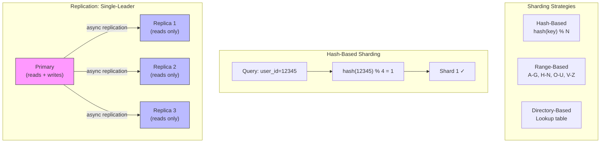

## Learning Objectives

- Compare SQL and NoSQL databases with concrete use-case guidance
- Design effective indexes and understand their impact on read/write performance
- Explain sharding strategies (hash, range, directory) and their trade-offs
- Implement replication topologies for high availability and read scaling
- Choose the right database for given requirements in system design interviews

## Prerequisites

- Scalability basics and caching strategies (previous lessons)
- Basic SQL query familiarity (SELECT, JOIN, WHERE)

## Core Concepts

### SQL vs NoSQL: The Real Comparison

The "SQL vs NoSQL" debate is misleading because it compares categories, not individual databases. Here's the nuanced view:

| Characteristic | Relational (SQL) | Document (NoSQL) | Key-Value | Wide-Column | Graph |
|---------------|-----------------|-----------------|-----------|-------------|-------|
| Examples | PostgreSQL, MySQL | MongoDB, DynamoDB | Redis, Memcached | Cassandra, HBase | Neo4j, DGraph |
| Schema | Rigid, predefined | Flexible, per-document | None (blob) | Column families | Nodes + edges |
| Joins | Native, efficient | Limited/manual | None | Limited | Native traversals |
| Transactions | Full ACID | Per-document (MongoDB has multi-doc) | Limited | Limited | Depends |
| Scaling | Vertical + read replicas | Horizontal (native sharding) | Horizontal | Horizontal | Varies |
| Query language | SQL (standardized) | Custom (MQL, DynamoDB) | get/set | CQL | Cypher, Gremlin |

**When to choose SQL:**
- Complex relationships between entities (e-commerce orders with items, users, payments)
- Strong consistency requirements (financial transactions)
- Ad-hoc queries and reporting
- Your data model is well-understood and relatively stable

**When to choose NoSQL:**
- High write throughput with simple access patterns
- Rapidly evolving schema (startup iterating on product)
- Document-shaped data that's read as a whole (user profiles, product catalogs)
- Horizontal scaling is a primary requirement

### Indexing

An index is a data structure that speeds up data retrieval at the cost of additional storage and slower writes.

**Without index:** Full table scan — O(n) for every query.
**With index:** B-tree lookup — O(log n) for indexed queries.

```sql
-- Without index: scans all 10 million rows
SELECT * FROM users WHERE email = 'alice@example.com';
-- Execution time: 2,500 ms

-- Create an index
CREATE INDEX idx_users_email ON users(email);

-- With index: B-tree lookup
SELECT * FROM users WHERE email = 'alice@example.com';
-- Execution time: 0.3 ms
```

#### Index Types

**B-Tree Index** (default in PostgreSQL, MySQL)
- Balanced tree structure
- Supports: =, <, >, <=, >=, BETWEEN, LIKE 'prefix%'
- Best for: Most general-purpose queries

**Hash Index**
- Hash table structure
- Supports: = (equality only)
- Best for: Exact match lookups

**Composite Index**

```sql
CREATE INDEX idx_orders_user_date ON orders(user_id, created_at);

-- ✅ Uses the index (left-most prefix match)
SELECT * FROM orders WHERE user_id = 123;
SELECT * FROM orders WHERE user_id = 123 AND created_at > '2024-01-01';

-- ❌ Cannot use the index (missing left-most column)
SELECT * FROM orders WHERE created_at > '2024-01-01';
```

**The "left-most prefix" rule:** A composite index on (A, B, C) can be used for queries on (A), (A, B), or (A, B, C), but NOT (B), (C), or (B, C).

#### Index Trade-offs

| Benefit | Cost |
|---------|------|
| Faster reads (O(log n) vs O(n)) | Slower writes (must update index on INSERT/UPDATE/DELETE) |
| Efficient sorting and grouping | Additional storage (10-30% of table size per index) |
| Unique constraints | More indexes = slower write amplification |

**Rule of thumb:** Index columns that appear in WHERE, JOIN, ORDER BY, and GROUP BY clauses. Don't over-index — every index slows down writes.

### Sharding (Horizontal Partitioning)

Sharding splits a large database across multiple servers, each holding a subset of the data.

#### Hash-Based Sharding

```
shard_id = hash(shard_key) % num_shards

User ID 12345 → hash(12345) % 4 = 1 → Shard 1
User ID 67890 → hash(67890) % 4 = 2 → Shard 2
```

**Pros:** Even data distribution, simple routing.
**Cons:** Adding/removing shards requires rehashing (redistributing all data). Mitigated with consistent hashing.

#### Range-Based Sharding

```
Users A-G → Shard 1
Users H-N → Shard 2
Users O-U → Shard 3
Users V-Z → Shard 4
```

**Pros:** Efficient range queries within a shard. Easy to understand.
**Cons:** Hot spots if data isn't uniformly distributed (e.g., more users with names starting with 'S' than 'X').

#### Directory-Based Sharding

A lookup service maps each entity to its shard.

**Pros:** Maximum flexibility, easy rebalancing.
**Cons:** Lookup service is a single point of failure and bottleneck.

#### Choosing a Shard Key

The shard key determines everything. A bad shard key can make sharding worse than no sharding.

**Good shard key properties:**
- High cardinality (many distinct values)
- Even distribution
- Used in most queries (avoids cross-shard queries)
- Doesn't change over time

**Examples:**

| Use Case | Good Shard Key | Bad Shard Key |
|----------|---------------|---------------|
| Social media | user_id | country (uneven) |
| E-commerce | order_id | product_category (hot spots) |
| Chat app | conversation_id | created_date (all new data goes to one shard) |

#### Cross-Shard Queries

The biggest problem with sharding: queries that need data from multiple shards.

```sql
-- Easy (single shard): Find orders for user 123
SELECT * FROM orders WHERE user_id = 123;  -- Routes to one shard

-- Hard (cross-shard): Find all orders over $100
SELECT * FROM orders WHERE total > 100;  -- Must query ALL shards and merge
```

### Replication

Replication maintains copies of data on multiple servers for high availability and read scaling.

#### Single-Leader Replication

```
Writes → Primary (Leader)
                ↓ replication
        Replica 1 (Follower) ← Reads
        Replica 2 (Follower) ← Reads
        Replica 3 (Follower) ← Reads
```

**Synchronous replication:** Primary waits for replica confirmation before acknowledging the write. Strong consistency, higher write latency.

**Asynchronous replication:** Primary acknowledges immediately, replicas catch up later. Lower write latency, possible stale reads.

#### Multi-Leader Replication

Multiple nodes accept writes. Used for multi-datacenter deployments.

```
Datacenter US-East:  Leader 1 (accepts writes)
Datacenter EU-West:  Leader 2 (accepts writes)
        ↕ bidirectional replication
```

**Challenge:** Write conflicts when two leaders modify the same data. Resolution strategies: last-writer-wins, merge, application-level resolution.

#### Leaderless Replication

All nodes accept reads and writes. Uses quorum consensus.

```
Write: Send to all N replicas, succeed if W acknowledge (W = write quorum)
Read:  Read from all N replicas, succeed if R respond (R = read quorum)
Rule:  W + R > N guarantees reading the latest write
```

**Example:** N=3, W=2, R=2. Every read overlaps with every write, ensuring you see at least one up-to-date copy.

Used by: DynamoDB, Cassandra, Riak.

### Database Selection Guide

| Requirement | Recommended Database | Why |
|------------|---------------------|-----|
| Complex queries + ACID transactions | PostgreSQL | Full SQL, JSONB, extensions |
| High-volume writes, flexible schema | MongoDB | Document model, horizontal scaling |
| Sub-millisecond key-value access | Redis | In-memory, rich data types |
| Time-series data | TimescaleDB or InfluxDB | Optimized for time-based queries |
| Massive write throughput, eventual consistency | Cassandra | Partitioned, leaderless, linear scaling |
| Graph relationships | Neo4j | Native graph storage and traversals |
| Full-text search | Elasticsearch | Inverted index, relevance scoring |
| Simple key-value at scale | DynamoDB | Managed, predictable performance |

## Diagram



## Hands-On Exercise

### Exercise: Choose the Right Database

For each scenario, recommend a database (or combination), justify your choice, and explain your indexing/sharding strategy.

**Scenario 1: Real-Time Chat Application**
- 10M daily active users
- Messages need to be retrievable by conversation and time range
- Users are distributed globally
- Messages are immutable once sent

**Scenario 2: E-Commerce Product Catalog**
- 5M products with varying attributes (electronics have specs, clothing has sizes/colors)
- Complex search with filters (price range, category, brand, ratings)
- Read-heavy workload (1000:1 read-to-write ratio)
- Product data must be consistent (prices, inventory)

**Scenario 3: IoT Sensor Data Platform**
- 100,000 sensors sending readings every 10 seconds
- Data retention: 1 year
- Queries: time-range aggregations per sensor, anomaly detection
- ~864M data points per day

**For each scenario, answer:**
1. Which database and why?
2. What would your schema/data model look like?
3. How would you index it?
4. Would you shard? If so, on what key?
5. Replication strategy?
6. What caching layer would you add?

**Challenge:** Design a hybrid approach for Scenario 2 using PostgreSQL for transactions, MongoDB for the product catalog, and Elasticsearch for search. How do you keep them in sync?

## Key Takeaways

- Choose databases based on access patterns and consistency requirements, not hype or familiarity
- Indexes turn O(n) scans into O(log n) lookups but slow down writes — index strategically, not exhaustively
- The shard key is the most important sharding decision: it determines data distribution, query routing, and rebalancing difficulty
- Replication provides both high availability (failover) and read scaling (distribute read load)
- There is no perfect database — every choice involves trade-offs between consistency, availability, latency, and operational complexity
- Most production systems use multiple databases, each optimized for a specific access pattern (polyglot persistence)

## External Resources

- [Designing Data-Intensive Applications, Chapters 2-6](https://dataintensive.net/) — Essential reading on data models, storage, replication, and partitioning
- [Use The Index, Luke](https://use-the-index-luke.com/) — Complete guide to SQL indexing and performance
- [MongoDB Data Modeling Guide](https://www.mongodb.com/docs/manual/core/data-modeling-introduction/) — Document model design patterns
- [Cassandra Data Modeling Guide](https://cassandra.apache.org/doc/latest/cassandra/data_modeling/) — Wide-column design principles
- [PostgreSQL: Choosing Effective Indexes](https://www.postgresql.org/docs/current/indexes.html) — Official PostgreSQL indexing documentation

## Quiz

See the quiz.json file for this module's quiz questions.
