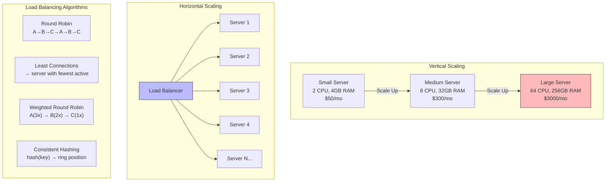
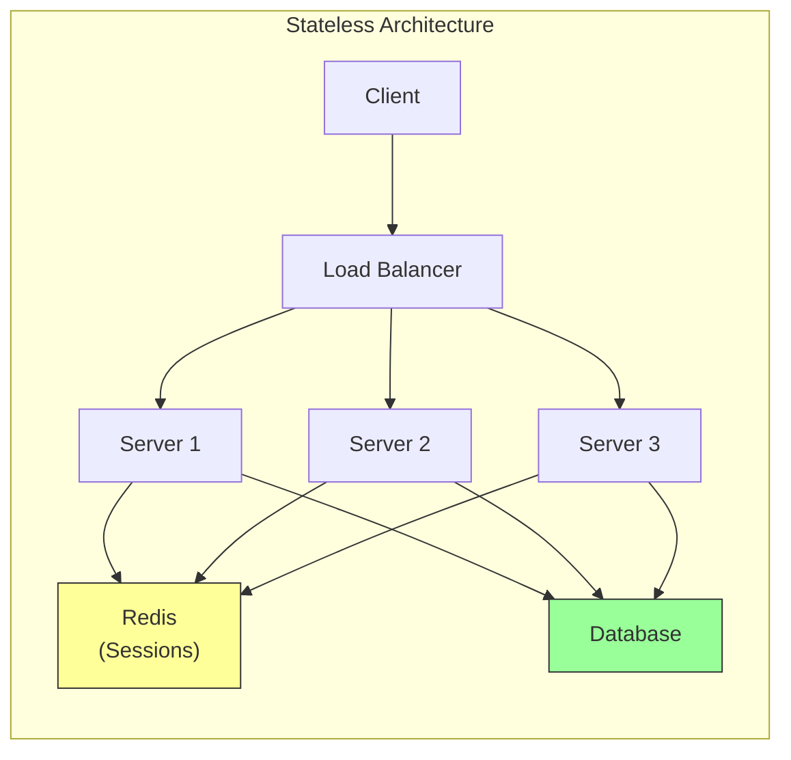

## Learning Objectives

- Compare vertical and horizontal scaling strategies with concrete trade-offs
- Explain common load balancing algorithms and when to use each
- Understand stateless vs stateful service design for scalability
- Recognize when to apply auto-scaling and capacity planning
- Design a basic scaling strategy for a given traffic pattern

## Prerequisites

- Basic understanding of client-server architecture
- Familiarity with web applications (HTTP, databases, servers)

## Core Concepts

### Why Scalability Matters

Your application launches, goes viral, and suddenly 10,000 users hit it simultaneously. The single server you deployed on starts returning 500 errors, response times spike to 30 seconds, and the database connection pool is exhausted.

**Scalability** is the ability of a system to handle increased load by adding resources. A scalable system maintains acceptable performance as demand grows.

Key metrics affected by scale:
- **Throughput** — Requests handled per second (RPS)
- **Latency** — Time for a single request (p50, p95, p99)
- **Availability** — Percentage of time the system is operational (99.9% = 8.7 hours downtime/year)
- **Resource utilization** — CPU, memory, disk, network usage

### Vertical Scaling (Scale Up)

Vertical scaling means making a single machine more powerful: more CPU cores, more RAM, faster disks, better network cards.

**Pros:**
- Simple — no code changes required
- No distributed system complexity
- Single point of administration
- Strong consistency is easy (one database)

**Cons:**
- **Hard ceiling** — The biggest available machine has limits (e.g., AWS r7i.metal: 128 vCPUs, 1024 GB RAM)
- **Single point of failure** — If that machine dies, everything is down
- **Cost curve** — Doubling resources often more than doubles cost
- **Downtime for upgrades** — Moving to a bigger machine usually requires restart

**When to use:** Early stage, low traffic, when simplicity matters more than resilience. Many applications run fine on a single server for years.

### Horizontal Scaling (Scale Out)

Horizontal scaling means adding more machines to share the load. Instead of one powerful server, you run many smaller ones behind a load balancer.

**Pros:**
- **No ceiling** — Add machines as needed
- **Redundancy** — If one server fails, others handle traffic
- **Cost-effective** — Many small machines can be cheaper than one giant one
- **Incremental** — Add capacity in small steps

**Cons:**
- **Complexity** — Distributed systems are fundamentally harder
- **Data consistency** — Sharing state across machines is challenging
- **Network overhead** — Machines must communicate over the network
- **Operational burden** — More machines to monitor, deploy, patch

### Load Balancing

A load balancer distributes incoming traffic across multiple backend servers. It's the gateway to horizontal scaling.

#### Load Balancing Algorithms

**Round Robin** — Requests go to each server in order: A → B → C → A → B → C...

```
Request 1 → Server A
Request 2 → Server B
Request 3 → Server C
Request 4 → Server A
...
```

Best for: Homogeneous servers with similar request processing times.

**Weighted Round Robin** — Servers with more capacity get more requests.

```
Server A (weight=3): Gets 3 out of every 6 requests
Server B (weight=2): Gets 2 out of every 6 requests
Server C (weight=1): Gets 1 out of every 6 requests
```

Best for: Mixed hardware where some servers are more powerful.

**Least Connections** — New request goes to the server with the fewest active connections.

Best for: Requests with varying processing times (some fast, some slow).

**IP Hash** — Client IP determines which server handles the request. Same client always goes to the same server.

```
hash(client_ip) % num_servers = server_index
```

Best for: Session affinity without shared session stores (not recommended for most architectures).

**Consistent Hashing** — A ring-based hash scheme that minimizes redistribution when servers are added or removed.

Best for: Distributed caches, sharded databases — anywhere you need sticky routing with minimal disruption during scaling.

#### Load Balancer Types

| Layer | Operates On | Examples | Speed | Intelligence |
|-------|------------|---------|-------|-------------|
| L4 (Transport) | TCP/UDP connections | AWS NLB, HAProxy (TCP mode) | Very fast | Routing only |
| L7 (Application) | HTTP requests | AWS ALB, Nginx, Envoy | Slower | Content-based routing, SSL termination |

### Stateless vs Stateful Services

**Stateless services** don't store any client-specific data between requests. Every request contains all information needed to process it.

```
Client → Load Balancer → Any Server Can Handle It
                        ↓
                  Server A, B, or C (all equivalent)
```

**Benefits:** Easy to scale horizontally — just add more servers. Any server can handle any request.

**Stateful services** maintain client state (sessions, in-memory cache, local data) between requests.

```
Client → Load Balancer → Must Go To Same Server (sticky session)
                        ↓
                  Only Server B has this user's session
```

**Problem:** If Server B crashes, the session is lost. Adding servers doesn't help if sessions are stuck on specific machines.

**The solution:** Externalize state. Move sessions, caches, and shared data to dedicated services:

```
Client → Load Balancer → Any Server
                        ↓
                  All servers read from:
                  - Redis (sessions)
                  - PostgreSQL (data)
                  - S3 (files)
```

### Auto-Scaling

Auto-scaling automatically adjusts the number of server instances based on demand.

**Scaling triggers:**
- CPU utilization > 70% → Scale up
- Request queue depth > 100 → Scale up
- Memory usage > 80% → Scale up
- CPU utilization < 30% for 10 minutes → Scale down

**Scaling policies:**
- **Target tracking** — Maintain a target metric (e.g., "keep average CPU at 60%")
- **Step scaling** — Add specific numbers of instances at defined thresholds
- **Scheduled scaling** — Scale up before known traffic peaks (e.g., Black Friday)

**Cooldown periods** prevent thrashing: after scaling, wait 5 minutes before making another scaling decision.

### Capacity Planning

Back-of-the-envelope calculations help size your system:

**Example: Social media feed service**

Assumptions:
- 10M daily active users (DAU)
- Each user loads feed 5 times/day
- Each feed load = 1 API call + 20 post fetches

Calculations:
```
Total API calls/day = 10M × 5 = 50M
API calls/second = 50M / 86,400 ≈ 580 RPS (average)
Peak = 3× average = 1,740 RPS
Each server handles ~200 RPS → Need 9 servers (plus headroom)
Target: 12 servers in production, min 6 during off-peak
```

### The Database Bottleneck

Scaling application servers is relatively easy (add more, load balance). The hard part is the **database**:

- **Read replicas** — Route reads to replicas, writes to the primary
- **Connection pooling** — Reuse database connections instead of opening new ones
- **Caching** — Cache frequently-read data in Redis (covered in next lesson)
- **Sharding** — Split data across multiple database servers (covered in database concepts)

## Diagram





## Hands-On Exercise

### Exercise: Design a Scaling Strategy

**Scenario:** You're building a recipe-sharing platform. Current metrics:
- 50,000 DAU, growing 20% month-over-month
- Average 3 page views per session
- 10% of users upload a recipe per session
- Recipe pages have images (avg 2MB per recipe)
- Current setup: 1 server, 1 database, hitting 85% CPU during peak

**Step 1: Calculate current and projected load**

```
Current daily requests = 50,000 × 3 = 150,000
Current peak RPS = 150,000 / 86,400 × 3 (peak factor) ≈ 5.2 RPS
In 6 months at 20% MoM growth: 50,000 × 1.2^6 ≈ 149,000 DAU
Projected peak RPS ≈ 15.5 RPS
In 12 months: ~371,000 DAU → peak ~38.6 RPS
```

**Step 2: Answer these questions**

1. Should you scale vertically or horizontally first? Why?
2. At what traffic level would you add a load balancer?
3. Which load balancing algorithm would you choose?
4. Where would you add a cache, and what would you cache?
5. When would you add a read replica for the database?
6. How would you handle the image storage as uploads grow?

**Step 3: Draw an architecture diagram** showing your proposed system at the 12-month mark. Include:
- Number of application servers
- Load balancer
- Database setup (primary + replicas?)
- Cache layer
- Image storage solution

**Challenge:** What changes if the platform goes viral and grows 10x overnight instead of 20% monthly?

## Key Takeaways

- Vertical scaling is simpler but has hard limits; horizontal scaling is unlimited but adds complexity
- Stateless services are the foundation of horizontal scaling — externalize all state to shared stores
- Load balancing algorithms should match your traffic pattern: Round Robin for uniform requests, Least Connections for variable processing times
- Auto-scaling reacts to demand, but capacity planning prevents being caught off guard
- The database is almost always the scalability bottleneck — plan for it early with read replicas, caching, and connection pooling
- Back-of-the-envelope calculations (DAU → RPS → servers needed) are essential for system design interviews and real planning

## External Resources

- [Designing Data-Intensive Applications (Martin Kleppmann)](https://dataintensive.net/) — The definitive book on distributed systems fundamentals
- [System Design Primer (GitHub)](https://github.com/donnemartin/system-design-primer) — Comprehensive open-source system design guide
- [AWS Well-Architected Framework](https://docs.aws.amazon.com/wellarchitected/latest/framework/) — Cloud architecture best practices
- [High Scalability Blog](http://highscalability.com/) — Real-world architecture case studies
- [ByteByteGo](https://bytebytego.com/) — Visual system design explanations

## Quiz

See the quiz.json file for this module's quiz questions.
