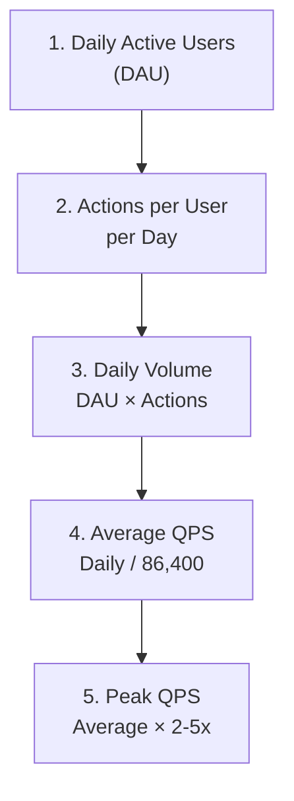
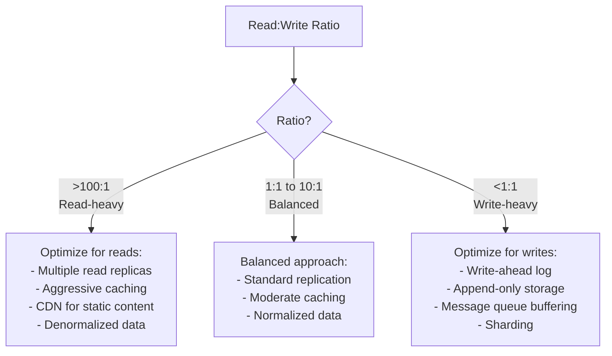

## Learning Objectives

- Perform back-of-envelope capacity estimations for system design interviews
- Calculate QPS, storage, bandwidth, and memory requirements from first principles
- Analyze read/write ratios to choose appropriate architectures
- Design scaling strategies based on projected growth
- Avoid common estimation pitfalls and over-engineering traps

## Prerequisites

- Understanding of scalability concepts (horizontal/vertical scaling)
- Familiarity with storage units (KB, MB, GB, TB, PB)
- Basic arithmetic and order-of-magnitude reasoning

## Why Capacity Planning Matters

In system design interviews, capacity estimation serves two purposes:

1. **Justify architectural decisions**: "We need sharding because our data exceeds 10 TB"
2. **Demonstrate quantitative thinking**: Show you can reason about scale, not just hand-wave

In production, capacity planning prevents outages caused by running out of storage, hitting connection limits, or exceeding bandwidth.

## Essential Numbers to Know

### Powers of Two

```
2^10 = 1 KB (Thousand)         = 1,024
2^20 = 1 MB (Million)          = 1,048,576
2^30 = 1 GB (Billion)          = 1,073,741,824
2^40 = 1 TB (Trillion)         = 1,099,511,627,776
2^50 = 1 PB (Quadrillion)      = 1,125,899,906,842,624
```

### Time Conversions

```
1 day    = 86,400 seconds    ≈ 10^5 seconds
1 month  = 2,592,000 seconds ≈ 2.5 × 10^6 seconds
1 year   = 31,536,000 seconds ≈ 3 × 10^7 seconds

Quick estimation:
  "per day to per second" → divide by 100,000 (10^5)
  "per month to per second" → divide by 2,500,000 (2.5 × 10^6)
```

### Latency Numbers Every Engineer Should Know

```
L1 cache reference:                 1 ns
L2 cache reference:                 4 ns
Main memory reference:             100 ns
SSD random read:                   16 μs
HDD random read:                    2 ms
Send 1 KB over 1 Gbps network:    10 μs
Round trip within same datacenter: 0.5 ms
Round trip coast-to-coast (US):     30 ms
Round trip US → Europe:             75 ms
Round trip US → Asia:              150 ms
```

### Common Data Sizes

```
UUID/GUID:           36 bytes (as string), 16 bytes (binary)
Timestamp:           8 bytes
Integer (64-bit):    8 bytes
Short string (name): 50 bytes
Medium string (URL): 200 bytes
Email:               50 bytes
Tweet/short post:    280 bytes
User profile record: 1-5 KB
JSON API response:   5-50 KB
Thumbnail image:     10-50 KB
Full image:          200 KB - 5 MB
1-minute video:      5-50 MB
```

## QPS Estimation Framework

### Step-by-Step Process



### Example: Twitter-Like Service

```
Given: 300M DAU

Read path (viewing tweets):
  Each user views feed 10 times/day, 20 tweets per load
  Daily tweet views: 300M × 10 × 20 = 60B views/day
  Average QPS: 60B / 86,400 ≈ 700,000 QPS
  Peak QPS: 700K × 3 = 2.1M QPS

Write path (posting tweets):
  5% of users post 1 tweet/day
  Daily tweets: 300M × 5% × 1 = 15M tweets/day
  Average QPS: 15M / 86,400 ≈ 175 QPS
  Peak QPS: 175 × 5 = 875 QPS

Read:Write ratio = 700,000 : 175 ≈ 4000:1 → Extremely read-heavy
→ Optimize for reads: caching, read replicas, CDN
```

### Example: Uber-Like Ride Service

```
Given: 20M DAU (riders + drivers)

Ride requests:
  5M rides/day
  Average QPS: 5M / 86,400 ≈ 58 QPS
  Peak QPS: 58 × 5 = 290 QPS

Driver location updates:
  1M active drivers, update every 5 seconds
  QPS: 1M / 5 = 200,000 QPS

Read: Get nearby drivers (riders):
  5M requests/day × 10 API calls per ride (searching) = 50M/day
  Average QPS: 50M / 86,400 ≈ 580 QPS
  Peak QPS: 580 × 3 ≈ 1,740 QPS

Key insight: Driver location updates dominate → 200K writes/sec
→ Need a write-optimized geospatial index (e.g., GeoHash + Redis)
```

## Storage Estimation

### Framework

```
Storage = Daily data volume × Retention period × Replication factor

Daily data = Number of items × Average item size
```

### Example: Chat Application

```
Given: 500M DAU, 40 messages/user/day

Messages per day: 500M × 40 = 20B messages/day
Average message size: 200 bytes (text) + 300 bytes (metadata) = 500 bytes

Daily storage: 20B × 500 bytes = 10 TB/day
Monthly: 10 TB × 30 = 300 TB/month
Yearly: 300 TB × 12 = 3.6 PB/year

With replication factor 3: 3.6 PB × 3 = 10.8 PB/year

Media messages (20% have images):
  20B × 20% × 200KB average image = 800 TB/day
  → Store on object storage (S3), not in database
```

### Example: URL Shortener

```
Given: 100M new URLs/month, 5-year retention

Total URLs: 100M × 60 months = 6B URLs
Per URL: short_code (7B) + long_url (100B) + metadata (100B) = ~207 bytes
But with indexes and overhead: ~500 bytes

Total storage: 6B × 500 bytes = 3 TB
With replication: 3 TB × 3 = 9 TB

Cache (hot data, 20% of URLs):
  6B × 20% × 200 bytes = 240 GB → fits in Redis Cluster
```

## Bandwidth Estimation

### Framework

```
Bandwidth = QPS × Average response size

Incoming (ingress): Write QPS × Average request size
Outgoing (egress): Read QPS × Average response size
```

### Example: Video Streaming Service

```
Given: 200M DAU, each watches 1 hour/day

Video bitrate: 5 Mbps (1080p)
Concurrent viewers (30% of DAU at peak): 60M

Peak bandwidth: 60M × 5 Mbps = 300 Pbps

This is why CDNs and ISP-level caching (Netflix Open Connect) are essential.
Without CDN: impossible to serve from origin
With CDN: 95% served from edge, origin handles 5% = 15 Pbps
```

## Memory Estimation

### Cache Sizing

```
Cache = Hot data size × Overhead factor

Hot data: Items accessed in the last time window
Overhead: 1.5-2x for data structure overhead (hash tables, pointers)
```

### Example: E-Commerce Product Cache

```
Given: 10M products, 20% are "hot" (accessed daily)

Hot products: 10M × 20% = 2M products
Average product data: 5 KB (name, price, images, description)
Cache size: 2M × 5 KB = 10 GB
With overhead: 10 GB × 1.5 = 15 GB

→ Easily fits in a single Redis instance (up to 64 GB)
→ For higher availability, use Redis Cluster with replicas
```

## Server Estimation

### How Many Servers?

```
Servers = Peak QPS / QPS per server

Typical per-server capacity:
  Web server (API):     1,000-10,000 QPS (depending on request complexity)
  Database (reads):     5,000-50,000 QPS (with indexes)
  Database (writes):    1,000-10,000 QPS
  Cache (Redis):        100,000+ QPS
  Search (Elasticsearch): 1,000-5,000 QPS
```

### Example: Social Media API

```
Peak QPS: 50,000 requests/sec
QPS per API server: 5,000 (assuming moderate complexity)

API servers needed: 50,000 / 5,000 = 10 servers
With redundancy (3x for fault tolerance): 30 servers

Database:
  Read QPS: 45,000 (90% reads)
  Write QPS: 5,000 (10% writes)

  1 primary for writes: handles 5,000 write QPS ✓
  Read replicas: 45,000 / 10,000 per replica = 5 replicas

Redis:
  50,000 cache checks/sec → 1 Redis instance is sufficient (handles 100K+)
  Use cluster for redundancy: 3 nodes
```

## Read/Write Ratio Analysis

### Impact on Architecture



| System | Read:Write | Architecture Implication |
|--------|-----------|------------------------|
| Twitter home feed | 4000:1 | Pre-computed feeds, heavy caching |
| Instagram | 100:1 | Read replicas, CDN for images |
| Uber location | 1:200 | Write-optimized store, in-memory |
| Chat application | 1:1 | Balanced, partitioned by chat_id |
| Analytics platform | 1:100 | Append-only, batch processing |

## Scaling Strategies

### When to Scale What

```
Stage 1: Single server (0-1K users)
  → Vertical scaling, optimize code

Stage 2: Separate DB and app (1K-100K users)
  → Add caching (Redis), read replicas

Stage 3: Horizontal scaling (100K-1M users)
  → Multiple app servers behind LB, CDN

Stage 4: Sharding and microservices (1M-10M users)
  → Database sharding, service decomposition

Stage 5: Global scale (10M+ users)
  → Multi-region, advanced caching, custom infrastructure
```

## Common Estimation Mistakes

### What Interviewers Watch For

| Mistake | Why It's Wrong | Correction |
|---------|---------------|-----------|
| **Using exact numbers** | "2,847,239 requests" is false precision | Round to "~3M requests" |
| **Ignoring peak vs. average** | Systems must handle peaks, not averages | Use 2-5x multiplier for peak |
| **Forgetting replication** | Data is replicated 3x for durability | Multiply storage by replication factor |
| **Ignoring metadata** | Only counting raw data, not indexes/overhead | Add 50-100% for overhead |
| **Not connecting to architecture** | Numbers without implications | "This means we need sharding because..." |
| **Over-engineering** | Designing for Google scale at startup scale | Right-size for current + 10x growth |

## Estimation Template

Use this framework in every system design interview:

```
1. USERS
   - Total users: ___
   - DAU: ___
   - Concurrent users (peak): ___

2. TRAFFIC
   - Key operation QPS (average): ___
   - Peak QPS (×3-5): ___
   - Read:Write ratio: ___

3. STORAGE
   - Data per item: ___ bytes
   - Items per day: ___
   - Daily growth: ___ GB
   - 5-year storage: ___ TB
   - Replication factor: ___

4. BANDWIDTH
   - Ingress: ___ MB/s
   - Egress: ___ MB/s

5. MEMORY (Cache)
   - Hot data: ___ GB
   - Cache hit ratio target: ___%

6. IMPLICATIONS
   - "We need ___ because ___"
   - "This is read/write heavy, so we should ___"
```

## Real-World Example: Complete Estimation

### Design a Photo Sharing App (Instagram-like)

```
USERS:
  Total: 1B, DAU: 500M, Peak concurrent: 150M

TRAFFIC:
  Photo uploads: 500M × 2% post/day = 10M uploads/day = 115/sec
  Photo views: 500M × 50 views/day = 25B views/day = 290K/sec
  Likes: 500M × 10 likes/day = 5B/day = 58K/sec
  Read:Write = 290K:115 ≈ 2500:1 → Extremely read-heavy

STORAGE:
  Photos: 10M/day × 2MB avg = 20 TB/day = 7.3 PB/year
  Thumbnails: 10M × 50KB × 3 sizes = 1.5 TB/day
  Metadata: 10M × 1KB = 10 GB/day (trivial)
  Total: ~21.5 TB/day, ~8 PB/year
  → Object storage (S3) for photos, DB for metadata

BANDWIDTH:
  Upload: 115/sec × 2MB = 230 MB/s = ~2 Gbps
  Download: 290K/sec × 200KB = 58 GB/s = ~464 Gbps
  → CDN essential, serves 95% → origin handles ~24 Gbps

CACHE:
  Hot photos (20%): 7.3 PB × 20% = 1.46 PB
  → Can't cache all in memory, use CDN + SSD-based caching

SERVERS:
  API: 290K QPS / 5K per server = 58 servers (×3 = 174 with redundancy)
  Upload workers: 115 uploads/sec, each takes ~2s = 230 concurrent uploads
  → 10 upload servers with image processing

IMPLICATIONS:
  → S3 for photo storage (cost-effective at PB scale)
  → CDN (CloudFront) for photo delivery (464 Gbps is massive)
  → Read replicas for metadata (2500:1 read:write)
  → Cache photo metadata in Redis (10GB/day is manageable)
  → No need to shard metadata DB for years (10GB/day)
```

## Interview Approach

1. **Ask about scale**: How many users? How many DAU?
2. **Estimate QPS**: Daily volume → per-second → peak
3. **Estimate storage**: Item size × volume × retention × replication
4. **Calculate bandwidth**: QPS × response size
5. **Size the cache**: Hot data percentage × data size
6. **Draw implications**: "This tells us we need..."

> **Pro tip**: Do the estimation on the whiteboard while talking through your reasoning. Interviewers care about the **process** more than the exact numbers.

## Key Takeaways

1. **Back-of-envelope is about orders of magnitude**: 10K vs. 100K vs. 1M QPS changes the architecture.
2. **Read:Write ratio drives architecture**: Read-heavy → cache + replicas. Write-heavy → sharding + queues.
3. **Peak matters, not average**: Size for peak × safety margin, not daily average.
4. **Don't forget replication and overhead**: Raw data × 3 replicas × 1.5 overhead factor.
5. **Connect numbers to decisions**: "10 TB means we can fit on one server" vs. "100 TB means we need to shard."
6. **Practice makes perfect**: Estimate capacity for every system you design until it's second nature.

## External Resources

- [Jeff Dean's Latency Numbers Every Programmer Should Know](https://gist.github.com/jboner/2841832)
- [System Design Primer — Back-of-Envelope Estimation](https://github.com/donnemartin/system-design-primer#back-of-the-envelope-estimation)
- [Google SRE Book — Embracing Risk (Error Budgets)](https://sre.google/sre-book/embracing-risk/)
- [ByteByteGo — Capacity Estimation](https://bytebytego.com/)
- [Numbers Everyone Should Know (Google Research)](https://research.google/pubs/pub36356/)
