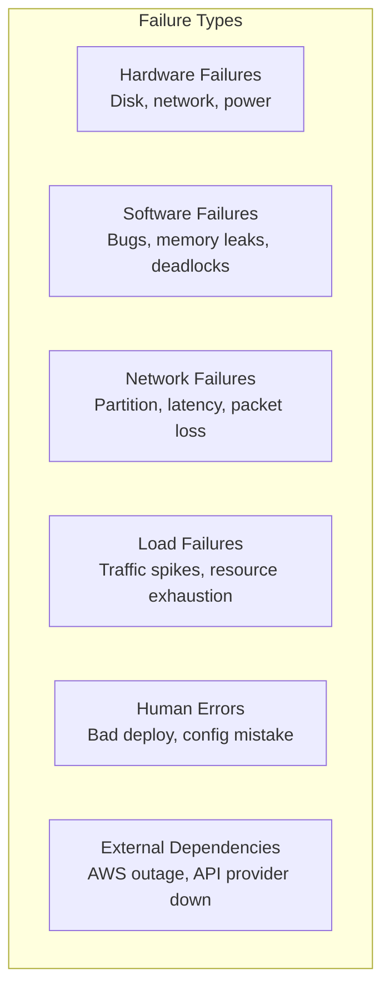
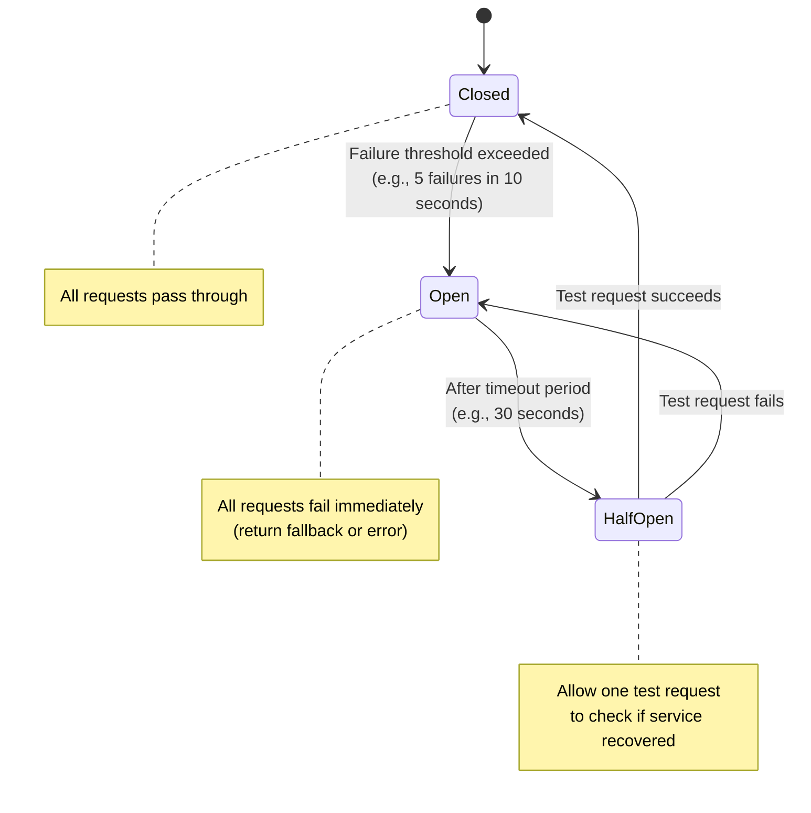
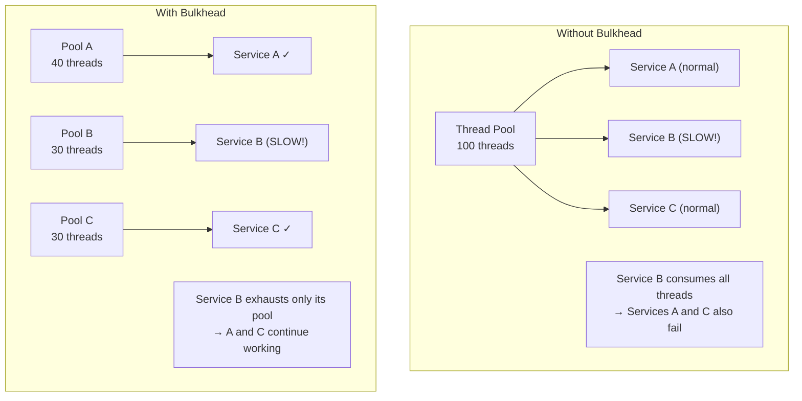
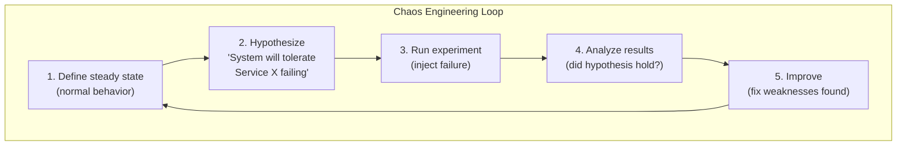
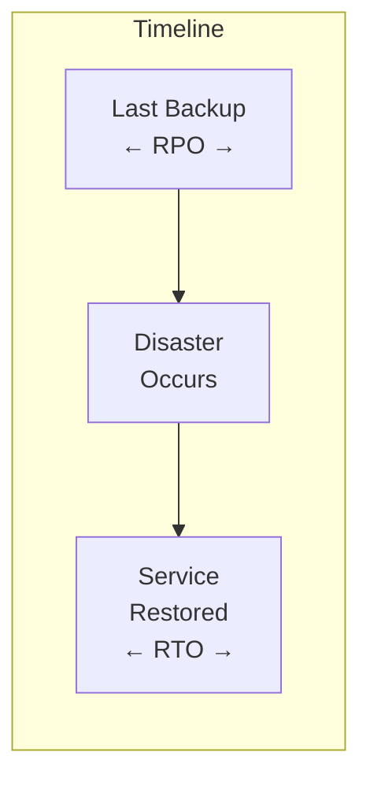
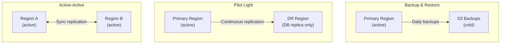
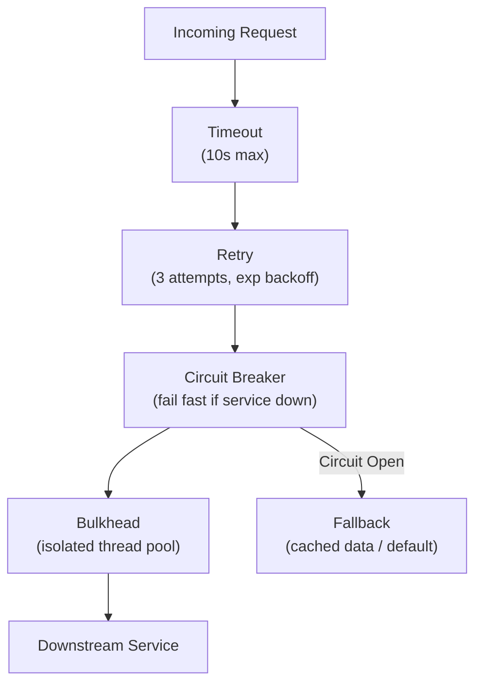

## Learning Objectives

- Implement circuit breaker, bulkhead, and retry patterns for resilient services
- Design retry strategies with exponential backoff and jitter
- Evaluate chaos engineering principles for proactive failure testing
- Build disaster recovery plans with RPO and RTO objectives
- Combine fault tolerance patterns into a comprehensive resilience strategy

## Prerequisites

- Understanding of distributed systems failure modes
- Familiarity with monitoring, alerting, and SLOs
- Knowledge of microservices communication patterns

## Why Systems Fail

### Failure Categories



**Key insight**: It's not **if** failures happen, it's **when**. Design for failure from the start.

## Circuit Breaker Pattern

### The Problem

When a downstream service is failing, continuing to send it requests:
1. Wastes resources (threads, connections) waiting for timeouts
2. Cascades the failure to upstream services
3. Prevents the failing service from recovering (overwhelmed with retries)

### How It Works



### Implementation

```python
class CircuitBreaker:
    def __init__(self, failure_threshold=5, recovery_timeout=30):
        self.failure_threshold = failure_threshold
        self.recovery_timeout = recovery_timeout
        self.failure_count = 0
        self.state = "CLOSED"
        self.last_failure_time = None

    def call(self, func, *args, **kwargs):
        if self.state == "OPEN":
            if time.time() - self.last_failure_time > self.recovery_timeout:
                self.state = "HALF_OPEN"
            else:
                raise CircuitOpenError("Circuit is open, failing fast")

        try:
            result = func(*args, **kwargs)
            self._on_success()
            return result
        except Exception as e:
            self._on_failure()
            raise

    def _on_success(self):
        self.failure_count = 0
        self.state = "CLOSED"

    def _on_failure(self):
        self.failure_count += 1
        self.last_failure_time = time.time()
        if self.failure_count >= self.failure_threshold:
            self.state = "OPEN"
```

### Fallback Strategies

When the circuit is open, what do you return?

| Strategy | Example | When |
|----------|---------|------|
| **Default value** | Return cached data, empty list | Non-critical features |
| **Graceful degradation** | Show basic page without recommendations | Partial functionality OK |
| **Alternative service** | Use backup payment provider | Redundant dependencies |
| **Queue for later** | Accept order, process payment later | Eventual consistency OK |
| **Fail fast** | Return error immediately | Critical path, no fallback |

## Bulkhead Pattern

### Isolating Failure Domains

Named after ship bulkheads that prevent a hull breach from sinking the entire ship:



### Types of Bulkheads

1. **Thread pool isolation**: Separate thread pools per dependency
2. **Connection pool isolation**: Separate DB connection pools per service
3. **Process isolation**: Separate processes or containers per component
4. **Cluster isolation**: Separate infrastructure per team or service criticality

### Semaphore Bulkhead

For async/non-blocking code, use semaphores instead of thread pools:

```python
class BulkheadSemaphore:
    def __init__(self, max_concurrent=10):
        self.semaphore = asyncio.Semaphore(max_concurrent)

    async def call(self, func, *args):
        try:
            async with asyncio.timeout(5):
                async with self.semaphore:
                    return await func(*args)
        except asyncio.TimeoutError:
            raise BulkheadFullError("Bulkhead capacity exceeded")

payment_bulkhead = BulkheadSemaphore(max_concurrent=20)
inventory_bulkhead = BulkheadSemaphore(max_concurrent=50)
```

## Retry Strategies

### Exponential Backoff with Jitter

Never retry immediately or at fixed intervals. Use exponential backoff with random jitter:

```
Attempt 1: Wait 0ms (immediate)
Attempt 2: Wait random(0, 1000ms)    = ~500ms
Attempt 3: Wait random(0, 2000ms)    = ~1000ms
Attempt 4: Wait random(0, 4000ms)    = ~2000ms
Attempt 5: Wait random(0, 8000ms)    = ~4000ms
Max wait cap: 30 seconds
```

```python
import random

def retry_with_backoff(func, max_retries=5, base_delay=1.0, max_delay=30.0):
    for attempt in range(max_retries):
        try:
            return func()
        except RetryableError:
            if attempt == max_retries - 1:
                raise

            delay = min(base_delay * (2 ** attempt), max_delay)
            jittered_delay = delay * random.uniform(0.5, 1.0)
            time.sleep(jittered_delay)
```

### Why Jitter Matters

Without jitter, thousands of clients that failed simultaneously will all retry at the same time (thundering herd):


### What to Retry

| Retryable | Not Retryable |
|-----------|--------------|
| Network timeout | Authentication error (401) |
| HTTP 500, 502, 503 | Bad request (400) |
| HTTP 429 (with Retry-After) | Not found (404) |
| Connection refused | Business logic error |
| DNS resolution failure | Validation error (422) |

## Timeouts

### Timeout Design

Every network call needs a timeout. Without timeouts, a slow dependency can hold resources indefinitely:

```
Connection timeout: 3 seconds (time to establish TCP connection)
Request timeout: 10 seconds (time to receive response)
Idle timeout: 60 seconds (close idle connections)

Total budget for a user request:
  API Gateway: 30s total budget
  ├── Auth Service: 5s timeout
  ├── Order Service: 15s timeout
  │   ├── Database: 5s timeout
  │   └── Payment Service: 8s timeout
  └── Notification Service: 3s timeout (fire-and-forget)
```

**Cascade timeouts**: The outer timeout must be larger than inner timeouts. If the API gateway times out at 30s, inner services must have shorter timeouts that sum to less than 30s.

## Chaos Engineering

### Principles

Chaos engineering is the practice of **intentionally injecting failures** to test system resilience:



### Netflix Chaos Tools

| Tool | What It Does |
|------|-------------|
| **Chaos Monkey** | Randomly terminates production instances |
| **Chaos Kong** | Simulates entire AWS region failure |
| **Latency Monkey** | Injects artificial latency |
| **FIT (Failure Injection Testing)** | Injects failures between services |

### Chaos Experiments

Start simple, increase severity:

```
Level 1: Kill a single container
Level 2: Introduce 500ms latency to a dependency
Level 3: Kill a database replica
Level 4: Simulate network partition between services
Level 5: Simulate entire availability zone failure
Level 6: Simulate region failure

Always start in staging, then gradually move to production
```

## Disaster Recovery

### RPO and RTO



**RPO (Recovery Point Objective)**: Maximum acceptable data loss measured in time. If RPO = 1 hour, you can lose up to 1 hour of data.

**RTO (Recovery Time Objective)**: Maximum acceptable downtime. If RTO = 4 hours, the system must be back up within 4 hours.

### DR Strategies

| Strategy | RTO | RPO | Cost |
|----------|-----|-----|------|
| **Backup & Restore** | Hours | Hours | $ |
| **Pilot Light** | 30-60 min | Minutes | $$ |
| **Warm Standby** | Minutes | Seconds | $$$ |
| **Active-Active** | Near-zero | Near-zero | $$$$ |



## Combining Patterns

### Resilience Stack



### Netflix's Resilience Strategy

Netflix uses all these patterns together via **Hystrix** (now Resilience4j):

1. Every remote call wrapped in a circuit breaker
2. Separate thread pools per dependency (bulkhead)
3. Timeouts on every call (fast fail)
4. Retries with backoff for transient errors
5. Fallbacks for every critical path
6. Chaos Monkey constantly testing in production

## Real-World Failure Stories

### Amazon DynamoDB (2015)

A metadata partition became overloaded, causing cascading failures across the fleet. Root cause: a missing back-off in the internal retry logic caused a positive feedback loop — failures led to retries, retries led to more load, more load led to more failures.

**Lesson**: Retry storms can be worse than the original failure. Always use exponential backoff with jitter.

### GitHub (2018)

A network partition between a primary database and its replicas caused a failover. The new primary had stale data, leading to data inconsistency. Recovery took 24 hours.

**Lesson**: Automated failover without proper safeguards can cause data loss. Test your failover procedure regularly.

## Interview Approach

1. **Identify failure modes**: What can go wrong? (dependency down, network partition, overload)
2. **Add circuit breakers**: For all remote calls to prevent cascade failures
3. **Add retries with backoff**: For transient failures, with jitter to prevent thundering herd
4. **Set timeouts**: Connection + request timeouts on every network call
5. **Use bulkheads**: Isolate thread/connection pools per dependency
6. **Plan for disaster**: Define RPO/RTO, implement appropriate DR strategy

> **Pro tip**: In an interview, say: "Every call to the payment service goes through a circuit breaker with a 5-second timeout, 3 retries with exponential backoff, and a fallback to queue the payment for later processing."

## Key Takeaways

1. **Circuit breakers prevent cascading failures**: Fail fast when a dependency is down, give it time to recover.
2. **Bulkheads isolate blast radius**: One slow dependency shouldn't take down everything else.
3. **Retries need backoff and jitter**: Without them, retries cause thundering herd problems.
4. **Timeouts are non-negotiable**: Every network call needs a timeout, or it can hang forever.
5. **Chaos engineering builds confidence**: You don't know your system is resilient until you've tested it.
6. **DR is about RPO and RTO**: Know how much data you can lose and how long you can be down.

## External Resources

- [Netflix Hystrix (concepts still relevant)](https://github.com/Netflix/Hystrix/wiki)
- [Resilience4j Documentation](https://resilience4j.readme.io/)
- [Chaos Engineering Principles](https://principlesofchaos.org/)
- [Google SRE Book — Handling Overload](https://sre.google/sre-book/handling-overload/)
- [AWS Well-Architected — Reliability Pillar](https://docs.aws.amazon.com/wellarchitected/latest/reliability-pillar/)
- [The Netflix Simian Army](https://netflixtechblog.com/the-netflix-simian-army-16e57fbab116)
