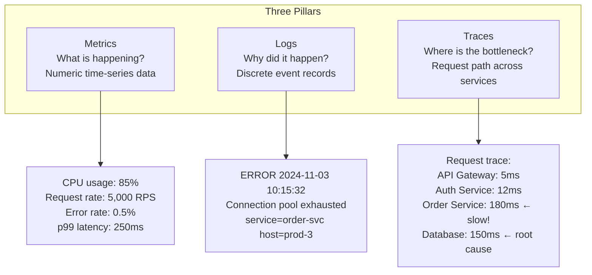
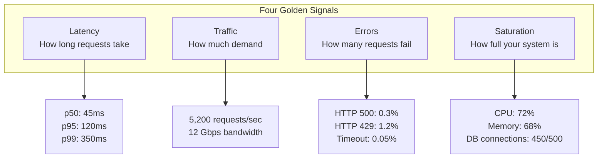
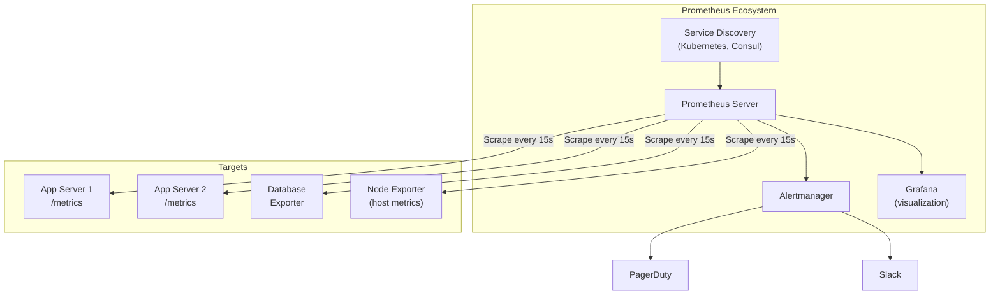
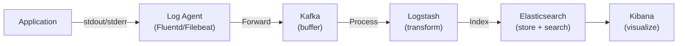
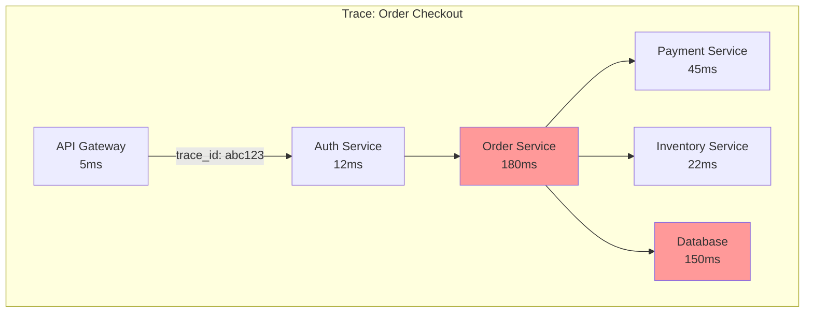
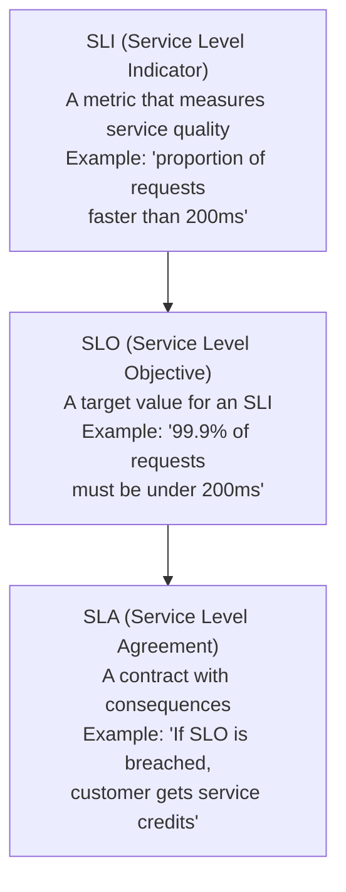
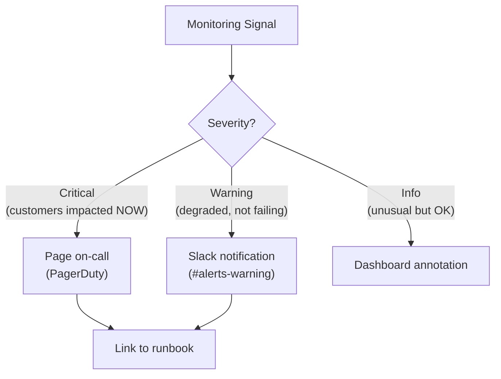

## Learning Objectives

- Distinguish between metrics, logs, and traces as the three pillars of observability
- Define SLIs, SLOs, and SLAs and use them to drive alerting decisions
- Design a monitoring stack using Prometheus, Grafana, and distributed tracing
- Implement effective alerting strategies that avoid alert fatigue
- Build dashboards that surface actionable insights during incidents

## Prerequisites

- Understanding of distributed system architecture
- Familiarity with web services and HTTP
- Basic knowledge of databases and infrastructure concepts

## The Three Pillars of Observability

### Why Observability Matters

You can't fix what you can't see. In a distributed system with dozens of services, a single slow database query can cascade into user-visible latency. Observability gives you the tools to understand **what** is happening, **why** it's happening, and **where** to look.



## Metrics

### The Four Golden Signals

Google's SRE book defines four signals that capture the health of any service:



### RED and USE Methods

| Method | Focus | Signals |
|--------|-------|---------|
| **RED** (for services) | Request-driven | **R**ate, **E**rrors, **D**uration |
| **USE** (for resources) | Resource-driven | **U**tilization, **S**aturation, **E**rrors |

**RED** is ideal for microservices: "How fast? How many errors? How many requests?"

**USE** is ideal for infrastructure: "How busy is the CPU? Is the disk queue full? Any hardware errors?"

### Prometheus Metrics Types

```
# Counter: only goes up (total requests, total errors)
http_requests_total{method="GET", status="200"} 154832

# Gauge: goes up and down (current connections, temperature)
http_connections_active 142

# Histogram: distribution of values (request duration)
http_request_duration_seconds_bucket{le="0.1"} 24054
http_request_duration_seconds_bucket{le="0.5"} 33091
http_request_duration_seconds_bucket{le="1.0"} 33444
http_request_duration_seconds_count 33444
http_request_duration_seconds_sum 5765.46

# Summary: similar to histogram but calculates quantiles client-side
http_request_duration_seconds{quantile="0.99"} 0.35
```

### Prometheus Architecture



## Logs

### Structured Logging

```json
{
  "timestamp": "2024-11-03T10:15:32.456Z",
  "level": "ERROR",
  "service": "order-service",
  "host": "prod-order-3",
  "trace_id": "abc123def456",
  "span_id": "789ghi",
  "user_id": "user_456",
  "message": "Failed to process order",
  "error": "ConnectionPoolExhausted",
  "details": {
    "pool_size": 50,
    "active_connections": 50,
    "waiting_requests": 23
  },
  "duration_ms": 5032
}
```

**Why structured**: Searchable, filterable, aggregatable. "Show me all ERROR logs from order-service in the last hour where duration > 1000ms."

### Log Aggregation Pipeline



### Log Levels

```
TRACE → Extremely detailed (function entry/exit)
DEBUG → Detailed diagnostic information
INFO  → Normal operation events (request handled, job completed)
WARN  → Unexpected but handled situations (retry succeeded, cache miss)
ERROR → Failures requiring attention (request failed, exception caught)
FATAL → System cannot continue (out of memory, config missing)

Production: INFO and above
Debugging: DEBUG and above (temporarily, with increased storage cost)
```

## Distributed Tracing

### Following a Request Across Services



```
Trace ID: abc123
├── Span: API Gateway (0-5ms)
├── Span: Auth Service (5-17ms)
├── Span: Order Service (17-197ms)
│   ├── Span: Payment Service (20-65ms)
│   ├── Span: Inventory Service (25-47ms)
│   └── Span: Database Query (30-180ms) ← root cause!
```

### OpenTelemetry

OpenTelemetry (OTel) is the industry standard for instrumentation:

```
OpenTelemetry provides:
  - API: Defines how to create spans, metrics, logs
  - SDK: Implements the API with exporters, samplers
  - Collector: Agent that receives, processes, and exports telemetry
  - Auto-instrumentation: Automatically instruments HTTP, DB, gRPC calls

Exporters: Jaeger, Zipkin, Datadog, New Relic, Grafana Tempo
```

### Trace Sampling

At 100K requests/sec, storing every trace is expensive. Sampling strategies:

| Strategy | Description | When |
|----------|-------------|------|
| **Head-based** | Decide at the start (sample 1%) | Default, simple |
| **Tail-based** | Decide at the end (keep errors, slow traces) | Better signal |
| **Adaptive** | Adjust rate based on traffic | Production |

Tail-based sampling is ideal: store 1% of successful traces but 100% of errors and slow traces (>1s).

## SLIs, SLOs, and SLAs

### Definitions



### Defining Good SLOs

| Service | SLI | SLO |
|---------|-----|-----|
| **API** | Request latency p99 | < 200ms for 99.9% of requests |
| **API** | Error rate | < 0.1% over 30 days |
| **Database** | Query latency p95 | < 50ms for 99.95% |
| **Storage** | Data durability | 99.999999999% (11 nines) |
| **CDN** | Cache hit ratio | > 95% |
| **Auth** | Login success rate | > 99.95% |

### Error Budgets

An SLO of 99.9% means your **error budget** is 0.1%. Over 30 days:

```
Total minutes in 30 days: 43,200
Error budget (99.9%): 43.2 minutes of downtime allowed
Error budget (99.99%): 4.32 minutes

Burn rate:
  If you've used 80% of your monthly error budget by day 15,
  you're burning too fast → slow down deployments, focus on reliability
```

## Alerting

### Effective Alerting Strategy



### Alert Anti-Patterns

| Anti-Pattern | Problem | Fix |
|-------------|---------|-----|
| **Alerting on causes** | CPU is high → not necessarily a problem | Alert on symptoms (latency, errors) |
| **Too many alerts** | Alert fatigue, people ignore them | Reduce to only actionable alerts |
| **No runbook** | Engineer wakes up, doesn't know what to do | Every alert has a linked runbook |
| **Missing context** | "Errors are high" — on which service? | Include service, endpoint, error type |
| **Flapping alerts** | Alerts fire and resolve repeatedly | Add hysteresis (fire at 90%, resolve at 70%) |

### Alert on SLO Burn Rate

Instead of alerting on raw metrics, alert when your error budget is burning too fast:

```
Multi-window, multi-burn-rate alerting:

Fast burn (for urgent issues):
  If 5% of monthly error budget consumed in 1 hour → PAGE

Medium burn (for significant issues):
  If 10% of monthly error budget consumed in 6 hours → WARN

Slow burn (for chronic issues):
  If 100% of monthly error budget consumed in 3 days → TICKET
```

This approach avoids alerting on brief spikes while catching sustained degradation.

## Dashboard Design

### The Four Dashboard Types

1. **Overview dashboard**: High-level health of all services (traffic light view)
2. **Service dashboard**: Deep dive into one service (golden signals, dependencies)
3. **Infrastructure dashboard**: Host-level metrics (CPU, memory, disk, network)
4. **Incident dashboard**: Pre-built for common failure modes

### Effective Dashboard Layout

```
┌──────────────────────────────────────────────────┐
│ Service: Order Service | Environment: Production │
│ Status: HEALTHY ● | Last Deploy: 2h ago         │
├──────────────────────────────────────────────────┤
│ Request Rate  │ Error Rate    │ Latency (p50/p99)│
│ ▁▂▃▄▅▆▇ 5.2K │ ▁▁▁▁▂▁▁ 0.3% │ ▁▂▁▂▁▂▁ 45/120ms│
├──────────────────────────────────────────────────┤
│ SLO Status (30d rolling)                         │
│ Availability: 99.95% (target: 99.9%) ✅          │
│ Latency: 99.2% < 200ms (target: 99%) ✅          │
│ Error Budget Remaining: 62%                      │
├──────────────────────────────────────────────────┤
│ Dependencies                                     │
│ Payment Service: ● Healthy   | Redis: ● Healthy │
│ Database (RDS): ● Healthy    | Kafka: ⚠ Degraded│
└──────────────────────────────────────────────────┘
```

## Real-World Examples

### Netflix

Netflix's observability stack:
- **Atlas**: Custom time-series database for metrics (billions of data points/sec)
- **Edgar**: Distributed tracing system
- **Mantis**: Real-time stream processing for operational insights
- **Chaos Monkey**: Proactively discovers failure modes

### Uber

- **M3**: Custom time-series platform (handles 500M+ metrics)
- **Jaeger**: Open-source distributed tracing (created at Uber)
- **uMonitor**: Anomaly detection on metrics
- **On-call**: SLO-based alerting with burn rate

## Interview Approach

When discussing monitoring in a system design interview:

1. **Mention the three pillars**: Metrics, logs, traces — and when each is useful
2. **Define SLOs**: "Our API SLO is 99.9% of requests under 200ms"
3. **Describe alerting**: "We alert on SLO burn rate, not raw metrics"
4. **Name tools**: Prometheus + Grafana for metrics, ELK for logs, Jaeger for traces
5. **Show dashboards**: Sketch a golden signals dashboard

> **Pro tip**: Interviewers love it when you proactively add observability to your system design. "I'd add Prometheus metrics for request latency and error rate, with Grafana dashboards and PagerDuty alerts on SLO burn rate."

## Key Takeaways

1. **Three pillars work together**: Metrics tell you something is wrong, logs tell you why, traces tell you where.
2. **Alert on symptoms, not causes**: Users care about latency and errors, not CPU usage.
3. **SLOs drive decisions**: Error budgets tell you when to ship features vs. fix reliability.
4. **Structured logging is essential**: JSON logs with trace IDs enable correlated debugging.
5. **Tail-based trace sampling**: Keep 100% of errors, sample 1% of successes.
6. **Less is more for alerts**: Every alert should be actionable with a linked runbook.

## External Resources

- [Google SRE Book — Monitoring Distributed Systems](https://sre.google/sre-book/monitoring-distributed-systems/)
- [Prometheus Documentation](https://prometheus.io/docs/)
- [Grafana Documentation](https://grafana.com/docs/)
- [OpenTelemetry Documentation](https://opentelemetry.io/docs/)
- [SLOs and Error Budgets (Google)](https://sre.google/workbook/implementing-slos/)
- [Distributed Tracing with Jaeger](https://www.jaegertracing.io/docs/)
