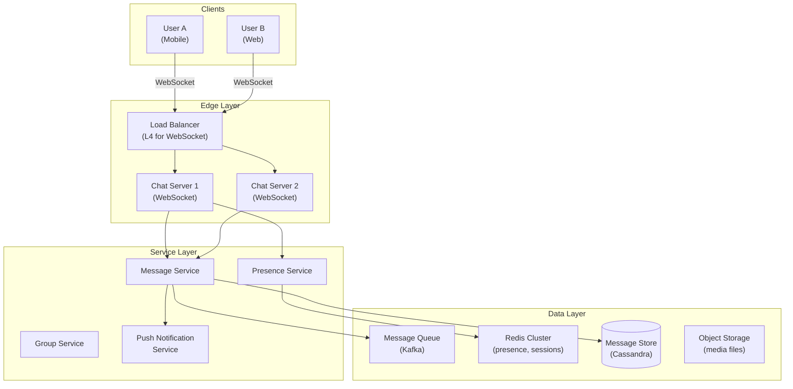
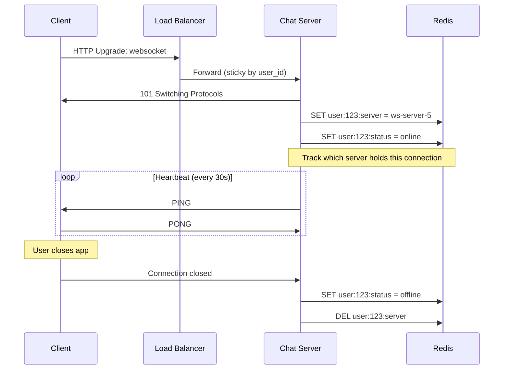
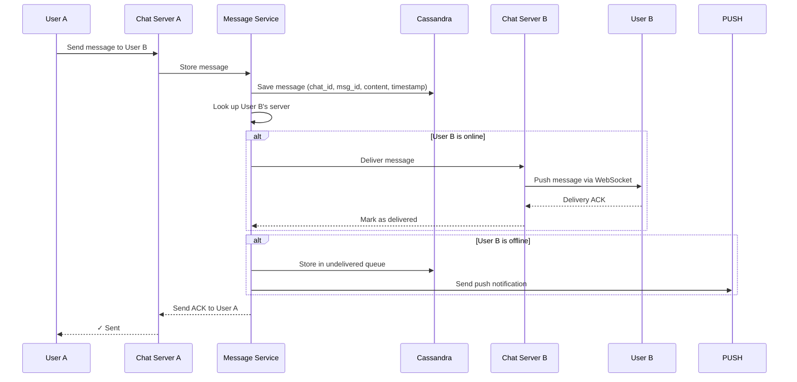
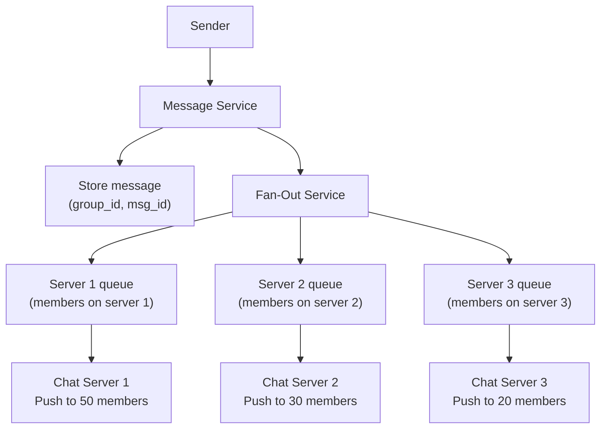
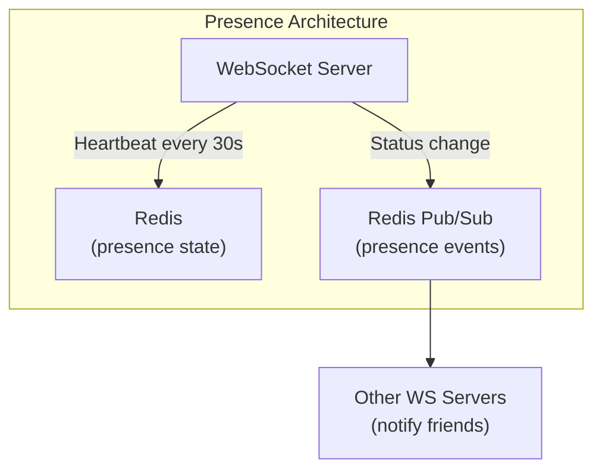
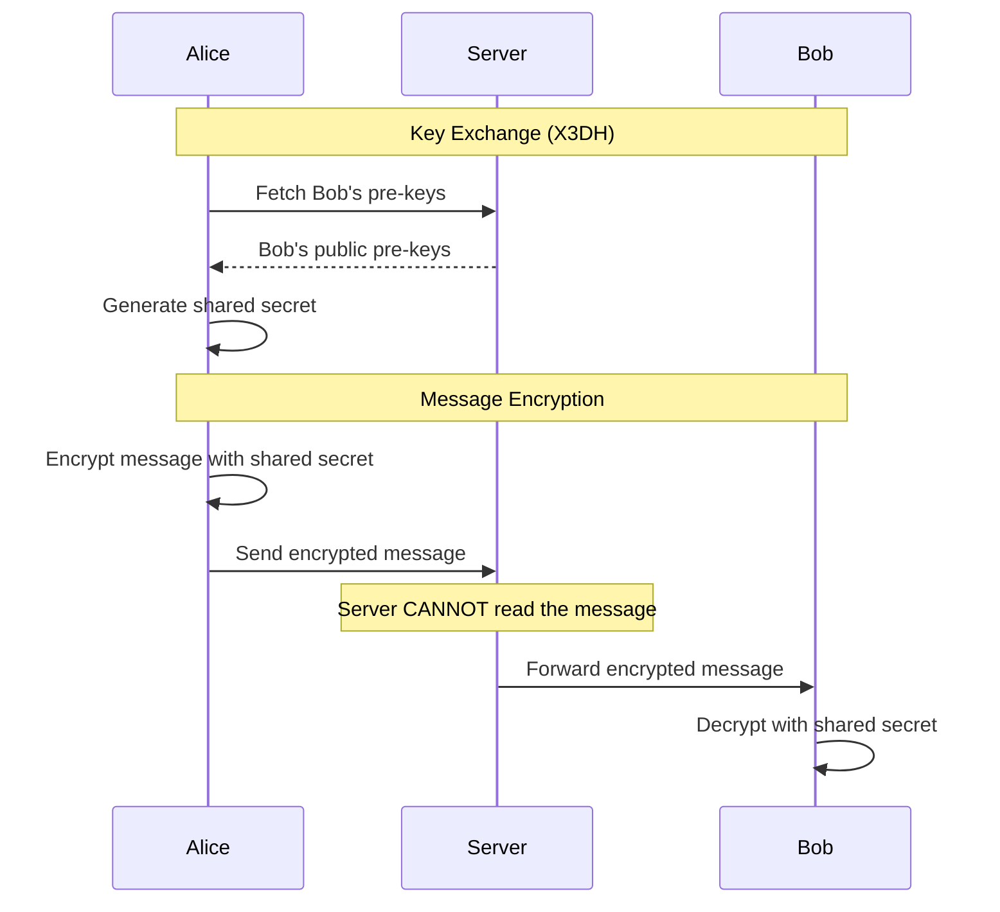
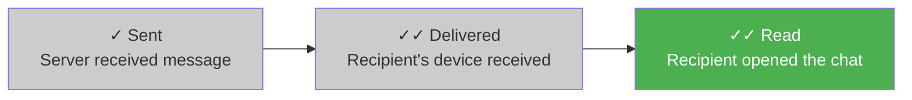
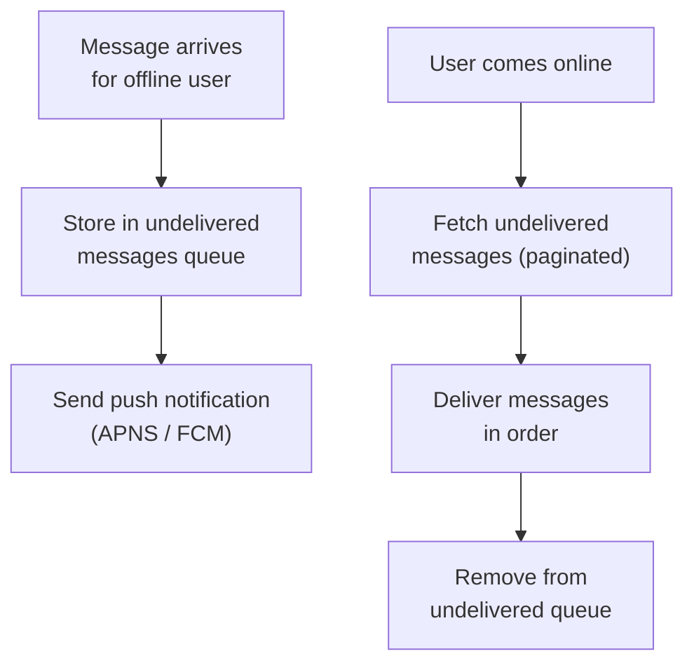

## Learning Objectives

- Design a real-time chat system supporting 1-on-1 and group messaging
- Implement WebSocket-based communication with connection management
- Solve message ordering, delivery guarantees, and offline message handling
- Design presence (online/offline status) at scale
- Evaluate end-to-end encryption approaches and their architectural impact

## Prerequisites

- Understanding of WebSockets and HTTP long-polling
- Familiarity with message queues and pub/sub patterns
- Knowledge of database partitioning and replication

## Requirements

### Functional Requirements

1. 1-on-1 messaging (real-time)
2. Group messaging (up to 500 members)
3. Online/offline presence indicators
4. Message delivery receipts (sent, delivered, read)
5. Message history and search
6. Media sharing (images, files)

### Non-Functional Requirements

- **Real-time delivery**: <100ms for online users
- **Message ordering**: Messages appear in the order they were sent
- **Reliability**: No message loss, exactly-once delivery to each recipient
- **Scale**: 500M DAU, 40B messages/day

### Capacity Estimation

```
Users: 500M DAU
Messages: 40B/day = ~460K messages/sec
  Average message size: 200 bytes (text) + metadata = 500 bytes
  Storage: 40B × 500 bytes = 20 TB/day = 7.3 PB/year

Concurrent WebSocket connections:
  500M DAU, ~30% online at peak = 150M concurrent connections
  Each connection: ~10KB memory
  150M × 10KB = 1.5 TB memory for connection state

Bandwidth:
  460K msg/sec × 500 bytes = 230 MB/sec = ~2 Gbps
```

## High-Level Architecture



## Real-Time Communication

### WebSocket Connection Lifecycle



### Why WebSockets Over HTTP?

| Approach | Latency | Server Resources | Best For |
|----------|---------|-----------------|----------|
| **Short polling** | 1-5s delay | Very high (constant requests) | Legacy systems |
| **Long polling** | ~instant | High (connections held open) | Fallback |
| **WebSocket** | Instant | Low (persistent, bidirectional) | Chat, gaming |
| **SSE** | Instant | Medium (server→client only) | Notifications, feeds |

## Message Flow

### 1-on-1 Message Delivery



### Group Message Delivery

For a group with 500 members, you can't fan out to 500 WebSocket connections synchronously:



**Optimization**: Group messages by the chat server they need to go to. Instead of 500 individual deliveries, batch by server (e.g., 10 servers × 50 members each).

## Message Storage

### Schema Design (Cassandra)

```sql
-- Messages partitioned by chat_id, ordered by message_id (time-based)
CREATE TABLE messages (
    chat_id     UUID,
    message_id  TIMEUUID,
    sender_id   UUID,
    content     TEXT,
    content_type TEXT,  -- 'text', 'image', 'file'
    media_url   TEXT,
    created_at  TIMESTAMP,
    PRIMARY KEY (chat_id, message_id)
) WITH CLUSTERING ORDER BY (message_id DESC);

-- User's chat list (recent conversations)
CREATE TABLE user_chats (
    user_id       UUID,
    last_activity TIMESTAMP,
    chat_id       UUID,
    chat_type     TEXT,  -- '1on1', 'group'
    last_message  TEXT,
    unread_count  INT,
    PRIMARY KEY (user_id, last_activity, chat_id)
) WITH CLUSTERING ORDER BY (last_activity DESC);
```

**Why Cassandra?**: Write-heavy workload (460K messages/sec), partition by `chat_id` keeps conversation data together, time-ordered within partition, horizontal scaling.

## Message Ordering

### The Ordering Challenge

```
User A sends "Hello" at t=1000 (server clock: 1000)
User B sends "Hi" at t=999 (server clock: 1001, B's phone clock is behind)

Which came first? Server clocks may disagree across servers.
```

### Solutions

1. **Server-assigned timestamps**: The message service assigns a timestamp when it receives the message. Consistent but doesn't reflect "true" send time.

2. **Lamport timestamps**: Logical clocks that ensure causal ordering. If A sends after seeing B's message, A's timestamp is guaranteed to be higher.

3. **Per-conversation sequence numbers**: Each conversation has a monotonically increasing sequence number. The message service assigns the next number atomically:

```
Chat #456:
  seq=1: Alice: "Hello"
  seq=2: Bob: "Hi there"
  seq=3: Alice: "How are you?"

Client-side: display messages ordered by sequence number
```

## Presence System

### Presence at Scale

Tracking online/offline status for 500M users requires careful design:



### Fan-Out Problem

If a user with 1,000 friends comes online, do you notify all 1,000? That's expensive at scale.

**WhatsApp's approach**: Only show presence for the currently open chat. Don't broadcast "online" to all contacts — only to the person you're actively chatting with.

**Lazy presence**: When User A opens a chat with User B, query User B's presence. Don't push presence updates to all contacts proactively.

```
Proactive: User comes online → notify 500 friends = 500 messages
Lazy: User opens chat with friend → query 1 presence = 1 message
```

## End-to-End Encryption (E2EE)

### Signal Protocol (used by WhatsApp, Signal)



### E2EE Implications for Architecture

| Feature | Without E2EE | With E2EE |
|---------|-------------|-----------|
| Server-side search | Yes | No (can't read messages) |
| Message backup | Server handles | Client must manage keys |
| Spam detection | Content analysis | Metadata-only analysis |
| Group messages | Simple fanout | Re-encrypt per recipient |
| Push notification preview | Show message text | "New message" (generic) |

## Delivery Receipts

### Three Ticks System



Implementation:
1. **Sent**: Message service ACKs to sender
2. **Delivered**: Recipient's client sends delivery ACK back through WebSocket
3. **Read**: Recipient opens the chat → client sends read receipt

## Offline Message Handling



## Interview Approach

1. **Start with requirements**: 1-on-1? Group? Scale? E2EE?
2. **Choose communication protocol**: WebSocket for real-time
3. **Design message flow**: Send → store → route → deliver
4. **Handle offline users**: Persistent queue + push notifications
5. **Solve ordering**: Per-conversation sequence numbers
6. **Design presence**: Lazy over proactive for scale
7. **Discuss trade-offs**: E2EE implications, group message fan-out

> **Pro tip**: Draw the message flow for both online and offline recipients. Interviewers want to see you handle both cases.

## Key Takeaways

1. **WebSocket is the right choice**: Persistent, bidirectional, low-latency. Use L4 load balancing with sticky sessions.
2. **Partition messages by conversation**: Each chat's messages stay together. Cassandra with `chat_id` partition key.
3. **Lazy presence scales better**: Only query presence for active conversations, don't broadcast to all contacts.
4. **Sequence numbers ensure ordering**: Per-conversation counters are simpler and more reliable than synchronized clocks.
5. **Offline handling is critical**: Store-and-forward with push notifications for offline users.
6. **E2EE changes everything**: Server can't search, filter, or preview encrypted messages.

## External Resources

- [WhatsApp System Architecture](https://www.youtube.com/watch?v=vvhC64hQZMk)
- [Signal Protocol Specification](https://signal.org/docs/)
- [Facebook Messenger Architecture](https://engineering.fb.com/2014/10/09/production-engineering/building-mobile-first-infrastructure-for-messenger/)
- [Discord Architecture (blog)](https://discord.com/blog/how-discord-stores-trillions-of-messages)
- [Designing Data-Intensive Applications — Ch. 11](https://dataintensive.net/)
