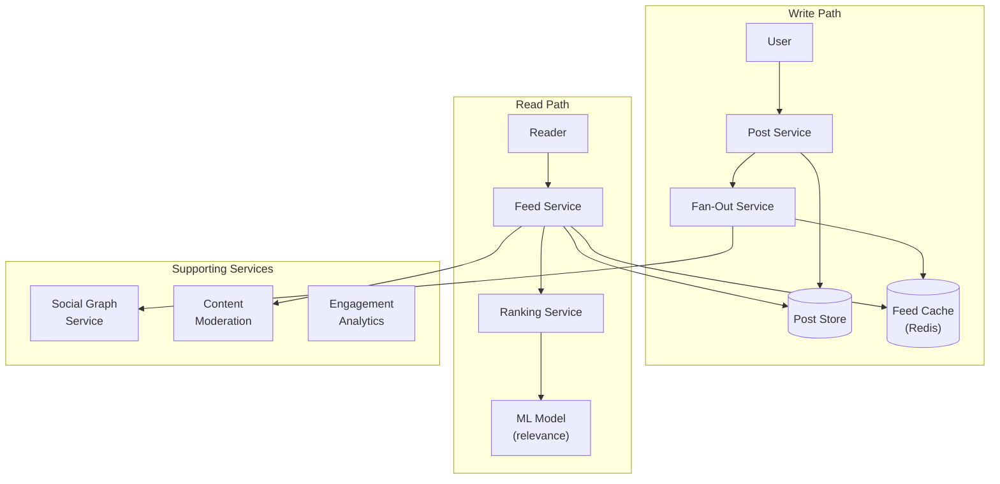
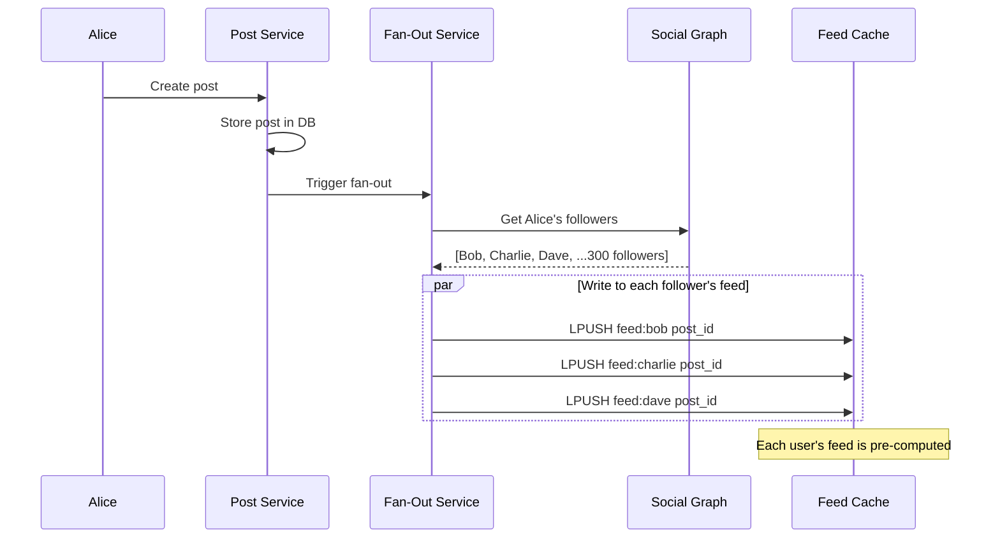
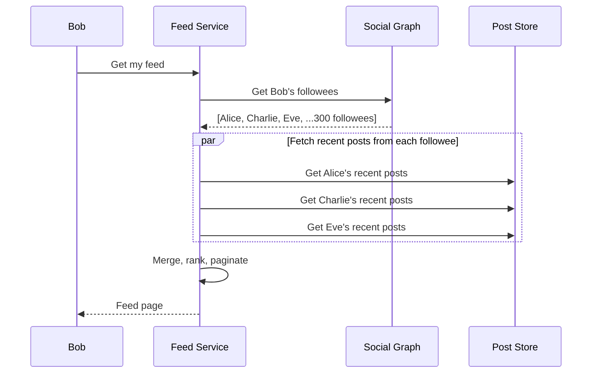
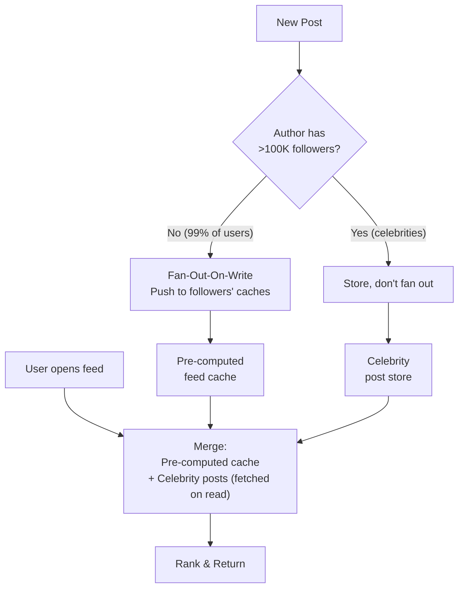
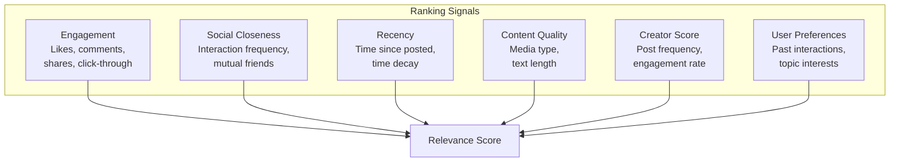
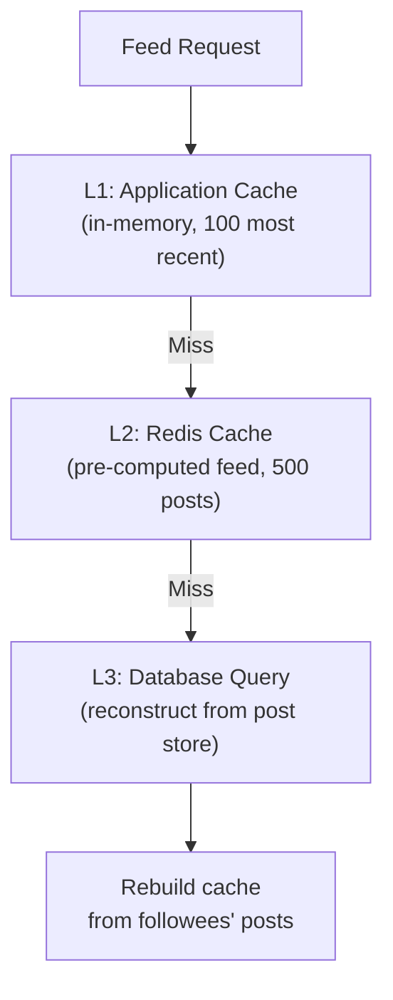
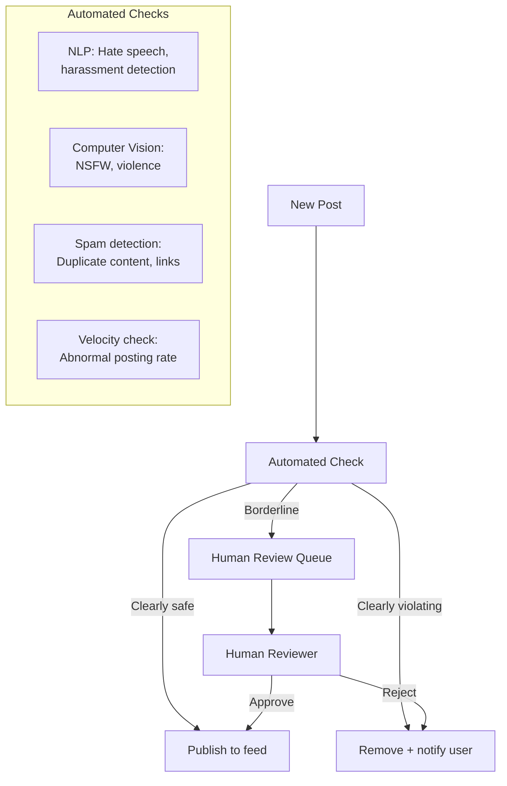

## Learning Objectives

- Compare fan-out-on-write vs. fan-out-on-read strategies with concrete trade-off analysis
- Design a feed ranking system that balances relevance, recency, and diversity
- Implement caching strategies for feed generation at scale
- Handle content moderation, infinite scroll, and feed deduplication
- Estimate capacity requirements for a feed serving hundreds of millions of users

## Prerequisites

- Understanding of message queues and event-driven architecture
- Familiarity with caching strategies and database partitioning
- Knowledge of social graph data structures

## Requirements

### Functional Requirements

1. Users create posts (text, images, videos)
2. Users see a feed of posts from people they follow
3. Feed is ranked by relevance (not purely chronological)
4. Infinite scroll pagination
5. Support for likes, comments, shares (engagement signals)

### Non-Functional Requirements

- **Feed generation latency**: <200ms for rendering a feed page
- **Freshness**: New posts appear in follower feeds within 5 seconds
- **Scale**: 500M DAU, average 300 followees per user
- **Availability**: 99.99% uptime

### Capacity Estimation

```
Users: 1B total, 500M DAU
Posts: 500M new posts/day = ~6,000 posts/sec
Feed reads: 500M users × 10 feed loads/day = 5B feed reads/day = ~58,000/sec

Average followees: 300
Average followers: 300 (reciprocal in aggregate)

Fan-out volume (write path):
  6,000 posts/sec × 300 avg followers = 1.8M fan-out writes/sec

Feed storage per user: 500 post IDs × 8 bytes = 4 KB
Total feed cache: 500M users × 4 KB = 2 TB (Redis)
```

## High-Level Architecture



## Fan-Out Strategies

### Fan-Out-On-Write (Push Model)

When a user publishes a post, **immediately write it to all followers' feed caches**:



**Pros**:
- Feed reads are fast (just read from cache)
- Simple read path

**Cons**:
- Celebrity problem: A user with 100M followers requires 100M writes per post
- Wasted work for inactive users (writing to feeds no one reads)
- Hot spot: celebrities generate enormous write load

### Fan-Out-On-Read (Pull Model)

When a user opens their feed, **fetch posts from all followees at read time**:



**Pros**:
- No wasted writes for inactive users
- Celebrity posts don't require massive fan-out
- Always fresh data

**Cons**:
- Slow reads (must query 300 followees' posts and merge)
- High read-time computation
- Difficult to rank in real-time

### Hybrid Approach (What Twitter/X Uses)



**The hybrid approach**: Push for regular users (99%), pull for celebrities (1%). When reading the feed, merge the pre-computed cache with freshly fetched celebrity posts.

### Trade-Off Comparison

| Factor | Fan-Out-On-Write | Fan-Out-On-Read | Hybrid |
|--------|-----------------|-----------------|--------|
| **Read latency** | Low (pre-computed) | High (compute on read) | Low |
| **Write latency** | High (fan-out) | Low (just store) | Medium |
| **Storage** | High (duplicated feeds) | Low | Medium |
| **Celebrity handling** | Terrible | Good | Good |
| **Inactive users** | Wasted writes | No waste | Minimal waste |
| **Complexity** | Low | Medium | High |

## Feed Ranking

### Ranking Signals



### Simple Ranking Formula

```
score = (engagement_score × 0.3)
      + (social_closeness × 0.25)
      + (recency_score × 0.2)
      + (content_quality × 0.15)
      + (creator_score × 0.1)

Where:
  engagement_score = log(likes + 2×comments + 3×shares + 1)
  social_closeness = interaction_count / days_since_first_interaction
  recency_score = 1 / (1 + hours_since_posted)
  content_quality = has_media ? 1.2 : 1.0
  creator_score = avg_engagement_rate × posting_consistency
```

### ML-Based Ranking

Modern feeds use ML models that predict the probability of engagement:

```
For each candidate post, predict:
  P(like)     → 0.12
  P(comment)  → 0.03
  P(share)    → 0.01
  P(click)    → 0.25
  P(hide)     → 0.005
  P(report)   → 0.001

Score = w1×P(like) + w2×P(comment) + w3×P(share)
      + w4×P(click) - w5×P(hide) - w6×P(report)
```

## Caching Architecture

### Multi-Layer Feed Cache



### Cache Invalidation Strategy

- **New post**: LPUSH to followers' feed lists, LTRIM to keep only top 500
- **Delete post**: Remove from feed lists (or filter at read time)
- **Unfollow**: Eventually consistent — old posts from unfollowed user will age out
- **Block user**: Filter at read time (check against block list)

## Infinite Scroll Pagination

### Cursor-Based Feed Pagination

```
GET /feed?cursor=eyJ0IjoxNjk5ODc3MjAwLCJzIjo4Ljd9&limit=20

Response:
{
  "posts": [...20 posts...],
  "cursor": "eyJ0IjoxNjk5ODc2MDAwLCJzIjo3LjJ9",
  "has_more": true
}

Cursor contains: {timestamp, score} of the last item
Next page: items with score < last_score (or timestamp < last_timestamp if scores equal)
```

### Handling New Posts During Scroll

While the user is scrolling, new posts arrive. Without handling, the user sees duplicates or misses posts:

```
Feed at t=0: [A, B, C, D, E]
User views [A, B, C], scrolls down
New post X is added → Feed becomes [X, A, B, C, D, E]

Without dedup: Next page shows [C, D, E] → user sees C twice!

Solution: Cursor tracks position by post_id/score,
          not by offset. Dedup on the client side.
```

## Content Moderation

### Moderation Pipeline



**Moderation timing**: Run automated checks synchronously (before publishing). Human review is async — posts in queue are visible with a "pending review" flag or hidden until approved.

## Real-World Examples

### Instagram Feed (Meta)

- **Hybrid fan-out**: Push for most users, pull for celebrities
- **ML ranking**: Deep learning models predict engagement probability
- **Interest graph**: Tracks which topics/creators each user engages with
- **Diversity rules**: Don't show 5 posts from the same creator back-to-back
- **Inventory management**: Mix content types (photos, Reels, ads)

### Twitter/X Timeline

- **Home timeline**: Ranked feed (ML-based, fan-out-on-write + pull for celebrities)
- **Following timeline**: Reverse chronological (no ranking)
- **For You**: Discovery feed (pulls from broader network, not just followees)
- Fan-out handled by a service called "Timeline Service" built on Manhattan (in-house KV store)

## Interview Approach

1. **Clarify scope**: Social network type? Following model? Content types?
2. **Estimate scale**: Users, posts/day, fan-out requirements
3. **Choose fan-out strategy**: Push for most, pull for celebrities (hybrid)
4. **Design caching**: Pre-computed feeds in Redis, multi-layer cache
5. **Add ranking**: Start with simple formula, mention ML model
6. **Handle edge cases**: Infinite scroll, dedup, moderation, celebrities
7. **Discuss trade-offs**: Freshness vs. latency, complexity vs. performance

> **Pro tip**: Start by calculating the fan-out write volume. "6,000 posts/sec × 300 followers = 1.8M writes/sec" immediately shows why pure fan-out-on-write is challenging and motivates the hybrid approach.

## Key Takeaways

1. **Hybrid fan-out is the answer**: Push for regular users, pull for celebrities. Mention this trade-off explicitly.
2. **Pre-compute, don't query**: The feed should be pre-built in cache, not assembled on every read.
3. **Ranking is essential**: Chronological feeds don't scale. Users miss important content.
4. **Cursor-based pagination for infinite scroll**: Never use offset-based for user-facing feeds.
5. **Content moderation is a first-class concern**: Automated + human review pipeline.
6. **Cache aggressively**: 2 TB of Redis for 500M users' feeds is a reasonable investment.

## External Resources

- [Building the Facebook News Feed (Engineering Blog)](https://engineering.fb.com/)
- [Twitter Home Timeline Architecture](https://blog.twitter.com/engineering/en_us/topics/infrastructure)
- [Instagram Feed Ranking](https://about.instagram.com/blog/announcements/shedding-more-light-on-how-instagram-works)
- [Designing Data-Intensive Applications — Ch. 11](https://dataintensive.net/)
- [System Design: News Feed (Alex Xu)](https://bytebytego.com/)
