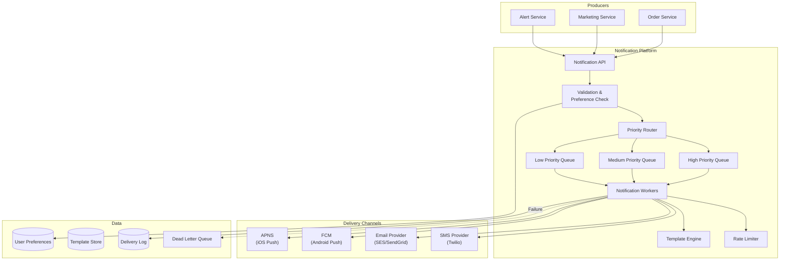
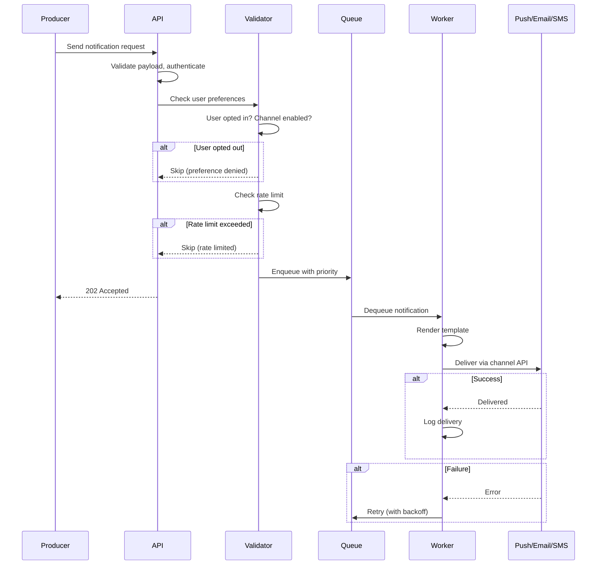
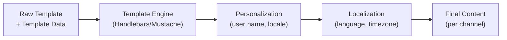
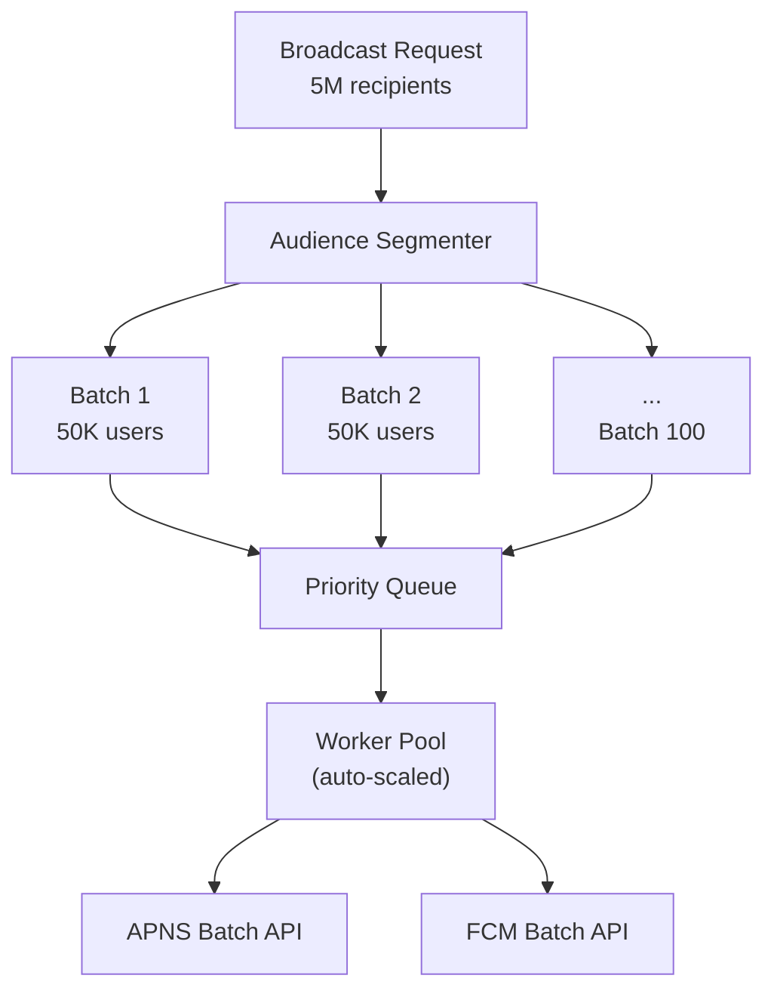
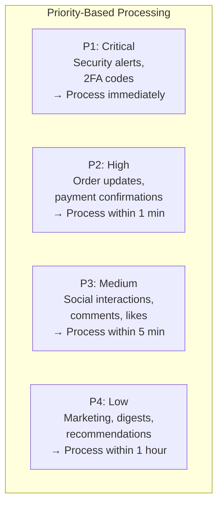
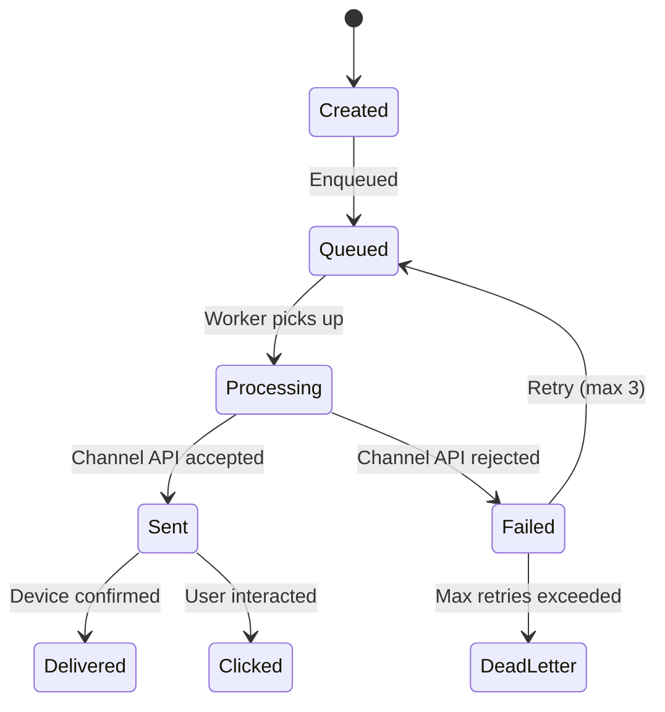

## Learning Objectives

- Design a multi-channel notification system (push, email, SMS)
- Implement fan-out strategies for notifications targeting millions of users
- Handle notification prioritization, rate limiting, and user preferences
- Design template engines for personalized notification content
- Track delivery status across channels with retry and fallback logic

## Prerequisites

- Understanding of message queues and event-driven architecture
- Familiarity with rate limiting and API design
- Knowledge of distributed systems and scaling patterns

## Requirements

### Functional Requirements

1. Support push notifications (iOS/Android), email, and SMS
2. Pluggable notification templates with personalization
3. User preference management (channels, frequency, opt-out)
4. Priority levels (urgent, high, medium, low)
5. Delivery tracking and analytics
6. Rate limiting per user to prevent notification fatigue

### Non-Functional Requirements

- **Throughput**: 10M notifications/hour at peak
- **Latency**: Urgent notifications delivered within 30 seconds
- **Reliability**: No lost notifications for critical alerts
- **Scalability**: Handle fan-out to millions of users (broadcast)

### Capacity Estimation

```
Volume: 10B notifications/month
  Push: 60% = 6B
  Email: 30% = 3B
  SMS: 10% = 1B

Peak throughput: 10M/hour = ~2,800 notifications/sec
  Push: 1,700/sec
  Email: 840/sec
  SMS: 280/sec

Storage (30-day retention for delivery logs):
  10B × 200 bytes = 2 TB/month
```

## High-Level Architecture



## Notification Flow

### Step-by-Step



## Notification API Design

```json
// POST /v1/notifications
{
  "type": "order_shipped",
  "priority": "high",
  "recipients": [
    {
      "user_id": "user_123",
      "channels": ["push", "email"]
    }
  ],
  "template_id": "tmpl_order_shipped",
  "template_data": {
    "order_id": "ORD-456",
    "tracking_number": "1Z999AA10123456784",
    "estimated_delivery": "2024-11-15"
  },
  "idempotency_key": "order_456_shipped_v1",
  "scheduled_at": null
}
```

For broadcast notifications (millions of recipients):

```json
// POST /v1/notifications/broadcast
{
  "type": "product_launch",
  "priority": "low",
  "audience": {
    "segment": "active_users_30d",
    "filters": {
      "country": ["US", "CA"],
      "plan": ["pro", "enterprise"]
    }
  },
  "template_id": "tmpl_product_launch",
  "template_data": {
    "product_name": "New Feature X"
  },
  "send_rate": 50000,
  "idempotency_key": "product_x_launch_nov2024"
}
```

## Template Engine

### Template Design

```
Template: tmpl_order_shipped

Push notification:
  Title: "Your order is on its way! 📦"
  Body: "Order {{order_id}} shipped via {{carrier}}. Track: {{tracking_number}}"

Email:
  Subject: "Your order {{order_id}} has shipped"
  Body: (HTML template with tracking details, delivery estimate, order summary)

SMS:
  Body: "Your order {{order_id}} shipped. Track at {{tracking_url}}"
```

### Template Rendering Pipeline



**Localization**: Store templates per locale (`tmpl_order_shipped_en`, `tmpl_order_shipped_es`). Render in the user's preferred language.

## Fan-Out Strategy

### Small Fan-Out (1-1000 recipients)

Direct fan-out: Create one notification event per recipient and enqueue:

```
1 notification request → 500 recipients → 500 queue messages
```

### Large Fan-Out (1M+ recipients)

Two-stage fan-out to avoid overwhelming the queue:



**Batch APIs**: APNS supports 5,000 notifications per batch request. FCM supports 500 per batch. Use batch APIs to reduce HTTP overhead.

**Send rate throttling**: Spread delivery over time (e.g., 50K/minute) to avoid overwhelming channel providers and to smooth server load.

## Priority System

### Priority Queues



Implementation: Separate Kafka topics or SQS queues per priority. Workers poll high-priority queues more frequently.

## Rate Limiting Per User

### Notification Fatigue Prevention

```
Rules:
  - Max 5 push notifications per hour per user
  - Max 3 emails per day per user
  - Max 1 SMS per day per user
  - Marketing notifications: max 2 per week per user
  - Critical notifications (2FA, security): exempt from limits

Implementation:
  Redis sorted set per user: notifications sent in time window
  ZADD user:123:push_notifications <timestamp> <notification_id>
  ZRANGEBYSCORE user:123:push_notifications (now-3600) +inf → count
```

### Notification Aggregation

Instead of 10 separate "someone liked your post" notifications, aggregate:

```
Individual: "Alice liked your post"
            "Bob liked your post"
            "Charlie liked your post"

Aggregated: "Alice, Bob, and 8 others liked your post"
```

Aggregation requires a **delay window** (e.g., 5 minutes). If multiple similar notifications arrive within the window, combine them.

## Delivery Tracking

### Delivery States



### Tracking Storage

```sql
CREATE TABLE delivery_log (
    notification_id UUID,
    user_id         UUID,
    channel         TEXT,
    status          TEXT,
    provider_id     TEXT,
    created_at      TIMESTAMP,
    updated_at      TIMESTAMP,
    error_message   TEXT,
    retry_count     INT,
    PRIMARY KEY (notification_id, channel)
);
```

## Channel-Specific Considerations

### Push Notifications (APNS/FCM)

- **Device token management**: Tokens change on app reinstall, OS update. Handle `InvalidRegistration` by removing stale tokens.
- **Payload size**: APNS max 4KB, FCM max 4KB. Keep payloads small; fetch details from server on tap.
- **Silent push**: Background data sync without user-visible notification.

### Email

- **Bounce handling**: Hard bounces (invalid address) → remove from list. Soft bounces (mailbox full) → retry later.
- **Reputation management**: High bounce rates or spam complaints affect sender reputation. Use dedicated IPs, DKIM, SPF, DMARC.
- **Unsubscribe**: CAN-SPAM requires one-click unsubscribe link in every marketing email.

### SMS

- **Cost**: $0.01-0.05 per SMS. Most expensive channel.
- **Character limit**: 160 characters (GSM-7) or 70 (Unicode).
- **Regulatory**: TCPA compliance, opt-in requirements, quiet hours (no SMS between 9 PM - 8 AM).

## Real-World Examples

### Uber

Uber sends notifications for trip updates, promotions, and safety alerts:
- **Trip updates**: Push + SMS for critical (driver arrived, trip started)
- **Promotions**: Push only, rate-limited to 2/day, preference-based
- **Safety alerts**: All channels, bypasses rate limits, highest priority

### Twitter / X

- **Social notifications**: Aggregated ("5 people liked your tweet")
- **Threshold-based**: Only notify for high engagement, not every like
- **Digest emails**: Daily/weekly summaries for less active users

## Interview Approach

1. **Clarify channels**: Which channels? (push, email, SMS, in-app)
2. **Estimate volume**: How many notifications/day? Peak throughput?
3. **Design the pipeline**: API → validation → priority queue → workers → channels
4. **Handle preferences**: User opt-in/out, channel selection, frequency limits
5. **Fan-out strategy**: Direct for small audiences, batched for broadcasts
6. **Reliability**: Retries, DLQ, idempotency, delivery tracking

## Key Takeaways

1. **Decouple with queues**: Producers publish events, workers consume and deliver. Never send notifications synchronously.
2. **Priority queues prevent delays**: A marketing blast shouldn't delay a 2FA code.
3. **Rate limit to prevent fatigue**: Users will disable notifications if overwhelmed.
4. **Aggregate similar notifications**: "10 people liked" is better than 10 separate notifications.
5. **Track delivery end-to-end**: From creation through delivery to interaction.
6. **Respect user preferences**: Channels, frequency, quiet hours, and opt-out must be honored.

## External Resources

- [Apple Push Notification Service](https://developer.apple.com/documentation/usernotifications)
- [Firebase Cloud Messaging](https://firebase.google.com/docs/cloud-messaging)
- [AWS SES Best Practices](https://docs.aws.amazon.com/ses/latest/dg/best-practices.html)
- [Twilio SMS API](https://www.twilio.com/docs/sms)
- [Designing Notifications at Scale (Pinterest)](https://medium.com/pinterest-engineering)
