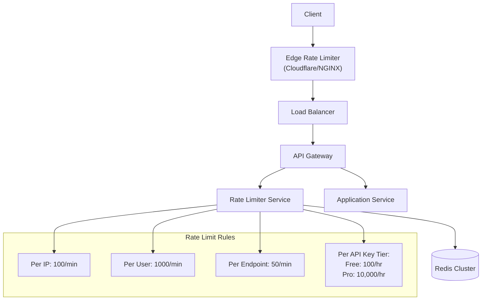
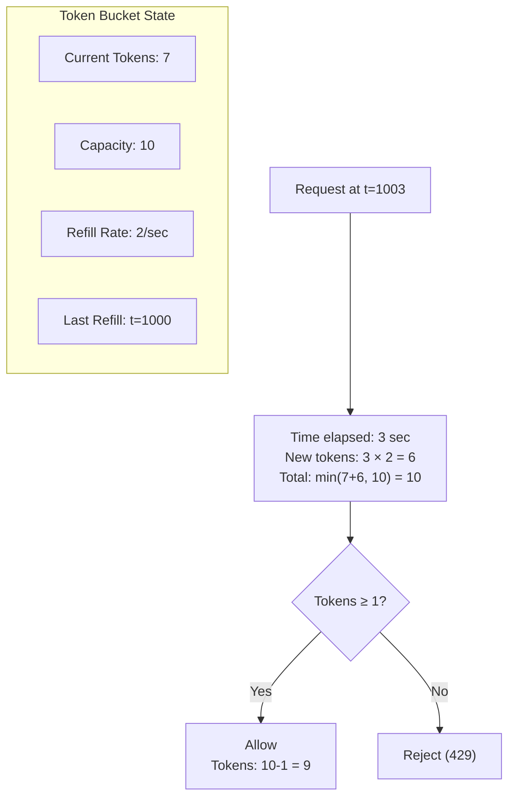
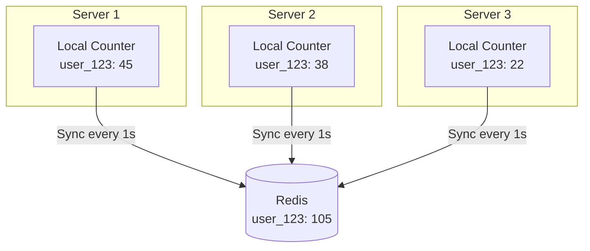
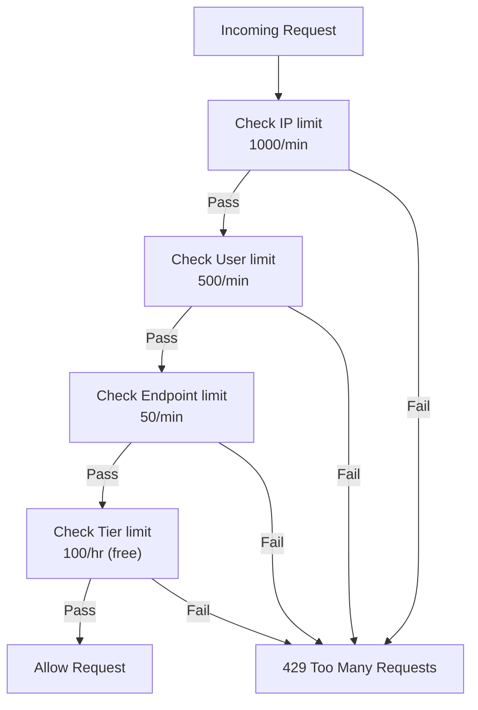
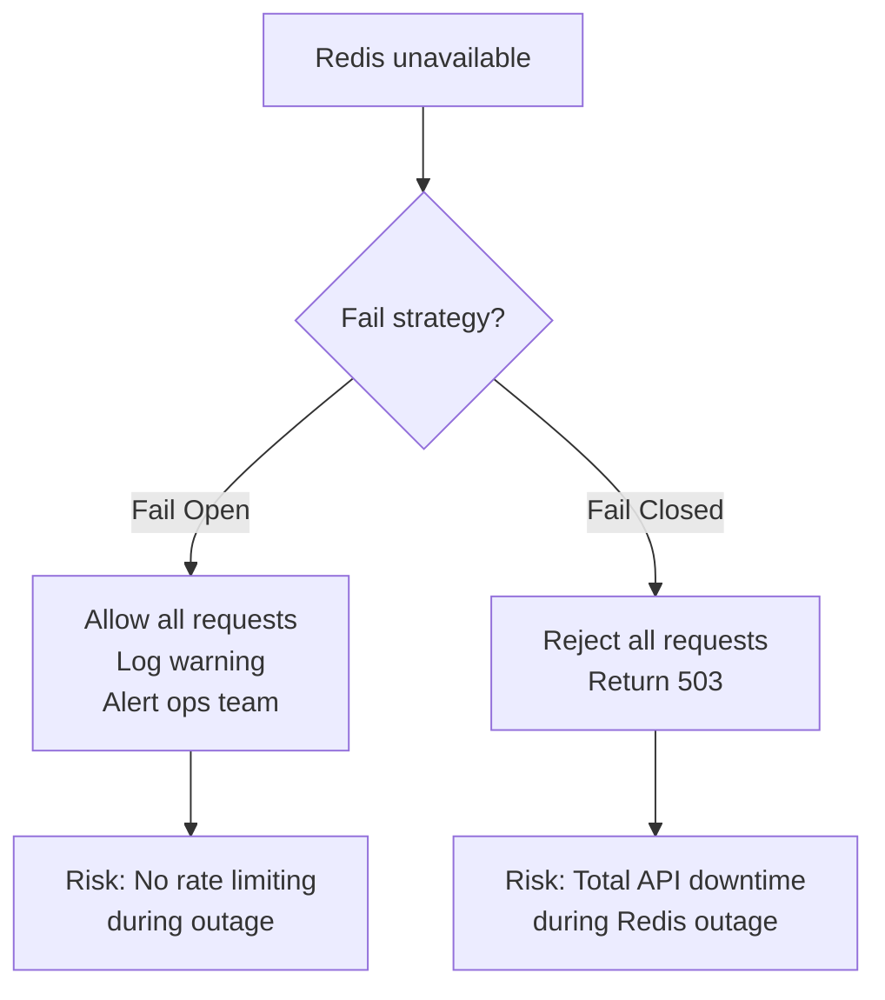

## Learning Objectives

- Design a distributed rate limiter that handles millions of requests per second
- Implement and compare token bucket, sliding window log, and sliding window counter algorithms
- Build a Redis-based distributed rate limiting service
- Handle race conditions and synchronization in distributed environments
- Deploy rate limiters at different layers: client, API gateway, and application

## Prerequisites

- Understanding of rate limiting algorithms (token bucket, sliding window)
- Familiarity with Redis data structures and atomic operations
- Knowledge of distributed systems and consistency challenges

## Requirements

### Functional Requirements

1. Limit requests based on configurable rules (per user, per IP, per API key)
2. Support multiple rate limiting rules simultaneously
3. Return clear rate limit headers in responses
4. Support different limits for different API endpoints
5. Configurable time windows (per second, per minute, per hour)

### Non-Functional Requirements

- **Low latency**: Rate check should add <5ms to request processing
- **High throughput**: Handle 1M+ rate checks per second
- **Accuracy**: Minimal false positives (legitimate requests rejected)
- **Fault tolerance**: Fail open (allow traffic) if rate limiter is down
- **Distributed**: Work across multiple API servers consistently

### Capacity Estimation

```
Incoming traffic: 1M requests/sec
Unique clients: 10M (by user_id or API key)
Rate limit rules: ~5 per request check (IP + user + endpoint + plan + global)

Redis operations per request: 5-10
  → 5-10M Redis operations/sec
  → Redis Cluster with 3-5 shards

Memory per client:
  Token bucket: 16 bytes (tokens + timestamp) × 10M = 160 MB
  Sliding window counter: 32 bytes × 10M = 320 MB
  Total: <1 GB (trivial for Redis)
```

## High-Level Architecture



### Where to Place the Rate Limiter

| Placement | Pros | Cons |
|-----------|------|------|
| **Client-side** | Reduces unnecessary requests | Easily bypassed, unreliable |
| **Edge (CDN/WAF)** | Blocks DDoS before it reaches servers | Limited customization |
| **API Gateway** | Centralized, consistent | Gateway becomes bottleneck |
| **Application middleware** | Fine-grained control | Must be in every service |
| **Sidecar (service mesh)** | Transparent to application | Infrastructure complexity |

**Best practice**: Layer them. IP-based at the edge, user-based at the API gateway, endpoint-specific in middleware.

## Algorithm Deep Dive

### Token Bucket (Detailed Implementation)



**Redis implementation with Lua** (atomic operation):

```lua
-- Token bucket rate limiter (Redis Lua script)
local key = KEYS[1]
local capacity = tonumber(ARGV[1])
local refill_rate = tonumber(ARGV[2])  -- tokens per second
local now = tonumber(ARGV[3])
local requested = tonumber(ARGV[4]) or 1

local data = redis.call('HMGET', key, 'tokens', 'last_refill')
local tokens = tonumber(data[1]) or capacity
local last_refill = tonumber(data[2]) or now

-- Calculate new tokens based on elapsed time
local elapsed = math.max(0, now - last_refill)
tokens = math.min(capacity, tokens + elapsed * refill_rate)

local allowed = 0
if tokens >= requested then
    tokens = tokens - requested
    allowed = 1
end

redis.call('HMSET', key, 'tokens', tokens, 'last_refill', now)
redis.call('EXPIRE', key, math.ceil(capacity / refill_rate) * 2)

return {allowed, tokens}
```

### Sliding Window Counter (Detailed Implementation)

```
Window size: 1 minute
Limit: 100 requests

Current window (10:01:00 - 10:02:00): 40 requests
Previous window (10:00:00 - 10:01:00): 80 requests
Position in current window: 30 seconds (50%)

Weighted count = previous × (1 - position%) + current
               = 80 × 0.5 + 40
               = 40 + 40 = 80

80 < 100 → ALLOW
```

```lua
-- Sliding window counter (Redis Lua script)
local key = KEYS[1]
local limit = tonumber(ARGV[1])
local window_size = tonumber(ARGV[2])  -- in seconds
local now = tonumber(ARGV[3])

local current_window = math.floor(now / window_size)
local previous_window = current_window - 1

local current_key = key .. ':' .. current_window
local previous_key = key .. ':' .. previous_window

local current_count = tonumber(redis.call('GET', current_key) or '0')
local previous_count = tonumber(redis.call('GET', previous_key) or '0')

-- Weight the previous window by how much of it overlaps
local elapsed_in_window = now % window_size
local weight = 1 - (elapsed_in_window / window_size)
local weighted_count = math.floor(previous_count * weight) + current_count

if weighted_count < limit then
    redis.call('INCR', current_key)
    redis.call('EXPIRE', current_key, window_size * 2)
    return {1, limit - weighted_count - 1}  -- allowed, remaining
else
    return {0, 0}  -- denied, remaining=0
end
```

### Fixed Window with Distributed Counters

For extremely high throughput, use per-node local counters that sync periodically:



**Trade-off**: Slightly less accurate (allows brief over-limit bursts between syncs) but eliminates Redis as a bottleneck for every single request.

## Rate Limit Rules Engine

### Rule Configuration

```yaml
rate_limits:
  - name: "global_ip_limit"
    key: "ip:{{client_ip}}"
    limit: 1000
    window: 60
    action: "reject"

  - name: "api_endpoint_limit"
    key: "user:{{user_id}}:endpoint:{{path}}"
    limit: 50
    window: 60
    action: "reject"

  - name: "free_tier_limit"
    key: "plan:free:user:{{user_id}}"
    limit: 100
    window: 3600
    condition: "user.plan == 'free'"
    action: "reject"

  - name: "burst_protection"
    key: "burst:{{user_id}}"
    limit: 20
    window: 1
    action: "throttle"
```

### Multi-Rule Evaluation



All checks can be batched into a **single Redis pipeline** to minimize round trips:

```
PIPELINE:
  EVALSHA token_bucket_script IP:203.0.113.50 ...
  EVALSHA token_bucket_script USER:user_123 ...
  EVALSHA token_bucket_script ENDPOINT:user_123:/api/search ...
  EVALSHA token_bucket_script TIER:free:user_123 ...
EXEC
```

One network round-trip, four rate limit checks.

## Response Headers

```http
HTTP/1.1 200 OK
X-RateLimit-Limit: 100
X-RateLimit-Remaining: 67
X-RateLimit-Reset: 1699877200
X-RateLimit-Policy: "100;w=3600"

# When rate limited:
HTTP/1.1 429 Too Many Requests
Retry-After: 42
X-RateLimit-Limit: 100
X-RateLimit-Remaining: 0
X-RateLimit-Reset: 1699877200
Content-Type: application/json

{
  "error": {
    "code": "RATE_LIMIT_EXCEEDED",
    "message": "Rate limit exceeded. Retry after 42 seconds.",
    "limit": 100,
    "window": "1 hour",
    "retry_after": 42
  }
}
```

## Race Conditions

### The TOCTOU Problem

```
Time-Of-Check to Time-Of-Use:
  Thread A: GET counter → 99 (under limit of 100)
  Thread B: GET counter → 99 (under limit of 100)
  Thread A: INCR counter → 100 (allowed)
  Thread B: INCR counter → 101 (should have been rejected!)
```

### Solutions

1. **Redis Lua scripts**: Atomic check-and-increment (used above). The entire operation runs as a single atomic unit in Redis.

2. **Redis MULTI/EXEC**: Transaction with optimistic locking (WATCH key).

3. **Accept slight inaccuracy**: For non-critical rate limits, a brief over-limit burst of 1-2% is acceptable.

## Failure Handling

### Fail Open vs. Fail Closed



**Best practice**: Fail open with local fallback rate limiting. Use in-memory counters as a coarse backup when Redis is down.

## Real-World Examples

### Cloudflare Rate Limiting

- Operates at the edge (before requests reach origin)
- Rules based on URL pattern, HTTP method, headers, cookies
- Actions: block, challenge (CAPTCHA), throttle
- Global state synchronized across 300+ PoPs using counting Bloom filters

### Stripe

- 100 requests/second per API key (general)
- 25 requests/second for resource-intensive endpoints
- Idempotency keys prevent accidental retries
- Graduated response: first few over-limit requests get 429, then temporary ban

## Interview Approach

1. **Clarify requirements**: What's being limited? Per user, IP, endpoint?
2. **Choose the algorithm**: Token bucket for most cases (allows bursts)
3. **Design the architecture**: Centralized Redis, with rules engine
4. **Handle distribution**: Redis Lua for atomicity, pipeline for performance
5. **Address failure**: Fail open with local fallback
6. **Response design**: Clear headers, Retry-After, meaningful error messages

> **Pro tip**: Show the interviewer the Redis Lua script for atomic rate limiting. It demonstrates you understand both the algorithm and the distributed implementation.

## Key Takeaways

1. **Token bucket is the industry standard**: Simple, allows bursts, memory-efficient. Used by AWS, Stripe, and most cloud providers.
2. **Redis Lua ensures atomicity**: Single-threaded execution prevents race conditions.
3. **Pipeline multiple checks**: Batch all rate limit rules into one Redis round-trip.
4. **Layer your defenses**: Edge (IP) → gateway (user) → middleware (endpoint).
5. **Fail open, not closed**: Rate limiter failure shouldn't cause total API downtime.
6. **Communicate clearly**: Rate limit headers let clients self-throttle before hitting limits.

## External Resources

- [Rate Limiting at Stripe](https://stripe.com/blog/rate-limiters)
- [Cloudflare Rate Limiting](https://developers.cloudflare.com/waf/rate-limiting-rules/)
- [Redis Lua Scripting](https://redis.io/docs/interact/programmability/eval-intro/)
- [Kong Rate Limiting Plugin](https://docs.konghq.com/hub/kong-inc/rate-limiting/)
- [System Design: Rate Limiter (Alex Xu)](https://bytebytego.com/)
- [IETF Draft: RateLimit Header Fields](https://datatracker.ietf.org/doc/draft-ietf-httpapi-ratelimit-headers/)
